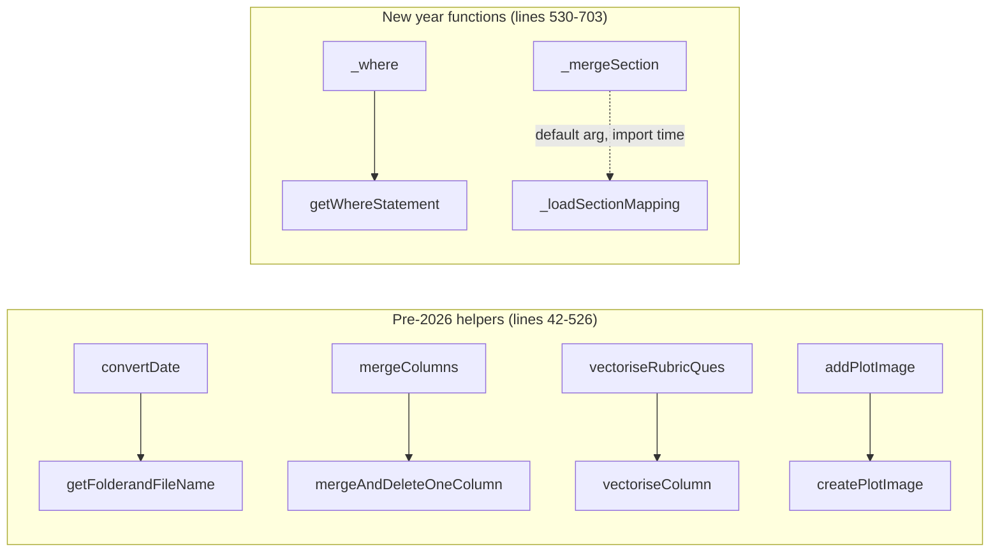

# `Utils.py`

> The shared base-layer helper module: ReportLab table/image builders, a page-banner
> factory, SQLAlchemy read/DDL wrappers, openpyxl column sizing, the item-code →
> section mapping merge, plus a set of older one-off DataFrame/analysis helpers.

| | |
|---|---|
| **Lines of code** | 703 |
| **Top-level functions** | 29 (+1 nested = 30 total) |
| **Classes** | 0 |
| **Module constants** | 0 module-level assignments; 2 module-level *statements* (font registration, lines 39–40) |
| **Imports from this codebase** | `variableUtils` (line 10) |
| **Imported by** | `boh3_dds4_utils` (63 call edges), `boh2_dds2_dds3_utils` (28), `flagging_utils` (4), `general_utils` (4), `boh1_utils` (2), `assessor_analysis` (1). `main.ipynb` imports it directly: `from Utils import *` (notebook line 69) |
| **Run how** | Library module only — no `__main__`, no CLI. Imported by `main.ipynb` via `from Utils import *`, and by the other `*_utils` modules via explicit `from Utils import ...` lists |

---

## 1. Purpose and role in the pipeline

`Utils.py` is the bottom of the dependency stack for the MDS 2026 reporting
codebase. It imports nothing from the codebase except `variableUtils` (which
holds page sizes, margins, ParagraphStyles, column-name constants and the
item-section mapping file path), and it is imported by every other analysis /
report module. `facts` records **zero** outgoing cross-module edges and **102**
incoming ones, so any change to a signature here ripples through
`boh3_dds4_utils`, `boh2_dds2_dds3_utils`, `flagging_utils`, `general_utils`,
`boh1_utils`, `assessor_analysis` and the orchestrator notebook.

Four of its helpers carry nearly all the traffic:

- **`readDf(engine, sql, params)`** — the single database read path for the whole
  codebase. It is called by 71 distinct functions across six modules and 13 times
  directly in `main.ipynb`. Every DASH table read (`rawforms`,
  `rawform_forms_v3`, `dds4_boh3_forms_v3`, the `v_mcex_*` views, …) goes through it.
- **`createTable(...)`** / **`addPlotImage(...)`** — the two ReportLab flowable
  factories. Every student report PDF and cohort report PDF is assembled from
  `createTable` output (a `KeepTogether` of title + table) and `addPlotImage`
  output (a matplotlib figure rendered to an in-memory PNG `Image`).
- **`getBannerDrawer(firstline, secondline)`** — returns the `onPage` callback that
  paints the navy University banner across the top of every report page.
- **`_loadSectionMapping()` / `_mergeSection(...)`** — load `item_section_mapping.xlsx`
  and attach `Section` / `Sub-section` labels to any DataFrame carrying an
  `Item Code` column. Used by the flagging pipeline and the DDS2/DDS3 student reports.

The remainder of the file is an older stratum: Excel-era helpers
(`getStudentList`, `checkAttendence`, `convertRubricScale`, `vectoriseRubricQues`,
`mergeColumns`), a scikit-learn feature-importance experiment (`getImportance`),
and anonymisation/pairing utilities (`anonymize_column`, `getPairCounts`). None of
these have any caller in the current codebase or notebook — see §7.

The file has a single structural marker, `# New year functions ---` at line 528,
which separates the pre-2026 helpers (lines 42–526) from the current-generation
DB/Excel/PDF helpers (lines 530–703). §5 follows that division.

**Consumes:** a SQLAlchemy `engine`/`conn` supplied by the caller; Excel files
(`item_section_mapping.xlsx`, MDS student lists); matplotlib `Figure` objects;
pandas DataFrames; TrueType fonts on the system font path.
**Produces:** ReportLab flowables (`Table`, `Image`, `KeepTogether`), pandas
DataFrames, `pd.ExcelWriter` kwargs dicts, an Outlook mail item, and (in
`getImportance`) a CSV and a PNG on disk.

---

## 2. External dependencies

| Library / resource | Used for |
|---|---|
| `pandas` (`pd`) | All DataFrame work; `pd.read_excel`, `pd.read_sql`, `pd.Int64Dtype` |
| `numpy` (`np`) | `np.nan` sentinel in `getImportance`'s value replacement map |
| `os` | `os.path.split/splitext/exists/abspath/join/isfile` |
| `openpyxl` + `openpyxl.utils.get_column_letter` | `autoFitColumns` column widths; `load_workbook` appears only in dead code (lines 86) |
| `sqlalchemy` (`text`; `create_engine` imported but unused) | `runDdl`, `readDf` |
| `reportlab.platypus` (`Table`, `TableStyle`, `Paragraph`, `Spacer`, `Image`, `KeepTogether`) | `createTable`, `createSplitTable`, `addPlotImage` |
| `reportlab.lib.colors` | Header fills, Yes/No cell colouring, banner fill |
| `reportlab.pdfbase.pdfmetrics` + `TTFont` | Module-level registration of `Arial` and `Calibri-Bold` (lines 39–40) |
| `matplotlib.pyplot` (`plt`) | Figure save/close in `createPlotImage`/`addPlotImage`; the bar chart in `getImportance` |
| `io.BytesIO` | In-memory PNG buffer for `createPlotImage` |
| `scikit-learn` (`RandomForestRegressor`, `SimpleImputer`, `train_test_split`, `mean_squared_error`) | `getImportance` only |
| `IPython.display.display` | Notebook-only rendering inside `getImportance`, `getPairCounts`, `checkAttendence` (via `pprint`) |
| `dateutil.parser` | `convertDate` |
| `itertools.combinations` | `getPairCounts` |
| `win32com` | `send_email` → Outlook COM automation (**Windows-only**) |
| `pprint.pprint` | Console output in `checkAttendence` |
| `variableUtils` | `pageSize`, `topMargin`/`bottomMargin`/`leftMargin`/`rightMargin`, `uniColor`, `tableTextStyle`, `subsubheadingStyle`, `colId`, `colCohort`, `rubricQues`, `itemSectionMappingFile` |

**Filesystem / environment requirements**

- `arial.ttf` and `calibrib.ttf` must be resolvable at **import time** (lines 39–40).
- `variableUtils.itemSectionMappingFile` — hard-coded to
  `C:\Users\Kunal Patel\D folder\MDS Work\2026\item_section_mapping.xlsx` — is read at
  **import time** because it is a default-argument expression (line 645).
- An Outlook profile must exist for `send_email`.
- No environment variables are read by this module.
- Imports declared but never used: `re`, `warnings`, `json`, `datetime`,
  `letter`/`landscape`/`A4`/`A3`, `SimpleDocTemplate`, `PageBreak`, `PdfPages`,
  `PdfReader`/`PdfWriter`, `TA_CENTER`, `inch`, `getSampleStyleSheet`,
  `ParagraphStyle`, `create_engine`, and the `RLTable` alias (line 24).
  `reportlab.platypus` is imported three separate times (lines 20, 24, 25).

---

## 3. Module-level constants and variables

There are **no module-level assignments** — `constants[]` in the facts file is empty.

The module does execute two statements at import time:

| Line | Statement | Effect |
|---|---|---|
| 39 | `pdfmetrics.registerFont(TTFont('Arial', 'arial.ttf'))` | Registers the ReportLab font name `Arial`. Raises `TTFError` at import if `arial.ttf` is not on the font search path. |
| 40 | `pdfmetrics.registerFont(TTFont('Calibri-Bold', 'calibrib.ttf'))` | Registers `Calibri-Bold`, the font `getBannerDrawer` asks for. Same failure mode. |

One further piece of state is created at import time as a side effect of a default
argument: `_mergeSection`'s `mappingDf=_loadSectionMapping()` (line 645) calls
`pd.read_excel` on the section-mapping workbook once, when `Utils` is first
imported, and reuses that single DataFrame for every subsequent call. See §7.

---

## 4. Classes

None. `classes[]` is empty.

---

## 5. Function reference

### 5.1 Path and date helpers (lines 42–92)

#### `getFolderandFileName(filePath: str)`

*Lines 42–55.* Splits a path into folder, stem and extension.

**Parameters**

| Name | Type | Default | Description |
|---|---|---|---|
| `filePath` | `str` | — | Path to a file. |

**Returns** — a 3-tuple `(folderPath, name, ext)`: the directory portion, the
filename without extension, and the extension including the leading dot.

**Behaviour**

1. `os.path.split(filePath)` → `folderPath`, `fileName`.
2. `os.path.splitext(fileName)` → `name`, `ext`.
3. Returns all three.

Note the docstring (lines 43–52) documents only two return values; the function
actually returns three.

**Called by** — `main.ipynb`; also recorded as called by `Utils:convertDate`, but
that edge comes from the unreachable block at lines 86–92 (see §7).

**Example** (`main_notebook_code.py` line 2910)

```python
folder = getFolderandFileName(file)[0]
savefolder = f"{folder}/feedback_reports"
```

---

#### `convertDate(date_str)`

*Lines 57–75 (function body); lines 77–92 are unreachable.* Normalises a date value
to a `dd/mm/YYYY` string.

**Parameters**

| Name | Type | Default | Description |
|---|---|---|---|
| `date_str` | `pd.Timestamp` \| `str` \| other | — | Value to convert. |

**Returns** — `str` formatted `'%d/%m/%Y'`.

**Behaviour**

1. If the input is a `pd.Timestamp`, formats and returns immediately (line 58–59).
2. Otherwise attempts `dateutil.parser.parse(date_str)`.
3. On `ValueError`, strips spaces and the ordinal suffixes `th`, `st`, `nd`, `rd`
   from the string and re-parses. Note the replacements are unanchored, so `'August'`
   would lose its `st` — the retry path is fragile for month names.
4. On `TypeError`, keeps the original object as `date_obj` — the subsequent
   `.strftime` call will then fail unless the object happens to support it.
5. Prints the parsed date, then returns `date_obj.strftime('%d/%m/%Y')`.

**Side effects** — prints to stdout on every call (line 74), plus extra prints on
the error paths.

**Calls** — `dateutil.parser.parse`. (`Utils:getFolderandFileName` appears in
`calls_resolved`, but only from the dead block.)
**Called by** — nothing in this codebase.

---

### 5.2 Student lists and DataFrame reshaping (lines 94–185)

#### `getStudentList(listFile1='data/Student ID for Kunal.xlsx', listFile2='2024/data/2024 MDS Student List_v10.xlsx', **kwargs)`

*Lines 94–112.* Reads a student-list workbook and returns the de-duplicated student IDs.

**Parameters**

| Name | Type | Default | Description |
|---|---|---|---|
| `listFile1` | `str` | `'data/Student ID for Kunal.xlsx'` | **Unused** — every line that referenced it is commented out (lines 96–102). |
| `listFile2` | `str` | `'2024/data/2024 MDS Student List_v10.xlsx'` | Excel file actually read. |
| `**kwargs` | — | — | Only `cohort` is consulted. |

**Returns** — `list` of unique values from the `variableUtils.colId` column
(`'Student ID'`), order non-deterministic because it comes from `set()`.

**Behaviour**

1. `cohort = kwargs.get('cohort', None)`.
2. `pd.read_excel(listFile2)`; if `cohort` is not None, filters on the literal
   column name `'Cohort'` (hard-coded, not `variableUtils.colCohort`).
3. Collects `listDf2[variableUtils.colId]` into a list, then `list(set(...))`.

**Side effects** — reads an Excel file from disk.
**Called by** — nothing.

---

#### `printDuplicateValues(renameDict)`

*Lines 114–131.* Reports values that appear under more than one key in a rename map.

**Parameters**

| Name | Type | Default | Description |
|---|---|---|---|
| `renameDict` | `dict` | — | Mapping of old name → new name. |

**Returns** — `None`.

**Behaviour** — inverts the dict into value → `[keys]`, prints one
`Duplicate value: '<value>' found for keys: [...]` line per collision, or
`No duplicate values found.` if there are none.

**Side effects** — prints only.
**Called by** — nothing.

---

#### `mergeAndDeleteOneColumn(df, col1, col2, newCol)`

*Lines 133–155.* Concatenates two columns into a new comma-joined column and drops the originals.

**Parameters**

| Name | Type | Default | Description |
|---|---|---|---|
| `df` | `pd.DataFrame` | — | Source frame. |
| `col1`, `col2` | `str` | — | Columns to merge. |
| `newCol` | `str` | — | Name of the created column. |

**Returns** — a new `DataFrame` with `newCol` present and `col1`/`col2` dropped. If
either column is missing, returns `df` unchanged (line 148).

**Behaviour**

1. Guard: if `col1` or `col2` is absent, return `df` untouched.
2. `df[newCol] = df[col1].fillna('') + ', ' + df[col2].fillna('')`.
3. `.str.strip(', ')` removes a leading/trailing separator when one side was blank.
4. `df.drop(columns=[col1, col2])` returns a copy.

**Side effects** — step 2 assigns into the caller's `df` **in place** before the
`drop` copy is made, so the input frame gains `newCol` even though the return value
is a different object.

**Called by** — `Utils:mergeColumns`.

---

#### `mergeColumns(df: pd.DataFrame, serviceColMerge: list)`

*Lines 157–163.* Applies `mergeAndDeleteOneColumn` for a list of merge specs.

**Parameters**

| Name | Type | Default | Description |
|---|---|---|---|
| `df` | `pd.DataFrame` | — | Source frame. |
| `serviceColMerge` | `list` | — | Iterable of `(cols, new_col)` pairs where `cols` is a 2-element sequence. |

**Returns** — the progressively merged `DataFrame`.

**Behaviour** — loops the specs; raises `ValueError("Each tuple must contain exactly
two columns to merge.")` if `len(cols) != 2`.

**Calls** — `Utils:mergeAndDeleteOneColumn`. **Called by** — nothing.

---

#### `convertRubricScale(df, rubricQues)`

*Lines 165–169.* Turns `"Lvl 3"`-style rubric answers into integers.

**Parameters**

| Name | Type | Default | Description |
|---|---|---|---|
| `df` | `pd.DataFrame` | — | Frame containing the rubric columns. |
| `rubricQues` | iterable of `str` | — | Column names to convert. |

**Returns** — the same `df` object (mutated).

**Behaviour** — per column, `str.extract(r'Lvl (\d+)')[0]`, then `pd.to_numeric(...,
errors='coerce').fillna(0).astype('Int64')`. Anything that does not match the
`Lvl N` pattern silently becomes `0`, not `NA`.

**Side effects** — mutates `df` in place.
**Called by** — nothing.

---

#### `vectoriseColumn(columnName, df, maxColValue, newRubricQues: set)`

*Lines 171–175.* Expands one ordinal column into cumulative 0/1 indicator columns.

**Parameters**

| Name | Type | Default | Description |
|---|---|---|---|
| `columnName` | `str` | — | Ordinal column to expand. |
| `df` | `pd.DataFrame` | — | Frame, mutated in place. |
| `maxColValue` | `int` | — | Highest level to generate. |
| `newRubricQues` | `set` | — | Set that receives the generated column names. |

**Returns** — `None`.

**Behaviour** — fills NA with 0 and casts to `int`, then for `i` in `1..maxColValue`
creates `f'{columnName}-{i}'` = `(df[columnName] >= i)` as `int`, adding each name to
`newRubricQues`.

**Side effects** — mutates both `df` and `newRubricQues`.
**Called by** — `Utils:vectoriseRubricQues`.

---

#### `vectoriseRubricQues(df, rubricQues, newRubricQues)`

*Lines 177–185.* Runs `vectoriseColumn` over every rubric column.

**Parameters**

| Name | Type | Default | Description |
|---|---|---|---|
| `df` | `pd.DataFrame` | — | Frame, mutated in place. |
| `rubricQues` | iterable of `str` | — | Ordinal columns to expand. |
| `newRubricQues` | `set` | — | Receives all generated names. |

**Returns** — `df`.

**Behaviour** — for each column computes `maxColValue = int(df[col].max())` and
delegates. The original column is *not* dropped (line 184 is commented out). An
all-NA column makes `int(nan)` raise `ValueError`.

**Calls** — `Utils:vectoriseColumn`. **Called by** — nothing.

---

### 5.3 Attendance check and feature-importance modelling (lines 187–311)

#### `checkAttendence(workbookPath, cohort=None, studentListPath='2024 MDS Student List_v10.xlsx')`

*Lines 187–224.* Prints which students in a cohort are missing from an attendance workbook.

**Parameters**

| Name | Type | Default | Description |
|---|---|---|---|
| `workbookPath` | `str` | — | Excel file of records that were submitted/attended. |
| `cohort` | `str` | `None` | Cohort value to filter the student list on (e.g. `'DDS2 (2024)'`, per the commented example at line 215). |
| `studentListPath` | `str` | `'2024 MDS Student List_v10.xlsx'` | Master student list. |

**Returns** — `None`.

**Behaviour**

1. Reads `workbookPath`, takes `df[colId].unique().astype(pd.Int64Dtype)` — note the
   dtype **class** is passed, not an instance (contrast `pd.Int64Dtype()` in
   `getImportance` line 245).
2. Reads `studentListPath` and filters via `getDfbyColumnValue(studentDf, colCohort,
   cohort)` — **that function is not defined in this module or anywhere in the
   codebase** (see §7).
3. Prints the attended list, the cohort list, then each cohort student not present
   in the attended list.

**Side effects** — reads two Excel files; prints/`pprint`s to stdout.
**Called by** — nothing.

---

#### `getImportance(df, code, tag, folderPath, cohort=None)`

*Lines 226–311.* Fits a Random Forest Regressor predicting a student's "MC %" from
their multiple-choice checklist columns, and saves a feature-importance bar chart.

**Parameters**

| Name | Type | Default | Description |
|---|---|---|---|
| `df` | `pd.DataFrame` | — | Wide assessment frame. |
| `code` | `str` | — | Item code; used in the CSV filename and plot title. |
| `tag` | `str` | — | Free-text label for the plot title / PNG filename. |
| `folderPath` | `str` | — | Output directory for the CSV and PNG. |
| `cohort` | `str` | `None` | Optional filter on `variableUtils.colCohort`. |

**Returns** — `None` (early-returns `None` when fewer than 5 usable rows remain, line 268).

**Behaviour**

1. Drops duplicate column names (`df.loc[:, ~df.columns.duplicated()]`), then filters
   to `cohort` if given.
2. Replaces categorical answers with numbers **in place**:
   `Yes→1, No→0, Completed→1, Not completed→0`, and
   `Not Assessed / Not Reviewed / NA → np.nan`.
3. `findMCColumns(newDf)` selects the MC columns — **also an undefined name** (§7).
4. Keeps `mc_columns + variableUtils.rubricQues + ['MC Total']`, coerces blanks to
   `pd.NA` and casts to `Int64`.
5. Computes `'MC total possible'` as the non-null count per row and keeps only rows
   with more than **5** answered items (magic constant, line 253).
6. `'MC %' = MC Total / MC total possible * 100`.
7. Writes `f'{folderPath}\\{code}.csv'` — Windows-only backslash separator, unlike
   the PNG path two lines later which uses `/`.
8. Drops rows with NA `'MC %'`; bails out with a printed message if fewer than 5 rows remain.
9. Mean-imputes `X`, `train_test_split(test_size=0.2, random_state=42)`, fits
   `RandomForestRegressor(n_estimators=100, random_state=42)`, prints the test MSE.
10. Plots a horizontal bar chart of `model.feature_importances_` sorted descending,
    saves it to `{folderPath}/{code}_{tag}_{cohort}_FeatureImportances.png` (the
    `_{cohort}` part is dropped when `cohort is None`), and calls `plt.show()`.
11. Calls `getMCValueCounts(df, code, tag, folderPath, cohort=cohort)` — **a third
    undefined name** (§7).

**Side effects** — writes a CSV and a PNG; mutates `newDf` (a filtered view/copy of
`df`) in place; renders to the active matplotlib backend; prints to stdout;
`display()`s the head and columns into the notebook.

**Called by** — nothing.

---

### 5.4 Pie-chart labels, anonymisation and pair counts (lines 313–362)

#### `autopct(pct, total)`

*Lines 313–328.* Formats a matplotlib pie-slice label as `"NN% \n(count)"`.

**Parameters**

| Name | Type | Default | Description |
|---|---|---|---|
| `pct` | `float` | — | Percentage of the slice, as matplotlib supplies it. |
| `total` | `int` | — | Total of all values, so the absolute count can be recovered. |

**Returns** — `str`. `'{:.0f}% \n({v:d})'.format(pct, v=val)` where
`val = int(round(pct * total / 100.0))`; returns `''` when `pct <= 0` so zero slices
are unlabelled.

**Behaviour** — designed to be wrapped: the docstring records the intended usage
`lambda pct: autopct(pct, total)`.

**Called by** — `boh3_dds4_utils:weaknessPiePlot`.

---

#### `anonymize_column(column)`

*Lines 330–334.* Replaces the distinct values of a Series with 1-based integers.

**Parameters**

| Name | Type | Default | Description |
|---|---|---|---|
| `column` | `pd.Series` | — | Series to anonymise. |

**Returns** — 3-tuple `(mappedSeries, mapping, reverse_mapping)` where `mapping` is
`{str(value): idx}` and `reverse_mapping` is `{idx: strValue}`.

**Behaviour** — enumerates `column.dropna().unique()` from 1, then `column.map(mapping)`.
Because the mapping keys are `str(value)` but `map` is applied to the raw values, a
non-string column maps to all-`NaN`.

**Called by** — nothing.

---

#### `getPairCounts(df, colPairBy=variableUtils.colId, colPairWith=None)`

*Lines 336–362.* Counts how often each unordered pair of values co-occurs within a group.

**Parameters**

| Name | Type | Default | Description |
|---|---|---|---|
| `df` | `pd.DataFrame` \| `pd.Series` | — | Data to group. |
| `colPairBy` | `str` | `variableUtils.colId` (`'Student ID'`) | Grouping key. |
| `colPairWith` | `str` | `None` | Column whose unique values are paired. If `None`, the group object itself is `.unique()`d. |

**Returns** — `pd.DataFrame` with columns `['Pair', '# of Pairs']`; `Pair` holds
2-tuples.

**Behaviour** — groups by `colPairBy`, takes the unique values of `colPairWith` per
group, generates `itertools.combinations(sorted(values), 2)`, and tallies each pair
in a dict before converting to a DataFrame.

**Side effects** — `display()`s the result frame.
**Called by** — nothing.

---

### 5.5 ReportLab building blocks (lines 364–526)

#### `createTable(df, title, colRatio: list, tableWidth=0.9, customTextCols=[], tableTextStyle=variableUtils.tableTextStyle, topPadding=12, bottomPadding=12, cellHighlight=False, headerColor='#9C27B0', titleStyle=variableUtils.subsubheadingStyle, headerTextColor='#FFFFFF', pageSize=variableUtils.pageSize)`

*Lines 364–412.* The codebase's standard "title + styled table" PDF flowable factory.

**Parameters**

| Name | Type | Default | Description |
|---|---|---|---|
| `df` | `pd.DataFrame` | — | Table data. Column names become the header row. |
| `title` | `str` | — | Heading rendered above the table. Pass `''` for no heading (still emits an empty `Paragraph`). |
| `colRatio` | `list` \| `None` | — | Relative column widths. `None` gives every column a literal width of `1` point (line 381) — almost certainly not what you want. |
| `tableWidth` | `float` | `0.9` | Fraction of `pageSize[0]` the table occupies. |
| `customTextCols` | `list` | `[]` (**mutable default**) | Zero-based column indices whose cells are wrapped in `Paragraph(str(value), tableTextStyle)` so they wrap instead of overflowing. |
| `tableTextStyle` | `ParagraphStyle` | `variableUtils.tableTextStyle` | Style for those wrapped cells. |
| `topPadding` / `bottomPadding` | `int` | `12` | Cell padding in points. |
| `cellHighlight` | `bool` | `False` | If `True`, colour cells equal to `'No'` red and `'Yes'` green. |
| `headerColor` | `str` | `'#9C27B0'` (purple) | Header row fill. Callers commonly pass `uniColor` (`'#010d44'`). |
| `titleStyle` | `ParagraphStyle` | `variableUtils.subsubheadingStyle` | Style for the title Paragraph. |
| `headerTextColor` | `str` | `'#FFFFFF'` | Header text colour. |
| `pageSize` | tuple | `variableUtils.pageSize` (`11.69in × 16.54in`) | Used only to compute `colWidths`. |

**Returns** — a `KeepTogether([Paragraph(title, titleStyle), Spacer(1, 6), table,
Spacer(1, 12)])` flowable, ready to append to a ReportLab `elements` list. When `df`
is empty, `table` is the `Paragraph("No data found", variableUtils.subsubheadingStyle)`
— note that branch ignores the caller's `titleStyle`/`tableTextStyle` and hard-codes
`subsubheadingStyle` (line 369).

**Behaviour**

1. Prints `Creating table for {title}`.
2. Builds `data = [columns] + df.values.tolist()`.
3. Wraps the `customTextCols` cells in `Paragraph`s (data rows only, header untouched).
4. `colWidths[i] = colRatio[i]/sum(colRatio) * pageSize[0] * tableWidth`.
5. Applies a fixed `TableStyle`: header background/text colour, everything
   centre/middle aligned, 1pt black grid, **font hard-coded to `Helvetica-Bold`
   at size 14** for every cell (lines 392–393) — the `Arial`/`Calibri-Bold` fonts
   registered at import are not used here.
6. Wraps in `KeepTogether`, then — only if `cellHighlight` — walks every cell and adds a
   per-cell `TEXTCOLOR` style for `'No'` (red) / `'Yes'` (green).

**Side effects** — prints one line per call.

**Called by** — `boh2_dds2_dds3_utils:_addReflectionsTable`, `:_addSectionPerformance`,
`:buildStudentReport`; `boh3_dds4_utils:buildCohortSummaryPdf`, `:buildFrontPage`,
`:buildIndividualEntryPage`, `:buildStudentPdf`, `:buildStudentVsAssessorSection`
(and its nested `renderTopDf`); `main.ipynb` (2 sites).

**Example** (`main_notebook_code.py` lines 2943–2945)

```python
table = createTable(tableDf, colRatio = [1, 3], customTextCols=[0, 1], headerColor = uniColor,
                    bottomPadding=6, topPadding=6, title = f"", titleStyle = subheadingStyle,
                    tableTextStyle=tableTextStyleSmall)
```

and (line 2870)

```python
tableObj = createTable(stationDf, colRatio= [1, 1, 1, 1, 1], title='', tableWidth = 0.7,
                       bottomPadding=6, topPadding=6, customTextCols=[0, 1, 2, 3, 4])
```

---

#### `createSplitTable(df, title, colRatio: list, tableWidth=0.9, customTextCols=[], tableTextStyle=variableUtils.tableTextStyle, topPadding=12, bottomPadding=12, cellHighlight=False, headerColor='#9C27B0', titleStyle=variableUtils.subsubheadingStyle)`

*Lines 414–495.* Same as `createTable` but splits the rows down the middle and lays
the two halves side by side.

**Parameters** — identical to `createTable` minus `headerTextColor` and `pageSize`
(header text is hard-coded `'#FFFFFF'` at line 452 and the page width is read
directly from `variableUtils.pageSize`).

**Returns** — a `KeepTogether` containing the title and a 1×2 outer `Table` whose two
cells are the left and right sub-tables. Empty `df` returns the "No data found"
variant early (lines 421–423).

**Behaviour**

1. Builds `data` and wraps `customTextCols` exactly as `createTable` does.
2. `colWidths` are halved: `ratio/sum(colRatio) * pageSize[0] * tableWidth/2`.
3. `splitPoint = (len(bodyRows) + 1) // 2`; the header row is repeated on both halves.
4. Both sub-tables get the same `TableStyle`; the outer table is `hAlign='CENTER'`
   with `VALIGN TOP` (the comment at line 471 flags that VALIGN line as critical).
5. `cellHighlight` colours `'Yes'`/`'No'` in both halves, guarded by `isinstance(..., str)`
   (a guard `createTable` lacks).

**Side effects** — prints `Creating split table for {title}`.
**Called by** — nothing in this codebase (no intra- or cross-module callers, no notebook use).

---

#### `createPlotImage(fig)`

*Lines 497–501.* Renders a matplotlib figure to an in-memory PNG buffer.

**Parameters**

| Name | Type | Default | Description |
|---|---|---|---|
| `fig` | `matplotlib.figure.Figure` | — | Figure to render. |

**Returns** — a rewound `io.BytesIO` containing PNG bytes.

**Behaviour** — `fig.savefig(buf, format='png', bbox_inches='tight')` then `buf.seek(0)`.
(The body is indented 8 spaces — cosmetic only.)

**Called by** — `Utils:addPlotImage`.

---

#### `addPlotImage(fig, ratio=None, pageSize=variableUtils.pageSize)`

*Lines 503–526.* Converts a matplotlib figure into a ReportLab `Image` scaled to fit
inside the page margins.

**Parameters**

| Name | Type | Default | Description |
|---|---|---|---|
| `fig` | `Figure` | — | Figure to embed. |
| `ratio` | `float` \| `None` | `None` | Extra scale factor applied to both max dimensions, e.g. `0.7` for a 70 %-width chart. |
| `pageSize` | tuple | `variableUtils.pageSize` | Page dimensions used for the fit calculation. |

**Returns** — a `reportlab.platypus.Image` whose `drawWidth`/`drawHeight` have been
scaled by `min(max_width/drawWidth, max_height/drawHeight)`.

**Behaviour**

1. `createPlotImage(fig)` → PNG buffer → `Image(buffer)`.
2. `max_height = pageSize[1] - topMargin - bottomMargin`,
   `max_width = pageSize[0] - leftMargin - rightMargin`, using the four margin values
   read from `variableUtils` (each 0.5–1 inch).
3. If `ratio` is given, multiplies both maxima by it.
4. Scales the image by the smaller of the two ratios, preserving aspect.
5. **`plt.close(fig)`** before returning.

**Side effects** — closes the figure, so the caller cannot reuse or re-save `fig`
afterwards; reads four module-level margin globals from `variableUtils`.

**Calls** — `Utils:createPlotImage`.
**Called by** — `boh2_dds2_dds3_utils:_addItemCodeCountsBarChart`, `:_addSectionPerformance`,
`:_addTimeSeriesPage`, `:buildCohortTimeSeriesPdf`, `:buildStudentReport`;
`boh3_dds4_utils:_addProceduresBarChart`, `:buildCohortSummaryPdf`,
`:buildEntrustmentTimeSeriesPdf`, `:buildFrontPage`, `:buildStudentPdf`,
`:weaknessPiePlot`; `main.ipynb` (10 sites).

**Example** (`main_notebook_code.py` lines 2533 and 2876)

```python
fig = makeAssessorKdeFig(df, scoreCol="% Score")
img = addPlotImage(fig)
...
chartImg = addPlotImage(fig, 0.7)
```

---

### 5.6 "New year functions" — DB, Excel and PDF helpers (lines 528–703)

#### `getBannerDrawer(firstline, secondline)`

*Lines 530–568.* Factory returning a ReportLab `onPage` callback that paints the
navy university banner with two lines of text.

**Parameters**

| Name | Type | Default | Description |
|---|---|---|---|
| `firstline` | `str` | — | Large (30pt) top line. |
| `secondline` | `str` | — | Smaller (24pt) second line. |

**Returns** — `drawBanner(canvas, doc)`, suitable for
`doc.build(elements, onFirstPage=..., onLaterPages=...)`.

**Nested functions**

| Name | Signature | Description |
|---|---|---|
| `drawBanner` | `drawBanner(canvas, doc)` | Lines 538–566. Saves canvas state; draws a filled rect of height **132 pt** across the full page width at the top, coloured `variableUtils.uniColor` (`#010d44`); sets `Calibri-Bold` 30 (falling back to `Helvetica-Bold` 30 inside a bare `except`), draws `firstline` white at `pageHeight - 72`; switches to `Calibri-Bold` 24 (same fallback) and draws `secondline` 36 pt lower; restores state. Left inset is `variableUtils.leftMargin`. |

**Side effects** — none beyond drawing on the supplied canvas; reads
`variableUtils.uniColor` and `variableUtils.leftMargin`.

**Called by** — `boh2_dds2_dds3_utils:buildCohortTimeSeriesPdf`,
`:buildEntireCohortStudentReports`; `boh3_dds4_utils:buildCohortSummaryPdf`,
`:buildEntrustmentTimeSeriesPdf`, `:buildStudentPdf`; `main.ipynb` (4 sites).

**Example** (`main_notebook_code.py` line 2948; also 3296/3299 where the returned
callback is invoked directly)

```python
pdfdoc.build(elements, onFirstPage = getBannerDrawer("BOH2 Mini-CEX LA (06 Mar)", studentName))
...
getBannerDrawer("Student Report", f"{studentName} ({studentNumber_})")(canvas, doc)
```

---

#### `getmodeArgs(filepath)`

*Lines 570–590.* Produces the right `pd.ExcelWriter` kwargs for "create or append a sheet".

**Parameters**

| Name | Type | Default | Description |
|---|---|---|---|
| `filepath` | `str` | — | Target `.xlsx` path, checked with `os.path.exists`. |

**Returns** — `dict`:
`{'engine': 'openpyxl', 'mode': 'a', 'if_sheet_exists': 'replace'}` when the file
exists, otherwise `{'engine': 'openpyxl', 'mode': 'w'}` (the `if_sheet_exists` key is
deliberately omitted for `mode='w'`, which pandas rejects).

**Side effects** — reads the filesystem (existence check only).

**Called by** — `boh2_dds2_dds3_utils:getCohortReportsPerClinic`;
`boh3_dds4_utils:buildCohortSummaryPdf`, `:createPatientStatsPerClinicPerRotation`;
`main.ipynb` (3 sites).

**Example** (`main_notebook_code.py` line 502, and 1684)

```python
with pd.ExcelWriter(scbdPath, **getmodeArgs(scbdPath)) as writer:
    rawDf.to_excel(writer,     sheet_name="Raw Data",        index=False)
...
wargs = getmodeArgs(file)
with pd.ExcelWriter(file, **wargs) as writer:
```

---

#### `runDdl(conn, ddl)`

*Lines 592–595.* Executes a multi-statement DDL script on an open connection.

**Parameters**

| Name | Type | Default | Description |
|---|---|---|---|
| `conn` | SQLAlchemy `Connection` | — | Usually obtained from `with engine.begin() as conn:`. |
| `ddl` | `str` | — | One or more `;`-separated SQL statements. |

**Returns** — `None`.

**Behaviour** — `ddl.strip().split(";")`, skipping blank fragments, and
`conn.execute(text(stmt))` on each.

**Side effects** — **writes to the database** (CREATE/DROP/ALTER, whatever the script
contains). Does not manage the transaction — the caller's context manager commits.

**Called by** — `main.ipynb` (8 sites). No in-repo module calls it, though
`boh2_dds2_dds3_utils`, `boh3_dds4_utils` and `flagging_utils` all import the name.

**Example** (`main_notebook_code.py` lines 181–183)

```python
with engine.begin() as conn:
    runDdl(conn, CREATE_RAWFORM_FORMS_V3_TABLE_SQL)
```

---

#### `readDf(engine, sql, params=None)`

*Lines 597–599.* The single database-read entry point for the whole codebase.

**Parameters**

| Name | Type | Default | Description |
|---|---|---|---|
| `engine` | SQLAlchemy `Engine` | — | Engine for the DASH database. |
| `sql` | `str` | — | SQL text; may contain `:name` bind parameters. |
| `params` | `dict` \| `None` | `None` | Bind parameters; `None` becomes `{}`. |

**Returns** — `pd.DataFrame` from `pd.read_sql(text(sql), conn, params=params or {})`.

**Behaviour** — opens a **new** connection per call via `with engine.connect() as
conn:`, executes, and closes it. No caching, no retry.

**Side effects** — network/database read; a connection is checked out of the pool for
the duration of the call.

**Called by** — 71 functions across `assessor_analysis`, `boh1_utils`,
`boh2_dds2_dds3_utils`, `boh3_dds4_utils`, `general_utils`; plus `main.ipynb`
(13 direct sites). This is by far the most-called function in the codebase.

**Example** (`main_notebook_code.py` line 200, and 2098 with params)

```python
df = readDf(engine, counts)
...
testdf = readDf(engine, testsql, {"rubricKeys": rubricKeys, "commentKey": commentKey, "cohort": cohort})
```

---

#### `toInt(x)`

*Lines 601–603.* "Safely convert to int, defaulting to 0."

**Parameters**

| Name | Type | Default | Description |
|---|---|---|---|
| `x` | numeric \| `None` | — | Value to round and cast. |

**Returns** — `int(round(x))`, or `0` when `x is None`.

**Behaviour** — a single conditional expression. Only `None` is treated as missing:
`float('nan')` raises `ValueError`, `pd.NA` raises `TypeError`, and a non-numeric
string raises `TypeError`. The docstring's "safely" is narrower than it sounds.

**Called by** — `boh3_dds4_utils:_collectFeedbackData`, `:_collectSummaryData`,
`:buildStudentVsAssessorSection`, `:getStudentSummaryTable`.

---

#### `getWhereStatement(cohort, filters: dict = None)`

*Lines 605–618.* Builds a SQL `WHERE` fragment plus its bind-parameter dict.

**Parameters**

| Name | Type | Default | Description |
|---|---|---|---|
| `cohort` | `str` | — | Always emitted as `cohort = :cohort`. |
| `filters` | `dict` | `None` | Extra column → value filters. |

**Returns** — a 2-tuple `(whereClause: str, params: dict)`, the clause being the
fragments joined with `" AND "` (no leading `WHERE`).

**Behaviour**

1. Seeds `whereClauses = ["cohort = :cohort"]` and `params = {"cohort": cohort}`.
2. For each filter: a `list` value emits `f"{key} IN :{key}"`; a key ending in
   `_min` or `_max` is **skipped** from the clause (the comment says these are
   "handled specially in callers like getTopItemCodes"); anything else emits
   `f"{key} = :{key}"`.
3. `params.update(filters)` adds **all** filter entries — including the skipped
   `_min`/`_max` ones, which then become bind parameters with no placeholder.

**Called by** — `Utils:_where` only.

---

#### `_where(cohort, filters)`

*Lines 620–624.* Thin shorthand around `getWhereStatement`.

**Parameters**

| Name | Type | Default | Description |
|---|---|---|---|
| `cohort` | `str` | — | Cohort value. |
| `filters` | `dict` \| falsy | — | **No default** — must be passed explicitly, even as `None`. |

**Returns** — `getWhereStatement(cohort, filters)` when `filters` is truthy,
otherwise the hard-coded `("cohort = :cohort", {"cohort": cohort})`.

**Calls** — `Utils:getWhereStatement`. **Called by** — nothing (see §7).

---

#### `autoFitColumns(ws, minWidth=5, maxWidth=30, padding=2)`

*Lines 626–632.* Sets each openpyxl column width from the length of its **header cell only**.

**Parameters**

| Name | Type | Default | Description |
|---|---|---|---|
| `ws` | `openpyxl.worksheet.worksheet.Worksheet` | — | Sheet to resize. |
| `minWidth` | `int` | `5` | Lower clamp. |
| `maxWidth` | `int` | `30` | Upper clamp. |
| `padding` | `int` | `2` | Characters added to the header length. |

**Returns** — `None`.

**Behaviour** — for each column, takes `col[0]` (row 1), converts its index with
`get_column_letter`, and sets
`width = max(minWidth, min(maxWidth, len(str(header or "")) + padding))`.
Body-cell content is never measured — the docstring says so explicitly, but the
function name implies otherwise.

**Side effects** — mutates `ws.column_dimensions` in place.

**Called by** — `boh2_dds2_dds3_utils:saveToExcel`,
`general_utils:buildWeeklySimWorkbookDDS2`; `main.ipynb` (6 sites).

**Example** (`main_notebook_code.py` lines 490, 812–813)

```python
autoFitColumns(ws, minWidth=8, maxWidth=50)
...
autoFitColumns(wb["Item Detail"])
autoFitColumns(wb["Checklist Legend"], maxWidth=70)
```

---

#### `_loadSectionMapping(mappingFile=None)`

*Lines 634–643.* Loads the item-code → section mapping workbook.

**Parameters**

| Name | Type | Default | Description |
|---|---|---|---|
| `mappingFile` | `str` \| `None` | `None` → `variableUtils.itemSectionMappingFile` | Path to the mapping `.xlsx`. |

**Returns** — `pd.DataFrame` with (at least) `["Item Code", "Section", "Sub-section"]`;
`Item Code` is coerced to `str` and stripped of whitespace.

**Behaviour** — `pd.read_excel(mappingFile)` then `.astype(str).str.strip()` on the
code column. No caching — every call re-reads the file from disk.

**Side effects** — reads an Excel file; with the default argument that file is the
hard-coded absolute Windows path in `variableUtils` (line 81 of `variableUtils.py`).

**Called by** — `boh2_dds2_dds3_utils:buildStudentReport`, `:pivotItemCodes`;
`flagging_utils:_buildCountPivot`, `:_buildGrPivot`, `:getFlagDf`.

---

#### `_mergeSection(df, mappingDf=_loadSectionMapping(), codeCol="Item Code", sectionCol="Section", subSectionCol="Sub-section")`

*Lines 645–681.* Left-joins a frame carrying an item-code column onto the section mapping.

**Parameters**

| Name | Type | Default | Description |
|---|---|---|---|
| `df` | `pd.DataFrame` | — | Frame with an item-code column. |
| `mappingDf` | `pd.DataFrame` | `_loadSectionMapping()` — **evaluated once at import time** | Mapping table. |
| `codeCol` | `str` | `"Item Code"` | Name of the code column in `df`. |
| `sectionCol` | `str` | `"Section"` | Name of the section column produced. |
| `subSectionCol` | `str` | `"Sub-section"` | Name of the sub-section column produced. |

**Returns** — a **copy** of `df` with `Section` (and `Sub-section` when present in the
mapping) appended; unmatched codes get `"Unmapped"`.

**Behaviour**

1. `merged = df.copy()`. If `df` is empty, adds `sectionCol`/`subSectionCol` as `pd.NA`
   and returns immediately — note this early path yields `NA`, **not** `"Unmapped"`.
2. Builds a helper column `_MappingCode`: `str(code).split("/")[0].strip()` — so a
   compound code like `"022/024"` matches on `022`.
3. Then splits on `-` **only if the first segment is all digits**:
   `"022-1"` → `"022"`, but `"BOH-DD"` is kept whole (line 662).
4. `mergeCols = ['Item Code', 'Section']` — **literal names, ignoring `codeCol`/`sectionCol`**;
   `subSectionCol` is appended only if that column exists in `mappingDf`. The
   rename that would have honoured the parameters is commented out at line 664.
5. Left-merges `mappingDf[mergeCols]` on `_MappingCode` → `Item Code`,
   with `suffixes=("", "_map")`.
6. Drops `Item Code_map` (if created) and `_MappingCode`.
7. `fillna("Unmapped")` on the section column, and on the sub-section column if present.

**Side effects** — prints `mergeCols` and `mappingDf.columns` on **every** call
(line 665, a leftover debug print).

**Called by** — `boh2_dds2_dds3_utils:buildStudentReport`, `:pivotItemCodes`;
`flagging_utils:getFlagDf`.

---

#### `send_email(recipient_email: str, filename: str, subject: str = "Report", body: str = "Please find the attached report.", savefolder: str = ".") -> None`

*Lines 683–703.* Sends a report by Outlook COM automation.

**Parameters**

| Name | Type | Default | Description |
|---|---|---|---|
| `recipient_email` | `str` | — | Recipient address. |
| `filename` | `str` | — | Attachment filename, resolved relative to `savefolder`. |
| `subject` | `str` | `"Report"` | Mail subject. |
| `body` | `str` | `"Please find the attached report."` | Plain-text body. |
| `savefolder` | `str` | `"."` | Directory containing `filename`. |

**Returns** — annotated `-> None`, but actually returns `False` when the attachment is
missing and `True` after a successful send.

**Behaviour**

1. `win32com.client.Dispatch("Outlook.Application")` and `CreateItem(0)` (a MailItem).
2. Sets `To`, `Subject`, `Body`.
3. `fullpath = os.path.abspath(os.path.join(savefolder, filename))`; if that file does
   not exist, prints a warning and returns `False` **without sending**.
4. Attaches, `mail.Send()`, then `outlook.Session.SendAndReceive(False)` to force
   the outbox to flush.
5. Prints a confirmation line.

**Side effects** — **sends real email**; requires Windows + a configured Outlook
profile; reads the filesystem; prints to stdout. Relies on `win32com.client` having
been imported somewhere — this module only does `import win32com` (see §7).

**Called by** — `main.ipynb` (3 sites; note the notebook also defines its own
`Mailer.send_email` method at line 3431 that shadows this name in that class scope).

**Example** (`main_notebook_code.py` lines 1583–1584)

```python
send_email(email, file, subject="BOH1 OSCE Report", body=f"Dear {name},\n\nPlease find attached your BOH1 test OSCE report.\n\nBest regards,\nAssessment Team",
           savefolder = "OSCE/BOH1/Student Reports")
```

---

## 6. Call graph (this module)

Only five intra-module edges exist; every other function is a leaf called from
outside the module (or not at all).



The dashed edge is not a runtime call edge — `_loadSectionMapping()` is evaluated once
when `Utils` is imported, to build `_mergeSection`'s default `mappingDf`. It does not
appear in `intra_edges`.

Leaf functions with no intra-module edges: `getStudentList`, `printDuplicateValues`,
`convertRubricScale`, `checkAttendence`, `getImportance`, `autopct`,
`anonymize_column`, `getPairCounts`, `createTable`, `createSplitTable`,
`getBannerDrawer`, `getmodeArgs`, `runDdl`, `readDf`, `toInt`, `autoFitColumns`,
`send_email`.

---

## 7. Gotchas and known issues

**Import-time side effects (the big one)**

- **Line 645 — `_mergeSection(df, mappingDf=_loadSectionMapping(), ...)`.** The default
  argument is evaluated when `Utils` is imported, so **`import Utils` reads
  `item_section_mapping.xlsx` from disk**. Combined with the hard-coded path in
  `variableUtils.itemSectionMappingFile`
  (`C:\Users\Kunal Patel\D folder\MDS Work\2026\item_section_mapping.xlsx`), the entire
  codebase fails to import on any machine without that exact path. It also means the
  mapping is frozen at import: editing the workbook mid-session has no effect on
  `_mergeSection` callers that rely on the default, while `_loadSectionMapping()`
  callers *do* see the change — the two paths can disagree.
- **Lines 39–40** — `pdfmetrics.registerFont(TTFont('Arial', 'arial.ttf'))` and
  `TTFont('Calibri-Bold', 'calibrib.ttf')` run at import and raise if the fonts are not
  on the path. Ironically `createTable`/`createSplitTable` then hard-code
  `Helvetica-Bold` (lines 392, 456), so only `getBannerDrawer` uses `Calibri-Bold`
  and `Arial` is registered but never referenced.

**Undefined names — guaranteed `NameError` at call time**

- **Line 216** — `checkAttendence` calls `getDfbyColumnValue(...)`, which is not defined
  in `Utils.py`, not imported, and does not exist anywhere in `src/`.
- **Lines 241 and 311** — `getImportance` calls `findMCColumns(...)` and
  `getMCValueCounts(...)`; neither exists in the codebase either.
  Both functions are therefore unrunnable as written.
- **Line 690** — `send_email` uses `win32com.client.Dispatch` but line 9 only does
  `import win32com`. It works today purely because `main.ipynb` line 50 does
  `import win32com.client` first, which registers the submodule. Calling `send_email`
  from a context that has not imported `win32com.client` raises `AttributeError`.

**Dead / unreachable code**

- **Lines 77–92** — an orphaned docstring ("Loads an Excel workbook…") plus a full
  function body (`openpyxl.load_workbook`, `getFolderandFileName`, two `pprint`s,
  `return workbook, folderPath, name`) sits **after** the `return` on line 75, inside
  `convertDate`. This is the remains of a deleted `loadWorkbook` function whose `def`
  line was lost. It never executes, and it is the sole reason the facts file records
  `getFolderandFileName.called_by == ["Utils:convertDate"]` and `openpyxl.load_workbook`
  as a dependency.
- **`createSplitTable` (lines 414–495)** has zero callers anywhere — not in
  `intra_edges`, not in `cross_edges_in`, not in `main.ipynb`.
- **`_where` (lines 620–624) and `getWhereStatement` (lines 605–618)**
  form an unused pair: `_where` has no callers and `getWhereStatement` is only called
  by `_where`. The `_min`/`_max` special-case comment refers to `getTopItemCodes` in
  `boh3_dds4_utils`, which builds its own WHERE clause instead.
- Never called from anywhere: `convertDate`, `getStudentList`, `printDuplicateValues`,
  `mergeColumns`, `mergeAndDeleteOneColumn`, `convertRubricScale`, `vectoriseColumn`,
  `vectoriseRubricQues`, `checkAttendence`, `getImportance`, `anonymize_column`,
  `getPairCounts`, `createSplitTable`, `getWhereStatement`, `_where`. That is roughly
  half the module.

**Hard-coded years, paths and magic numbers**

- **Line 94** — `getStudentList` defaults to `'data/Student ID for Kunal.xlsx'` and
  `'2024/data/2024 MDS Student List_v10.xlsx'`; **line 187** — `checkAttendence`
  defaults to `'2024 MDS Student List_v10.xlsx'`. All three are 2024-era relative paths.
- **Line 107** — `getStudentList` filters on the string literal `'Cohort'` rather than
  `variableUtils.colCohort`, even though `checkAttendence` (line 202) uses the constant.
- **Line 258** — `newDf.to_csv(f'{folderPath}\\{code}.csv')` uses a Windows backslash,
  while **line 306** uses a forward slash for the PNG in the same function.
- **Line 253** — `newDf[colmcTotalPossible] > 5` and **line 266** — `len(y) < 5` are
  unexplained thresholds.
- **Line 543** — banner height `132`, **line 549** — `topOffset = 72`,
  **line 550** — `lineSpacing = 36`, all bare literals in `drawBanner`.
- **Lines 392–393 / 456–457** — font `Helvetica-Bold` and font size `14` are baked into
  both table builders with no parameter to override them, so every table in every PDF
  is bold 14pt.

**Silently swallowed errors and misleading contracts**

- **Lines 552–555 and 560–562** — bare `except:` around `canvas.setFont`, which will
  catch anything including `KeyboardInterrupt`.
- **Lines 71–73** — `convertDate`'s `except TypeError` assigns the *unparsed* input to
  `date_obj`, so the very next line fails with a different, more confusing error.
- **`toInt` (line 601)** claims to be "safe" but only handles `None`; `nan` and `pd.NA`
  raise. Four `boh3_dds4_utils` call sites depend on it.
- **`autoFitColumns` (line 626)** measures only the header, despite the name.
- **`send_email` (line 683)** is annotated `-> None` but returns `True`/`False`.
- **`getFolderandFileName` (line 42)** returns three values; its docstring documents two.
- **`convertRubricScale` (line 168)** turns any non-`Lvl N` value into `0`, silently
  conflating "missing" with "level zero".

**Parameter handling bugs**

- **`_mergeSection` lines 663–673** hard-code `mergeCols = ['Item Code', 'Section']` and
  merge with `right_on='Item Code'`, so the `sectionCol` and `subSectionCol` parameters
  are ignored for the join. Passing `sectionCol="MySection"` produces a `KeyError` at
  line 678 (`merged[sectionCol].fillna(...)`). Only the default values are safe.
- **`_mergeSection` lines 656–659** — the empty-input branch fills `pd.NA`, whereas the
  normal path fills `"Unmapped"`. Downstream groupbys will behave differently.
- **`_mergeSection` line 665** — `print(mergeCols, mappingDf.columns)` fires on every
  call; noisy in a loop over students.
- **`createTable` / `createSplitTable`** use the mutable default `customTextCols=[]`
  (lines 364, 414). Nothing mutates it today, but it is a latent shared-state bug.
- **`createTable` line 381** — when `colRatio is None` the widths become a list of
  literal `1`s (1 point each), not equal shares as the comment claims.
- **`createTable` line 369** — the empty-DataFrame branch ignores the caller's
  `titleStyle`/`tableTextStyle` and hard-codes `variableUtils.subsubheadingStyle`.
- **`createSplitTable`** guards its Yes/No comparison with `isinstance(..., str)`
  (lines 484, 490) but **`createTable` does not** (lines 408, 410) — an inconsistency,
  though `==` on non-strings is harmless here.
- **`_where` (line 620)** gives `filters` no default while `getWhereStatement` (line 605)
  defaults it to `None`; the "shorthand" is less convenient than the function it wraps.
- **`getWhereStatement` line 612** emits `f"{key} IN :{key}"` for list values. With a
  plain `text()` construct SQLAlchemy will not expand a list bind parameter unless it
  is declared with `expanding=True`, so this branch would fail if it were reachable.
  Line 617 also copies `_min`/`_max` filters into `params` even though no placeholder
  was emitted for them.

**Resource and performance notes**

- **`readDf` (line 597)** opens and closes a connection on every call. With 71 callers
  and loops over students/cohorts this produces a large number of short-lived
  connections; there is no caching or batching layer.
- **`runDdl` (line 593)** splits on `";"` naively — any semicolon inside a string
  literal, comment or function body will split the statement incorrectly.
  `main.ipynb` redefines its own identical `runDdl` twice (notebook lines 1889 and 2090),
  shadowing the `Utils` version after `from Utils import *` — so which implementation
  runs depends on cell execution order.
- **`addPlotImage` (line 525)** calls `plt.close(fig)`, so the caller's figure is dead
  after the call. Reusing `fig` afterwards (e.g. to also save it to disk) silently
  produces nothing.
- **`_loadSectionMapping`** re-reads the mapping workbook on every call — five callers
  invoke it inside per-student loops in `flagging_utils` and `boh2_dds2_dds3_utils`.

**Housekeeping**

- `reportlab.platypus` is imported three times (lines 20, 24, 25), including an unused
  `Table as RLTable` alias.
- Around 16 imported names are never used: `re`, `warnings`, `json`, `datetime`,
  `letter`, `landscape`, `A4`, `A3`, `SimpleDocTemplate`, `PageBreak`, `PdfPages`,
  `PdfReader`, `PdfWriter`, `TA_CENTER`, `inch`, `getSampleStyleSheet`,
  `ParagraphStyle`, `create_engine`.
- Naming is inconsistent: `snake_case` (`autopct`, `anonymize_column`, `send_email`)
  sits alongside `camelCase` (everything else), and the module mixes US spelling
  (`anonymize_column`) with British/Australian (`vectoriseColumn`, `vectoriseRubricQues`).
  `checkAttendence` is misspelt (should be "Attendance").
