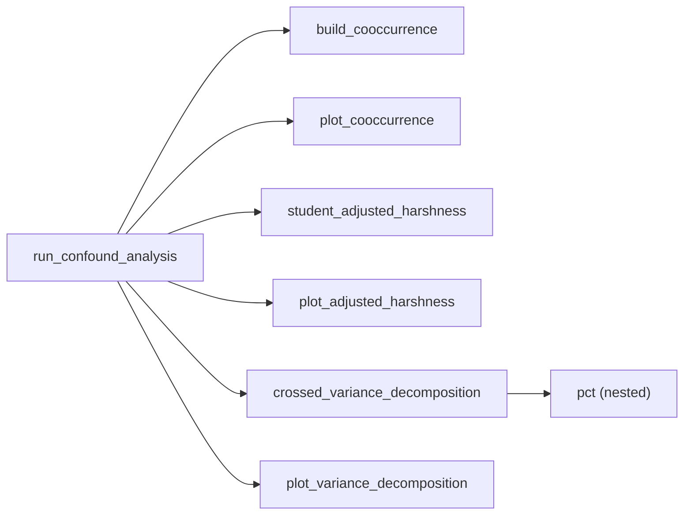

# `assessor_confound.py`

> Diagnoses whether apparent assessor harshness in BOH1 is real or an artefact of *which students each assessor happened to grade*, via student × assessor co-occurrence heatmaps, student-adjusted residuals, and a hand-rolled crossed variance decomposition.

| | |
|---|---|
| **Lines of code** | 436 |
| **Top-level functions** | 7 (plus 1 nested helper, `pct`) |
| **Classes** | 0 |
| **Module constants** | 3 (`UNI_COLOR`, `MIN_FORMS`, `METRICS`) |
| **Imports from this codebase** | none (it consumes a DataFrame produced by `assessor_analysis`, but does not import it) |
| **Imported by** | No other module in `src/`. `main.ipynb` does `from assessor_confound import run_confound_analysis` |
| **Run how** | Imported by `main.ipynb`. There is **no** `if __name__ == "__main__":` block — `python assessor_confound.py` does nothing |

---

## 1. Purpose and role in the pipeline

`assessor_analysis.py` answers "which assessors give lower scores?". This module exists because that question has an obvious confound: in a clinic, assessors do not grade a random sample of students. If assessor A happens to supervise the three weakest students in the cohort all semester, A will look harsh in the raw means even if A marks identically to everyone else. This module is the **confound diagnostic** for that problem.

**What it consumes.** A single in-memory DataFrame — explicitly documented (line 373) as "output of `add_scores(load_data(engine))` from `boh1_assessor_analysis.py`". It does not touch the database, read any file, or import `assessor_analysis`; it just expects that module's column contract: `assessmentid`, `student_number`, `student_name`, `assessor_name`, `checklist_mean`, `global_rating`, `practice_readiness`.

**What it produces.** A nested `results` dict returned in memory, plus printed text and up to seven matplotlib figures. Nothing is written to disk and nothing is written back to the database.

**Three analyses, run once per metric.** `run_confound_analysis` loops over the three keys of `METRICS` and for each one runs:

1. **Co-occurrence** (`build_cooccurrence` / `plot_cooccurrence`) — a descriptive student × assessor pivot showing who assessed whom (counts) and with what mean score. This is the raw evidence for how crossed (or nested) the design actually is; the printed "Sparsity" figure is the proportion of empty cells.
2. **Student-adjusted harshness** (`student_adjusted_harshness` / `plot_adjusted_harshness`) — a **within-student residual model**. Dependent variable: the metric. The student effect is removed non-parametrically by subtracting each student's own mean on that metric (`groupby("student_number")[metric].transform("mean")`), and the residuals are then averaged by assessor. A negative mean residual means the assessor scores below the level that student typically receives, i.e. harsher. Alongside this it computes a `coverage_ratio` (unique students ÷ total forms) and turns it into a three-level `confound_risk` flag.
3. **Crossed variance decomposition** (`crossed_variance_decomposition` / `plot_variance_decomposition`) — a **two-way crossed ANOVA without interaction**, deliberately hand-computed rather than fitted with `statsmodels` (the module docstring at line 9 says "without statsmodels"; the section banner at line 218 repeats "no statsmodels"). Dependent variable: the metric at form level. Two crossed factors: `student_number` and `assessor_name`. Type I sums of squares are computed by hand from group means, F-tests are formed against the residual mean square, and p-values come from the one library call in the whole module, `scipy.stats.f.cdf`. Variance components are then backed out of the mean squares using the balanced-design expected-mean-square identities `σ²_s ≈ (MS_student − MS_residual)/k_a` and `σ²_a ≈ (MS_assessor − MS_residual)/k_s`, and reported as percentages of the total.

**Who calls it.** Only `main.ipynb`, immediately after the `assessor_analysis` data-prep call.

---

## 2. External dependencies

| Library / resource | Used for |
|---|---|
| `numpy` (`np`) | `np.arange` for bar positions; `np.isnan` guards in the decomposition; `np.nan` sentinels |
| `pandas` (`pd`) | `pivot_table` for both co-occurrence matrices; `groupby().agg()` / `transform`; `pd.notna`; `DataFrame.plot(kind="bar", stacked=True)` |
| `matplotlib.pyplot` (`plt`) | All figures; `plt.show()` inside the entry point |
| `matplotlib.ticker` (`ticker`) | **Imported at line 22 and never referenced** — dead import |
| `matplotlib.patches` (`mpatches`) | `mpatches.Patch` to build the confound-risk legend in `plot_adjusted_harshness` |
| `seaborn` (`sns`) | `sns.heatmap` — the only use of seaborn; both co-occurrence heatmaps |
| `scipy.stats` (`stats`) | `stats.f.cdf` only, for the two p-values in `crossed_variance_decomposition` |
| `typing.Tuple` | Return annotation of `build_cooccurrence` |
| **Database / filesystem / env vars / network** | **None.** This module is pure in-memory computation over a DataFrame handed to it |

---

## 3. Module-level constants and variables

| Name | Type | Value / shape | Purpose |
|---|---|---|---|
| `UNI_COLOR` | `str` | `'#010d44'` | University of Melbourne navy; suptitle/title colour and the raw-mean bar colour. Duplicated verbatim from `assessor_analysis.py` line 36 |
| `MIN_FORMS` | `int` | `2` | Minimum forms for an entity (student *or* assessor) to appear in any analysis. Used in `build_cooccurrence` (both axes), `student_adjusted_harshness` (assessors) and `crossed_variance_decomposition` (both factors). Equivalent to `assessor_analysis.MIN_ASSESSMENTS`, but a separate constant with a different name |
| `METRICS` | `dict` (3 entries) | metric column → display label | Drives the per-metric loop in `run_confound_analysis` and the x-axis of `plot_variance_decomposition` |

```python
METRICS = {
    "checklist_mean":     "Checklist (0–1)",
    "global_rating":      "Global Rating (1–5)",
    "practice_readiness": "Practice Readiness (1–4)",
}
```

Note the labels record the natural range of each metric — 0–1, 1–5 and 1–4 respectively. That range difference matters: see the `vmin`/`vmax` gotcha below.

---

## 4. Classes

None. This module defines no classes.

---

## 5. Function reference

Sections follow the file's own four numbered banner comments.

### 5.1 Co-occurrence matrices

#### `build_cooccurrence(df: pd.DataFrame, metric: str = "checklist_mean") -> Tuple[pd.DataFrame, pd.DataFrame]`

*Lines 41–66.* Builds the student × assessor count matrix and the matching mean-score matrix.

**Parameters**

| Name | Type | Default | Description |
|---|---|---|---|
| `df` | `pd.DataFrame` | — | Form-level DataFrame from `add_scores(load_data(engine))` |
| `metric` | `str` | `"checklist_mean"` | Which score column to average in `score_mx` |

**Returns** — `(count_mx, score_mx)`:
- `count_mx` — `student_name × assessor_name` pivot of `assessmentid` counts, NaN filled with 0, cast to `int`.
- `score_mx` — the same pivot shape holding the mean of `metric`, rounded to 3 dp, with NaN left in place for cells with no data.

**Behaviour**

1. Drops rows with a null `metric`, on a copy.
2. Two `pivot_table` calls — `aggfunc="count"` on `assessmentid` and `aggfunc="mean"` on `metric`.
3. Filters both matrices to assessors whose column total is `>= MIN_FORMS` and students whose row total is `>= MIN_FORMS` (lines 61–64). Note the filter is computed on `count_mx` and applied to both, so the two matrices stay aligned.
4. Rows are indexed by **`student_name`** (not `student_number`) — the heatmap axis is human-readable, which also means two students sharing a name would be merged.

**Called by** — `assessor_confound:run_confound_analysis`.

---

#### `plot_cooccurrence(count_mx: pd.DataFrame, score_mx: pd.DataFrame, metric_label: str='Checklist Score') -> plt.Figure`
*Lines 69–115.* Two side-by-side seaborn heatmaps: assessment counts (left) and mean score (right).

**Parameters**

| Name | Type | Default | Description |
|---|---|---|---|
| `count_mx` | `pd.DataFrame` | — | Count matrix from `build_cooccurrence` |
| `score_mx` | `pd.DataFrame` | — | Mean-score matrix from `build_cooccurrence` |
| `metric_label` | `str` | `"Checklist Score"` | Used in the suptitle, right-hand title and colour-bar label |

**Returns** — the matplotlib `Figure`.

**Behaviour**

1. Sizes the figure adaptively from the matrix shape: `cell_w = max(0.6, 8/ncols)`, `cell_h = max(0.4, 6/nrows)`, then clamps the result to at most 24 inches wide and 18 inches tall (lines 76–80).
2. Left panel: `sns.heatmap(count_mx, cmap="Blues", annot=True, fmt="d")` with a `# assessments` colour-bar.
3. Right panel: `sns.heatmap(score_mx, cmap="RdYlGn", vmin=0, vmax=1, mask=score_mx.isna())`. Annotations are pre-formatted to 2 dp strings via `annot.applymap(...)` so that empty cells render blank rather than `nan`.
4. Tick labels: x rotated 45°, y rotated 0°, both at fontsize 7.

**Side effects** — creates a matplotlib figure (never closed by this function).

**Called by** — `assessor_confound:run_confound_analysis`.

---

### 5.2 Student-adjusted assessor harshness

#### `student_adjusted_harshness(df: pd.DataFrame, metric: str = "checklist_mean") -> pd.DataFrame`

*Lines 122–160.* The core bias-correction model: strips each student's own average out of every score, then aggregates the residuals by assessor.

**Parameters**

| Name | Type | Default | Description |
|---|---|---|---|
| `df` | `pd.DataFrame` | — | Form-level DataFrame |
| `metric` | `str` | `"checklist_mean"` | Dependent variable |

**Returns** — a DataFrame indexed by `assessor_name`, sorted ascending by `adj_mean` (harshest first), with columns `n_forms`, `n_students_unique`, `raw_mean`, `raw_std`, `adj_mean`, `adj_std`, `coverage_ratio`, `confound_risk`.

**The model.** For every form *i* graded by assessor *a* on student *s*:

```
residual_i = metric_i − mean(metric over all forms for student s)
adj_mean_a = mean(residual_i for all forms graded by a)
```

The student mean is computed with `groupby("student_number")[metric].transform("mean")` (line 138) — i.e. across *all* of that student's assessors. This is a fixed-effect student adjustment done by centring, not by fitting a regression; there is no design matrix and no library call.

**Behaviour**

1. Drops rows with a null `metric`, on a copy; adds a `residual` column to that copy.
2. Named aggregation (lines 141–148): `n_forms` = count of `assessmentid`; `n_students_unique` = `nunique` of `student_number`; `raw_mean`/`raw_std` of the metric; `adj_mean`/`adj_std` of the residual. All rounded to 4 dp.
3. Filters to `n_forms >= MIN_FORMS`.
4. `coverage_ratio = n_students_unique / n_forms`, 3 dp. A ratio of 1.0 means the assessor never graded the same student twice; a low ratio means the assessor's mean is dominated by a handful of students.
5. `confound_risk` — hard-coded thresholds at line 157: `< 0.4` → `"HIGH"`, `< 0.7` → `"MEDIUM"`, else `"LOW"`. The comment at lines 154–155 documents the 40 % rule.
6. Sorts ascending by `adj_mean`.

**Side effects** — none outside the local copy; the caller's `df` is not mutated.

**Called by** — `assessor_confound:run_confound_analysis`.

---

#### `plot_adjusted_harshness(adj_df: pd.DataFrame, metric_label: str = "Checklist") -> plt.Figure`

*Lines 163–214.* Three horizontal-bar panels contrasting raw and adjusted harshness against confound risk.

**Parameters**

| Name | Type | Default | Description |
|---|---|---|---|
| `adj_df` | `pd.DataFrame` | — | Output of `student_adjusted_harshness` |
| `metric_label` | `str` | `"Checklist"` | Suptitle and axis label |

**Returns** — the matplotlib `Figure`.

**Behaviour**

1. Re-sorts by `adj_mean` and maps `confound_risk` to bar colours via `risk_color = {"LOW": "#27ae60", "MEDIUM": "#e67e22", "HIGH": "#c0392b"}` (line 171).
2. Panel 1 — raw mean per assessor in `UNI_COLOR`, titled "Raw Mean Score (confounded by student ability)".
3. Panel 2 — `adj_mean` bars coloured by confound risk, with `xerr=adj_std.fillna(0)` in grey and a black vertical line at 0. A manual `mpatches.Patch` legend explains the three risk colours.
4. Panel 3 — `coverage_ratio` bars with dashed vertical threshold lines at 0.4 (red) and 0.7 (orange), x-limited to `(0, 1.05)`. **These thresholds are hard-coded a second time here** (lines 204–205), independently of the ones in `student_adjusted_harshness`.
5. All three panels share the same y ordering, so rows do line up across panels.

**Side effects** — creates a matplotlib figure.

**Called by** — `assessor_confound:run_confound_analysis`.

---

### 5.3 Crossed variance decomposition

#### `crossed_variance_decomposition(df: pd.DataFrame, metric: str = "checklist_mean") -> dict`

*Lines 221–311.* Two-way crossed ANOVA (student × assessor, no interaction) computed by hand, returning variance components and F-tests.

**Parameters**

| Name | Type | Default | Description |
|---|---|---|---|
| `df` | `pd.DataFrame` | — | Form-level DataFrame |
| `metric` | `str` | `"checklist_mean"` | Dependent variable |

**Returns** — a `dict`. On success, 13 keys: `n_forms`, `n_students`, `n_assessors`, `var_student`, `var_assessor`, `var_residual` (6 dp), `pct_student`, `pct_assessor`, `pct_residual` (1 dp), `F_student`, `F_assessor` (3 dp), `p_student`, `p_assessor` (4 dp). On failure, the single key `{"error": "Insufficient crossed data for decomposition"}`.

**The model, step by step**

| Quantity | Formula in source | Lines |
|---|---|---|
| `SS_total` | `Σ(y − ȳ)²` | 246 |
| `SS_student` | `Σ_s n_s · (ȳ_s − ȳ)²` (Type I, computed from group means) | 250–253 |
| `SS_assessor` | `Σ_a n_a · (ȳ_a − ȳ)²` | 257–260 |
| `SS_residual` | `max(SS_total − SS_student − SS_assessor, 0)` | 262 |
| `df_student` / `df_assessor` / `df_residual` | `n_s − 1` / `n_a − 1` / `max(n − n_s − n_a + 1, 1)` | 268–270 |
| `MS_*` | `SS_* / df_*`, NaN if df ≤ 0 | 272–274 |
| `F_student`, `F_assessor` | `MS_factor / MS_residual` | 277–278 |
| `p_*` | `1 − stats.f.cdf(F, df_factor, df_residual)` | 279–280 |
| `k_a`, `k_s` | `n/n_s` (avg assessments per student), `n/n_a` (avg per assessor) | 285–286 |
| `var_student` | `max((MS_student − MS_residual)/k_a, 0)` | 288 |
| `var_assessor` | `max((MS_assessor − MS_residual)/k_s, 0)` | 289 |
| `var_residual` | `MS_residual` | 290 |
| `pct_*` | `100 · v / var_total`, 1 dp | 294–295 |

The expected-mean-square identities used at lines 283–284 (`E[MS_student] = σ²_ε + k_a·σ²_s`, `E[MS_assessor] = σ²_ε + k_s·σ²_a`) are the *balanced* design formulas; the code's own comments describe this as a "balanced approximation" (lines 228, 282).

**Behaviour**

1. Drops rows with a null `metric`; filters to students and assessors that each have `>= MIN_FORMS` non-null values of the metric (lines 236–239).
2. Guard: returns the `error` dict if the filtered frame is empty or has fewer than 2 distinct students or 2 distinct assessors.
3. Computes the table above.
4. `var_total = (var_student or 0) + (var_assessor or 0) + (var_residual or 0)`, then the nested `pct` helper divides through.
5. Everything is rounded before return.

**Nested functions**

| Name | Signature | Description |
|---|---|---|
| `pct` | `pct(v)` (lines 294–295) | Returns `round(100 * v / var_total, 1)` when `var_total > 0` and `v` is not NaN, else `np.nan`. Closes over `var_total` |

**Called by** — `assessor_confound:run_confound_analysis`.

---

#### `plot_variance_decomposition(decomp_results: dict) -> plt.Figure`

*Lines 314–362.* Stacked bar chart of % variance attributable to student / assessor / residual, one bar per metric.

**Parameters**

| Name | Type | Default | Description |
|---|---|---|---|
| `decomp_results` | `dict` | — | `results["decomp"]` — metric key → the dict returned by `crossed_variance_decomposition` |

**Returns** — the matplotlib `Figure`. If **no** metric produced a valid decomposition, returns a small 6×3 figure containing only the centred text "Insufficient data for decomposition" (lines 332–336).

**Behaviour**

1. Iterates `METRICS` in order, skipping any metric whose result dict contains `"error"`, and collects `pct_student` / `pct_assessor` / `pct_residual` plus `p_assessor` into a row list. `r.get(key, 0) or 0` coerces missing/zero values to 0.
2. Builds a DataFrame indexed by the metric label and pops `p_assessor` into a separate series.
3. Stacked bar via `plot_df[["Student","Assessor","Residual"]].plot(kind="bar", stacked=True)` with colours `["#2980b9", "#c0392b", "#95a5a6"]`, y-limit 0–115 (the extra headroom is for the annotation).
4. Annotates each bar at `y=103` with `assessor ***` / `**` / `*` / `ns`, from the assessor p-value at the conventional 0.001 / 0.01 / 0.05 cut-points (line 356).

**Side effects** — creates a matplotlib figure.

**Called by** — `assessor_confound:run_confound_analysis`.

---

### 5.4 Entrypoint

#### `run_confound_analysis(df: pd.DataFrame, show_plots: bool = True) -> dict`

*Lines 369–436.* Runs all three analyses for all three metrics, prints a report and returns everything.

**Parameters**

| Name | Type | Default | Description |
|---|---|---|---|
| `df` | `pd.DataFrame` | — | Documented at line 373 as "output of `add_scores(load_data(engine))` from `boh1_assessor_analysis.py`" |
| `show_plots` | `bool` | `True` | When false, no figures are drawn and `plt.show()` is never called |

**Returns** — `dict` with three keys, each a metric-keyed sub-dict:

| Key | Value per metric |
|---|---|
| `"cooccurrence"` | tuple `(count_mx, score_mx)` |
| `"adj_harshness"` | the `student_adjusted_harshness` DataFrame |
| `"decomp"` | the `crossed_variance_decomposition` dict |

**Behaviour**

1. Prints a 70-character `=` banner and "STUDENT-ASSESSOR CONFOUND ANALYSIS".
2. For each `(metric, label)` in `METRICS`:
   - `build_cooccurrence` → store; print student and assessor counts and a **sparsity** percentage, `(count_mx == 0).values.sum() / count_mx.size` — the share of student × assessor cells with no data. High sparsity is the direct warning that the design is not properly crossed.
   - If `show_plots`: `plot_cooccurrence(...)` then `plt.show()`.
   - `student_adjusted_harshness` → store; print the seven-column table via `to_string()`.
   - If any assessor is flagged `HIGH`, print a `⚠` block listing each one's form count, unique-student count and coverage percentage, with the instruction "interpret their harshness score cautiously".
   - If `show_plots`: `plot_adjusted_harshness(...)` then `plt.show()`.
   - `crossed_variance_decomposition` → store; print the three variance percentages with the student and assessor F and p values, or the error string.
3. After the loop, if `show_plots`, draws `plot_variance_decomposition(results["decomp"])` and `plt.show()` once.
4. Returns `results`.

**Side effects** — prints extensively to stdout; creates up to 3×2 + 1 = 7 matplotlib figures, none of which are closed. No files, no database, no network.

**Calls** — `assessor_confound:build_cooccurrence`, `plot_cooccurrence`, `student_adjusted_harshness`, `plot_adjusted_harshness`, `crossed_variance_decomposition`, `plot_variance_decomposition`.
**Called by** — `main.ipynb`.

**Example** (from `main_notebook_code.py`, lines 1417–1421):

```python
from assessor_analysis import load_data, add_scores
from assessor_confound  import run_confound_analysis

df = add_scores(load_data(engine))
results = run_confound_analysis(df)
```

---

## 6. Call graph (this module)



`run_confound_analysis` is the only function with outgoing intra-module edges — every other top-level function is a leaf called exactly once from it. The module has no cross-module call edges at all.

---

## 7. Gotchas and known issues

- **The score heatmap is hard-coded to a 0–1 colour scale.** `plot_cooccurrence` line 104 passes `vmin=0, vmax=1` to `sns.heatmap`, but `run_confound_analysis` calls it for all three metrics. For `global_rating` (1–5) and `practice_readiness` (1–4) every cell is at or above the top of the scale, so the entire right-hand heatmap renders solid dark green and conveys nothing. Only the checklist metric is displayed correctly. The colour-bar label still says "Global Rating (1–5)", which makes the bug easy to miss.
- **The student adjustment is biased toward zero by self-inclusion.** In `student_adjusted_harshness` line 138 the student mean includes the very form being residualised. For a student graded by only one assessor, the residual is *identically zero*, so that student contributes no evidence at all about the assessor — yet the form still counts toward `n_forms` and dilutes `adj_mean` toward 0. Assessors working with students who have few other assessors will systematically look more average than they are. A leave-one-out student mean would fix this.
- **Type I sums of squares are not additive in an unbalanced crossed design, but line 262 assumes they are.** `SS_residual = max(SS_total − SS_student − SS_assessor, 0)`. When students and assessors are correlated — which is precisely the confound this module was written to detect — `SS_student` and `SS_assessor` each contain the shared variance, so their sum can exceed `SS_total` and `SS_residual` gets clamped to 0. That makes `MS_residual` 0, and then `F_student = MS_student / 0` and the variance components go to infinity or NaN. The worse the confound, the less trustworthy the decomposition; the `max(..., 0)` clamp hides the failure rather than reporting it.
- **`(v or 0)` does not protect against NaN.** Line 292 uses `(var_student or 0) + (var_assessor or 0) + (var_residual or 0)`, but `np.nan` is truthy, so a NaN component propagates into `var_total`, and `pct()` then returns NaN for every component. The guard only converts genuine zeros to zeros.
- **NaN p-values silently print as `ns`.** `plot_variance_decomposition` line 356 chains `"***" if p < 0.001 else … else "ns"`; every comparison against NaN is `False`, so an undefined assessor p-value is annotated on the chart as "not significant" rather than "not computed".
- **`DataFrame.applymap` is deprecated** (line 101). Pandas 2.1 deprecated it in favour of `DataFrame.map`; on a newer pandas this emits a `FutureWarning`, and it is slated for removal.
- **Module docstring names files that do not exist.** Lines 1–17 call the file `boh1_assessor_confound.py` and tell you to import `from boh1_assessor_analysis import load_data, add_scores` / `from boh1_assessor_confound import run_confound_analysis`. The real modules are `assessor_confound` and `assessor_analysis`; the documented imports will `ModuleNotFoundError`. Line 373's docstring reference to `boh1_assessor_analysis.py` has the same problem.
- **`MIN_FORMS = 2` is far too low for the inferential parts.** With 2 forms an assessor gets an `adj_std` from two residuals and enters an F-test. It is also a duplicate of `assessor_analysis.MIN_ASSESSMENTS = 2` under a different name — changing one does not change the other, so the two modules can silently disagree about who is included.
- **The confound-risk thresholds 0.4 / 0.7 are hard-coded twice.** Once in the classification logic (line 157) and again as the drawn threshold lines (lines 204–205). Changing the policy requires editing both, or the chart will disagree with the labels.
- **Co-occurrence rows are keyed on `student_name`, not `student_number`** (line 51), while `student_adjusted_harshness` (line 138) and `crossed_variance_decomposition` (line 236) key on `student_number`. Two students with the same display name are one row in the heatmap and two units everywhere else.
- **Up to seven figures are created and never closed.** `run_confound_analysis` assigns each to a local `fig` and calls `plt.show()`; over repeated notebook runs these accumulate, and matplotlib will start warning past 20 open figures.
- **`matplotlib.ticker` is imported (line 22) and never used.** Dead import.
- **No `__main__` guard.** Unlike `assessor_analysis.py` and `blr_analysis.py`, this module cannot be run as a script — it is import-only, and it has no way to obtain `df` on its own.
- **Silent dependence on an undeclared column contract.** The module never imports `assessor_analysis`, so nothing enforces that `df` has `checklist_mean`; passing a raw `load_data` result (without `add_scores`) fails with a bare pandas `KeyError` deep inside `build_cooccurrence`.
