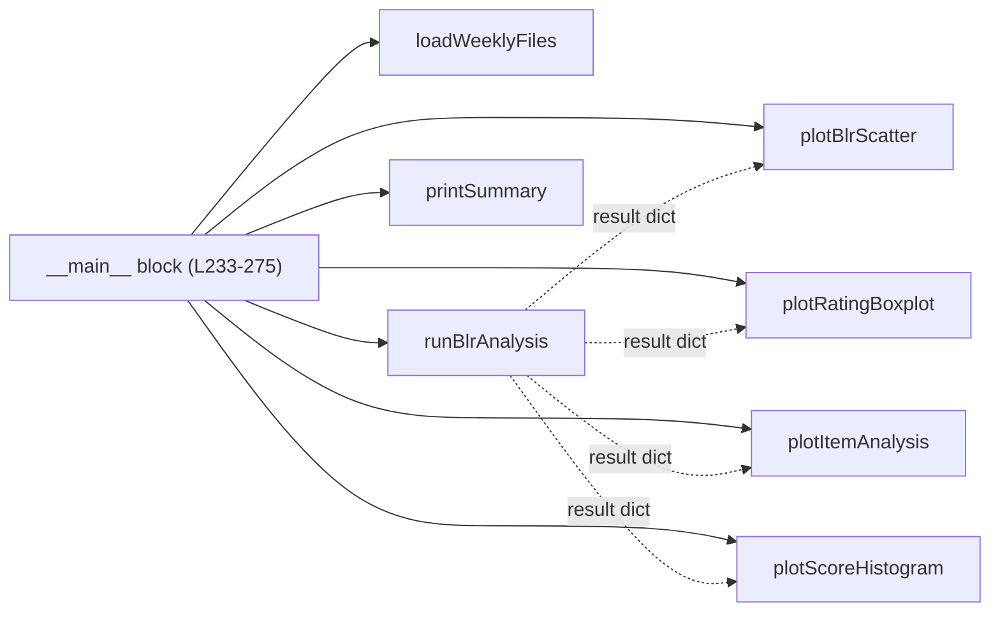

# `blr_analysis.py`

> Standalone CLI script that reads a folder of weekly DDS2 assessment workbooks and, for each assessment day, derives a Borderline Regression (BLR) pass/fail cutoff by regressing assessor score on global rating, plus item analysis, Cronbach's alpha and four diagnostic charts saved as PNGs.

| | |
|---|---|
| **Lines of code** | 275 |
| **Top-level functions** | 7 |
| **Classes** | 0 |
| **Module constants** | 4 (`folderPath`, `borderlineThreshold`, `dateRegex`, `filePattern` — all lower-camelCase, not UPPER_CASE) |
| **Imports from this codebase** | none |
| **Imported by** | **Nothing.** No module in `src/` imports it, and `main.ipynb` does not import it |
| **Run how** | **CLI script — `python blr_analysis.py`.** All orchestration lives in the `if __name__ == "__main__":` block at lines 233–275. It is *not* dead code in the sense of being unreachable — the script runs end to end — but it is **superseded**: evolved copies of `loadWeeklyFiles` and `runBlrAnalysis` live in `general_utils.py` (lines 1489 and 1652), and `main.ipynb` uses those instead via `runBlrAnalysisForAllFiles` (notebook line 1702). Treat this file as a legacy standalone that no longer participates in the notebook pipeline |

---

## 1. Purpose and role in the pipeline

**Borderline Regression (BLR)** is a standard-setting method used in clinical assessment. Rather than picking a pass mark by fiat, you regress the objective checklist score on the assessor's holistic **global rating** (**GR**), then read off the score the regression predicts at the "borderline" global rating. That predicted score becomes the cutoff. This module implements that method for a folder of weekly DDS2 (Doctor of Dental Surgery, year 2) assessment exports.

**What it consumes.** Excel workbooks on the local filesystem. `loadWeeklyFiles` scans `folderPath` (`"2026/DDS2"`) for files whose name matches `filePattern` (`r"assessment_data\.xlsx$"`) and contains an ISO date matching `dateRegex` (`r"\d{4}-\d{2}-\d{2}"`), reading each with `pd.read_excel(..., engine="openpyxl")`. Each workbook is expected to have at minimum the columns `global_rating`, `assessor_score`, `student_number`, `student_name`, `assessor_name`, plus a set of item columns whose names start with `MC`.

**What it produces.** Console output and PNG files written back into `folderPath`: one four-panel `blr_analysis_<date>.png` per assessment day, and, when more than one day is found, a single `blr_cutoff_trend.png`. Nothing is returned to a caller and nothing is written to Excel or the database — that is exactly the gap the `general_utils.py` successor fills (the notebook writes `BLR_analysis_results.xlsx`).

**The statistical models.** `runBlrAnalysis` fits and reports four distinct things per day:

1. **Simple ordinary least-squares linear regression** — the BLR model proper. Dependent variable: `assessor_score` (the checklist total, on a 0–1 scale — every display multiplies by 100). Single independent variable: `global_rating` (an integer 1–4 in the colour map at line 114). Fitted with **`scipy.stats.linregress(df["global_rating"], df["assessor_score"])`**, which returns `slope, intercept, rVal, pVal, stdErr`. Reported as `slope`, `intercept`, `rSquared` (= `rVal ** 2`) and `pVal`; the derived quantity of interest is `regressionCutoff = slope * borderlineGr + intercept`, i.e. the score the model predicts at the borderline rating.
2. **Borderline group method** — the alternative, non-regression standard-setting method, computed for comparison: the plain `mean` and `std` of `assessor_score` restricted to rows where `global_rating == borderlineGr`.
3. **Per-rating descriptive statistics** — `df.groupby("global_rating")["assessor_score"].agg(["mean","std","count"])`, renamed to `meanScore` / `sdScore` / `n`.
4. **Classical item analysis + reliability** — per `MC` item: the item mean, the item mean within the borderline group, and the **item-total correlation** `df[mc].corr(df["assessor_score"])` (Pearson, uncorrected — the item is included in the total). Then **Cronbach's alpha**, computed by hand as `α = (k/(k−1)) · (1 − Σ item variances / variance of the summed score)`, all variances with `ddof=1`, on the listwise-complete `MC` submatrix.

Finally the script flags every student whose `assessor_score` is at or below the regression cutoff.

**Who calls it.** Nobody. This is the only module in the documented set that is neither imported by `main.ipynb` nor by any other module. Its function names are duplicated — with the same behaviour but extra parameters — in `general_utils.py`, which is what the notebook actually runs.

---

## 2. External dependencies

| Library / resource | Used for |
|---|---|
| `pandas` (`pd`) | `pd.read_excel(..., engine="openpyxl")`; all DataFrame handling; `groupby`/`agg`; `.corr()`; `.var()` |
| `numpy` (`np`) | `np.random.uniform` for scatter jitter; `np.arange` / `np.array` for plot positions; `np.nan` for the degenerate Cronbach case |
| `matplotlib.pyplot` (`plt`) | All four chart types, the 2×2 per-day figure and the longitudinal trend figure; `fig.savefig` and `plt.close` |
| `scipy.stats` (`stats`) | `stats.linregress` — the only inferential library call in the module |
| `os` | `os.listdir` to scan the folder; `os.path.join` for input and output paths |
| `re` | Compiles `filePattern` (case-insensitive) and `dateRegex` to select and date-stamp workbooks |
| **openpyxl** | Not imported directly, but required at runtime as the `pd.read_excel` engine |
| **Filesystem** | Reads `*.xlsx` from `folderPath`; **writes PNGs into the same folder** |
| **Database / network / env vars** | None |

---

## 3. Module-level constants and variables

All four sit under the `# ── CONFIG ──` banner at line 9 and are the script's entire configuration surface — there is no argparse, no env var, no CLI flag. Changing behaviour means editing the source.

| Name | Type | Value / shape | Purpose |
|---|---|---|---|
| `folderPath` | `str` (raw) | `r"2026/DDS2"` | Relative path scanned for input workbooks **and** written to for output PNGs. Hard-codes both the year and the cohort |
| `borderlineThreshold` | `int` | `2` | The global-rating value treated as "borderline". Passed as `borderlineGr` into `runBlrAnalysis` and `printSummary` from the `__main__` block. The inline comment reads `# global_rating value considered "borderline"` |
| `dateRegex` | `str` (raw) | `r"\d{4}-\d{2}-\d{2}"` | Extracts the ISO date from a filename; the matched text becomes `dateStr`, used for sorting, titles and output filenames |
| `filePattern` | `str` (raw) | `r"assessment_data\.xlsx$"` | Selects which files in the folder are assessment exports (matched case-insensitively) |

---

## 4. Classes

None. This module defines no classes.

---

## 5. Function reference

The file has no section banners beyond `# ── CONFIG ──` and `# ── MAIN ──`, so functions are grouped below by role, in source order.

### 5.1 Input

#### `loadWeeklyFiles(folderPath, dateRegex, filePattern)`

*Lines 16–33.* Loads every dated assessment workbook in a folder.

**Parameters**

| Name | Type | Default | Description |
|---|---|---|---|
| `folderPath` | `str` | — | Directory to scan (shadows the module-level global of the same name) |
| `dateRegex` | `str` | — | Regex whose match is taken as the date string |
| `filePattern` | `str` | — | Regex a filename must match to be treated as an assessment export |

**Returns** — `list[tuple[str, pd.DataFrame]]`, sorted ascending by the date string. Because the dates are ISO-formatted, plain string sorting is chronologically correct.

**Behaviour**

1. Pre-compiles both regexes; the file pattern is compiled with `re.IGNORECASE`, the date pattern is not.
2. Iterates `os.listdir(folderPath)` and skips: filenames beginning with `~$` (Excel lock files), filenames that do not match `filePattern`, and filenames with no date match.
3. Reads each survivor with `pd.read_excel(filePath, engine="openpyxl")`.
4. Returns the list sorted by `x[0]` (the date string).

**Side effects** — reads from the filesystem. Note there is no `try/except` around `read_excel`: a corrupt or open workbook raises and aborts the whole run.

**Called by** — the `__main__` block only (line 234). No intra-module function calls it, which is why the machine-parsed facts record zero intra-module edges for this file.

---

### 5.2 Analysis

#### `runBlrAnalysis(df, dateStr, borderlineGr, mcCols=None)`

*Lines 36–106.* The whole statistical model for one assessment day.

**Parameters**

| Name | Type | Default | Description |
|---|---|---|---|
| `df` | `pd.DataFrame` | — | One day's assessment data. Must contain `global_rating`, `assessor_score`, `student_number`, `student_name`, `assessor_name` |
| `dateStr` | `str` | — | Date label, carried through into the result and every chart title |
| `borderlineGr` | `int` | — | The global-rating value defining the borderline group; the regression cutoff is evaluated at this x-value |
| `mcCols` | `list[str] \| None` | `None` | Item columns. When `None`, auto-detected as every column whose name `startswith("MC")` (line 39) |

**Returns** — a `dict` with 16 keys:

| Key | Content |
|---|---|
| `date`, `n` | `dateStr`; `len(df)` |
| `borderlineMean`, `borderlineSd` | Mean and SD of `assessor_score` within the borderline GR group, 4 dp |
| `regressionCutoff` | `slope * borderlineGr + intercept`, 4 dp — **the BLR standard** |
| `slope`, `intercept`, `rSquared` | Regression coefficients and `rVal ** 2`, 4 dp |
| `pVal` | Regression p-value, **unrounded** |
| `overallMean`, `overallSd` | Cohort-day mean and SD of `assessor_score`, 4 dp |
| `cronbachAlpha` | Reliability coefficient, 4 dp |
| `ratingStats` | DataFrame indexed by `global_rating` with `meanScore`, `sdScore`, `n` |
| `itemStatsDf` | DataFrame with `item`, `mean`, `borderlineMean`, `itemTotalCorr` (all 3 dp) |
| `belowCutoffDf` | Students at or below the cutoff, sorted ascending by score |
| `df` | The input DataFrame, passed through so the plot functions can re-read it |

**Behaviour**

1. **Borderline group method** (lines 42–44): subsets `df.loc[df["global_rating"] == borderlineGr, "assessor_score"]` and takes `mean()` / `std()` (pandas default `ddof=1`).
2. **Regression** (lines 47–51): `stats.linregress(x=global_rating, y=assessor_score)`. The cutoff is the fitted value at `x = borderlineGr`. `rSquared = rVal ** 2`.
3. **Per-rating stats** (lines 54–57): grouped agg, renamed to `meanScore` / `sdScore` / `n`.
4. **Item analysis** (lines 60–73): loops `mcCols`, skipping any not present in `df`; for each, item mean, borderline-group item mean, and `df[mc].corr(df["assessor_score"])` — an **uncorrected** item-total correlation (the item is part of the total it is correlated with).
5. **Cronbach's alpha** (lines 76–81): `mcData = df[validMcCols].dropna()` (listwise deletion across all items), `itemVars = mcData.var(axis=0, ddof=1)`, `totalVar = mcData.sum(axis=1).var(ddof=1)`, then `α = (k/(k−1))·(1 − Σ itemVars / totalVar)` when `k > 1`, else `np.nan`.
6. **Flagging** (lines 84–87): `df["assessor_score"] <= regressionCutoff` — inclusive — selecting five identity/score columns, sorted ascending by score.

**Side effects** — none. Pure computation; the input `df` is read but not mutated (only `.loc` reads and a pass-through reference into the result).

**Called by** — the `__main__` block only (line 242).

---

### 5.3 Plots

All four plot functions accept an optional `ax`; when `ax is None` each creates its own 8×5 figure, which is what makes them usable both standalone and as panels of the 2×2 grid the `__main__` block builds. All four return the `Axes`, not the `Figure`. The shared GR colour map is `{1: "#E24B4A", 2: "#EF9F27", 3: "#3266ad", 4: "#1D9E75"}` — red, amber, blue, green — duplicated verbatim in `plotBlrScatter` (line 114) and `plotRatingBoxplot` (line 155).

#### `plotBlrScatter(result, borderlineGr, ax=None)`

*Lines 109–145.* Scatter of assessor score against global rating with the fitted regression line and the cutoff.

**Parameters**

| Name | Type | Default | Description |
|---|---|---|---|
| `result` | `dict` | — | Output of `runBlrAnalysis` |
| `borderlineGr` | `int` | — | **Accepted but never used in the body** — the cutoff is read from `result["regressionCutoff"]` instead |
| `ax` | `Axes \| None` | `None` | Target axes; created if omitted |

**Returns** — the `Axes`.

**Behaviour**

1. For each distinct `global_rating`, scatters that subset with **uniform jitter in ±0.15** on the x-axis (`np.random.uniform`, line 118) so overlapping integer ratings separate visually. Legend entries carry the group n.
2. Scores are plotted as percentages (`* 100`).
3. Draws the regression line across `x ∈ [0.5, max(GR)+0.5]` as a black dashed line labelled with R².
4. Draws a dotted red horizontal line at the cutoff, labelled `BLR cutoff <value>%`.
5. Axis limits: x `(0.5, max(GR)+0.5)`, **y hard-coded to `(45, 105)`**.

**Side effects** — draws on the axes; consumes the global numpy random state (no seed).

**Called by** — the `__main__` block only (line 249).

---

#### `plotRatingBoxplot(result, ax=None)`

*Lines 148–167.* Box plot of assessor score grouped by global rating, with the cutoff line.

**Parameters**

| Name | Type | Default | Description |
|---|---|---|---|
| `result` | `dict` | — | Output of `runBlrAnalysis` |
| `ax` | `Axes \| None` | `None` | Target axes |

**Returns** — the `Axes`.

**Behaviour**

1. Builds one array of `assessor_score * 100` per sorted distinct rating.
2. `ax.boxplot(data, labels=[f"GR {r}" …], patch_artist=True, widths=0.5)`.
3. Colours each box by appending `"66"` (40 % alpha) to the GR hex colour for the face, and uses the solid colour for the edge (lines 158–160).
4. Adds the same dotted red cutoff line and a legend.

**Called by** — the `__main__` block only (line 250).

---

#### `plotItemAnalysis(result, ax=None)`

*Lines 170–193.* Dual-axis chart: item means as bars, item-total correlations as an overlaid line.

**Parameters**

| Name | Type | Default | Description |
|---|---|---|---|
| `result` | `dict` | — | Output of `runBlrAnalysis`; uses `result["itemStatsDf"]` |
| `ax` | `Axes \| None` | `None` | Target axes |

**Returns** — the primary `Axes`.

**Behaviour**

1. Bars of `mean * 100` on the left axis, y-limited `(0, 110)`.
2. `ax2 = ax.twinx()` carrying `itemTotalCorr` as a green marker-line, y-limited `(0, 1)` — **negative item-total correlations, the ones that most need attention, are clipped off the chart**.
3. Item names as x tick labels, rotated 45°.
4. Merges the handles from both axes into a single legend (lines 190–192).

**Called by** — the `__main__` block only (line 251).

---

#### `plotScoreHistogram(result, ax=None)`

*Lines 196–209.* Histogram of assessor scores with cutoff and mean reference lines.

**Parameters**

| Name | Type | Default | Description |
|---|---|---|---|
| `result` | `dict` | — | Output of `runBlrAnalysis` |
| `ax` | `Axes \| None` | `None` | Target axes |

**Returns** — the `Axes`.

**Behaviour** — 15-bin histogram of `assessor_score * 100`; a dotted red vertical line at the BLR cutoff and a dashed dark-grey vertical line at `overallMean * 100`, both labelled in the legend.

**Called by** — the `__main__` block only (line 252).

---

### 5.4 Reporting

#### `printSummary(result, borderlineGr)`

*Lines 212–229.* Prints the full per-day BLR report to stdout.

**Parameters**

| Name | Type | Default | Description |
|---|---|---|---|
| `result` | `dict` | — | Output of `runBlrAnalysis` |
| `borderlineGr` | `int` | — | Echoed in the header as "Borderline GR threshold" |

**Returns** — `None`.

**Behaviour** — prints a 60-character `=` banner with the date and n, then: the borderline threshold; the BLR cutoff as a percentage to 2 dp; the borderline-group mean and SD; the regression written out as `score = <slope> × GR + <intercept>`; R² and p (the latter in scientific notation, `.2e`); overall mean and SD; Cronbach's α to 4 dp; then the `ratingStats` table, the `itemStatsDf` table, and the count and listing of students below the cutoff — all via `to_string()`.

**Side effects** — stdout only.

**Called by** — the `__main__` block only (line 244).

---

### 5.5 The `__main__` block

*Lines 233–275.* Not a function — this is where every function above is actually called, and the reason the module's intra-call graph is empty.

**Behaviour**

1. `weeklyFiles = loadWeeklyFiles(folderPath, dateRegex, filePattern)`. If empty, prints `No matching files found in <folderPath>` and calls the bare builtin **`exit()`** (line 238).
2. For each `(dateStr, df)`: run `runBlrAnalysis`, append the result to `allResults`, and `printSummary`.
3. Build a 2×2 figure (14×10) titled `BLR Analysis — <date>` and fill the panels with `plotBlrScatter`, `plotRatingBoxplot`, `plotItemAnalysis`, `plotScoreHistogram`; `tight_layout`; save to `os.path.join(folderPath, f"blr_analysis_{dateStr}.png")` at `dpi=150, bbox_inches="tight"`; print the path; `plt.close(fig)`.
4. If more than one day was processed, build a longitudinal figure plotting the BLR cutoff (red circles/solid) and the overall mean (blue squares/dashed) against date, save it to `os.path.join(folderPath, "blr_cutoff_trend.png")`, print the path and close it.

**Side effects** — writes one PNG per assessment day plus one trend PNG **into the input folder**; prints throughout; may terminate the interpreter via `exit()`.

---

## 6. Call graph (this module)

**There are zero function-to-function call edges in this module** — every one of the seven functions is a leaf invoked directly from the `__main__` block. The dashed edges show the data dependency instead: all four plot functions consume the dict `runBlrAnalysis` returns.

---

## 7. Gotchas and known issues

- **Not imported by `main.ipynb`, and superseded by `general_utils.py`.** This is the headline issue. `general_utils.py` contains its own `loadWeeklyFiles` (line 1489), `runBlrAnalysis` (line 1652) and a wrapper `runBlrAnalysisForAllFiles` (line 1725), and the notebook uses those (`blrResultsDf = runBlrAnalysisForAllFiles(folderPath=folder, borderlineGr=2, period=PERIOD, …)` at notebook line 1702, writing `BLR_analysis_results.xlsx`). The `general_utils` versions have gained parameters this file lacks — `period` / `minDate` / `maxDate` / `ignoreCodeList` / `minItemCount` / `verbose` on the loader, and `grCol="GR"` on the analysis. **Any fix made here will not affect the pipeline**, and any fix made in `general_utils.py` will silently diverge from this copy. Decide whether to delete this file or repoint it at `general_utils`.
- **The GR column name is hard-coded as `global_rating`, but the live version parameterises it as `grCol="GR"`.** `general_utils.runBlrAnalysis` defaults to a column called `GR`; this file uses `global_rating` in five places (lines 42, 48, 54, 65, and inside all the plot functions). Running this script against the workbooks the current pipeline produces will raise `KeyError: 'global_rating'`.
- **Hard-coded year and cohort in the only input path.** `folderPath = r"2026/DDS2"` (line 10) must be edited for any other year or cohort, and it is a *relative* path — the script only works when run from the correct working directory.
- **Output PNGs are written into the input folder** (lines 254 and 272), so re-runs overwrite previous figures in place and the input directory accumulates artefacts alongside the source workbooks.
- **Scatter jitter is unseeded.** `np.random.uniform(-0.15, 0.15, len(subset))` at line 118 means `blr_analysis_<date>.png` differs on every run for the same input — bad for reproducibility and for diffing figures across re-runs.
- **`ax.set_ylim(45, 105)` in `plotBlrScatter`** (line 144) silently hides any student scoring below 45 %. Those are precisely the students the BLR cutoff is meant to catch — and they will still appear in `belowCutoffDf` in the printed report, so the chart and the table can disagree.
- **`ax2.set_ylim(0, 1)` in `plotItemAnalysis`** (line 184) clips negative item-total correlations off the chart. A negatively discriminating item is the single most important finding an item analysis can produce, and it is invisible here.
- **Item-total correlations are uncorrected.** Line 66 correlates each item against `assessor_score`, which *includes* that item, inflating `itemTotalCorr` — the more so the fewer items there are. The conventional statistic is the corrected item-total correlation (item vs total minus that item).
- **Cronbach's alpha uses listwise deletion across all items.** `mcData = df[validMcCols].dropna()` (line 77) drops any student missing even one item, so α can be computed on a much smaller sample than `n` reported in the same dict, with no warning. There is also no guard against `totalVar == 0`, which would produce an infinity.
- **`itemStatsDf` can be empty.** If no column starts with `MC`, `mcCols` is `[]`, `itemStatsDf` is an empty DataFrame, and `plotItemAnalysis` then raises `KeyError: 'mean'` at line 177. `runBlrAnalysis` itself survives (k=0 → `cronbachAlpha = np.nan`), so the failure surfaces only at plot time.
- **`pVal` is the only unrounded value in the result dict** (line 98), while every neighbouring value is rounded to 4 dp — inconsistent, though deliberate given `printSummary` formats it as `.2e`.
- **`plotBlrScatter` takes a `borderlineGr` argument it never uses** (line 109). Callers must still pass one.
- **Bare `exit()` at line 238** rather than `sys.exit()`. `exit` is injected by the `site` module and is not guaranteed to exist under `python -S` or when embedded; it also raises `SystemExit` inside a notebook rather than merely stopping a cell.
- **No error handling anywhere.** A single unreadable or malformed workbook in `folderPath` aborts the entire multi-day run at `pd.read_excel` (line 31), losing the results for every day already processed, since nothing is written until after each day's analysis completes.
- **`ax.boxplot(..., labels=...)`** (line 157) uses the `labels` keyword, renamed to `tick_labels` in matplotlib 3.9; on current matplotlib this emits a deprecation warning.
- **Module constants are lower-camelCase**, unlike the UPPER_CASE convention used by `assessor_analysis.py` and `assessor_confound.py`, and `folderPath` is additionally shadowed by the identically named parameter of `loadWeeklyFiles`.
