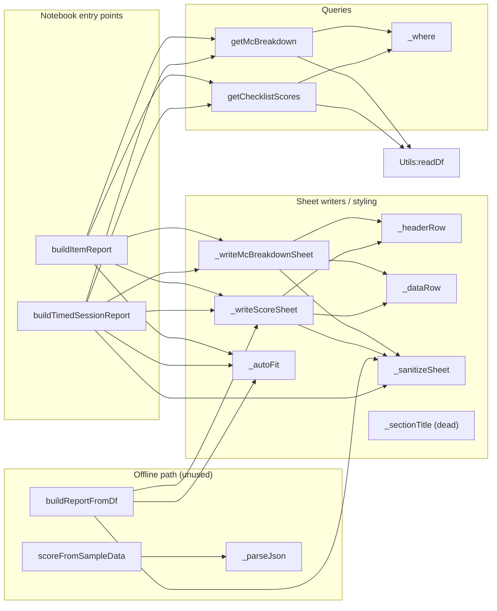

# `boh1_utils.py`

> Queries BOH1 clinical checklist forms out of Postgres and writes formatted, colour-coded Excel workbooks (timed-session reports and single-item reports) with openpyxl.

| | |
|---|---|
| **Lines of code** | 692 |
| **Top-level functions** | 14 (plus 1 nested — 15 in total) |
| **Classes** | 0 |
| **Module constants** | 8 |
| **Imports from this codebase** | `Utils` (`readDf`), `variableUtils` (imported but never used) |
| **Imported by** | No other module in the codebase imports it. `main.ipynb` imports it: `from boh1_utils import buildTimedSessionReport, buildItemReport` |
| **Run how** | Imported by `main.ipynb`. The module docstring advertises `from boh1_utils import *`, but the notebook actually uses a named import of the two builders. |

---

## 1. Purpose and role in the pipeline

`boh1_utils` is the BOH1-specific slice of the MDS assessment pipeline. **BOH1** is the first-year Bachelor of Oral Health cohort; **cohort** is the value stored in the `cohort` column of the forms table and is the primary filter for every query here.

The module consumes exactly one data source: the raw assessment forms table, `rawform_forms` (module default `BOH1_TABLE`, overridable per call via `formsTable=`). Two JSONB columns carry the payload:

- `assessor_data` — a JSONB object whose **top-level keys are item codes** (e.g. `"221"`, `"114 H/S"`, `"531"`) plus a set of scale keys (`"scale-global-rating"`, `"scale-practice-readiness"`, …). Each item code maps to an object of `MC<n>` keys (individual checklist criteria) whose values are **option keys** `O1`–`O6`. Scale keys map to `{"scale": "N"}`.
- `student_data` — the same shape, filled in by the student. `checklists` carries the human-readable metadata: `checklists-><item_code>->>'name'` is the item name, `checklists-><item_code>->'fields'->><MC key>` is the criterion description.

The option keys are scored by `SCORE_MAP`: O1 = 1.00 (*Done well*) down to O5 = 0.00 (*Not done*). **O6 (`N/A`) is excluded from both the numerator and the denominator** — the denominator is the count of MC keys whose value is one of O1–O5, so an N/A criterion simply does not count against the student.

What it produces: `.xlsx` workbooks on the local filesystem, and the DataFrames that back them. Two report shapes exist:

1. **Timed session report** (`buildTimedSessionReport`) — one workbook for one clinical *timed session* date, with a sheet for that date's scores, a "Historical Comparison" sheet putting the timed session next to the same students' earlier sessions for the same items, and an "MC Breakdown" sheet showing assessor-vs-student option selections criterion by criterion.
2. **Item report** (`buildItemReport`) — one workbook for a single item code across all dates, with a Summary sheet, an MC Breakdown sheet, and a "By Assessor" pivot of mean `% Score` per assessor.

Everything else in the file is either a private openpyxl formatting helper (`_headerRow`, `_dataRow`, `_autoFit`, `_sectionTitle`, `_sanitizeSheet`), a private SQL `WHERE` builder (`_where`), one of the two SQL query functions (`getChecklistScores`, `getMcBreakdown`), or an offline fallback path (`scoreFromSampleData` + `buildReportFromDf`) that reproduces the SQL scoring in Python from an exported TSV so a report can be built with no live DB connection.

Nothing in this module writes to the database. `readDf` (from `Utils`) is the only DB touch point and it is read-only.

---

## 2. External dependencies

| Library / resource | Used for |
|---|---|
| `re` | `_sanitizeSheet` — stripping Excel-illegal characters `[ ] : * ? / \` from sheet names |
| `numpy` (`np`) | NaN detection (`np.isnan`) when converting DataFrame cells to Excel values |
| `pandas` (`pd`) | The DataFrame is the interchange format throughout; `pd.to_datetime` for the session label; `pd.DataFrame` construction in `scoreFromSampleData` |
| `openpyxl.Workbook` | Workbook construction and `wb.save()` |
| `openpyxl.utils.get_column_letter` | Column-width setting in `_autoFit` |
| `openpyxl.styles` (`Font`, `Alignment`, `PatternFill`, `Border`, `Side`) | All cell styling — header fills, borders, banded shading |
| `openpyxl.utils.dataframe.dataframe_to_rows` | **Imported at line 19 but never used.** |
| `Utils.readDf` | `readDf(engine, sql, params)` — wraps `pd.read_sql(text(sql), conn, params=...)` on a SQLAlchemy engine |
| `variableUtils` | **Imported at line 22 but never referenced.** |
| **Database** | Postgres, via a SQLAlchemy `engine` passed in by the caller. Table `rawform_forms` (`BOH1_TABLE`). Both queries are `SELECT`-only. Timezone `Australia/Melbourne` is hard-coded for date conversion. |
| **Filesystem** | `.xlsx` files written to `outputPath` by `buildTimedSessionReport`, `buildItemReport`, `buildReportFromDf`. Parent directories are **not** created. |
| **Env vars** | None. |
| **Network** | None beyond the DB connection held by `engine`. |

---

## 3. Module-level constants and variables

| Name | Type | Value / shape | Purpose |
|---|---|---|---|
| `BOH1_TABLE` | `str` | `"rawform_forms"` | Default source table. The inline comment says *"override per environment if needed"*; every function takes `formsTable=` to do so. |
| `BOH1_COHORT` | `str` | `"BOH1"` | Default value for the `cohort = :cohort` predicate. |
| `SCORE_MAP` | `dict` (5) | `{"O1": 1.00, "O2": 0.80, "O3": 0.60, "O4": 0.40, "O5": 0.00}` | Option key → score weight. Note O6 is deliberately absent — see the comment at line 31: *"O6 (N/A) is excluded from score AND from denominator"*. Used **only** by `scoreFromSampleData`; the SQL path re-states the same weights inline. |
| `OPTION_LABELS` | `dict` (6) | `{"O1": "Done well", …, "O6": "N/A"}` | Human labels for the six option keys. **Not referenced anywhere in this module.** |
| `GLOBAL_RATING_LABELS` | `dict` (5) | `{1: "Unsatisfactory", 2: "Borderline", 3: "Satisfactory", 4: "Good", 5: "Excellent"}` | Labels for the 1–5 **GR** (Global Rating) scale. **Not referenced anywhere in this module.** |
| `PRACTICE_READINESS_LABELS` | `dict` (4) | `{1: "L1 – Not ready", …, 4: "L4 – Ready with indirect supervision"}` | Labels for the 1–4 practice-readiness scale. **Not referenced anywhere in this module.** |
| `_TIMED_COLS` | `list` (16) | Column order for score sheets | Column whitelist/ordering for the "Timed Session" sheet and the default `buildReportFromDf` layout. |
| `_HIST_COLS` | `list` (11) | Column order for the historical sheet | Narrower column set for "Historical Comparison"; adds `"Session Type"`, drops the four secondary scales and `"Student Reflection"`. |

```python
# _TIMED_COLS (line 327) — full 16-column layout
["Student Name", "Assessor", "Date", "Item Code", "Item Name",
 "Score", "Max Score", "% Score",
 "Practice Readiness", "Global Rating",
 "Time Mgmt", "Communication", "Professionalism", "Position & Ergonomics",
 "Assessor Comments", "Student Reflection"]

# _HIST_COLS (line 335) — 11-column layout, with Session Type
["Student Name", "Date", "Item Code", "Item Name", "Session Type",
 "Score", "Max Score", "% Score",
 "Practice Readiness", "Global Rating", "Assessor Comments"]
```

Both column lists are filtered against the DataFrame's actual columns before use (`[c for c in cols if c in df.columns]`), so a missing column degrades silently rather than raising.

---

## 4. Classes

None. The module defines no classes.

---

## 5. Function reference

The file is divided by banner comments into: **Internal helpers** (openpyxl formatting), **WHERE clause builder**, **Core query**, **Per-item MC breakdown query**, **Excel report builders**, **Internal sheet writers**, and **Notebook convenience**. The sections below follow that order.

### 5.1 Internal openpyxl helpers

#### `_sanitizeSheet(name: str) -> str`

*Lines 65–67.* Turn an arbitrary string into a legal Excel worksheet name.

**Parameters**

| Name | Type | Default | Description |
|---|---|---|---|
| `name` | `str` | — | Proposed sheet name; `None` is tolerated. |

**Returns** — `str`, at most 31 characters, never empty.

**Behaviour**

1. `re.sub(r'[\[\]\:\*\?\/\\]', '', str(name or ''))` strips the six characters Excel forbids in sheet names, then `.strip()`.
2. Truncates to 31 characters (Excel's hard limit).
3. Falls back to the literal `"Sheet"` if the result is empty.

**Called by** — `_writeScoreSheet`, `_writeMcBreakdownSheet`, `buildTimedSessionReport`, `buildReportFromDf`.

---

#### `_autoFit(ws, minW=10, maxW=60)`

*Lines 70–73.* Set every column's width from its longest cell value.

**Parameters**

| Name | Type | Default | Description |
|---|---|---|---|
| `ws` | openpyxl worksheet | — | Sheet to resize. |
| `minW` | `int` | `10` | Lower bound on column width. |
| `maxW` | `int` | `60` | Upper bound on column width. |

**Returns** — `None`.

**Behaviour**

1. For each column, takes `max(len(str(cell.value)))` over non-`None` cells (`default=0`).
2. Sets the width to `max(minW, min(maxW, best + 2))` — i.e. the longest value plus 2 characters of padding, clamped.

**Side effects** — Mutates `ws.column_dimensions` in place.

**Called by** — `buildTimedSessionReport`, `buildItemReport`, `buildReportFromDf`.

---

#### `_headerRow(ws, row: int, cols: list, fillHex="1F4E79")`

*Lines 76–86.* Write a styled header row.

**Parameters**

| Name | Type | Default | Description |
|---|---|---|---|
| `ws` | worksheet | — | Target sheet. |
| `row` | `int` | — | 1-based row index to write into. |
| `cols` | `list` | — | Header labels, written left to right from column 1. |
| `fillHex` | `str` | `"1F4E79"` | Solid fill colour (dark navy). |

**Returns** — `int`, `row + 1` (the next free row), so callers can chain.

**Behaviour** — Each cell gets bold white text, the solid navy fill, `wrap_text=True` with top/centre alignment, and a thin border on all four sides.

**Side effects** — Writes cells into `ws`.

**Called by** — `_writeScoreSheet`, `_writeMcBreakdownSheet`.

---

#### `_dataRow(ws, row: int, values: list, shade=False)`

*Lines 89–99.* Write one styled data row.

**Parameters**

| Name | Type | Default | Description |
|---|---|---|---|
| `ws` | worksheet | — | Target sheet. |
| `row` | `int` | — | 1-based row index. |
| `values` | `list` | — | Cell values, written left to right from column 1. |
| `shade` | `bool` | `False` | When true, applies a light blue (`D9E1F2`) solid fill to the whole row. |

**Returns** — `int`, `row + 1`.

**Behaviour** — Wrapped, top-aligned text with a thin border on every cell; conditional row shading. Callers use `shade` for zebra striping (`i % 2 == 1`) and, in the MC breakdown sheet, for highlighting assessor/student disagreement.

**Side effects** — Writes cells into `ws`.

**Called by** — `_writeScoreSheet`, `_writeMcBreakdownSheet`.

---

#### `_sectionTitle(ws, row: int, title: str, ncols: int = 1, fillHex="2E75B6")`

*Lines 102–108.* Write a merged, filled section-title banner across `ncols` columns.

**Parameters**

| Name | Type | Default | Description |
|---|---|---|---|
| `ws` | worksheet | — | Target sheet. |
| `row` | `int` | — | 1-based row index. |
| `title` | `str` | — | Banner text. |
| `ncols` | `int` | `1` | Number of columns to merge across. |
| `fillHex` | `str` | `"2E75B6"` | Solid fill colour (mid blue). |

**Returns** — `int`, `row + 1`.

**Side effects** — Merges cells and writes into `ws`.

**Called by** — **Nothing. This function is dead code** (`called_by` is empty; no call site exists in the module or in `main.ipynb`).

---

### 5.2 WHERE clause builder

#### `_where(cohort: str, dateFrom=None, dateTo=None, filters: dict = None)`

*Lines 114–143.* Build the shared `WHERE` fragment and bind-parameter dict for both queries.

**Parameters**

| Name | Type | Default | Description |
|---|---|---|---|
| `cohort` | `str` | — | Cohort value, e.g. `"BOH1"`. Bound as `:cohort`. |
| `dateFrom` | `str` \| `None` | `None` | Inclusive lower bound, `YYYY-MM-DD`. |
| `dateTo` | `str` \| `None` | `None` | Inclusive upper bound, `YYYY-MM-DD`. |
| `filters` | `dict` \| `None` | `None` | Extra `column = value` predicates. A `list` value becomes `column = ANY(:column)`. |

**Returns** — `tuple[str, dict]`: the clause string joined with `" AND "`, and the params dict.

**Behaviour**

1. Always seeds two predicates: `cohort = :cohort` and **`submitted_by_assessor = true`** — unsubmitted assessor forms are unconditionally excluded from every query in this module.
2. Date bounds compare `DATE(datetimeutc AT TIME ZONE 'Australia/Melbourne')`, so the boundaries are Melbourne calendar days, not UTC days.
3. `filters` keys are interpolated **directly into the SQL string** as column names (`f"{key} = :{key}"`). Values are bound safely; keys are not — callers must supply trusted column names.

**Called by** — `getChecklistScores`, `getMcBreakdown`.

---

### 5.3 Core queries

#### `getChecklistScores(engine, itemCodes: list, cohort: str = BOH1_COHORT, dateFrom: str = None, dateTo: str = None, formsTable: str = BOH1_TABLE, filters: dict = None) -> pd.DataFrame`

*Lines 150–269.* One row per `(assessmentid, item_code)`, with the aggregated checklist score, the percentage, and all six scale values.

**Parameters**

| Name | Type | Default | Description |
|---|---|---|---|
| `engine` | SQLAlchemy engine | — | Connection source; passed straight to `readDf`. |
| `itemCodes` | `list[str]` | — | Item codes to score, e.g. `["221", "114 H/S", "531"]`. Bound as `:item_codes` and matched with `= ANY()`. |
| `cohort` | `str` | `BOH1_COHORT` (`"BOH1"`) | Cohort filter. |
| `dateFrom` | `str` \| `None` | `None` | Inclusive lower date bound. |
| `dateTo` | `str` \| `None` | `None` | Inclusive upper date bound. |
| `formsTable` | `str` | `BOH1_TABLE` (`"rawform_forms"`) | Source table, interpolated into the `FROM` clause. |
| `filters` | `dict` \| `None` | `None` | Extra predicates, forwarded to `_where`. |

**Returns** — `pd.DataFrame` with 18 columns: `Assessment ID`, `Student ID`, `Student Name`, `Assessor`, `Date`, `Item Code`, `Item Name`, `Practice Readiness`, `Global Rating`, `Time Mgmt`, `Communication`, `Professionalism`, `Position & Ergonomics`, `Score`, `Max Score`, `% Score`, `Assessor Comments`, `Student Reflection`. Ordered by `student_name, session_date, item_code`.

**Behaviour**

1. Builds the `WHERE` fragment via `_where` and adds `params["item_codes"] = itemCodes`.
2. CTE `base` selects identity columns, converts `datetimeutc` to a Melbourne date, and lifts the six scales out of `assessor_data` with `NULLIF(assessor_data->'scale-x'->>'scale','')::int`. An empty-string scale becomes `NULL` rather than raising a cast error.
3. CTE `item_scores` double-unnests the JSONB: `jsonb_each(assessor_data)` yields `(item_code, item_data)`, then `jsonb_each_text(item_data)` yields `(mc_key, mc_val)`. It keeps only rows where `mc_key LIKE 'MC%%'` — this is what separates checklist criteria from the scale keys sharing the same object.
4. Scoring is a `CASE` expression hard-coding the same weights as `SCORE_MAP` (O1 → 1.00 … O5 → 0.00, anything else → `NULL`), summed and rounded to 2 dp as `raw_score`. `max_items` counts only MC values in `('O1','O2','O3','O4','O5')` — **so `O6` (N/A) drops out of the denominator**, and unrecognised values are excluded from both.
5. Final `SELECT` aliases everything to display names, computes `% Score` as `ROUND(raw_score / NULLIF(max_items,0) * 100, 1)` (`NULLIF` guards divide-by-zero → `NULL`), and coalesces blank reflections to the em dash `"—"`.
6. `Item Name` is `COALESCE(checklists->item_code->>'name', item_code)` — falls back to the code when the checklist metadata is missing.

**Side effects** — Executes a `SELECT` against the database (read-only).

**Calls** — `boh1_utils:_where`, `Utils:readDf`.
**Called by** — `buildTimedSessionReport`, `buildItemReport`.

---

#### `getMcBreakdown(engine, itemCodes: list, cohort: str = BOH1_COHORT, dateFrom: str = None, dateTo: str = None, formsTable: str = BOH1_TABLE, filters: dict = None) -> pd.DataFrame`

*Lines 276–320.* One row per `(assessmentid, item_code, MC key)` with the assessor's and the student's option selections side by side.

**Parameters** — Identical to `getChecklistScores`.

**Returns** — `pd.DataFrame` with 10 columns: `Assessment ID`, `Student Name`, `Assessor`, `Date`, `Item Code`, `Item Name`, `MC`, `MC Description`, `Assessor Option`, `Student Option`. Ordered by `"Student Name", "Date", "Item Code", "MC"`.

**Behaviour**

1. Drives off `assessor_data` with the same `jsonb_each` / `jsonb_each_text` / `mc_key LIKE 'MC%%'` pattern — no aggregation, one row per criterion.
2. `MC Description` comes from `checklists->item_code->'fields'->>mc_key`, i.e. the human wording of the criterion.
3. `Student Option` is fetched by a `LEFT JOIN LATERAL` over `jsonb_each(f.student_data)` restricted to the same item code, `LIMIT 1`. Because the join is `LEFT`, a missing student submission yields `NULL` rather than dropping the row.
4. The lateral subquery also selects `val->mc_a.mc_key AS mc_val_raw`, which is never referenced in the outer `SELECT` — vestigial.

**Side effects** — Executes a `SELECT` against the database (read-only).

**Calls** — `boh1_utils:_where`, `Utils:readDf`.
**Called by** — `buildTimedSessionReport`, `buildItemReport`.

---

### 5.4 Excel report builders

#### `buildTimedSessionReport(engine, outputPath: str, timedDate: str, timedItems: list, cohort: str = BOH1_COHORT, formsTable: str = BOH1_TABLE, sessionLabel: str = None, dateFrom: str = None)`

*Lines 343–420.* Build the three-sheet timed-session workbook.

**Parameters**

| Name | Type | Default | Description |
|---|---|---|---|
| `engine` | SQLAlchemy engine | — | Connection source. |
| `outputPath` | `str` | — | Destination `.xlsx` path. |
| `timedDate` | `str` | — | Session date, `"YYYY-MM-DD"`. Used as both `dateFrom` and `dateTo` for sheet 1. |
| `timedItems` | `list[str]` | — | Item codes assessed in the timed session. |
| `cohort` | `str` | `BOH1_COHORT` | Cohort filter. |
| `formsTable` | `str` | `BOH1_TABLE` | Source table. |
| `sessionLabel` | `str` \| `None` | `None` | Sheet 1 name / title. When `None`, derived as `f"Timed {pd.to_datetime(timedDate).strftime('%d %b %Y')}"`. |
| `dateFrom` | `str` \| `None` | `None` | Lower bound for the historical query. `None` means "all history". |

**Returns** — `tuple[pd.DataFrame, pd.DataFrame]`: `(timedDf, histDf)`.

**Behaviour**

1. Computes `label` from `sessionLabel` or the formatted `timedDate`.
2. Queries the timed session: `getChecklistScores(..., dateFrom=timedDate, dateTo=timedDate)`.
3. Derives the student list from `timedDf["Student Name"].unique().tolist()` (empty list if `timedDf` is empty) and builds `histFilters = {"student_name": timedStudents}` — a list, so `_where` renders it as `student_name = ANY(:student_name)`. **If the timed date returned no rows, `histFilters` is `None` and the historical query is run unfiltered across the whole cohort.**
4. Queries history with `dateFrom=dateFrom, dateTo=timedDate` — the range is inclusive of the timed date, so the timed session appears in the historical sheet too.
5. Adds `histDf["Session Type"]` by string-comparing each `Date` against `timedDate` → `"Timed"` or `"Regular"`.
6. Queries `getMcBreakdown` for the timed date only.
7. Creates a `Workbook`, removes the default sheet via `wb.remove(wb.active)`, then writes three sheets: `_sanitizeSheet(label)`, `"Historical Comparison"` (columns intersected with `_HIST_COLS`), and `"MC Breakdown"`.
8. Runs `_autoFit` over every worksheet and saves.

**Side effects** — Three DB `SELECT`s; writes an `.xlsx` file to `outputPath` (parent directory must already exist); prints `f"✓ Timed session report saved → {outputPath}"`; mutates `histDf` in place by adding the `Session Type` column.

**Calls** — `boh1_utils:getChecklistScores`, `boh1_utils:getMcBreakdown`, `boh1_utils:_sanitizeSheet`, `boh1_utils:_writeScoreSheet`, `boh1_utils:_writeMcBreakdownSheet`, `boh1_utils:_autoFit`.
**Called by** — `main.ipynb`.

**Example** — from `main_notebook_code.py`:

```python
from boh1_utils import buildTimedSessionReport, buildItemReport

# Timed session report
buildTimedSessionReport(
    engine,
    outputPath="BOH1/BOH1_Timed_29Apr.xlsx",
    timedDate="2026-04-29",
    timedItems=["161", "114 H/S", "221", "222"],
    formsTable="rawform_forms",  # adjust to your table name
)
```

---

#### `buildItemReport(engine, outputPath: str, itemCode: str, cohort: str = BOH1_COHORT, dateFrom: str = None, dateTo: str = None, formsTable: str = BOH1_TABLE)`

*Lines 423–506.* Build a three-sheet workbook for a single item code across all dates.

**Parameters**

| Name | Type | Default | Description |
|---|---|---|---|
| `engine` | SQLAlchemy engine | — | Connection source. |
| `outputPath` | `str` | — | Destination `.xlsx` path. |
| `itemCode` | `str` | — | A single item code, e.g. `"531"`. Wrapped as `[itemCode]` for the queries. |
| `cohort` | `str` | `BOH1_COHORT` | Cohort filter. |
| `dateFrom` | `str` \| `None` | `None` | Inclusive lower date bound. |
| `dateTo` | `str` \| `None` | `None` | Inclusive upper date bound. |
| `formsTable` | `str` | `BOH1_TABLE` | Source table. |

**Returns** — `pd.DataFrame` — `scoreDf`, the per-session score frame.

**Behaviour**

1. Runs `getChecklistScores` and `getMcBreakdown` for `[itemCode]` over the date range.
2. Sheet 1, `f"Item {itemCode} — Summary"`: a locally defined 17-column list (the `_TIMED_COLS` set plus `"Student ID"`) — note this is a **separate literal**, not `_TIMED_COLS`.
3. Sheet 2, `"MC Breakdown"`.
4. Sheet 3, `"By Assessor"`: only written when `scoreDf` is non-empty and has an `Assessor` column. Groups by `Assessor` and aggregates `Sessions=count("Assessment ID")`, `Avg_Pct_Score=mean("% Score")`, `Avg_Global_Rating=mean("Global Rating")`, `Avg_Practice_Readiness=mean("Practice Readiness")`, rounds to 2 dp, renames to display headings, and sorts by `Avg % Score` descending. The docstring calls this a "pivot of % Score by assessor"; it is a `groupby().agg()`.
5. `_autoFit` over all sheets, then save.

**Side effects** — Two DB `SELECT`s; writes an `.xlsx` file to `outputPath`; prints `f"✓ Item {itemCode} report saved → {outputPath}"`.

**Calls** — `boh1_utils:getChecklistScores`, `boh1_utils:getMcBreakdown`, `boh1_utils:_writeScoreSheet`, `boh1_utils:_writeMcBreakdownSheet`, `boh1_utils:_autoFit`.
**Called by** — `main.ipynb`.

**Example** — from `main_notebook_code.py`:

```python
# Item 531 report (up to 05 May)
buildItemReport(
    engine,
    outputPath="BOH1/BOH1_Item531.xlsx",
    itemCode="531",
    dateTo="2026-05-05",
    formsTable="rawform_forms",
)
```

---

### 5.5 Internal sheet writers

#### `_writeScoreSheet(wb, sheetName: str, df: pd.DataFrame, cols: list, title: str)`

*Lines 513–545.* Write a titled, banded, frozen-header score table onto a new sheet.

**Parameters**

| Name | Type | Default | Description |
|---|---|---|---|
| `wb` | `Workbook` | — | Workbook to add the sheet to. |
| `sheetName` | `str` | — | Sheet name; passed through `_sanitizeSheet`. |
| `df` | `pd.DataFrame` | — | Source data. |
| `cols` | `list` | — | Desired columns/order; intersected with `df.columns`. |
| `title` | `str` | — | Bold 13-pt title written into row 1, merged across `max(len(cols), 1)` columns. |

**Returns** — `None`.

**Behaviour**

1. Creates the sheet, sets row 1 height to 20, writes and merges the title.
2. If `df` is empty, writes `"No data found for the selected filters."` at A3 and **returns early** — no header, no freeze pane.
3. Otherwise builds `validCols` (the intersection, preserving `cols` order), copies that slice, writes the header at row 3 via `_headerRow`.
4. Per data row, converts values for openpyxl: float `NaN` → `None`; anything with an `.item()` attribute (numpy scalar) → its Python scalar. Rows alternate shading via `shade=(i % 2 == 1)`.
5. Freezes panes at `A4` so the title and header stay visible.

**Side effects** — Adds a worksheet to `wb` and writes cells.

**Calls** — `boh1_utils:_sanitizeSheet`, `boh1_utils:_headerRow`, `boh1_utils:_dataRow`.
**Called by** — `buildTimedSessionReport`, `buildItemReport`, `buildReportFromDf`.

---

#### `_writeMcBreakdownSheet(wb, sheetName: str, df: pd.DataFrame)`

*Lines 548–565.* Write the per-criterion assessor-vs-student sheet.

**Parameters**

| Name | Type | Default | Description |
|---|---|---|---|
| `wb` | `Workbook` | — | Workbook to add the sheet to. |
| `sheetName` | `str` | — | Sheet name; passed through `_sanitizeSheet`. |
| `df` | `pd.DataFrame` | — | Output of `getMcBreakdown`. **All** its columns are written, in DataFrame order — unlike `_writeScoreSheet` there is no column whitelist. |

**Returns** — `None`.

**Behaviour**

1. Writes the fixed bold title `"Per-MC Checklist Breakdown — Assessor vs Student"` at A1.
2. If `df` is empty, writes `"No MC data found."` at A3 and returns early.
3. Header at row 3, then one `_dataRow` per record with `NaN` → `None`.
4. **Shading is used as a discrepancy highlight, not zebra striping**: when the frame has an `"Assessor Option"` column, `shade = (r.get("Assessor Option") != r.get("Student Option"))`, so every row where the student and assessor picked different options is filled. Falls back to `i % 2 == 1` striping when that column is absent. Note that a `NULL` student option (student never submitted) counts as a discrepancy.
5. Freezes panes at `A4`.

**Side effects** — Adds a worksheet to `wb` and writes cells.

**Calls** — `boh1_utils:_sanitizeSheet`, `boh1_utils:_headerRow`, `boh1_utils:_dataRow`.
**Called by** — `buildTimedSessionReport`, `buildItemReport`.

---

### 5.6 Notebook convenience — offline (no DB) path

#### `scoreFromSampleData(rawDf: pd.DataFrame, itemCodes: list) -> pd.DataFrame`

*Lines 572–652.* Reimplement the `getChecklistScores` scoring in pure Python against an already-exported raw TSV, for use with no live DB connection.

**Parameters**

| Name | Type | Default | Description |
|---|---|---|---|
| `rawDf` | `pd.DataFrame` | — | Raw export. Expected columns: `assessmentid`, `student_number`, `student_name`, `assessor_name`, `datetimeutc`, `assessor_data`, `student_data`, `checklists`, `assessor_reflection`, `student_reflection`. The JSON columns may be `dict` or JSON `str`. |
| `itemCodes` | `list[str]` | — | Item codes to score. |

**Returns** — `pd.DataFrame` with the same 18-column schema as `getChecklistScores`, sorted by `["Student Name", "Date", "Item Code"]`.

**Behaviour**

1. Imports `json` locally as `_json` (function-level import).
2. Per raw row, parses `assessor_data`, `student_data` and `checklists` through the nested `_parseJson` helper. **`sd` (student_data) is parsed but never used** — the offline path scores the assessor only.
3. Reads the six scales out of `assessor_data` as `ad.get("scale-x", {}).get("scale")` and coerces via the nested `_toInt`.
4. Per item code: **skips the row entirely if the code is not a key of `assessor_data`** (`if ic not in ad: continue`).
5. Selects MC keys with `k.startswith("MC")` (the Python analogue of the SQL `LIKE 'MC%%'`), scores with `SCORE_MAP.get(v, 0)` and counts the denominator as the number of values actually present in `SCORE_MAP` — again excluding `O6`.
6. `% Score` is `round(raw_score / max_items * 100, 1)` or `None` when `max_items` is 0.
7. `Item Name` falls back to the item code; reflections fall back to `"—"`.

**Called by** — Nothing in this module, and no call site exists in `main.ipynb`. It is an unused-but-supported escape hatch.

**Nested functions**

| Name | Signature | What it does |
|---|---|---|
| `_parseJson` | `_parseJson(v)` *(lines 594–600)* | Returns `v` if it is already a `dict`; else `json.loads(v)` when truthy, `{}` when falsy. **Swallows every exception** and returns `{}` — malformed JSON is indistinguishable from an empty record. |
| `_toInt` | `_toInt(v)` *(lines 615–619)* | `int(v)` when `v is not None`, `None` on `ValueError`/`TypeError`. Defined inside the per-row loop, so it is rebuilt on every iteration. |

---

#### `buildReportFromDf(outputPath: str, scoreDf: pd.DataFrame, reportTitle: str = "BOH1 Session Report", timedDate: str = None)`

*Lines 655–692.* Write an Excel report from an already-computed score frame, with no DB access.

**Parameters**

| Name | Type | Default | Description |
|---|---|---|---|
| `outputPath` | `str` | — | Destination `.xlsx` path. |
| `scoreDf` | `pd.DataFrame` | — | A frame in the `getChecklistScores` / `scoreFromSampleData` schema. |
| `reportTitle` | `str` | `"BOH1 Session Report"` | Title text written into row 1 of the sheets. |
| `timedDate` | `str` \| `None` | `None` | When supplied *and* `scoreDf` has a `Date` column, splits the output into a timed sheet plus a historical sheet. |

**Returns** — `None`.

**Behaviour**

1. Creates a `Workbook` and removes the default sheet.
2. **Timed branch** (`timedDate` truthy and `"Date" in scoreDf.columns`): `timedMask = scoreDf["Date"].astype(str) == str(timedDate)`; `timedDf` is the masked subset; `histDf` is a copy of the **whole** frame (not the complement) with a `Session Type` column tagging `"Timed"` vs `"Regular"`. Sheet names are `_sanitizeSheet(f"Timed {…%d %b %Y}")` and `"Historical Comparison"`. The docstring's claim that the historical sheet holds *"all other dates"* is not what the code does — it holds all dates including the timed one.
3. **Else branch**: a single `"Summary"` sheet using `_TIMED_COLS`.
4. `_autoFit` over all sheets, save.

**Side effects** — Writes an `.xlsx` file to `outputPath`; prints `f"✓ Report saved → {outputPath}"`.

**Calls** — `boh1_utils:_sanitizeSheet`, `boh1_utils:_writeScoreSheet`, `boh1_utils:_autoFit`.
**Called by** — Nothing in this module; no call site in `main.ipynb`.

---

## 6. Call graph (this module)



---

## 7. Gotchas and known issues

- **Student-only checklists are not handled.** The project Config sheet records for BOH1: *"Some checklists are filled by students only, see config to analyze"* (the same note appears in the codebase at `boh2_dds2_dds3_utils.py:113` — *"BOH1 – some checklists are filled by students only (see Config.xlsx)"*). Nothing in `boh1_utils` acts on it:
  - `_where` (line 125) hard-codes `submitted_by_assessor = true`, so any form without an assessor submission is excluded before scoring begins.
  - `getChecklistScores` (line 236) drives the item unnest off `jsonb_each(b.assessor_data)`, so an item code present only in `student_data` produces **zero rows** — it is silently absent from the report rather than reported as unscored.
  - `getMcBreakdown` (lines 306–314) likewise drives off `assessor_data` and only `LEFT JOIN`s `student_data`, so student-only items never appear even in the "assessor vs student" sheet.
  - The offline path repeats the same assumption at line 622: `if ic not in ad: continue`.
  - There is **no Config/Config.xlsx read anywhere in this module** and no per-item switch for student-filled checklists. If a coordinator asks why an item is missing from a BOH1 report, this is the first thing to check.
- **Empty timed session silently widens the historical sheet.** In `buildTimedSessionReport` (lines 382–388), if `timedDf` is empty then `timedStudents` is `[]`, `histFilters` becomes `None`, and the historical query runs **with no student filter** — producing a "Historical Comparison" sheet covering the entire cohort instead of an empty one.
- **`buildReportFromDf`'s historical sheet contradicts its docstring.** Lines 674–678 assign `histDf = scoreDf.copy()` (all rows), not the complement of the timed mask, while the docstring (lines 665–666) promises *"a 'Historical Comparison' sheet for all other dates"*.
- **Dead code and unused imports.** `_sectionTitle` (lines 102–108) is never called. `dataframe_to_rows` (line 19) and `import variableUtils` (line 22) are never referenced. `OPTION_LABELS`, `GLOBAL_RATING_LABELS` and `PRACTICE_READINESS_LABELS` (lines 40–59) are defined but never used in this module — the O-key→score mapping is duplicated instead. `scoreFromSampleData` and `buildReportFromDf` have no call site in `main.ipynb`. Inside `getMcBreakdown`, the lateral subquery selects `mc_val_raw` (line 309) which the outer query never uses. `scoreFromSampleData` parses `student_data` into `sd` (line 605) and never reads it.
- **Scoring weights are duplicated in two places.** `SCORE_MAP` (lines 32–38) and the SQL `CASE` in `getChecklistScores` (lines 225–232) encode the same O1–O5 weights independently. Changing one without the other silently diverges the DB path from the offline path.
- **Docstring column name is wrong.** `getChecklistScores`'s docstring (line 179) lists `Time Management`, but the SQL alias (line 257) and every downstream column list use `Time Mgmt`. Since `_writeScoreSheet` filters columns by intersection, a caller who trusts the docstring would silently lose the column.
- **Sheet naming is not what the docstring says.** `buildTimedSessionReport`'s docstring says the first sheet is named `"Timed Session"`; the code (line 405) names it `_sanitizeSheet(label)`, i.e. `"Timed 29 Apr 2026"` by default. Also `_sanitizeSheet` truncates at 31 chars, so two long, similar sheet names could collide and openpyxl would create duplicates.
- **`filters` dict keys are interpolated into raw SQL.** `_where` line 138–140 builds `f"{key} = ANY(:{key})"` / `f"{key} = :{key}"` from caller-supplied dict keys. Values are bound, keys are not. Same for `formsTable`, which goes straight into the `FROM` clause. Callers must supply trusted identifiers.
- **`LIKE 'MC%%'` is DBAPI-escape-dependent.** Lines 239 and 317 double the percent sign so it survives pyformat parameter substitution (psycopg2). Under a driver or execution path that does not perform `%`-substitution, this would match the literal string `MC%` and return nothing.
- **Date bounds are Melbourne calendar days.** `_where` converts `datetimeutc AT TIME ZONE 'Australia/Melbourne'` (lines 129, 132) and the timezone is hard-coded. A session late in the UTC evening lands on the next Melbourne day.
- **The historical sheet includes the timed session.** `dateTo=timedDate` is inclusive (line 386), so the timed session appears twice across sheets 1 and 2 — tagged `"Session Type" = "Timed"` in sheet 2. This is intentional per the docstring but surprises readers comparing row counts.
- **`_writeScoreSheet` returns early on empty frames** (lines 521–523) without writing a header or freezing panes, so an empty sheet has a different structure from a populated one. Downstream consumers that expect a header at row 3 will not find one.
- **`_parseJson` swallows all exceptions** (lines 598–600, bare `except Exception: return {}`), so corrupt JSON in an exported TSV produces a silently empty record rather than an error.
- **No output directory creation.** All three builders call `wb.save(outputPath)` directly. The notebook uses paths like `"BOH1/BOH1_Timed_29Apr.xlsx"`; the `BOH1/` folder must already exist or the save raises.
- **Minor:** `ws.freeze_panes = f"A4"` (line 545) is an f-string with no placeholders. `_toInt` is redefined on every loop iteration inside `scoreFromSampleData` (lines 615–619). `buildItemReport`'s summary column list (lines 465–472) is a near-copy of `_TIMED_COLS` rather than a reuse.
