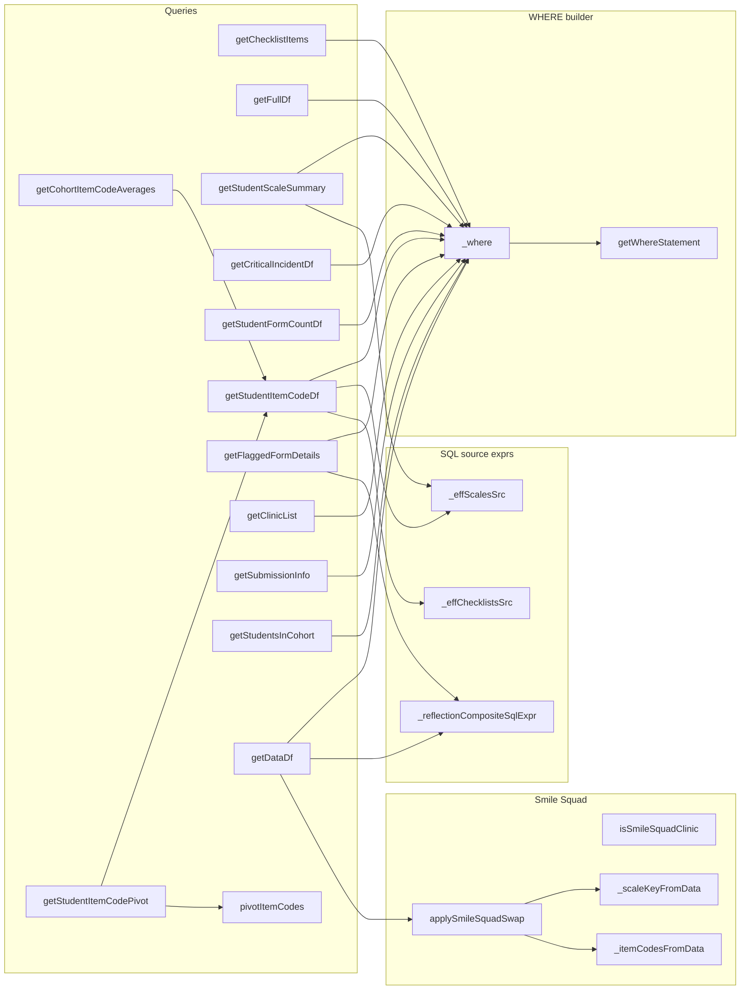
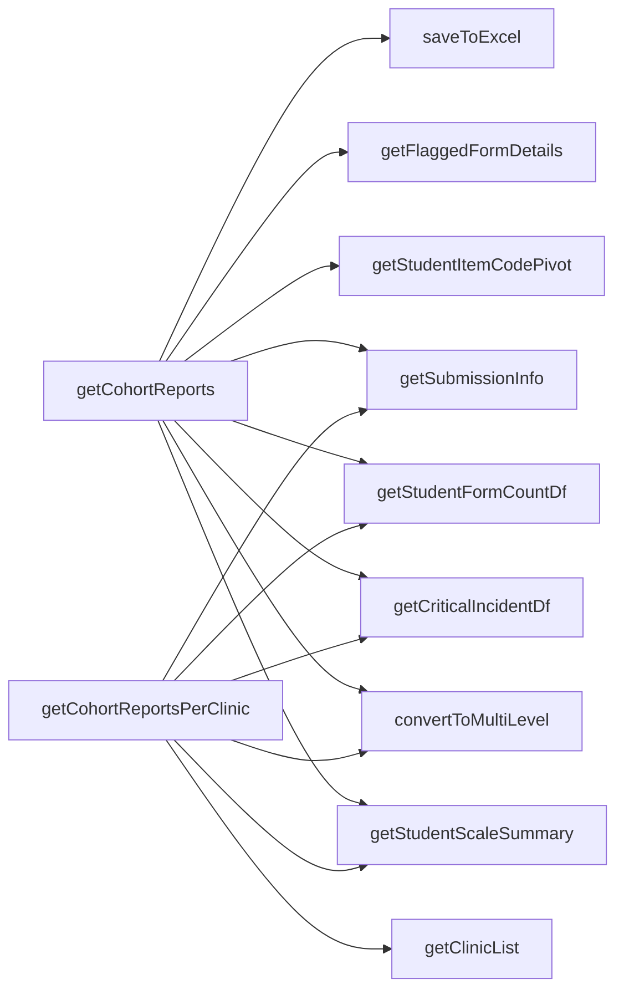
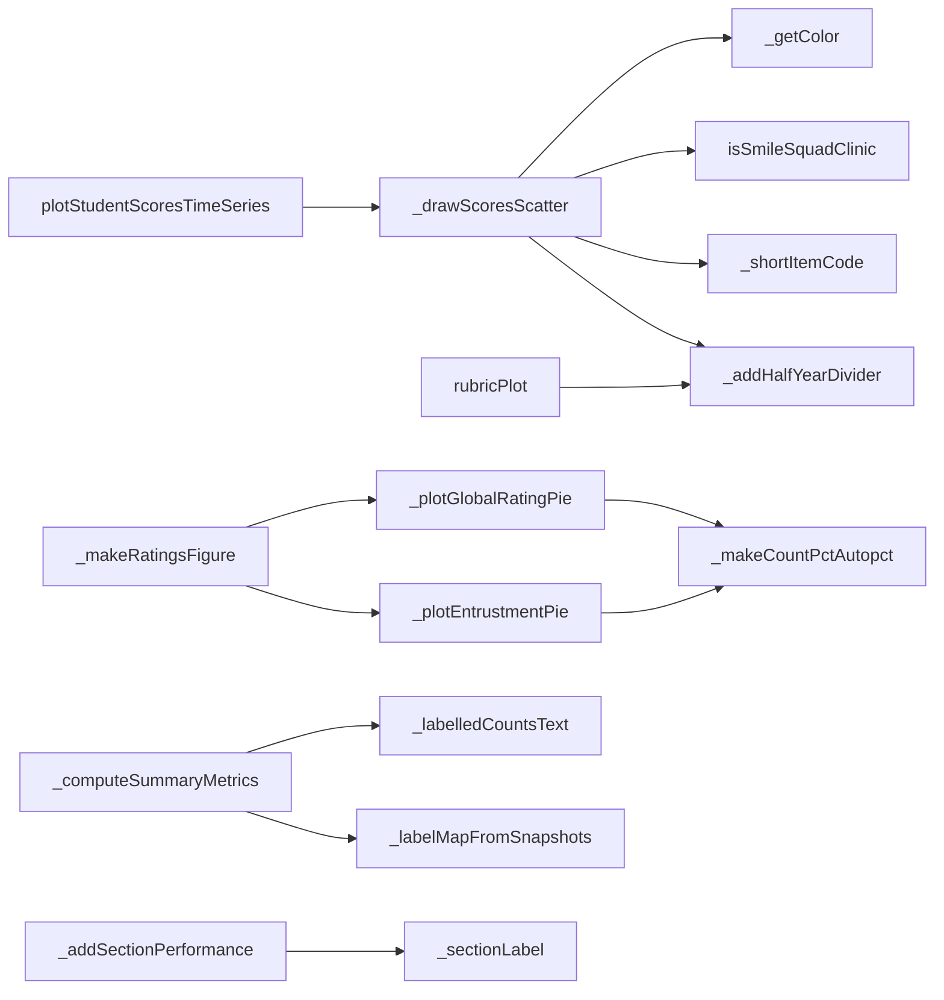
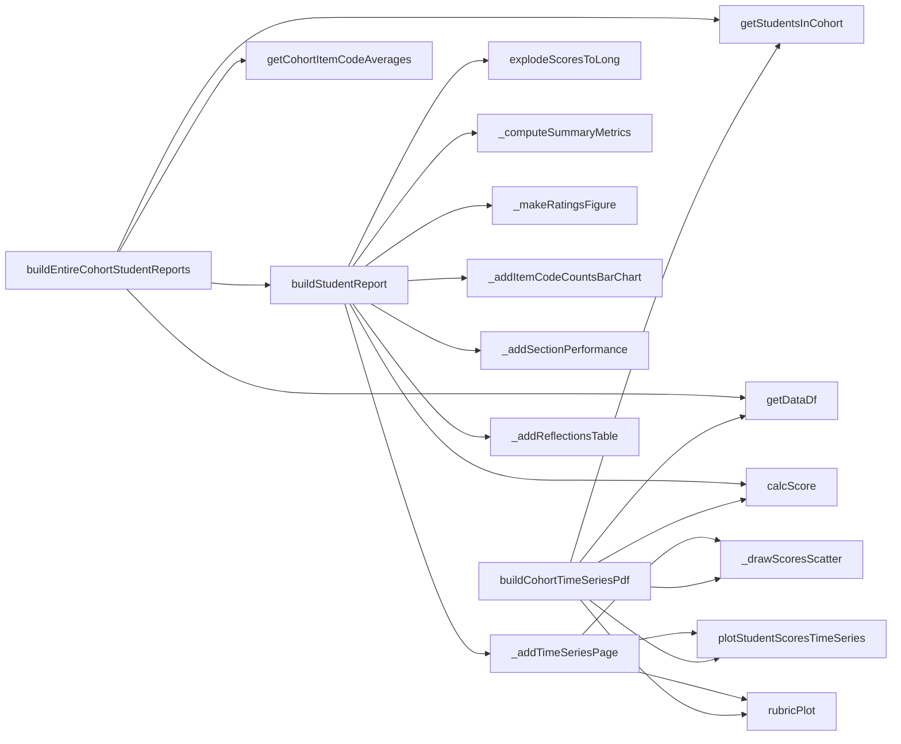

# `boh2_dds2_dds3_utils.py`

> Query, processing and report-building helpers that turn `rawform_forms_v3` DASH assessment forms into cohort-level Excel workbooks and per-student / per-cohort PDF reports for the BOH2, DDS2 and DDS3 cohorts (and, in practice, BOH1 and DDS1 too).

> **Changed since generation (2026-08-14).** 2026-08-18 added `clinicalIncidentSqlExpr()` and the `CLINICAL_INCIDENT_NO_DETAILS` constant, and rewired `getDataDf` and `getCriticalIncidentDf` to use them — a fix for clinical incidents never populating on the 2026 form templates. Details in the `clinicalIncidentSqlExpr` entry in §5 and in `_handover_docs/HANDOVER_dds2_clinic_flagging_fhy.md` §7.

> **Changed since generation (2026-09-09).** Added a **redesigned per-student report (V2)** as a parallel, additive stack — no original function changed. New entry points `buildEntireCohortStudentReportsV2` / `buildStudentReportV2` and ~20 `*V2` helpers: `_v2MakePageDecorators` (whole-page tint), `_v2SummaryTable` (zebra + compact two-line patient rows), `_makeRatingBarsFigureV2` (pies→stacked bars), `_addProceduresV2`/`_v2ProcPanel`/`_v2ChipsImage` (Sim+Clinic meter bars + rounded pill chips), `_addSectionPerformanceV2`/`_v2DrawSpider` (Clinic-default spider), `_addTimeSeriesPageV2`/`_v2FullFigImage` (original charts + rolling-avg line, full-frame embed to keep scatter/rubric x-ticks aligned), `_addReflectionCardsV2`/`_v2ReflectionCard` (GR-keyed cards + collapsed log). Two V2-only **data-logic fixes**: `_v2RemapUnmappedSections` (checklist/composite item codes → section via their 3-digit code, killing the Miscellaneous over-count) and `_v2OperatorClinicDf` (patient age distribution + patient outcomes counted on Operator-role forms only, role CODE `O`). New palette consts `V2_*`. LOC now 4410 (3336 at the 2026-08-14 note). Full detail: `_handover_docs/HANDOVER_student_report_v2_redesign.md`.

> **Related module (2026-09-15).** `student_report_html_utils.py` (new, additive) turns the V2 per-student report into an **interactive HTML** per student by importing this module and *calling* its `*V2` data functions (`getDataDf`, `_computeSummaryMetrics`, `_v2OperatorClinicDf`, `explodeScoresToLong`/`_mergeSection`/`_v2RemapUnmappedSections`, `_v2SectionAggs`, `_v2EntCounts`/`_v2GrCounts`, `_v2SessionMeanByDate`, `_v2VisibleReflection`/`_v2LogTag`, `getCohortItemCodeAverages`) plus the `V2_*` palette — so the HTML numbers cannot drift from the PDF. **Nothing in this module was changed.** See `_docs/student_report_html_utils.md` and `_handover_docs/HANDOVER_student_report_interactive_html.md`.

| | |
|---|---|
| **Lines of code** | 3336 *(2549 at generation)* |
| **Top-level functions** | 70 (plus nested inner functions) |
| **Classes** | 0 |
| **Module constants** | 29 |
| **Imports from this codebase** | `Utils` (`createTable`, `addPlotImage`, `getBannerDrawer`, `getmodeArgs`, `readDf`, `runDdl`, `toInt`, `autoFitColumns`, `_loadSectionMapping`, `_mergeSection`), `variableUtils` (both `import variableUtils` and `from variableUtils import *`) |
| **Imported by** | No other `.py` module in the codebase imports it. `main.ipynb` does: `from boh2_dds2_dds3_utils import *` (line 67 of `out/main_notebook_code.py`) |
| **Run how** | Imported by `main.ipynb` via `from boh2_dds2_dds3_utils import *`; every entry point is called from notebook cells |

---

## 1. Purpose and role in the pipeline

This module is the BOH2/DDS2/DDS3 arm of the reporting pipeline. It sits directly on top of the **`rawform_forms_v3`** Postgres table (the "v3" flattened raw-form schema produced upstream by `general_utils.getInsertSqlRawform_forms_v3`) and reads nothing else from the database. Every query goes through `Utils.readDf(engine, sql, params)`; the SQLAlchemy `engine` is always passed in by the caller (the notebook holds the connection).

It consumes:

* **DB**: `rawform_forms_v3` — scalar columns (`cohort`, `student_number`, `student_name`, `student_email`, `datetimeutc`, `type`, `clinic`, `subject`, `role`, `assessor_name`, `form_code`, `assessmentid`, `clinical_incident`, `submitted_by_student`, `submitted_by_assessor`, `checklists`) plus the JSONB columns `assessor_data`, `student_data`, `assessor_config`, `student_config`, `patient_data`, `context_schema_snapshot`.
* **Excel**: the item→section mapping workbook, read indirectly via `Utils._loadSectionMapping` / `Utils._mergeSection` (path comes from `variableUtils.itemSectionMappingFile`).
* **Globals from `variableUtils`** (star-imported): `REMOVE_STUDENTS_DICT`, `BOH2_REMOVED_STUDENTS`, `DDS2_REMOVED_STUDENTS`, `itemSectionMappingFile`, `pageSize`, `uniColor`, `subheadingStyle`, `tableTextStyle`, `leftMargin`/`rightMargin`/`topMargin`/`bottomMargin`.

It produces:

* **Excel workbooks** under a relative `{cohort}/` folder — `Scale Information …xlsx`, `Item Code Pivot …xlsx`, `Submission Info …xlsx` (and the per-clinic variants).
* **PDF reports** via reportlab — one scrollable cohort time-series PDF per form type (`buildCohortTimeSeriesPdf`) and one PDF per student under `{cohort}/Individual Student Reports/{studentNumber}.pdf` (`buildEntireCohortStudentReports`).
* **DataFrames** returned to the notebook for ad-hoc use (`getDataDf`, `getChecklistItems`, `getChecklistMcTexts`, the flagged-forms frames returned by `getCohortReports`). `getDataDf` + `calcScore` are also the input to the notebook's separate flagging report (`createFlaggingReport` → `getFlagDf`).

The file is organised into six numbered banner sections in the source, and this document follows that order: (1) flexible WHERE builder + Smile Squad handling, (2) cohort-level query functions, (3) cohort report orchestrators, (4) student-level query & report functions, (5) plotting helpers, (6) the PDF report builders.

Three cross-cutting concerns dominate the file and are worth understanding before reading any individual function:

1. **v3 scale-key handling.** In v3 the rubric scales are nested: `assessor_data -> 'scales' -> '<prefixed scale name>' ->> 'key'`. The scale names are *prefixed* — `scale-practice-readiness` (entrustment), `scale-professionalism`, `scale-communication`, `scale-time-mgmt`, `scale-global-rating`, `scale-patient-complexity` — and the selected level lives under the `key` sub-field, not directly on the scale. `NULLIF(…, '')::int` is used everywhere to turn blank strings into NULL before casting.
2. **Student-fallback cohorts.** For `STUDENT_FALLBACK_COHORTS = ("BOH1", "BOH2")` the graded content can live in `student_data` instead of `assessor_data`. `_effScalesSrc` and `_effChecklistsSrc` build the SQL that COALESCEs / UNIONs the two sides; `applySmileSquadSwap` does the equivalent in Python for BOH2 Smile Squad clinic forms (where the student fills in the assessor side and `submitted_by_assessor` is False).
3. **Role gating in scoring.** `calcScore` scores only the operator's own forms, excluding `role in ("OB", "SO")` (observer / second operator). A long comment at lines 1129–1136 records that the previous test (`role not in (None, "Operator")`) silently dropped every `role="O"` form.

---

## 2. External dependencies

| Library / resource | Used for |
|---|---|
| `os` | `os.makedirs(cohort, exist_ok=True)` and the individual-reports sub-folder |
| `re` | `_naturalKey`, `_mcNum`, `_shortItemCode` regexes |
| `json` | `json.loads` of `context_schema_snapshot` when it arrives as a string (`_labelMapFromSnapshots`) |
| `numpy` (`np`) | `np.nan` sentinel in `SCORE_MAP`, `np.isnan`, `np.arange`, `np.linspace`, `np.array` for spider/bar charts |
| `pandas` (`pd`) | All DataFrame work, `pd.ExcelWriter`, `pd.to_datetime`, `pd.to_numeric`, `pd.MultiIndex` |
| `matplotlib.pyplot` (`plt`) | Every figure: scatter, rubric line panels, pies, bar charts, polar spider charts |
| `matplotlib.lines.Line2D` | Custom "Complex" legend handle on the score scatter |
| `matplotlib.patches.Rectangle` | Imported, **never used** |
| `collections.defaultdict` | Label-collision offset counter in `_drawScoresScatter` |
| `collections.OrderedDict` | Summary-metric ordering in `_computeSummaryMetrics` / `buildStudentReport` |
| `xml.sax.saxutils.escape` | `makeSafeParagraph` only |
| `sqlalchemy.text` | Imported, **never used** (all SQL goes through `Utils.readDf`) |
| `openpyxl` `Workbook`, `Font`, `Alignment` | Imported, **never used** (`openpyxl` is used only as the `pd.ExcelWriter` engine) |
| `reportlab.platypus` `KeepTogether`, `SimpleDocTemplate`, `PageBreak`, `Paragraph`, `Spacer` | PDF flowables |
| `reportlab.lib.pagesizes.A4`, `reportlab.lib.units.inch` | Imported, **never used** (page size comes from `variableUtils.pageSize`) |
| `pathlib.Path` | Imported, referenced only in docstrings |
| `IPython.display.display` | Imported; only used in commented-out debug lines (2413, 2420) |
| `Utils` | `readDf` (all DB reads), `createTable` / `addPlotImage` / `getBannerDrawer` (PDF), `autoFitColumns` (Excel), `getmodeArgs` (append-mode ExcelWriter kwargs), `_loadSectionMapping` / `_mergeSection` (item→section mapping). `runDdl` and `toInt` are imported but **never used** |
| `variableUtils` | Styles, colours, page geometry, removed-student lists, the item-section mapping file path |
| **Database** | Postgres via the caller-supplied SQLAlchemy `engine`; single table `rawform_forms_v3` (parameterised as `formsTable`) |
| **Filesystem** | Writes `.xlsx` and `.pdf` under a **relative** `{cohort}/` directory (cwd-dependent) |
| **Env vars** | None read directly by this module |

---

## 3. Module-level constants and variables

### Scoring and layout

| Name | Type | Value / shape | Purpose |
|---|---|---|---|
| `SCORE_MAP` (L40) | `dict[str, float]` | 8 entries, `O1`…`O6` plus `Yes`/`No` | Default checklist-response → normalised score map used by `calcScore`. `O6` ("Not observed") maps to `np.nan` and is excluded from averages |
| `COMBINE_TIMESERIES_PANELS` (L57) | `bool` | `False` | Module-wide default for the `combined=` argument of `buildCohortTimeSeriesPdf`, `_addTimeSeriesPage`, `buildStudentReport`, `buildEntireCohortStudentReports`. `False` = two separate matched-width figures; `True` = one combined figure sharing a single x-axis |

```python
SCORE_MAP = {
    "O1": 1.00, "O2": 0.80, "O3": 0.60, "O4": 0.40, "O5": 0.00,
    "O6": np.nan,   # "Not observed" - exclude from averages
    "Yes": 1.00, "No": 0.00,
}
```

### Cohort / data-source handling

| Name | Type | Value / shape | Purpose |
|---|---|---|---|
| `STUDENT_FALLBACK_COHORTS` (L115) | `tuple[str, ...]` | `("BOH1", "BOH2")` | Cohorts whose graded data may live in `student_data` rather than `assessor_data`. Gates `_effScalesSrc` and `_effChecklistsSrc` |
| `SMILE_SQUAD_CLINIC_VALUES` (L135) | `set[str]` | `{"ss", "smile squad", "smilesquad"}` | Lower-cased clinic values recognised as Smile Squad. v3 stores the **code** `"SS"` (from `form_context->>'clinic_type'`); the v2 label "Smile Squad" never appears in v3 |
| `SMILE_SQUAD_COHORTS` (L136) | `tuple[str, ...]` | `("BOH2",)` | Cohorts for which `applySmileSquadSwap` does anything |
| `DATA_BUCKET_KEYS` (L140) | `tuple[str, ...]` | `("radio", "texts", "scales", "checklists", "multi-select")` | Standard non-item-code buckets that sit at the top level of `student_data`/`assessor_data` in v3 and must be excluded when enumerating item codes |
| `SMILE_SQUAD_SCALE_COLUMNS` (L145) | `dict[str, str]` | 6 entries, column name → nested scale name | Scalar columns that `getDataDf` derives **in SQL** from `assessor_data->'scales'`; `applySmileSquadSwap` must re-derive them in Python after the swap |
| `SMILE_SQUAD_INT_SCALE_COLUMNS` (L154) | `tuple[str, ...]` | `("entrustment", "professionalism", "communication", "time_management")` | The subset of the above that `getDataDf` casts to `int` |

```python
SMILE_SQUAD_SCALE_COLUMNS = {
    "entrustment":        "scale-practice-readiness",
    "professionalism":    "scale-professionalism",
    "communication":      "scale-communication",
    "time_management":    "scale-time-mgmt",
    "global_rating":      "scale-global-rating",
    "patient_complexity": "scale-patient-complexity",
}
```

### Reflection / comment text keys

| Name | Type | Value / shape | Purpose |
|---|---|---|---|
| `STUDENT_REFLECTION_TEXT_KEYS` (L1033) | `list[tuple[str, str]]` | 6 `(json_key, label)` pairs | Every student free-text key under `student_data->'texts'`, in display order, with a heading label. Consumed by `_reflectionCompositeSqlExpr` |
| `ASSESSOR_REFLECTION_TEXT_KEYS` (L1041) | `list[tuple[str, str]]` | 6 `(json_key, label)` pairs | Same for `assessor_data->'texts'` |

```python
STUDENT_REFLECTION_TEXT_KEYS = [
    ("reflection", "Reflection"),
    ("reflection-how-prepare", "How I Prepared"),
    ("reflection-what-did-well", "What Went Well"),
    ("reflection-what-differently", "What I'd Do Differently"),
    ("so-reflection", "Second Operator Reflection"),
    ("procedures-observed", "Procedures Observed"),
]
ASSESSOR_REFLECTION_TEXT_KEYS = [
    ("reflection", "Feedback"),
    ("reflection-student-did-well", "Did Well"),
    ("reflection-student-improve", "To Improve"),
    ("additional-comments", "Additional Comments"),
    ("so-assessor-reflection", "Second Operator Feedback"),
    ("needs-additional-support", "Needs Additional Support"),
]
```

The comment at L1024–1032 records why these exist: the report previously surfaced **only** `texts->>'reflection'`, silently dropping DDS1 `additional-comments`, the DDS2 structured prompts and the second-operator (SO) fields. Clinical-incident keys are deliberately excluded (handled by the `clinical_incident` column).

### Label maps, colours and display names

| Name | Type | Value / shape | Purpose |
|---|---|---|---|
| `HALF_YEAR_DIVIDER_DATE` (L1232) | `str` | `"2026-06-15"` | Boundary for the dotted vertical divider drawn on every time-series panel |
| `ROLE_LABELS_FALLBACK` (L1442) | `dict[str, str]` | `{"O": "Operator", "SO": "Support Operator", "OB": "Observation"}` | **Fallback only** — the authoritative role labels are read per-form from `context_schema_snapshot` by `_labelMapFromSnapshots` |
| `PATIENT_DETAIL_LABELS_FALLBACK` (L1447) | `dict[str, str]` | 5 entries: `ISP`, `FTA`, `PCW`, `NPB`, `UBP` | Fallback labels for the `patient.details` field, same dynamic-first rule |
| `ENTRUSTMENT_COLORS` (L1578) | `dict[int, str]` | levels 1–4 → `#d73027`, `#fc8d59`, `#91cf60`, `#1a9850` | Red→green tier colours for the entrustment pie |
| `GR_COLORS` (L1585) | `dict[int, str]` | levels 1–5 → `#d73027`, `#fc8d59`, `#fee08b`, `#91cf60`, `#1a9850` | Red→green tier colours for the global-rating pie |
| `SECTION_DISPLAY_NAMES` (L1965) | `dict[str, str]` | 1 entry | Shortens long section names on charts/tables: `"Preventive, Prophylactic and Bleaching Services"` → `"PPB"` |

```python
PATIENT_DETAIL_LABELS_FALLBACK = {
    "ISP": "I saw a patient",
    "FTA": "Failed to attend (FTA)",
    "PCW": "Patient cancelled within 24 hours",
    "NPB": "New patient block not filled",
    "UBP": "Unable to book a patient",
}
```

---

## 4. Classes

None. The module defines no classes.

---

## 5. Function reference

### 5.1 Flexible WHERE clause builder (source section 1)

#### `getWhereStatement(cohort, filters: dict = None, dateFrom="2026-01-01")`

*Lines 66–105.* Builds a SQL `WHERE` clause string and a bind-parameter dict from a cohort plus arbitrary column filters.

**Parameters**

| Name | Type | Default | Description |
|---|---|---|---|
| `cohort` | `str` | — | Cohort name, e.g. `"BOH2"`, `"DDS2"`, `"DDS3"` |
| `filters` | `dict` | `None` | Arbitrary column filters. `str`/`int`/`float` → `column = :column`; `list` → `column = ANY(:column)` |
| `dateFrom` | `str` or `None` | `"2026-01-01"` | Inclusive minimum `datetimeutc`. `None` disables the date clause |

**Returns** — `(whereClause: str, params: dict)`.

**Behaviour**

1. Seeds `whereClauses` with `cohort = :cohort` and `params` with the cohort.
2. Appends `datetimeutc >= :dateFrom` unless `dateFrom is None`.
3. For each filter key: keys ending in `_min` or `_max` are **skipped** in the clause (they are documented as being handled by specific callers such as age-range filtering) — but `params.update(filters)` at L103 still adds them to the params dict.
4. Joins clauses with `" AND "`.

**Called by** — `boh2_dds2_dds3_utils:_where`.

---

#### `_where(cohort, filters, dateFrom="2026-01-01")`

*Lines 107–109.* One-line shorthand delegating to `getWhereStatement`. Used by every query function in the module (11 callers).

**Calls** — `boh2_dds2_dds3_utils:getWhereStatement`.

---

### 5.2 BOH2 Smile Squad handling

Background (source comment L118–134): Smile Squad clinic sessions have no separate DASH assessor account — the student fills in the assessor side themselves. All the graded content (scales, checklists, flattened item codes) therefore lands in `student_data` while `assessor_data` holds only empty buckets and `submitted_by_assessor` is `False`. Since every downstream report filters on `submitted_by_assessor`, without the swap these forms vanish from the scatter, rubric panels, item-code counts, section performance and reflections.

#### `isSmileSquadClinic(value) -> bool`

*Lines 159–172.* True when a `clinic` value is Smile Squad.

**Behaviour** — returns `False` for `None` and for `pd.isna(value)` (with a `try/except (TypeError, ValueError)` guard because `pd.isna` on array-likes raises); otherwise lower-cases/strips and tests membership in `SMILE_SQUAD_CLINIC_VALUES`. Accepts both the v3 code `"SS"` and the legacy v2 label `"Smile Squad"`.

**Called by** — `boh2_dds2_dds3_utils:_drawScoresScatter` (to suffix scatter labels with `" SS"`), and `applySmileSquadSwap` via `df["clinic"].apply(...)`.

---

#### `_scaleKeyFromData(data, scaleName)`

*Lines 175–191.* Python mirror of the SQL `*_data->'scales'->scaleName->>'key'`.

**Returns** — the scale key, or `None` for a non-dict `data`, a non-dict `scales`, a missing entry, or a blank string. Tolerates an entry that is a bare scalar rather than a `{"key": …}` dict (L186).

**Called by** — `applySmileSquadSwap`.

---

#### `_itemCodesFromData(data)`

*Lines 194–205.* Returns the sorted top-level item codes of a `*_data` dict — mirrors the `LATERAL` join in `getDataDf` by excluding `DATA_BUCKET_KEYS` and any key starting with `scale-`. Returns `[]` for a non-dict.

**Called by** — `applySmileSquadSwap`.

---

#### `applySmileSquadSwap(df, cohort)`

*Lines 208–265.* Treats BOH2 Smile Squad `student_data` as `assessor_data`.

**Parameters**

| Name | Type | Default | Description |
|---|---|---|---|
| `df` | `DataFrame` | — | Output of `getDataDf`'s query |
| `cohort` | `str` | — | Cohort name; the swap is a no-op unless `cohort.upper()` is in `SMILE_SQUAD_COHORTS` |

**Returns** — a **new** DataFrame (the input is left untouched); the original object when it is a no-op.

**Behaviour**

1. Short-circuits on `None`/empty frames, non-`SMILE_SQUAD_COHORTS` cohorts, and frames without a `clinic` column.
2. Builds `mask = df["clinic"].apply(isSmileSquadClinic)`; returns early if no row matches.
3. `df = df.copy()`; for the masked index, swaps `student_data` ↔ `assessor_data` and `submitted_by_student` ↔ `submitted_by_assessor` via a `.values` assignment.
4. Re-derives every column in `SMILE_SQUAD_SCALE_COLUMNS` from the **new** assessor side using `_scaleKeyFromData` (the SQL-derived values were computed pre-swap and would otherwise stay NULL, leaving every rubric panel blank). Int columns are coerced with `pd.to_numeric(..., errors="coerce")` and the whole column is cast to `float`; the rest are cast to `object`.
5. Re-derives `item_codes` **cell by cell** with `df.at[...]` — the comment at L260 notes that `.loc` broadcasting mangles list values.
6. The reflection columns are deliberately **not** swapped: on a Smile Squad form the single reflection text is written by the student, so it belongs in the "Student Reflection" column.

**Calls** — `boh2_dds2_dds3_utils:_itemCodesFromData`, `boh2_dds2_dds3_utils:_scaleKeyFromData`. **Called by** — `boh2_dds2_dds3_utils:getDataDf`.

---

#### `_effScalesSrc(cohort, prefix="")`

*Lines 268–279.* Returns the SQL expression for the *effective* nested-scales object.

**Behaviour** — for cohorts in `STUDENT_FALLBACK_COHORTS` returns
`COALESCE(NULLIF(<prefix>assessor_data->'scales', '{}'::jsonb), <prefix>student_data->'scales', '{}'::jsonb)`;
otherwise just `<prefix>assessor_data->'scales'`. `prefix` is an optional table alias such as `"f."`.

**Called by** — `getStudentItemCodeDf`, `getStudentScaleSummary`.

---

#### `_effChecklistsSrc(cohort, prefix="")`

*Lines 282–293.* Returns the SQL expression for the *effective* nested-checklists object (`item_code -> mcs`).

**Behaviour** — for fallback cohorts returns `(<student checklists> || <assessor checklists>)`, i.e. a jsonb UNION where **assessor wins on key conflict**, so student-only item codes are included; otherwise just `COALESCE(<prefix>checklists, '{}'::jsonb)`. Note this reads the dedicated `checklists` **column**, not `assessor_data->'checklists'`.

**Called by** — `getStudentItemCodeDf`.

---

### 5.3 Small utilities

#### `_naturalKey(s: str) -> tuple`

*Lines 295–297.* Splits a string into alternating `(str, int)` parts for natural sorting: `'011-RPP'` → `('', 11, '-rpp')`. Used only for the item-code sort in `getChecklistMcTexts`.

#### `_mcNum(s: str) -> int`

*Lines 299–302.* Extracts the trailing number from an MC key: `'MC10'` → `10`; returns `0` when there is no trailing digit. Used only in `getChecklistMcTexts`.

#### `saveToExcel(filepath, sheets: dict, index=False, **writerKwargs)`

*Lines 304–328.* Writes multiple DataFrames to one workbook with auto-fitted columns.

**Behaviour** — opens a `pd.ExcelWriter(filepath, engine="openpyxl", **writerKwargs)`, writes each `{sheetName: df}` in insertion order, then calls `Utils.autoFitColumns(ws)` on every worksheet.

**Side effects** — **writes an .xlsx file** at `filepath`.

**Calls** — `Utils:autoFitColumns`. **Called by** — `getCohortReports`.

---

### 5.4 Checklist definition queries

#### `getChecklistMcTexts(engine, itemCodes: list, formsTable: str = "rawform_forms_v3") -> pd.DataFrame`

*Lines 330–380.* Returns the MC (multiple-choice criterion) text descriptions for a list of item codes.

**Parameters**

| Name | Type | Default | Description |
|---|---|---|---|
| `engine` | SQLAlchemy engine | — | DB connection |
| `itemCodes` | `list[str]` | — | e.g. `["578", "579"]` |
| `formsTable` | `str` | `"rawform_forms_v3"` | Table name (docstring says `"rawform_forms"` — stale) |

**Returns** — DataFrame with columns `item_code`, `item_name`, `MC`, `MC Text`.

**Behaviour**

1. `SELECT DISTINCT ON (item.item_code, mc.mc_key)` over `{formsTable} f`.
2. **v3 note in the source**: definitions (name + fields) live in `*_config`, not the data column. The item source is
   `COALESCE(f.assessor_config->'checklists'->'selected', f.student_config->'checklists'->'selected', '{}'::jsonb)`, expanded with `jsonb_each`.
3. A second `CROSS JOIN LATERAL jsonb_each_text(item.item_data -> 'fields')` yields the MC key/text pairs, filtered to `mc_key LIKE 'MC%'` **and** `mc_key ~ '^MC[0-9]+'`.
4. A **hard-coded** `AND f.datetimeutc >= '2026-01-01'` sits in the SQL (L368) — this function does not use `_where`, so there is no cohort filter at all.
5. Post-query the frame is re-sorted in pandas by `_naturalKey(item_code)` then `_mcNum(MC)` and the temporary sort columns are dropped.

**Calls** — `Utils:readDf`. **Called by** — `main.ipynb`.

**Example** (from `main_notebook_code.py` L207–208):

```python
itemList = getChecklistItems(engine, "DDS2", filters = {"type": "Clinic"})
mcDf = getChecklistMcTexts(engine, itemList["item_code"].tolist())
```

---

#### `getChecklistItems(engine, cohort: str, formsTable: str = "rawform_forms_v3", filters: dict = None) -> pd.DataFrame`

*Lines 382–425.* Returns distinct checklist item codes and names for a cohort.

**Returns** — DataFrame with columns `item_code`, `item_name`, `mc_count`.

**Behaviour**

1. `whereClause, params = _where(cohort, filters)` (so the `2026-01-01` date floor applies).
2. `SELECT DISTINCT ON (item.item_code)` over the same `assessor_config`/`student_config` `checklists->'selected'` source as `getChecklistMcTexts`.
3. `mc_count` is a correlated sub-select counting `jsonb_object_keys(item_data->'fields')` matching `^MC[0-9]+`.
4. Rows with a blank/NULL `item_data->>'name'` are excluded; `ORDER BY item.item_code, LENGTH(name) DESC` combined with `DISTINCT ON` means **the longest name wins** for each code.

**Calls** — `Utils:readDf`, `boh2_dds2_dds3_utils:_where`. **Called by** — `main.ipynb`.

**Example** — `getChecklistItems(engine, "DDS2", filters = {"type": "Clinic"})` (notebook L207).

---

### 5.5 Cohort-level query functions (source section 2)

#### `getFullDf(engine, cohort, formsTable="rawform_forms_v3", filters=None)`

*Lines 431–434.* `SELECT * FROM {formsTable} WHERE {whereClause}` — the raw rows with no derivation.

**Calls** — `Utils:readDf`, `_where`. **Called by** — nothing in this module or the notebook (appears unused).

---

#### `getStudentScaleSummary(engine, cohort, formsTable="rawform_forms_v3", filters=None)`

*Lines 437–499.* Per-student, per-type scale summary: level counts plus averages for entrustment, professionalism, communication and time management.

**Returns** — DataFrame with `Student ID`, `Student Name`, `Type`, then `<Scale> Lvl N` counts and `<Scale> Average` columns.

**Behaviour**

1. `scalesSrc = _effScalesSrc(cohort)` — for BOH1/BOH2 this falls back to `student_data->'scales'` when the assessor side is `{}`.
2. A `base` CTE projects `NULLIF(<scalesSrc>-><prefixed scale>->>'key','')::int` for `scale-practice-readiness`, `scale-professionalism`, `scale-communication`, `scale-time-mgmt`.
3. The outer query does `COUNT(*) FILTER (WHERE …)` per level and `ROUND(AVG(...)::numeric, 2)`, grouped by student and `type`, ordered by student name then type.
4. **The level ranges are hard-coded and asymmetric**: entrustment 1–4, professionalism 1–2, communication 1–2, time management 1–4.

**Calls** — `Utils:readDf`, `_effScalesSrc`, `_where`. **Called by** — `getCohortReports`, `getCohortReportsPerClinic`.

---

#### `convertToMultiLevel(df)`

*Lines 502–531.* Converts the flat scale-summary columns into a two-level `pd.MultiIndex` (`("Entrustment", "Lvl 1")` etc.) using a fixed 19-entry `columnMap`, then sorts descending by `("Entrustment", "Average")`.

**Side effects** — **mutates `df` in place** (`df.columns = …`, `sort_values(..., inplace=True)`) and also returns it. Raises `KeyError` if the input has any column not in `columnMap`.

**Called by** — `getCohortReports`, `getCohortReportsPerClinic`.

---

#### `getCriticalIncidentDf(engine, cohort, formsTable="rawform_forms_v3", filters=None)`

*Lines 534–548.* Rows with a non-blank `clinical_incident`, as `Student ID`, `Student Name`, `Date` (`datetimeutc::date`), `Critical Incident`.

> **Changed 2026-08-18.** Both the SELECT and the WHERE now use `clinicalIncidentSqlExpr("")` instead of the bare `clinical_incident` column. Before this, **the query returned nothing at all for the 2026 templates** — the stored column was NULL for every form that records an incident as a radio plus a text field. See `clinicalIncidentSqlExpr` below.

**Calls** — `Utils:readDf`, `_where`, `clinicalIncidentSqlExpr`. **Called by** — `getCohortReports`, `getCohortReportsPerClinic`.

---

#### `clinicalIncidentSqlExpr(alias="f")` — *added 2026-08-18*

Returns the SQL scalar expression that resolves a form's clinical incident from **any** of its three storage shapes. `alias` is the forms-table alias (`"f"`), or `""` / `None` when the query has none.

```sql
COALESCE(
    NULLIF(TRIM(COALESCE(f.clinical_incident, '')), ''),                       -- 1. stored column
    CASE WHEN lower(COALESCE(f.assessor_data->'radio'->>'clinical-incident-occurred','')) = 'yes'
         THEN COALESCE(NULLIF(TRIM(f.assessor_data->'texts'->>'clinical-incident'), ''),
                       'Yes (no details recorded)')                            -- 2. radio + text
    END,
    (SELECT string_agg(x->>'value', '; ' ORDER BY x->>'value')
       FROM jsonb_array_elements(
            COALESCE(f.assessor_data->'multi-select'->'clinical-incident','[]'::jsonb)) x)
)                                                                              -- 3. multi-select
```

**Why it exists.** `general_utils.getInsertSqlRawform_forms_v3` built `clinical_incident` from shape 3 only. The DDS2 / BOH2 / BOH1 / DDS1 2026 form templates use shape 2:

```jsonc
"assessor_data": {
  "radio": { "clinical-incident-occurred": "yes" },
  "texts": { "clinical-incident": "Infection isssues" }
}
```

So the stored column was NULL and **every** downstream consumer showed zero incidents — the flagging `ci_count` / `flag_clinical_incident` / Clinical Incidents sheet, and this module's Critical Incident sheet. Counted in the 2026 CAF payload: **159 forms with `"yes"`** (DDS2 Sim 40, DDS2 Clinic 35, BOH2 Clinic 32, BOH1 Sim 23, DDS1 Sim 20, BOH2 Sim 9) against 8 503 `"no"`, and 87 rows carrying shape 3. Shape 3 is real, so the expression must read both.

**Design.** Stored-column-first, so a correctly loaded row is never overwritten. Because shapes 2 and 3 are read straight from `assessor_data`, it **repairs the current table with no reload** — the raw JSON is still there. `general_utils` got the same COALESCE so the stored column is right going forward; that only takes effect on the next load, which is therefore optional.

~66 of the 159 are `"yes"` with no detail text typed. Those resolve to `CLINICAL_INCIDENT_NO_DETAILS = "Yes (no details recorded)"`, not an empty string — an empty string would read as "no incident", which is the whole failure being fixed.

> `clinical-incidents` (plural) and `heading-clinical-incidents` appear in the payload but are only a `group_key` and a heading on the **config**, never data fields. Don't chase them.

**Called by** — `getDataDf`, `getCriticalIncidentDf`.

---

#### `getStudentFormCountDf(engine, cohort, formsTable="rawform_forms_v3", filters=None)`

*Lines 551–564.* `COUNT(*)` per student as `# Forms`, ordered by count descending then name.

**Calls** — `Utils:readDf`, `_where`. **Called by** — `getCohortReports`, `getCohortReportsPerClinic`.

---

#### `getStudentItemCodeDf(engine, cohort, formsTable="rawform_forms_v3", filters=None)`

*Lines 567–598.* Flat one-row-per-(form, item code) frame with all scale values attached.

**Returns** — columns `Student ID`, `Student Name`, `Item Code`, `Description`, `Global Rating`, `Entrustment`, `Professionalism`, `Communication`, `Time Management`.

**Behaviour**

1. Uses `_effScalesSrc(cohort, "f.")` for the five scale columns and `_effChecklistsSrc(cohort, "f.")` as the item source.
2. `CROSS JOIN LATERAL jsonb_each(<checklistsSrc>) cl` — `cl.key` is the item code, `cl.value->>'name'` the description.
3. No `ORDER BY`.

**Calls** — `Utils:readDf`, `_effChecklistsSrc`, `_effScalesSrc`, `_where`. **Called by** — `getCohortItemCodeAverages`, `getStudentItemCodePivot`.

---

#### `getCohortItemCodeAverages(engine, cohort, formType="Simulation", formsTable="rawform_forms_v3", filters=None)`

*Lines 601–625.* Mean number of forms per item code per student — the class-average baseline for the individual student bar charts.

**Returns** — `dict {item_code: avg_count}`; `{}` when the underlying frame is empty.

**Behaviour**

1. `effectiveFilters = {"type": formType}` merged with (and overridable by) `filters`.
2. Calls `getStudentItemCodeDf`, then `groupby(["Student ID", "Item Code"]).size().unstack(fill_value=0)` and takes the column means across students.
3. The denominator is "students with at least one form in scope" — students with zero forms of that type never appear.

**Calls** — `getStudentItemCodeDf`. **Called by** — `buildEntireCohortStudentReports`.

---

#### `getFlaggedFormDetails(engine, cohort, formsTable="rawform_forms_v3", filters=None, globalRatingThresholds=(1,), entrustmentThresholds=(1,), includeEmptyComments=False)`

*Lines 628–723.* Returns the forms flagged by a low global rating and/or a low entrustment level, with all comment text composited for Excel export.

**Parameters**

| Name | Type | Default | Description |
|---|---|---|---|
| `globalRatingThresholds` | tuple of int | `(1,)` | GR values that trigger a flag; falsy/empty disables the GR trigger |
| `entrustmentThresholds` | tuple of int | `(1,)` | Entrustment values that trigger a flag |
| `includeEmptyComments` | `bool` | `False` | When `False`, only flagged forms that carry some comment text or a clinical incident are returned |

**Returns** — DataFrame with `Form Code`, `Assessment ID`, `Student ID/Name/Email`, `Date`, `Type`, `Clinic`, `Assessor Name`, `Global Rating`, `Entrustment`, `Student Reflection`, `Assessor Reflection`, `Critical Incident`, `Student Checklist Responses` (raw `student_data`), `Assessor Checklist Responses` (raw `assessor_data`), `Triggered By`.

**Behaviour**

1. Threshold tuples are **inlined into the SQL** as comma-separated integer literals (`str(int(x))`); the docstring notes they are small integer sets that never come from user input.
2. Builds a `triggerConditions` list and a parallel `triggerLabels` list of `CASE … THEN 'Global Rating'/'Entrustment' END` expressions. Raises `ValueError("At least one threshold list must be provided.")` if both lists are empty.
3. Reflection columns come from `_reflectionCompositeSqlExpr(..., bold=False)` — plain `Label: value` text, because this frame is exported to Excel.
4. When `includeEmptyComments` is `False`, adds a filter requiring the **full composite** (all comment keys) on either side to be non-NULL, or a non-blank `clinical_incident`. The comment at L677 explains this replaced a narrower `texts->>'reflection'` test that dropped forms whose only comment was in a structured key.
5. `Triggered By` is `TRIM(BOTH '; ' FROM <label1> || '; ' || <label2>)`.
6. **The scale reads here go straight to `assessor_data->'scales'`** — `_effScalesSrc` is *not* used, so the BOH1/BOH2 student-side fallback does not apply.

**Calls** — `Utils:readDf`, `_reflectionCompositeSqlExpr`, `_where`. **Called by** — `getCohortReports`.

---

#### `getClinicList(engine, cohort, formsTable="rawform_forms_v3", filters=None)`

*Lines 726–737.* `SELECT DISTINCT clinic … ORDER BY clinic`, returned as a plain Python list with NaNs dropped.

**Calls** — `Utils:readDf`, `_where`. **Called by** — `getCohortReportsPerClinic`.

---

#### `getSubmissionInfo(engine, cohort, formsTable="rawform_forms_v3", filters=None)`

*Lines 740–758.* Forms where **either** side has not submitted (`submitted_by_student = false OR submitted_by_assessor = false`), with student, assessor, date, type, clinic and both submission flags.

**Calls** — `Utils:readDf`, `_where`. **Called by** — `getCohortReports`, `getCohortReportsPerClinic`.

---

#### `getStudentsInCohort(engine, cohort, formsTable="rawform_forms_v3", dateFrom="2026-01-01")`

*Lines 761–771.* Distinct `student_number`, `student_name`, `student_email` for a cohort, ordered by name.

**Behaviour** — calls `_where(cohort, filters=None, dateFrom=dateFrom)` and additionally excludes NULL/blank names and the literal name `'Test Student'`.

**Calls** — `Utils:readDf`, `_where`. **Called by** — `buildCohortTimeSeriesPdf`, `buildEntireCohortStudentReports`.

---

### 5.6 Pivots and cohort report orchestrators (source section 3)

#### `pivotItemCodes(df, groupBy="item_code", valueCol=None, aggfunc=None, mappingFile=None)`

*Lines 779–848.* Pivots the flat item-code frame into a student × item/section matrix.

**Parameters**

| Name | Type | Default | Description |
|---|---|---|---|
| `df` | `DataFrame` | — | Output of `getStudentItemCodeDf` |
| `groupBy` | `str` | `"item_code"` | `"item_code"` \| `"section"` \| `"sub_section"` |
| `valueCol` | `str` or `None` | `None` | Column to aggregate; `None` → counts. e.g. `"Global Rating"`, `"Entrustment"` |
| `aggfunc` | str/callable/`None` | `None` | Defaults to `"sum"` for counts, `"mean"` for value columns |
| `mappingFile` | str/Path | `None` | Passed to `Utils._loadSectionMapping` when grouping by section |

**Returns** — a **tuple** `(pivotDf, df)` where `df` is the (possibly section-merged) long frame. The docstring does not mention the tuple.

**Behaviour**

1. When `valueCol is None`, adds a `_count=1` column and pivots on it with `aggfunc="sum"`.
2. For `groupBy in ("section", "sub_section")`, loads the mapping with `Utils._loadSectionMapping(mappingFile)` and merges with `Utils._mergeSection(df, mappingDf, codeCol="Item Code")`, pivoting on `Section`/`Sub-section`.
3. `pivot_table(index=["Student ID","Student Name"], …, fill_value=np.nan)` then `reset_index()`; `columns.name = None`.
4. Adds a `Total` column (row sum of the value columns) for count pivots **and** for any section/sub-section pivot — including mean-valued ones, where a "total of means" is not meaningful.
5. Rounds to 2dp when `aggfunc == "mean"`; sorts by `Student Name` in place.

**Calls** — `Utils:_loadSectionMapping`, `Utils:_mergeSection`. **Called by** — `getStudentItemCodePivot`.

---

#### `getStudentItemCodePivot(engine, cohort, formsTable="rawform_forms_v3", filters=None, groupBy="item_code", mappingFile=None, valueCol=None, aggfunc=None)`

*Lines 851–855.* Convenience wrapper: `getStudentItemCodeDf` → `pivotItemCodes`. Returns the same `(pivotDf, mergedDf)` tuple.

**Calls** — `getStudentItemCodeDf`, `pivotItemCodes`. **Called by** — `getCohortReports`.

---

#### `getCohortReports(engine, cohort, today, formsTable="rawform_forms_v3", subject=None, type_=("Simulation", "Clinic"))`

*Lines 858–971.* Generates the three cohort-level Excel workbooks and returns the flagged-form frames.

**Parameters**

| Name | Type | Default | Description |
|---|---|---|---|
| `engine` | SQLAlchemy engine | — | DB connection |
| `cohort` | `str` | — | Cohort name; also used as the **output directory name** |
| `today` | `str` | — | Pre-formatted date string embedded in the filenames |
| `formsTable` | `str` | `"rawform_forms_v3"` | Source table |
| `subject` | `str` | `None` | When set, adds a `subject` filter and a `" {subject}"` filename suffix |
| `type_` | tuple/list | `("Simulation", "Clinic")` | Which form types get sheets in the workbooks |

**Returns** — `(flaggedSimDf, flaggedClinicDf)` from `getFlaggedFormDetails`.

**Behaviour**

1. Builds three output paths: `{cohort}/Scale Information {cohort}{suffix} ({today}).xlsx`, `…/Item Code Pivot …`, `…/Submission Info …`.
2. Inner helper `_filters(formType)` (L877–883) assembles `{"type": …, "subject": …}` or `None`.
3. `removeStudents = REMOVE_STUDENTS_DICT.get(cohort, [])` (from `variableUtils`); **every** frame is filtered with `~df["Student ID"].isin(removeStudents)`.
4. Fetches, for both Simulation and Clinic **unconditionally** (regardless of `type_`): scale summaries (then `convertToMultiLevel`), critical incidents, form counts, submission info.
5. Pivots: Simulation by `item_code` (counts, mean Global Rating, mean Entrustment) and Clinic by `section` using `variableUtils.itemSectionMappingFile` (counts, mean GR, mean Entrustment). The Clinic count pivot also yields `mergedDf`, written as the `Clinic Item Code` sheet.
6. `os.makedirs(cohort, exist_ok=True)`, then three `saveToExcel` calls. The Scales workbook is written with `index=True` (the MultiIndex columns need it); the others with `index=False`.
7. Finally calls `getFlaggedFormDetails` for both Simulation and Clinic filters and returns the pair — these are **not** written to disk here.

**Side effects** — creates the `{cohort}/` directory and **writes three .xlsx files** (relative to cwd). Reads the module-global `REMOVE_STUDENTS_DICT` and `variableUtils.itemSectionMappingFile`.

**Calls** — `convertToMultiLevel`, `getCriticalIncidentDf`, `getFlaggedFormDetails`, `getStudentFormCountDf`, `getStudentItemCodePivot`, `getStudentScaleSummary`, `getSubmissionInfo`, `saveToExcel`. **Called by** — `main.ipynb`.

**Nested functions**

| Name | Signature | Description |
|---|---|---|
| `_filters` | `_filters(formType)` | Returns `{"type": formType, "subject": subject}` (keys omitted when falsy) or `None` |

**Example** (notebook L215–218):

```python
getCohortReports(engine, "DDS2", today)
getCohortReports(engine, "BOH2", today)
getCohortReports(engine, "BOH1", today)
# getCohortReports(engine, "DDS3", today, type_=["Clinic"])
```

---

#### `getCohortReportsPerClinic(engine, cohort, today, formsTable="rawform_forms_v3", subject=None, type_=("Clinic",))`

*Lines 974–1017.* Per-clinic breakdown of scale summaries, critical incidents, form counts and submission info.

**Behaviour**

1. `getClinicList(...)` (optionally subject-filtered) drives the loop.
2. For each clinic: `getmodeArgs(filepath)` gives append-or-create kwargs for `pd.ExcelWriter`, then prints `Generating report for clinic: {clinic}`.
3. Filters are `{"type": "Clinic", "clinic": clinic}` (+ `subject`), regardless of the `type_` argument — **`type_` is never read** in the body.
4. Writes `{clinic} Scale Summary` / `{clinic} Critical Incidents` / `{clinic} Form Count` sheets to the Scales workbook, and `{clinic} Clinic Submission Info` to the Submission workbook.
5. The Item Code Pivot block is entirely commented out (L1001–1013), so `filepathPivot` and `wargsPivot` are computed but never used, and no pivot workbook is produced.

**Side effects** — creates `{cohort}/`, **writes/appends two .xlsx files**, prints per clinic.

**Calls** — `Utils:getmodeArgs`, `convertToMultiLevel`, `getClinicList`, `getCriticalIncidentDf`, `getStudentFormCountDf`, `getStudentScaleSummary`, `getSubmissionInfo`. **Called by** — `main.ipynb`.

**Example** (notebook L219): `getCohortReportsPerClinic(engine, "DDS3", today)`

---

### 5.7 Student-level query & scoring (source section 4)

#### `_reflectionCompositeSqlExpr(textsExpr, pairs, bold=True)`

*Lines 1051–1071.* Builds a SQL scalar expression concatenating every non-empty text key.

**Parameters**

| Name | Type | Default | Description |
|---|---|---|---|
| `textsExpr` | `str` | — | SQL expression for the texts JSONB, e.g. `"f.student_data->'texts'"` |
| `pairs` | list of `(json_key, label)` | — | Usually `STUDENT_REFLECTION_TEXT_KEYS` / `ASSESSOR_REFLECTION_TEXT_KEYS` |
| `bold` | `bool` | `True` | `True` → `<b>Label: </b>` for reportlab `Paragraph`; `False` → plain `Label: ` for Excel/CSV |

**Returns** — a SQL string of the form `NULLIF(concat_ws(E'\n\n', <CASE…>, …), '')`.

**Behaviour** — for each pair emits `CASE WHEN NULLIF(TRIM(COALESCE(<texts>->>'key','')),'') IS NOT NULL THEN '<prefix>' || (<texts>->>'key') END`. Single quotes in keys/labels are doubled (`.replace("'", "''")`). `concat_ws` drops NULLs, so missing keys are skipped; the outer `NULLIF(…, '')` yields NULL when nothing is present.

**Called by** — `getDataDf` (bold), `getFlaggedFormDetails` (plain).

---

#### `getDataDf(engine, cohort, formsTable="rawform_forms_v3", filters=None, smileSquadSwap=True)`

*Lines 1074–1121.* The core per-student data fetch: all form rows with the v3 scale/patient/reflection derivations and the item-code array.

**Parameters**

| Name | Type | Default | Description |
|---|---|---|---|
| `filters` | `dict` | `None` | Normally `{"student_number": …}`, optionally with `"type"` |
| `smileSquadSwap` | `bool` | `True` | BOH2 only — apply `applySmileSquadSwap`; pass `False` for raw unswapped rows |

**Returns** — DataFrame of `f.*` plus the derived columns below.

**Derived columns**

| Column | Source |
|---|---|
| `entrustment` | `assessor_data->'scales'->'scale-practice-readiness'->>'key'` → `int` |
| `professionalism` | `…->'scale-professionalism'->>'key'` → `int` |
| `communication` | `…->'scale-communication'->>'key'` → `int` |
| `time_management` | `…->'scale-time-mgmt'->>'key'` → `int` |
| `global_rating` | `…->'scale-global-rating'->>'key'` (**kept as text**, not cast) |
| `patient_age` | `regexp_replace(patient_data->>'age', '[^0-9]', '', 'g')` → `int` |
| `patient_details` | `patient_data->>'details'` |
| `patient_drn` | `patient_data->>'drn'` |
| `patient_interpreter` | `patient_data->>'interpreter'` |
| `student_reflection_full` | `_reflectionCompositeSqlExpr("f.student_data->'texts'", STUDENT_REFLECTION_TEXT_KEYS)` (bold labels) |
| `assessor_reflection_full` | same for `assessor_data->'texts'` with the assessor key map |
| `clinical_incident_resolved` | **added 2026-08-18** — `clinicalIncidentSqlExpr("f")`; swapped over the raw `clinical_incident` column in Python (see Behaviour) |
| `item_codes` | `LEFT JOIN LATERAL` `array_agg(DISTINCT key)` over `jsonb_each(COALESCE(f.assessor_data,'{}'))` excluding `scale-%` keys and the five bucket keys |

**Behaviour** — builds the WHERE clause with `_where`, then `params.update(filters)` again (redundant, `_where` already did it), runs `Utils.readDf`, then (**2026-08-18**) `df["clinical_incident"] = df.pop("clinical_incident_resolved")`, and finally applies `applySmileSquadSwap(df, cohort)` when `smileSquadSwap` is true.

> The swap is done in Python rather than in SQL because the SELECT is `f.*` plus derived columns, so the raw `clinical_incident` comes back too and two columns can't share a name in the returned frame. Overwriting it means **every caller keeps reading the same column name** and nothing downstream had to change. The docstring notes the swap is applied *here* so that every caller — cohort time-series PDF, individual student reports, ad-hoc notebook pulls — gets the same view.

Note the `%%` escaping in `ic.key NOT LIKE 'scale-%%'` (L1111), needed because the SQL string is f-string-formatted and passed through a driver that treats `%` specially.

**Calls** — `Utils:readDf`, `_reflectionCompositeSqlExpr`, `_where`, `applySmileSquadSwap`. **Called by** — `buildCohortTimeSeriesPdf`, `buildEntireCohortStudentReports`, `main.ipynb`.

**Example** (notebook L291, inside `createFlaggingReport`):

```python
cohortDf = getDataDf(engine, cohort, filters=filters)
```

---

#### `calcScore(row, scoreMap=None)`

*Lines 1124–1161.* Calculates normalised per-item-code scores from a row's `assessor_data`.

**Parameters**

| Name | Type | Default | Description |
|---|---|---|---|
| `row` | Series | — | One row of a `getDataDf` frame; needs `assessor_data` and (optionally) `role` |
| `scoreMap` | `dict` | `None` → `SCORE_MAP` | Response value → numeric score |

**Returns** — `dict {item_code: {"score": float | nan}}`; `{}` when gated out.

**Behaviour**

1. **Role gate** (L1137): returns `{}` when `assessor_data is None` or `row.get("role") in ("OB", "SO")` — i.e. observer and second-operator forms are excluded, operator (`"O"`) and unspecified (`None`) forms are kept. The comment at L1129–1136 documents that the previous `role not in (None, "Operator")` test was broken because DASH stores `"O"`, never `"Operator"`, so it silently dropped most Feb–June forms and the scatter only showed July.
2. Skips any key containing the substring `"scale"` and the five v3 bucket keys (`radio`, `texts`, `scales`, `checklists`, `multi-select`), and any value that is not a dict.
3. For each remaining item code, sums `scoreMap[v]` over the item's field values that appear in the map, **skipping NaN entries** (`O6` = "Not observed"), and divides by the count of contributing fields. Zero valid fields → `np.nan`. Result rounded to 2dp.
4. Item scores that come out null/Not-Observed are ignored downstream by `_drawScoresScatter` (no marker drawn).

**Called by** — `buildCohortTimeSeriesPdf`, `buildStudentReport`, `main.ipynb`.

**Example** (notebook L294):

```python
cohortDf["scores"] = cohortDf.apply(lambda row: calcScore(row, SCORE_MAP), axis=1)
```

---

#### `truncateText(textValue, maxLength=2000)`

*Lines 1164–1170.* Returns `""` for `None`, otherwise the string truncated to `maxLength` with a `"..."` suffix. Used on both reflection columns in `_addReflectionsTable`.

---

#### `_getColor(row)`

*Lines 1173–1178.* Scatter marker colour: `"gray"` when `row["NA_Flag"]`, `"red"` when `row["Patient Complexity"] == "complex"`, else `"blue"`. Called via `expandedDf.apply(_getColor, axis=1)` in `_drawScoresScatter` (not detected by the static call graph).

---

#### `explodeScoresToLong(df)`

*Lines 1181–1205.* Explodes the per-form `scores` dict into one row per (form, item code).

**Returns** — DataFrame with columns `datetimeutc`, `Item Code`, `Score`, `Entrustment`, `Global Rating`, `Type`. (The docstring's column list — `item_code, score, entrustment, global_rating` — is stale and omits `Type`.)

**Behaviour** — iterates rows, skips rows whose `scores` is not a non-empty dict, and reads `sd.get("score")` (or `None` if `sd` is not a dict). Returns an empty DataFrame (no columns) when nothing matched.

**Called by** — `buildStudentReport`.

---

### 5.8 Plotting helpers (source section 5)

#### `_shortItemCode(item)`

*Lines 1210–1227.* Reduces a full item label to its 3-digit item code(s) for readable graph annotations. Pulls every standalone `\b\d{3}\b` out of the label, de-duplicated in order, joined with `", "`; falls back to the whole label when there is no 3-digit code. Examples from the docstring: `'36MO (532)'` → `'532'`; `'14MODB (534 577) (preparation)'` → `'534, 577'`; `'pe-scaling'` → `'pe-scaling'`.

**Called by** — `_drawScoresScatter`.

---

#### `_addHalfYearDivider(ax, xCategories=None, boundary=HALF_YEAR_DIVIDER_DATE)`

*Lines 1235–1252.* Draws the dotted vertical line splitting first-half from second-half academic year.

**Behaviour** — with a categorical axis, counts how many categories are `<= boundary` and places the line at `firstHalf - 0.5`, so it lands identically on the scatter and every rubric panel; **skipped entirely** when all forms fall on one side. Without `xCategories`, falls back to `pd.Timestamp(boundary)` on a real-date axis. Style: `linestyle=":"`, `color="#555555"`, `linewidth=1.3`, `alpha=0.8`, `zorder=0`.

**Called by** — `_drawScoresScatter`, `rubricPlot`, `rubricPlot._applySharedAxis`.

---

#### `_drawScoresScatter(ax, df, dateCol="Date", scoreDictCol="scores", scoreKey="score", fallbackKey=None, xCategories=None, showXTickLabels=True)`

*Lines 1255–1349.* Draws the item-code score scatter onto an existing Axes.

**Returns** — `True` if any marker was drawn, else `False`.

**Behaviour**

1. Skips a hard-coded `pecCodes` list of process/environment codes: `Consent`, `Record_keeping`, `infection_control`, `positioning`, plus the space/capitalised variants `Record keeping`, `Positioning`, `Infection control`.
2. Patient complexity is read per row from `row["assessor_data"]["scales"]["scale-patient-complexity"]["key"]` (v3 nested path) and carried into the expanded frame as `Patient Complexity`.
3. Scores that are `None`/NaN fall back to `scoreDict.get(fallbackKey)` if a fallback key was supplied; still-null scores produce **no marker**.
4. Scores are multiplied by 100 (percent).
5. Dates are converted to `"%Y-%m-%d"` strings and mapped to integer positions via `xCategories` (or the sorted unique dates), so ticks are **equidistant categories** and line up with the rubric panels. Rows whose date is not in the category list are dropped.
6. Colours come from `_getColor`; annotations use `_shortItemCode`, with a `defaultdict` offset counter so overlapping labels at the same (x, score) stack upward by 2pt per collision. Smile Squad points get an `" SS"` suffix (via `isSmileSquadClinic`).
7. Axis: y label "Score (% Yes or Weighted)", dashed grid, `ylim(-10, 120)`, y ticks every 10, and a manual `Line2D` legend with a single red "Complex" handle anchored at `(0.9, 0.97)`.
8. Calls `_addHalfYearDivider(ax, xCategories)`.

**Calls** — `_addHalfYearDivider`, `_shortItemCode`, `isSmileSquadClinic`, `_getColor`. **Called by** — `_addTimeSeriesPage`, `buildCohortTimeSeriesPdf`, `plotStudentScoresTimeSeries`.

---

#### `plotStudentScoresTimeSeries(df, dateCol="Date", scoreDictCol="scores", scoreKey="score", fallbackKey=None, title="Student Performance Over Time", pageSize=None, xCategories=None, marginFractions=None)`

*Lines 1352–1376.* Standalone score-scatter figure (a thin wrapper over `_drawScoresScatter`).

**Returns** — a matplotlib `Figure`, or `None` when nothing was drawn (the figure is closed in that case).

**Behaviour** — creates a `figsize=(14, 8)` figure, delegates to `_drawScoresScatter`, sets the x label to "Date", then applies `fig.subplots_adjust(**marginFractions)` if given else `fig.tight_layout()`. `pageSize` defaults to `variableUtils.pageSize` but is **never used** in the body. The `title` argument is likewise **never applied** to the figure.

**Calls** — `_drawScoresScatter`. **Called by** — `_addTimeSeriesPage`, `buildCohortTimeSeriesPdf`.

---

#### `rubricPlot(ax, studentDf, label, color, xLabelRotation=45, maxY=None, xCategories=None)`

*Lines 1380–1424.* Single-axis time series of one scale value on a categorical (equidistant) x-axis.

**Behaviour**

1. Drops rows with NaN in `label`. When the frame is empty, writes "No data available" in the centre of the axes, sets the title, still applies the shared axis and grid, and returns — so all five rubric panels and the scatter stay aligned even for scales with no data.
2. Otherwise groups by `Date` and takes the **mean**, so multiple forms on the same day collapse to one point.
3. Maps `Date` through the `xCategories` index when supplied; plots a line with `marker="o"`.
4. y limits: `maxY` when given (with integer ticks `0..maxY`), else `max + 0.5`.
5. Calls `plt.subplots_adjust(hspace=0.3)` — note this acts on the **current** figure, not necessarily `ax`'s figure.

**Nested functions**

| Name | Signature | Description |
|---|---|---|
| `_applySharedAxis` | `_applySharedAxis()` | Applies the categorical ticks/labels/limits (or plain rotation when `xCategories is None`) and calls `_addHalfYearDivider` |

**Calls** — `_addHalfYearDivider`. **Called by** — `_addTimeSeriesPage`, `buildCohortTimeSeriesPdf`.

---

#### `makeSafeParagraph(value)`

*Lines 1427–1433.* XML-escapes a value and converts `\n` to `<br/>` for reportlab. Returns `""` for NaN. **Not called anywhere** in this module or the notebook.

---

### 5.9 Summary metrics and label maps

#### `_labelMapFromSnapshots(snapshots, fieldKey, fallback=None)`

*Lines 1456–1479.* Builds a `{code: label}` map for a field key by scanning `context_schema_snapshot` values.

**Behaviour** — starts from `dict(fallback)` so codes absent from every snapshot still resolve; skips `None`; `json.loads` string snapshots inside a `try/except (ValueError, TypeError)` that **silently continues** on malformed JSON; skips non-list snapshots; for each field dict whose `key == fieldKey`, merges its `options` dict (stringifying both sides). **Later snapshots override earlier ones**, so the current form definition wins.

**Called by** — `_computeSummaryMetrics`.

---

#### `_labelledCountsText(series, labelMap)`

*Lines 1482–1490.* Renders `series.value_counts()` as `"Label: n"` rows joined with `"<br/> "`. Blank/NaN codes are skipped; unknown codes fall back to the raw code so nothing is silently lost.

**Called by** — `_computeSummaryMetrics`.

---

#### `_computeSummaryMetrics(df, patientInfo=False, isSimulation=False)`

*Lines 1493–1575.* Computes the summary-table metrics for one form type.

**Returns** — an `OrderedDict {metricName: displayValue}`; empty when `df` is empty.

**Behaviour**

1. `# Forms`, `# Assessor Submitted`, `# Student Submitted` are computed over the **unfiltered** frame.
2. All remaining metrics use `adf = df[df["submitted_by_assessor"]]`. When that is empty, returns a short OrderedDict with `Avg Global Rating = "N/A"` and `Critical Incidents = "0"`.
3. `Avg Global Rating` is `f"{mean:.2f}/5"`; `Critical Incidents` counts rows with a non-null `clinical_incident`.
4. When `patientInfo` and **not** `isSimulation`: clips `patient_age` to 0–120 for the mean, buckets ages into `0-6` / `7-17` / `18+` (buckets are computed on the **unclipped** column), and adds `Role Counts` and `Patient Details` using label maps read **dynamically** from `df["context_schema_snapshot"]` (falling back to `ROLE_LABELS_FALLBACK` / `PATIENT_DETAIL_LABELS_FALLBACK`).
5. When `isSimulation`, `Mean Patient Age` and `Patient Age Dist.` are set to `""` — simulation forms have no patient and no role/patient-details, and the comment at L1547 notes this avoids rendering empty-code counts like `": 16"`. `Role Counts` / `Patient Details` are simply not added for simulation.
6. `entrustmentCounts` / `esCountsText` are computed (L1527–1530) but the metric row that used them is **commented out** (L1522, L1540) — dead computation.

**Calls** — `_labelMapFromSnapshots`, `_labelledCountsText`. **Called by** — `buildStudentReport`.

---

### 5.10 Pie charts and ratings figure

#### `_makeCountPctAutopct(counts)`

*Lines 1594–1600.* Returns an `autopct` callable rendering pie slices as `"count (pct%)"` by back-computing the count from the percentage and the closed-over total.

**Nested functions**

| Name | Signature | Description |
|---|---|---|
| `autopct` | `autopct(pct)` | `f"{int(round(pct * total / 100.0))} ({pct:.0f}%)"` |

**Called by** — `_plotEntrustmentPie`, `_plotGlobalRatingPie`.

---

#### `_plotEntrustmentPie(ax, df, title)`

*Lines 1603–1621.* Entrustment-level pie on the given axis. Counts `df["entrustment"]` (dropna → int → `value_counts().sort_index()`); when empty writes "No data", sets the title and turns the axis off. Labels are `"Lvl N"`, colours from `ENTRUSTMENT_COLORS` (default `#999999`).

**Calls** — `_makeCountPctAutopct`. **Called by** — `_makeRatingsFigure`.

---

#### `_plotGlobalRatingPie(ax, df, title)`

*Lines 1624–1645.* Global-rating pie, with the mean appended to the title as `"  (Avg: X.XX/5)"`. `global_rating` is cast to float and **rounded** before counting. Labels are `"GR n"`, colours from `GR_COLORS`.

**Calls** — `_makeCountPctAutopct`. **Called by** — `_makeRatingsFigure`.

---

#### `_makeRatingsFigure(simDf, clinicDf, hasSim, hasClinic)`

*Lines 1648–1677.* Builds the "Rating Distribution" figure: rows = form type (Simulation first, then Clinic), columns = metric (Entrustment left, Global Rating right). Each row is filtered to `submitted_by_assessor`. `figsize=(10, 4.2 * nRows)`; when only one row, `axes` is wrapped with `np.array([axes])` to keep 2-D indexing. Returns `None` when neither type has data.

**Calls** — `_plotEntrustmentPie`, `_plotGlobalRatingPie`. **Called by** — `buildStudentReport`.

---

### 5.11 Report layout builders (PDF page sections)

These four `_add*` helpers each **append reportlab flowables to the caller's `elements` list in place**. The caller is responsible for adding the `PageBreak` afterwards.

#### `_addTimeSeriesPage(elements, df, typeLabel, subheadingStyle, combined=None)`

*Lines 1680–1778.* Appends the score scatter plus the **Entrustment and Global Rating** rubric panels for one form type.

**Parameters**

| Name | Type | Default | Description |
|---|---|---|---|
| `elements` | `list` | — | Reportlab flowable list, appended in place |
| `df` | DataFrame | — | Expected assessor-submitted, type-filtered, sorted by date |
| `typeLabel` | `str` | — | `"Simulation"` or `"Clinic"` |
| `combined` | `bool` or `None` | `None` → `COMBINE_TIMESERIES_PANELS` | Layout switch |

**Behaviour**

1. Returns immediately for an empty `df`. Appends `Spacer(1, 24)` and builds the `"{typeLabel} — Performance Over Time"` heading.
2. `xCategories = sorted(df["datetimeutc"].dt.strftime("%Y-%m-%d").unique())` — the shared equidistant axis for the scatter and the rubric panels.
3. Builds `timeSeriesDf` from `["datetimeutc", "entrustment", "global_rating", "item_codes", "scores", "assessor_data", "assessor_name"]` (+ `clinic` when present) and `rubricPlotDf` from `["datetimeutc", "entrustment", "global_rating"]`, coercing both scale columns with `pd.to_numeric(..., errors="coerce")`.
4. `rubricSpecs = [("Entrustment", "blue", 4.5), ("Global Rating", "green", 5.5)]` — only two panels here (the per-student cohort PDF uses five).
5. **combined=True**: one `plt.subplots(3, 1, figsize=(16, 14), sharex=True, height_ratios=[5, 1, 1])` figure; scatter on top, two rubric panels below; intermediate x tick labels hidden; margins `left=0.075, right=0.985, top=0.95, bottom=0.12, hspace=0.35`; wrapped in `KeepTogether([heading, Spacer, addPlotImage(fig, 0.95)])`.
6. **combined=False**: two figures with **matched widths** — the scatter via `plotStudentScoresTimeSeries` at `figsize=(14, 8)` with margins `left=0.09, right=0.985, top=0.92, bottom=0.24`, and a `plt.subplots(2, 1, figsize=(14, 6), sharex=True)` rubric figure with `top=0.93, bottom=0.22, hspace=0.5`. Both go through `addPlotImage(fig, 0.9)` so the page-width scaling matches, then are wrapped in one `KeepTogether`.

**Side effects** — mutates `elements`; creates matplotlib figures (`plt.close` is called on the rubric figure and, in the combined branch, on the combined figure *before* `addPlotImage`).

**Calls** — `Utils:addPlotImage`, `_drawScoresScatter`, `plotStudentScoresTimeSeries`, `rubricPlot`. **Called by** — `buildStudentReport`.

---

#### `_addReflectionsTable(elements, df, typeLabel, subheadingStyle, tableTextStyleSmall, uniColor)`

*Lines 1781–1822.* Appends the `"{typeLabel} — Reflections"` table.

**Behaviour**

1. Returns on an empty `df`.
2. Prefers the composite columns `student_reflection_full` / `assessor_reflection_full` (bold-labelled, all comment keys); falls back to plain `student_reflection` / `assessor_reflection` if a caller passed a frame without them.
3. `item_codes` lists are joined with `", "` (empty string for non-list/empty values).
4. Both text columns pass through `truncateText` (2000 chars) and `\n` → `<br/>`.
5. Columns renamed to `Date`, `Item Codes`, `Student Reflection`, `Assessor Reflection`; sorted by date; date formatted `"%Y-%m-%d"`.
6. Rendered by `Utils.createTable` with `colRatio=[1.2, 1.8, 4.5, 4.5]`, all four columns as custom-text columns, `headerColor=uniColor`, 6pt top/bottom padding.

**Calls** — `Utils:createTable`. **Called by** — `buildStudentReport`.

---

#### `_addItemCodeCountsBarChart(elements, df, classAvgItemCounts, typeLabel, subheadingStyle, maxCodesPerSubplot=25)`

*Lines 1825–1963.* Appends the item-code count bar chart(s), optionally side-by-side with the class average.

**Behaviour**

1. Returns on an empty `df` or when `df["item_codes"].dropna().explode().value_counts()` is empty.
2. `hasAvg = bool(classAvgItemCounts)`. Codes are the union of the student's and the class-average keys (or just the student's), sorted by descending student count then code.
3. **Filter**: drops any code where the student's count is `0` **and** (no average, or average `< 1`).
4. Splits the remaining codes into `ceil(n / maxCodesPerSubplot)` chunks sized as evenly as possible — the docstring notes 60 codes become 20+20+20, not 25+25+10.
5. Shared y ceiling `maxY * 1.15 + 1` across subplots for comparability; `figsize=(14, 5 * nSubplots)`, `sharey=True`.
6. Bars: with an average, two series at `width=0.4` (student `#1f77b4` "Your count", class average `#fc8d59` "Class average") with value labels (`int` for the student, one decimal for the average); without, a single `width=0.65` series. Legend only on the first subplot.
7. `suptitle` is `"{typeLabel} — Item Code Counts"` + `" vs Class Average"` when applicable; the flowable heading appended above the image is `"{typeLabel} — Procedures Performed"`.

**Calls** — `Utils:addPlotImage`. **Called by** — `buildStudentReport`.

---

#### `_sectionLabel(name)`

*Lines 1970–1972.* `SECTION_DISPLAY_NAMES.get(name, name)` — shortens long section names for charts/tables.

**Called by** — `_addSectionPerformance`.

---

#### `_addSectionPerformance(elements, longDf, typePages, subheadingStyle, tableTextStyle, uniColor, minSectionsForSpider=3)`

*Lines 1974–2125.* Appends section-level performance: spider (radar) charts and/or summary tables.

**Parameters**

| Name | Type | Default | Description |
|---|---|---|---|
| `longDf` | DataFrame | — | Must contain `Item Code`, `Score`, `Entrustment`, `Global Rating`, `Type`, `Section` |
| `typePages` | list of `(typeLabel, df)` | — | Which types to aggregate |
| `minSectionsForSpider` | `int` | `3` | Below this many sections a type gets a table instead of a spider |

**Behaviour**

1. Returns immediately when `longDf` is empty or has no `Section` column.
2. Per type, filters to `Type == typeLabel` **and** `Section != "Unmapped"`, then aggregates by `Section`: `count = size(Score)`, `mean_score = mean(Score)`, `mean_gr` and `mean_es` = mean of the dropna'd float series. Sorted by `count` descending.
3. Types with `>= minSectionsForSpider` sections get spider charts; `plt.subplots(nSpiders, 2, figsize=(11, 5.2 * nSpiders), subplot_kw=dict(polar=True))`, reshaped to `(1, 2)` when there is only one.
4. Spoke labels are `_sectionLabel(section) + "\n(n=count)"`. **Left spider** = mean Score on a 0–1 axis with 20–100% tick labels, filled `#1f77b4`. **Right spider** = Global Rating normalised `/5` (green `#2ca02c`) and Entrustment normalised `/4` (orange `#ff7f0e`) overlaid on the same 0–1 axis; NaN means are plotted as `0`.
5. The spider image is wrapped in `KeepTogether([Paragraph("Performance by Section", …), Spacer, img])`.
6. Types **without** a spider get a `Utils.createTable` summary with columns `Section`, `# Items`, `Mean Score` (`:.0%`), `Mean GR` (`X.X/5` or `N/A`), `Mean ES` (`X.X/4` or `N/A`), `colRatio=[3, 1, 1, 1, 1]`.

**Calls** — `Utils:addPlotImage`, `Utils:createTable`, `_sectionLabel`. **Called by** — `buildStudentReport`.

---

### 5.12 PDF report builders (source section 6)

#### `buildCohortTimeSeriesPdf(*, engine, cohort, outPath, bannerTitle, formType=None, formsTable="rawform_forms_v3", scoreMap=None, subheadingStyle=None, uniColor=None, pageSize=None, rightMargin=36, leftMargin=36, topMargin=48, bottomMargin=36, combined=None)`

*Lines 2129–2301.* **Keyword-only.** Builds one scrollable PDF containing every student's score scatter plus five rubric time series, optionally filtered to a single form type.

**Parameters**

| Name | Type | Default | Description |
|---|---|---|---|
| `engine` | SQLAlchemy engine | — | DB connection |
| `cohort` | `str` | — | Cohort name |
| `outPath` | str/Path | — | Destination PDF path |
| `bannerTitle` | `str` | — | Passed to `Utils.getBannerDrawer` for the first page |
| `formType` | `str` | `None` | `"Clinic"` / `"Simulation"`; `None` = all |
| `scoreMap` | `dict` | `None` → `SCORE_MAP` | Passed to `calcScore` |
| `subheadingStyle`, `uniColor`, `pageSize` | — | `None` → `variableUtils.*` | Styling defaults. `uniColor` is resolved but **never used** in the body |
| `rightMargin`/`leftMargin`/`topMargin`/`bottomMargin` | `int` | `36`/`36`/`48`/`36` | Doc margins (hard-coded points, unlike `buildEntireCohortStudentReports`) |
| `combined` | `bool` or `None` | `None` → `COMBINE_TIMESERIES_PANELS` | Layout switch |

**Behaviour**

1. Resolves the `None` defaults from `variableUtils`, creates a `SimpleDocTemplate(str(outPath), …)` and starts `elements` with `Spacer(1, 84)` to clear the banner.
2. `getStudentsInCohort(engine, cohort, formsTable)` sorted by name drives the loop.
3. Per student: skips `variableUtils.BOH2_REMOVED_STUDENTS` for BOH2 and `variableUtils.DDS2_REMOVED_STUDENTS` for DDS2.
4. Fetches with `filters = {"student_number": …}` plus `"type": formType` when set. The comment at L2179 records that dropping the type filter here previously made the Simulation and Clinic PDFs come out identical.
5. Converts `datetimeutc` to UTC then `Australia/Melbourne`, filters to `submitted_by_assessor` (BOH2 Smile Squad forms survive because `getDataDf` already swapped them), computes `scores` with `calcScore`, sorts by date.
6. `xCategories` = sorted distinct form days for that student — the shared equidistant axis.
7. Builds `rubricDf` by averaging `entrustment`, `global_rating`, `communication`, `professionalism`, `time_management` **per day** (after `pd.to_numeric(..., errors="coerce")`), renamed to display labels.
8. `_rubricSpecs = [("Entrustment","steelblue",4.5), ("Global Rating","darkorange",5.5), ("Communication","green",3.0), ("Professionalism","purple",3.0), ("Time Management","red",5.0)]` — the max-Y values are hard-coded per scale.
9. **combined=True**: one `plt.subplots(6, 1, figsize=(16, 22), sharex=True, height_ratios=[5,1,1,1,1,1])` figure. **combined=False**: the scatter figure (`figsize=(14, 8)`) then a `plt.subplots(5, 1, figsize=(14, 10), sharex=True)` rubric figure, both rendered at `addPlotImage(fig, 0.9)` with matched margins.
10. `PageBreak()` after each student; finally `doc.build(elements, onFirstPage=getBannerDrawer(bannerTitle, ""))`.

**Side effects** — **writes a PDF** at `outPath`; reads `variableUtils` globals; creates and closes many matplotlib figures.

**Calls** — `Utils:addPlotImage`, `Utils:getBannerDrawer`, `_drawScoresScatter`, `calcScore`, `getDataDf`, `getStudentsInCohort`, `plotStudentScoresTimeSeries`, `rubricPlot`. **Called by** — `main.ipynb`.

**Example** (notebook L223–225):

```python
for ft in ["Clinic", "Simulation"]:
    buildCohortTimeSeriesPdf(engine=engine, cohort="BOH2", outPath=f"BOH2/BOH2 {ft} Time Series ({today}).pdf",
        bannerTitle=f"BOH2 {ft} – Performance Over Time", formType=ft, subheadingStyle=subheadingStyle, uniColor=uniColor, combined=True)
```

---

#### `buildStudentReport(studentDataDf, patientInfo=False, scoreMap=None, subheadingStyle=None, subsubheadingStyleL=None, tableTextStyle=None, tableTextStyleSmall=None, uniColor=None, cohort=None, classAvgItemCounts: dict = None, combined=None)`

*Lines 2303–2476.* Builds the reportlab flowable list for one student's PDF report.

**Returns** — `list` of reportlab flowables (the caller runs `doc.build`).

**Page order produced**

1. **Summary** — `Spacer(1, 72)` for the banner, an optional intro paragraph (only when `subsubheadingStyleL` is not `None`) reading *"This is a summary report of your activity so far in 2026. …"*, then a `Metric` × `Simulation`/`Clinic` table built from `_computeSummaryMetrics` on the two type-filtered frames (`isSimulation=True` for the Simulation column). The column layout adapts: both types → `colRatio=[2,1,1]`; one type → `[2,1]`.
2. **Rating Distribution** — the `_makeRatingsFigure` pies, wrapped in `KeepTogether`. Then `PageBreak`.
3. **Item-code counts** — `_addItemCodeCountsBarChart` for Simulation when `classAvgItemCounts['Simulation']` is truthy, `simAdf` is non-empty and `cohort not in ['DDS3','DDS2']`; and for Clinic when `classAvgItemCounts['Clinic']` is truthy, `clinicAdf` is non-empty and `cohort not in ['BOH1']`.
4. **Section performance** — `_addSectionPerformance` when `longDf` is non-empty. Then `PageBreak`.
5. **Time series** — `_addTimeSeriesPage` per entry in `typePages`, each followed by a `PageBreak`.
6. **Reflections** — `_addReflectionsTable` per type, each followed by a `PageBreak`.

**Cohort-specific gating** (L2343–2346): `hasSim` is forced `False` for `DDS3`; `hasClinic` is forced `False` for `BOH1` and `DDS1`.

**Other behaviour**

* Converts `datetimeutc` to `Australia/Melbourne` **in place on the caller's frame** (L2323).
* After the summary/ratings pages, reassigns `studentDataDf` to the `submitted_by_assessor` subset (a copy). If that is empty it sets an empty `scores` column and **returns early** — the comment at L2404 explains that an empty frame's `apply(axis=1)` returns a multi-column DataFrame that cannot be assigned to a single column, and that all downstream sections guard on `.empty` anyway.
* `longDf = explodeScoresToLong(...)` then `Utils._mergeSection(longDf)`, with `"Unmapped"` replaced by `"Miscellaneous"`.
* `allSections = _loadSectionMapping()["Section"].dropna().unique().tolist()` (L2421) is computed but **never used**.

**Side effects** — mutates the passed-in `studentDataDf` (`datetimeutc` column); creates matplotlib figures.

**Calls** — `Utils:_loadSectionMapping`, `Utils:_mergeSection`, `Utils:addPlotImage`, `Utils:createTable`, `_addItemCodeCountsBarChart`, `_addReflectionsTable`, `_addSectionPerformance`, `_addTimeSeriesPage`, `_computeSummaryMetrics`, `_makeRatingsFigure`, `calcScore`, `explodeScoresToLong`. **Called by** — `buildEntireCohortStudentReports`.

---

#### `buildEntireCohortStudentReports(engine, cohort, formsTable="rawform_forms_v3", patientInfo=False, pageSize=None, leftMargin=None, rightMargin=None, topMargin=None, bottomMargin=None, subheadingStyle=None, subsubheadingStyleL=None, tableTextStyle=None, tableTextStyleSmall=None, uniColor=None, scoreMap=None, combined=None)`

*Lines 2478–2546.* Builds one PDF per student for a whole cohort.

**Behaviour**

1. Page size and all four margins default to the corresponding `variableUtils` globals.
2. `studentInfoDf = getStudentsInCohort(...).set_index("student_number")`; `studentIds` is the index list.
3. Creates `{cohort}/Individual Student Reports`.
4. **Class averages, computed once outside the loop**: Simulation averages only when `cohort not in ["DDS2", "DDS3"]`; Clinic averages only when `cohort not in ["BOH1"]`. Both are printed. The result is `classAvgItemCounts = {"Simulation": …, "Clinic": …}` where a skipped side is `None`.
5. Per student: skips `DDS2_REMOVED_STUDENTS` for DDS2 and `BOH2_REMOVED_STUDENTS` for BOH2 (star-imported from `variableUtils`, unqualified here); prints `Building report for student …`; calls `getDataDf(engine, cohort, formsTable, filters={"student_number": …})` — **no `type` filter**, so both Simulation and Clinic forms are loaded.
6. Builds `SimpleDocTemplate(f"{savefolder}/{studentNumber}.pdf", …)`, gets the flowables from `buildStudentReport`, and `doc.build(elements, onFirstPage=getBannerDrawer("Till Date performance report", f"{studentName} ({studentNumber})"))`.
7. Prints `Report saved to {filename}`.

**Side effects** — creates `{cohort}/Individual Student Reports/`, **writes one PDF per student**, prints progress, reads `variableUtils` globals.

**Calls** — `Utils:getBannerDrawer`, `buildStudentReport`, `getCohortItemCodeAverages`, `getDataDf`, `getStudentsInCohort`. **Called by** — `main.ipynb`.

**Example** (notebook L236–240):

```python
buildEntireCohortStudentReports(engine, "BOH1", patientInfo=False, combined=True)
buildEntireCohortStudentReports(engine, "BOH2", patientInfo=True, combined=True)
buildEntireCohortStudentReports(engine, "DDS1", patientInfo=True, combined=True)
buildEntireCohortStudentReports(engine, "DDS2", patientInfo=True, combined=True)
buildEntireCohortStudentReports(engine, "DDS3", patientInfo=True, combined=True)
```

---

## 6. Call graph (this module)

Restricted to functions with at least one intra-module edge, split by section.

### Query layer



### Cohort report orchestrators



### Plotting helpers



### PDF builders



---

## 7. Gotchas and known issues

**Correctness / data-coverage**

* **`getFlaggedFormDetails` bypasses the student-side fallback.** Lines 647, 658, 702–703 read `assessor_data->'scales'` directly instead of using `_effScalesSrc(cohort)`. For BOH1 and BOH2 (`STUDENT_FALLBACK_COHORTS`) — and for every BOH2 Smile Squad form, where the swap only happens in Python inside `getDataDf` — the GR/entrustment values are NULL here, so those forms can never be flagged. Every other query in the module goes through `_effScalesSrc`.
* **`buildStudentReport` unconditionally subscripts `classAvgItemCounts`.** The parameter defaults to `None` (L2304) but lines 2434 and 2441 do `classAvgItemCounts['Simulation']` / `['Clinic']` with no guard — calling `buildStudentReport` without that argument raises `TypeError: 'NoneType' object is not subscriptable`. Only `buildEntireCohortStudentReports` always passes the dict.
* **The `Section != "Unmapped"` filter in `_addSectionPerformance` (L1995) is dead when called from `buildStudentReport`**, because line 2419 has already replaced `"Unmapped"` with `"Miscellaneous"`. Miscellaneous therefore becomes a spoke on the spider charts and a row in the section tables.
* **`_getColor`'s "complex" test is fragile.** Line 1176 compares `row["Patient Complexity"] == "complex"`, but the value comes from `assessor_data->'scales'->'scale-patient-complexity'->>'key'` (L1276), which in v3 is a code, not the word "complex". If codes are used the red "Complex" markers — and the legend entry added at L1346 — will never appear.
* **`getStudentScaleSummary` hard-codes asymmetric level ranges** (L475–493): entrustment 1–4, professionalism 1–2, communication 1–2, time management 1–4. Any level outside those ranges is missing from the counts but still contributes to the `Average` column.
* **`applySmileSquadSwap` cannot re-derive `patient_complexity`** — `SMILE_SQUAD_SCALE_COLUMNS` lists it (L151) but `getDataDf` never selects a `patient_complexity` column, so the `if col not in df.columns: continue` guard (L247) skips it. `_drawScoresScatter` reads complexity from the JSON directly, so this is currently harmless but is a latent trap.
* **`buildEntireCohortStudentReports` loads all form types** (L2526, no `type` filter) while `buildCohortTimeSeriesPdf` filters by `formType` — a difference the comment at L2179–2181 documents was a real bug in the latter.

**Hard-coded dates, paths and cohorts**

* `dateFrom="2026-01-01"` is the default in both `getWhereStatement` (L66) and `_where` (L107), and there is a **second, independent** hard-coded `AND f.datetimeutc >= '2026-01-01'` inside the `getChecklistMcTexts` SQL (L368) — which also has **no cohort filter at all**, so it scans every cohort's forms.
* `HALF_YEAR_DIVIDER_DATE = "2026-06-15"` (L1232) and the student-facing blurb "your activity so far in 2026" (L2380) both need editing each academic year.
* `variableUtils.itemSectionMappingFile` is an absolute Windows path (`C:\Users\Kunal Patel\…\item_section_mapping.xlsx`), referenced by `getCohortReports` (L908, 914, 916). The module will not run outside that machine without changing it.
* All outputs are written to a **relative** `{cohort}/` directory (L930, L984, L2503) — results depend entirely on the notebook's cwd.
* **Cohort names are hard-coded in five places with different lists**: `hasSim=False` for DDS3 and `hasClinic=False` for BOH1/DDS1 (L2343–2346); `cohort not in ['DDS3','DDS2']` for the Simulation bar chart (L2434); `cohort not in ['BOH1']` for the Clinic bar chart (L2441); `cohort not in ["DDS2","DDS3"]` / `["BOH1"]` for the class averages (L2509, L2512). Adding a cohort means touching all of them.
* **Two different removed-student mechanisms coexist**: `getCohortReports` uses `REMOVE_STUDENTS_DICT.get(cohort, [])` (L888), while `buildCohortTimeSeriesPdf` (L2172–2175) and `buildEntireCohortStudentReports` (L2519–2522) test `BOH2_REMOVED_STUDENTS` / `DDS2_REMOVED_STUDENTS` explicitly per cohort — so BOH1 and DDS1 exclusions are honoured in the Excel reports but **not** in the PDFs. `getCohortReportsPerClinic` applies no exclusions at all.

**Dead / unused code**

* `getCohortReportsPerClinic`: the whole item-code pivot block is commented out (L1001–1013), leaving `filepathPivot` (L981) and `wargsPivot` (L988) computed but unused, and a reference to a function `getStudentItemCodeGlobalRatingPivot` that does not exist in this module. The `type_` parameter (L975) is never read.
* `getCohortReports` runs **both** Simulation and Clinic queries (L889–928) and both `getFlaggedFormDetails` calls (L969–970) regardless of `type_`; `type_` only selects which sheets get written. Passing `type_=["Clinic"]` still pays for every Simulation query.
* `_computeSummaryMetrics` builds `entrustmentCounts` / `esCountsText` (L1527–1530) for a metric row that is commented out at L1522 and L1540.
* `buildStudentReport` computes `allSections` (L2421) and never uses it.
* `buildCohortTimeSeriesPdf` sets `filters` at L2156 and immediately overwrites it inside the loop at L2182; the `uniColor` parameter is resolved (L2149) but never used.
* `plotStudentScoresTimeSeries` accepts `title` and `pageSize` and uses **neither** (L1352–1376) — the caller's title never appears on the figure.
* Functions with no caller anywhere in the module or the notebook: `getFullDf`, `makeSafeParagraph`, `convertToMultiLevel` is used but `getWhereStatement` is only reachable via `_where`.
* Unused imports: `sqlalchemy.text`, `openpyxl.Workbook`/`Font`/`Alignment`, `reportlab.lib.pagesizes.A4`, `reportlab.lib.units.inch`, `matplotlib.patches.Rectangle`, `pathlib.Path` (docstrings only), `Utils.runDdl`, `Utils.toInt`, `IPython.display.display` (commented-out debug at L2413, L2420).
* Commented-out `# break  # TEMP` markers remain at L2299 and L2547, alongside commented-out hard-coded `studentIds` test lists at L2176–2178 and L2516–2517 — re-enabling either silently limits the run to one student or six students.

**Fragile patterns**

* `plt.close(fig)` is called **before** `addPlotImage(fig, …)` in the combined branches of `_addTimeSeriesPage` (L1746–1748) and `buildCohortTimeSeriesPdf` (L2270–2271). This works with the Agg backend but relies on the closed figure still being renderable.
* `rubricPlot` calls the pyplot-global `plt.subplots_adjust(hspace=0.3)` (L1424) rather than acting on `ax.figure`, so it affects whichever figure is current.
* `convertToMultiLevel` mutates its argument in place and raises `KeyError` on any column not in its fixed 19-entry map — it is only safe on output straight from `getStudentScaleSummary`.
* `buildStudentReport` mutates the caller's `studentDataDf["datetimeutc"]` in place (L2323).
* `_labelMapFromSnapshots` swallows JSON parse errors with a bare `continue` (L1470–1471), so a malformed `context_schema_snapshot` silently falls back to the constant maps.
* `getDataDf` calls `params.update(filters)` (L1117) after `_where` already did the same — harmless duplication, but it means `_min`/`_max` filter keys reach the bind-parameter dict even though `getWhereStatement` deliberately skipped them in the clause.
* Docstring drift: `getChecklistMcTexts` and `getChecklistItems` say `formsTable` "defaults to `rawform_forms`" when it is `rawform_forms_v3`; `explodeScoresToLong`'s documented column names do not match what it returns; `pivotItemCodes` documents no return value but returns a 2-tuple.

---

## 2026-09-16 update — DDS3 interactive embedded time-series + FHY/SHY split (additive)

Full detail: `_handover_docs/HANDOVER_dds3_interactive_timeseries_embed_and_fhy_shy_split.md`.

New module constants: `TS_SPLIT_DATE` (15 Jun 2026, Melbourne), `INTERACTIVE_TS_COHORTS = ("DDS3",)`.

New V2 time-series functions (all additive; `_addTimeSeriesPageV2` unchanged and reused):
`_v2SplitFhyShy`, `_addTimeSeriesPageV2Split` (static, two pages per half), `_v2CleanPreviewImage`
(label-free preview), `_v2InteractiveTsHtml` (self-contained ECharts HTML, reuses
`student_report_html_utils._timeseriesBlock` + `_loadEcharts`), `_V2_INTERACTIVE_TS_JS`,
`_addTimeSeriesPageV2Interactive`, `class _V2AttachAnchor` (captures the paperclip page number),
`_v2EmbedInteractiveAttachments` (embeds the HTML into the finished PDF as an attachment + a
`/FileAttachment` paperclip, via `pikepdf`).

New kwargs on `buildStudentReportV2` and `buildEntireCohortStudentReportsV2`:
`interactiveTimeSeries` (None → DDS3 on, else off), `tsSplit` (default True; FHY/SHY split only when
a stream spans the boundary), `tsSplitDate` (override); `buildStudentReportV2` also takes `attachSink`.
The driver post-processes each PDF with `_v2EmbedInteractiveAttachments` after `multiBuild`.
`main.ipynb` not edited. Lazy imports of `student_report_html_utils` and `pikepdf` avoid a cycle /
load-time dependency. Backup: `_bak/boh2_dds2_dds3_utils.py.bak_20260916_004355`.
