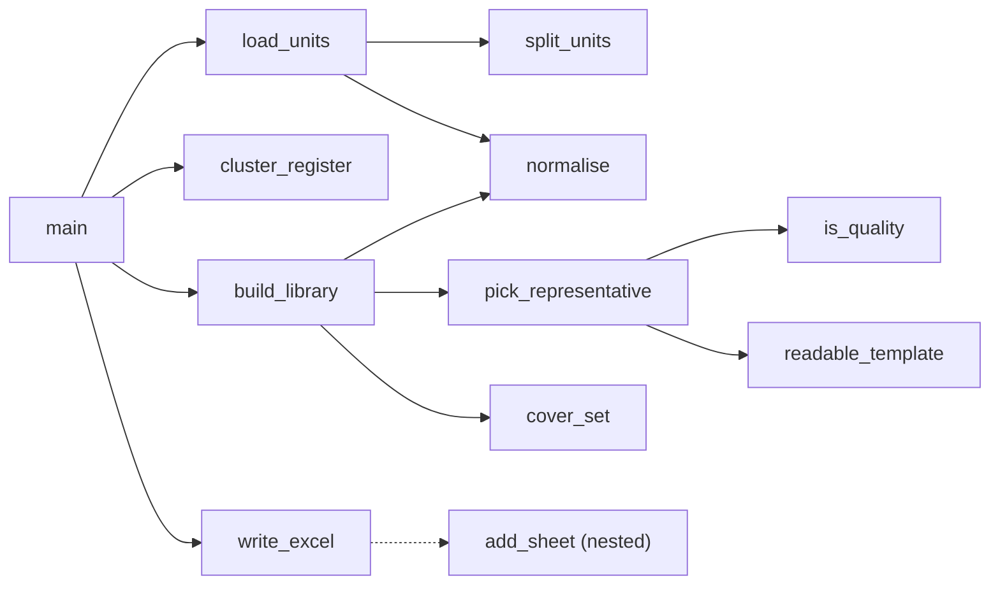

# `build_canned_comments.py`

> Standalone script that mines a de-identified DASH assessment-form export for recurring feedback phrases, clusters them into semantic "themes" with sentence embeddings, and exports a reviewable Excel library of canned (preset) comments tagged by scope, clinic type and procedure item code.

| | |
|---|---|
| **Lines of code** | 366 |
| **Top-level functions** | 11 (`split_units`, `normalise`, `readable_template`, `load_units`, `cluster_register`, `cover_set`, `is_quality`, `pick_representative`, `build_library`, `write_excel`, `main`) + 1 nested = 12 total |
| **Classes** | 0 |
| **Module constants** | 16 |
| **Imports from this codebase** | none (`json`, `re`, `collections`, `numpy`, `pandas`, `scikit-learn`, plus lazily imported `sentence_transformers` and `openpyxl`) |
| **Imported by** | nothing. No module in `src/` imports it, and `main.ipynb` never imports it — see [§7](#7-gotchas-and-known-issues) |
| **Run how** | CLI script (`python build_canned_comments.py`); `if __name__ == "__main__": main()` at lines 365–366 |

## 1. Purpose and role in the pipeline

The clinical assessment forms in **DASH** (the Dental School's assessment platform) contain two free-text reflection fields per form: one written by the student (`student_data.reflection`) and one by the assessor (`assessor_data.reflection`). Assessors write broadly the same advice over and over, differing only in which tooth or measurement is mentioned. This module's goal, per its own docstring (lines 1–21), is to distil a year of that free text into a **starter library of canned comments** that a UI can offer as preset options, keeping a free-text box for "the bespoke long tail".

Its input is a single spreadsheet, `INPUT_XLSX = "dash_forms_2025_anonymized.xlsx"` (line 32), whose `forms` column holds nested JSON — one JSON array of form objects per row. The name and the README text at line 267 ("de-identified DASH assessment forms") indicate a de-identified export; the source does not name the producing script, and note that `dash_anonymize_pipeline.py` in this same codebase writes a differently named file, so the exact provenance is not established in code.

The six-stage pipeline the docstring describes maps directly onto the functions:

1. **Load and flatten** (`load_units`) — parse the nested `forms` JSON, dedupe on each form's `id`, and pull out both reflection registers together with the form's `cohort`, `clinic_type` and its tuple of procedure `checklists` codes.
2. **Segment and normalise** (`split_units`, `normalise`) — split each reflection into sentence/line units and mask tooth numbers to `<tooth>` and measurements to `<num>`, so the same advice about different teeth collapses to one template.
3. **Embed and cluster** (`cluster_register`) — embed unique normalised units with the MiniLM sentence transformer and cluster with MiniBatchKMeans. One cluster = one theme = one candidate canned comment.
4. **Choose a representative and scope it** (`pick_representative`, `is_quality`, `cover_set`, `build_library`) — pick a concise, high-quality phrase per theme, then classify the theme as `GLOBAL`, `ITEM_CODE` or `CLINIC_TYPE` based on how concentrated its usage is.
5. **Export** (`write_excel`) — a four-sheet workbook: README, `Assessor_Library`, `Student_Library`, `ItemCode_Reference`.

The two registers (assessor, student) are processed **separately and never mixed**, with different cluster granularity (`K_THEMES`, line 35).

Nothing here touches the database, the DASH API or the PDF/report machinery. The only network access is the one-off model download performed by `sentence-transformers` on a cold cache.

## 2. External dependencies

| Library / resource | Used for |
|---|---|
| `json` | `json.loads(r["forms"])` — parsing the nested forms column (line 81) |
| `re` | All four segmentation/normalisation patterns plus inline `re.split` (line 53) and `re.sub` (line 66) |
| `collections.Counter` | Per-code distinct-form counts and per-code clinic-type distributions (lines 84–93) |
| `numpy` (as `np`) | `np.load` / `np.save` of the embedding cache (lines 116, 122) |
| `pandas` (as `pd`) | `pd.read_excel` input, `DataFrame`/`value_counts`/`groupby`/`explode` throughout, library assembly and sorting |
| `sklearn.cluster.MiniBatchKMeans` | Clustering normalised units into themes (lines 123–124) |
| `sentence_transformers.SentenceTransformer` | **Lazily imported inside `cluster_register`** (line 118), only when the `.npy` cache is missing. Downloads/loads `all-MiniLM-L6-v2` |
| `os` | **Lazily imported inside `cluster_register`** (line 110) for the cache-existence check |
| `openpyxl` (`Workbook`, `styles`, `utils`) | **Lazily imported inside `write_excel`** (lines 248–250) for workbook construction and formatting |
| **Filesystem — read** | `INPUT_XLSX`; `emb_cache_assessor.npy` / `emb_cache_student.npy` if present, in the current working directory |
| **Filesystem — write** | `emb_cache_{who}.npy` on a cold run; `OUTPUT_XLSX` |
| **Network** | First run only: the sentence-transformers model download (`EMB_MODEL`) |
| **Environment variables / DB** | none |

## 3. Module-level constants and variables

### 3.1 Configuration (lines 32–43)

| Name | Type | Value / shape | Purpose |
|---|---|---|---|
| `INPUT_XLSX` | `str` | `"dash_forms_2025_anonymized.xlsx"` | Source workbook; relative to CWD |
| `OUTPUT_XLSX` | `str` | `"canned_comment_library.xlsx"` | Destination workbook; relative to CWD |
| `SEED` | `int` | `0` | `random_state` for MiniBatchKMeans (line 123) — the only randomness control |
| `K_THEMES` | `dict[str, int]`, 2 items | `{"assessor": 500, "student": 600}` | Cluster count per register; the code caps it at `len(texts)` |
| `MIN_USAGE` | `int` | `4` | A theme with fewer than this many usages is dropped as not worth canning (line 179) |
| `COVER` | `float` | `0.80` | Cumulative-share threshold used by `cover_set` when choosing which codes / clinic types to tag |
| `CT_LIFT_MIN` | `float` | `1.30` | A clinic type must be over-represented by at least this factor versus its base rate before a theme is called `CLINIC_TYPE` (line 221) |
| `EMB_MODEL` | `str` | `"all-MiniLM-L6-v2"` | Sentence-transformer model name |
| `PLACEHOLDERS` | `set[str]`, 15 items | See below | Normalised phrases that are placeholders rather than feedback; themes resolving to one of these are dropped (line 182) |

```python
PLACEHOLDERS = {"see above", "as above", "see below", "as below", "n a", "na", "nil",
                "none", "ditto", "good", "ok", "okay", "done", "yes", "no"}
```

Note these are compared against the **normalised** form, so `"N/A"` becomes `"n a"` and is caught.

### 3.2 Segmentation and normalisation patterns (lines 46–49, 138)

| Name | Type | Pattern | Matches |
|---|---|---|---|
| `TOOTH` | `re.Pattern` | `\b\d{2}[A-Za-z]{0,3}\b` | A two-digit number with 0–3 trailing letters — the FDI tooth-notation-plus-surface shape (two digits, optional surface letters). Replaced with `<tooth>` |
| `NUM` | `re.Pattern` | `\b\d+(\.\d+)?\s?(mm|cm)?\b` | An integer or decimal, optionally followed by a space and `mm`/`cm`. Because both trailing groups are optional this also matches any bare number. Replaced with `<num>` |
| `WS` | `re.Pattern` | `\s+` | Any run of whitespace; collapsed to a single space (line 67) |
| `BULLET` | `re.Pattern` | `^\s*[-*•·>\d]+[\).\s]*` | A leading bullet or numbered-list marker (`-`, `*`, `•`, `·`, `>`, or digits) with any trailing `)`/`.`/whitespace. Stripped from the front of each unit (line 55) |
| `ALPHA` | `re.Pattern` | `[A-Za-z]` | Presence of at least one Latin letter in a word; used by `is_quality` (line 149) |

`TOOTH` is always applied **before** `NUM` (lines 64–65 and again at line 164), so two-digit numbers are consumed by the tooth pattern first.

### 3.3 Scope thresholds (lines 170–171)

| Name | Type | Value | Purpose |
|---|---|---|---|
| `GENERIC_CODE_SPREAD` | `int` | `12` | A theme appearing across ≥12 distinct procedure codes is treated as generic → `GLOBAL` |
| `GENERIC_CT_SPREAD` | `int` | `5` | …or appearing across ≥5 distinct clinic types |

These two are declared mid-file, immediately above `build_library`, rather than in the config block at the top.

## 4. Classes

None.

## 5. Function reference

The file's own banner comments define the sections: text segmentation, load + flatten, cluster, scope assignment, export, main.

### 5.1 Text segmentation

#### `split_units(text)`

*Lines 52–59.* Splits a free-text reflection into individual sentence/line units.

**Parameters**

| Name | Type | Default | Description |
|---|---|---|---|
| `text` | `str` | — | One reflection's raw text |

**Returns** — `list[str]` of cleaned units (may be empty).

**Behaviour**

1. `re.split(r"[\n\r]+|(?<=[.;!?])\s+", text)` — splits on newline runs, or on whitespace that follows a `.`, `;`, `!` or `?` (a lookbehind, so the terminator stays attached to the preceding unit).
2. Strips a leading bullet/number marker with `BULLET.sub("", p)` and trims whitespace.
3. Keeps only units of length ≥ 3 characters.

**Called by** — `build_canned_comments:load_units`.

#### `normalise(unit)`

*Lines 62–67.* Reduces a unit to a comparison key: lowercase, tooth/measurement masked, punctuation removed, whitespace collapsed.

**Parameters**

| Name | Type | Default | Description |
|---|---|---|---|
| `unit` | `str` | — | One segmented unit |

**Returns** — `str`, the normalised key.

**Behaviour**

1. `unit.lower().strip()`.
2. `TOOTH.sub("<tooth>", u)` then `NUM.sub("<num>", u)` — order matters, see §3.2.
3. `re.sub(r"[^\w<>\s]", " ", u)` — removes all punctuation except word characters, angle brackets (to preserve the `<tooth>`/`<num>` placeholders) and whitespace.
4. `WS.sub(" ", u).strip()` collapses whitespace.

**Called by** — `build_canned_comments:load_units` (line 101), `build_canned_comments:build_library` (lines 182, 186).

#### `readable_template(norm_text)`

*Lines 70–73.* Docstring: *"Turn a normalised template into something human-readable for review."*

**Parameters**

| Name | Type | Default | Description |
|---|---|---|---|
| `norm_text` | `str` | — | A masked string containing `<tooth>` / `<num>` |

**Returns** — `str` with `<tooth>` → `{tooth}` and `<num>` → `{measure}`, stripped and `.capitalize()`-ed.

**Behaviour** — note that Python's `str.capitalize()` upper-cases the first character **and lower-cases everything else**, so `{tooth}`/`{measure}` survive (they are already lowercase) but any other capitalisation in the phrase is lost.

**Called by** — `build_canned_comments:pick_representative` (line 165).

### 5.2 Load and flatten

#### `load_units(path)`

*Lines 77–105.* Reads the workbook, flattens the nested `forms` JSON, and produces one record per segmented text unit plus a metadata bundle.

**Parameters**

| Name | Type | Default | Description |
|---|---|---|---|
| `path` | `str` | — | Path to the input `.xlsx` (`INPUT_XLSX` in practice) |

**Returns** — `tuple[pandas.DataFrame, dict]`:

- The DataFrame has one row per text unit with columns `cohort`, `clinic_type`, `codes` (a tuple of item codes), `who` (`"student"` / `"assessor"`), `raw` (the segmented unit as written) and `norm` (the normalised key).
- `meta` is a dict with three entries: `code_names` (item code → checklist `name`), `code_form_ct` (`Counter`: item code → number of distinct forms containing it), `code_clinic` (item code → `Counter` of clinic types).

**Behaviour**

1. `pd.read_excel(path, dtype={"student_number": str})` — only `student_number` is forced to string, to preserve leading zeros.
2. For every spreadsheet row, `json.loads(r["forms"])` yields a list of form objects; `seen[f["id"]] = (f, r)` **dedupes on form id**, so a form appearing in several rows is counted once (last occurrence wins).
3. Per deduped form: reads `assessor_data` and `student_data` (defaulting to `{}`), takes `codes = tuple(sorted(f.get("checklists", {}).keys()))`, and for each checklist code records its `name`, increments `code_form_ct`, and increments `code_clinic[code][clinic_type]`.
4. Builds a per-form `base` dict of `cohort` (from the spreadsheet row), `clinic_type` and `codes`.
5. For each of the two registers, if the reflection text is non-empty it is segmented by `split_units`, each unit normalised, and units whose normalised form is ≥ 3 characters are appended as records.

**Side effects** — reads the input file. No writes.

**Calls** — `build_canned_comments:split_units`, `build_canned_comments:normalise`, plus `pd.read_excel`, `json.loads`. **Called by** — `build_canned_comments:main`.

### 5.3 Cluster

#### `cluster_register(units, who, k)`

*Lines 109–128.* Embeds the unique normalised units of one register and assigns each unit a theme id.

**Parameters**

| Name | Type | Default | Description |
|---|---|---|---|
| `units` | `pandas.DataFrame` | — | The full unit frame from `load_units` |
| `who` | `str` | — | `"assessor"` or `"student"` |
| `k` | `int` | — | Requested cluster count (`K_THEMES[who]`) |

**Returns** — a **copy** of the `who` subset with an added integer `theme` column.

**Behaviour**

1. `import os` locally (line 110), then subsets `units[units.who == who]`.
2. `counts = sub["norm"].value_counts()`; `texts = counts.index.tolist()` — clustering operates on **unique normalised strings**, not on every occurrence, so frequency does not bias the geometry.
3. Cache path `f"emb_cache_{who}.npy"`. If it exists, `np.load` is used and the model is never loaded; otherwise `SentenceTransformer(EMB_MODEL)` encodes `texts` with `batch_size=256`, `normalize_embeddings=True`, cast to `float32`, and `np.save`s the result.
4. `MiniBatchKMeans(n_clusters=min(k, len(texts)), random_state=SEED, n_init=3, batch_size=2048).fit(emb)`.
5. Maps each unique normalised string to its cluster label via `dict(zip(texts, km.labels_))` and applies that map to the subset's `norm` column.

**Side effects** — **writes `emb_cache_{who}.npy`** into the current working directory on a cold run; may download the model over the network; loads a transformer model into memory.

**Called by** — `build_canned_comments:main`.

### 5.4 Scope assignment

#### `cover_set(value_counts, frac)`

*Lines 132–135.* Returns the smallest set of top categories whose cumulative share reaches `frac`.

**Parameters**

| Name | Type | Default | Description |
|---|---|---|---|
| `value_counts` | `pandas.Series` | — | Counts indexed by category |
| `frac` | `float` | — | Target cumulative share (`COVER` = 0.80 in practice) |

**Returns** — `list` of index labels.

**Behaviour** — sorts descending, computes the normalised cumulative sum `c`, and returns `s.index[: (c < frac).sum() + 1]`. The `+ 1` includes the first element that crosses the threshold, so the returned set always covers **at least** `frac` and is never empty for a non-empty input.

**Called by** — `build_canned_comments:build_library`.

#### `is_quality(raw)`

*Lines 141–150.* Docstring: *"Reject normalisation fragments / junk as canned text."*

**Parameters**

| Name | Type | Default | Description |
|---|---|---|---|
| `raw` | `str` | — | A candidate raw phrase |

**Returns** — `bool`.

**Behaviour** — rejects empty strings and anything not starting with a letter (line 144); requires a word count of 2–16 inclusive (line 147); requires at least 2 words containing a Latin letter per the `ALPHA` pattern (lines 149–150).

**Called by** — `build_canned_comments:pick_representative`.

#### `pick_representative(theme_rows)`

*Lines 153–167.* Docstring: *"Concise, human-readable canned text for a theme, plus a {tooth}/{measure} template derived from the SAME chosen phrase (so they never disagree)."*

**Parameters**

| Name | Type | Default | Description |
|---|---|---|---|
| `theme_rows` | `pandas.DataFrame` | — | All unit rows belonging to one theme |

**Returns** — `tuple[str | None, str, list[str]]` = `(rep_raw, template, variants)`. Returns `(None, "", [])` when no candidate passes `is_quality`.

**Behaviour**

1. Ranks the theme's `raw` phrases by frequency (`value_counts`), then filters to those passing `is_quality`.
2. Among the **top 8** quality phrases, prefers one of 2–12 words; otherwise falls back to the single most frequent quality phrase (lines 162–163).
3. Masks the chosen phrase with `NUM.sub("<num>", TOOTH.sub("<tooth>", rep_raw))` — the same TOOTH-then-NUM order as `normalise`, but applied to the **un-lowercased** raw phrase.
4. A `template` is produced by `readable_template` **only if** the masked phrase actually contains a placeholder; otherwise it is `""`.
5. `variants` = up to 3 other quality phrases from the same theme, used as review context in the workbook.

**Calls** — `build_canned_comments:is_quality`, `build_canned_comments:readable_template`. **Called by** — `build_canned_comments:build_library`.

#### `build_library(sub, code_names, base_ct, base_code)`

*Lines 174–243.* Turns one register's themed units into the final library DataFrame.

**Parameters**

| Name | Type | Default | Description |
|---|---|---|---|
| `sub` | `pandas.DataFrame` | — | Output of `cluster_register` (has a `theme` column) |
| `code_names` | `dict` | — | Item code → checklist name, from `load_units` meta |
| `base_ct` | `dict` | — | Clinic type → base share of all units; used for the lift test |
| `base_code` | `dict` | — | Item code → base share. **Accepted but never used in the body** |

**Returns** — `pandas.DataFrame` with columns `comment_id`, `scope`, `canned_text`, `template_if_procedure_specific`, `applies_to_clinic_types`, `applies_to_item_codes`, `item_code_names`, `frequency`, `example_variants`.

**Behaviour**

1. **One record per theme** (lines 176–188). Groups by `theme`; drops themes with `usage < MIN_USAGE`; calls `pick_representative` and drops themes with no representative or whose normalised representative is in `PLACEHOLDERS`. Records the theme's clinic-type counts and its `explode("codes")` item-code counts.
2. **Merge duplicates** (lines 191–202). Two clusters can resolve to the same representative phrase; themes are re-keyed on `normalise(rep)` and merged — usages summed, the two count `Series` added with `fill_value=0`, and variants appended up to a cap of 3.
3. **Scope classification** (lines 206–223), evaluated in order:
   - `generic` if the theme spans ≥ `GENERIC_CODE_SPREAD` (12) distinct codes **or** ≥ `GENERIC_CT_SPREAD` (5) distinct clinic types → `GLOBAL`.
   - else if the 80 %-cover item-code set has 1–3 members → `ITEM_CODE`.
   - else if the 80 %-cover clinic-type set has ≤ 2 members → compute `lift = (top clinic type's share within the theme) / (its base share)` and assign `CLINIC_TYPE` when `lift >= CT_LIFT_MIN` (1.30), otherwise `GLOBAL`.
   - else `GLOBAL`.
4. **Tagging** (lines 225–235). `applies_to_clinic_types` is `"ALL"` for `GLOBAL` themes and otherwise the comma-joined cover set; `applies_to_item_codes` is `"ALL"` unless the scope is exactly `ITEM_CODE`; `item_code_names` is populated only for `ITEM_CODE` themes as `"CODE: name | CODE: name"`.
5. **Order and number** (lines 238–242). Sorted by scope in the fixed order `GLOBAL` (0) → `ITEM_CODE` (1) → `CLINIC_TYPE` (2) then by descending frequency, using a per-column `key` lambda that maps only the `scope` column. `comment_id` is then inserted as a 1-based sequence.

**Calls** — `build_canned_comments:pick_representative`, `build_canned_comments:cover_set`, `build_canned_comments:normalise`. **Called by** — `build_canned_comments:main`.

### 5.5 Export

#### `write_excel(libs, code_ref, path)`

*Lines 247–332.* Writes the four-sheet reviewable workbook.

**Parameters**

| Name | Type | Default | Description |
|---|---|---|---|
| `libs` | `dict[str, DataFrame]` | — | Keyed `"assessor"` and `"student"` |
| `code_ref` | `pandas.DataFrame` | — | Item-code reference table built in `main` |
| `path` | `str` | — | Output `.xlsx` path (`OUTPUT_XLSX`) |

**Returns** — `None`.

**Behaviour**

1. Imports `openpyxl` pieces locally (lines 248–250) and defines the shared formats: Arial bold white 11 pt headers on a solid `2F5496` fill, Arial 10 pt body, wrapped top-aligned cells, and a thin `D9D9D9` bottom border.
2. **README sheet** (lines 262–302) — a hard-coded list of (label, text) pairs documenting the method for the human reviewer: what the two registers are, what `GLOBAL` / `ITEM_CODE` / `CLINIC_TYPE` mean, how tagging works, what `template_if_procedure_specific` and `frequency` mean, a method note naming `all-MiniLM-L6-v2`, and the statement that "Item code is the strongest content driver; clinic type is a milder proxy; cohort and the rating scales carry essentially no signal and are NOT used to group." Bolding is decided by an inline predicate that tests the label against a hard-coded name list (lines 295–298). Column widths are fixed at 32 and 95.
3. **Three data sheets** via the nested `add_sheet` helper: `Assessor_Library`, `Student_Library`, `ItemCode_Reference`.
4. `wb.save(path)`.

**Side effects** — **writes the output workbook** at `path`.

**Nested functions**

| Name | Signature | One line |
|---|---|---|
| `add_sheet` | `add_sheet(name, df, wraps)` | Lines 305–324; writes a header row with the shared style, writes every DataFrame row cell-by-cell applying wrap only to columns in `wraps`, sets per-column widths from a hard-coded `widths` dict (default 18), freezes panes at `A2` and sets an auto-filter over the whole used range |

**Called by** — `build_canned_comments:main`.

### 5.6 Entry point

#### `main()`

*Lines 336–362.* Runs the whole pipeline end to end.

**Parameters** — none. **Returns** — `None`.

**Behaviour**

1. `units, meta = load_units(INPUT_XLSX)` (line 337).
2. Computes the two base-rate dicts used for the lift test: `base_ct` from `units["clinic_type"].value_counts(normalize=True)` and `base_code` from `units.explode("codes")["codes"].value_counts(normalize=True)` (lines 340–341).
3. For each register in `("assessor", "student")`: cluster with `K_THEMES[who]`, build the library, and print a one-line summary with the total and the per-scope counts (lines 344–351).
4. Builds the **item-code reference** table (lines 354–359): one row per code in `meta["code_form_ct"]` with `item_code`, `name`, the single most common `clinic_type` for that code, and `n_forms` (the true distinct-form count), sorted by `n_forms` descending.
5. `write_excel(libs, ref, OUTPUT_XLSX)` and prints `f"\nWrote {OUTPUT_XLSX}"`.

**Side effects** — reads `INPUT_XLSX`; may write embedding caches and download a model (via `cluster_register`); writes `OUTPUT_XLSX`; prints three lines to stdout. Depends on the module globals `INPUT_XLSX`, `OUTPUT_XLSX`, `K_THEMES`.

**Calls** — `build_canned_comments:load_units`, `build_canned_comments:cluster_register`, `build_canned_comments:build_library`, `build_canned_comments:write_excel`. **Called by** — nothing; only the `__main__` guard at line 366.

**Example** — no real call site exists in `main_notebook_code.py` (see §7).

## 6. Call graph (this module)



## 7. Gotchas and known issues

- **Not a notebook module.** The facts file lists `main` as a `main.ipynb` entry point 10 times; this is a **name collision**. `main_notebook_code.py` contains no `import build_canned_comments` and no reference to `canned_comment_library.xlsx`; its `main()` calls are all to notebook-local definitions. Treat this as a standalone script.
- **Stale embedding cache is silently wrong.** `cluster_register` (lines 114–122) keys the cache purely on the register name — `emb_cache_assessor.npy` / `emb_cache_student.npy` — with no hash of the input, the model name or the number of texts. If `INPUT_XLSX` changes and the cache is not deleted, `np.load` returns embeddings for the *previous* text set. `dict(zip(texts, km.labels_))` then zips two lists of different lengths and **silently truncates**, mis-assigning or dropping themes with no error. Deleting the `.npy` files is a mandatory step when the input changes.
- **`base_code` is a dead parameter.** `build_library(sub, code_names, base_ct, base_code)` (line 174) never uses `base_code`, yet `main` spends a full `explode`+`value_counts` pass computing it (line 341). Item codes get no lift test — only clinic types do (line 220).
- **`TOOTH` swallows ordinary two-digit numbers.** `\b\d{2}[A-Za-z]{0,3}\b` (line 46) is applied before `NUM`, so any bare two-digit number — a duration, a count, an age — is masked as `<tooth>`, not `<num>`. Phrases like "took 20 minutes" and "took 30 minutes" collapse into the same template, which happens to help clustering but makes the `{tooth}` templates in the output misleading.
- **`NUM`'s trailing groups are both optional**, so `\b\d+(\.\d+)?\s?(mm|cm)?\b` matches any number at all, not just measurements; the `mm|cm` alternation is effectively decorative.
- **`readable_template` lower-cases the phrase.** `str.capitalize()` at line 73 upper-cases the first character and lower-cases the rest, so proper nouns and acronyms in a template are destroyed. The `canned_text` column is unaffected — only `template_if_procedure_specific` is.
- **Hard-coded relative paths.** `INPUT_XLSX` and `OUTPUT_XLSX` (lines 32–33) resolve against the current working directory, as do the two `.npy` caches; there is no CLI argument or config override.
- **The README sheet hard-codes the input filename.** Line 267 states the library was "Built from dash_forms_2025_anonymized.xlsx" as a literal string, so it will not track a change to `INPUT_XLSX`. It also hard-codes the year in "How many comment fragments of this kind appeared in **2025**" (line 282).
- **Constants split across the file.** `GENERIC_CODE_SPREAD` and `GENERIC_CT_SPREAD` (lines 170–171) and `ALPHA` (line 138) sit mid-file rather than in the config block at lines 32–43, so tuning the scope logic means hunting for them.
- **Empty-library edge case.** If every theme is filtered out by `MIN_USAGE` / `PLACEHOLDERS` / `is_quality`, `build_library` builds `pd.DataFrame([])` and then calls `.sort_values(["scope", "frequency"])` on a frame with no columns (lines 237–241), raising `KeyError` rather than producing an empty sheet.
- **`meta["code_clinic"][c].most_common(1)[0][0]`** (line 357) will yield `None` as the `clinic_type` for any code whose forms all lack `clinic_type`, since `f.get("clinic_type")` is stored unguarded at line 93.
- **Misleading local name.** In `main`, `n = libs[who]` (line 347) is a DataFrame, then used as `len(n)` and `sum(n.scope=='GLOBAL')` — `n` reads like a count.
- **No error handling anywhere.** A single row with malformed `forms` JSON raises out of `load_units` and aborts the run; the caches written so far remain on disk.
- **Reproducibility is only partly pinned.** `SEED` fixes the k-means `random_state`, but the model version behind `EMB_MODEL` is unpinned, so re-running after a model update can produce a different library from the same input.
