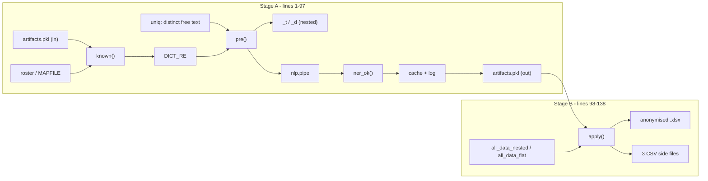

# `dash_anonymize_pipeline.py`

> A two-stage, top-level de-identification script that strips person names out of the free-text fields of the full DASH data export, substitutes pseudonymous identifiers for student numbers, assessor names and patient DRNs, and writes an anonymised workbook plus three side files (two re-identification mappings and a redaction review log).

| | |
|---|---|
| **Lines of code** | 138 |
| **Top-level functions** | 4 (`known`, `ner_ok`, `pre`, `apply`) + 1 nested = 5 total (a 6th, conditionally nested, is described in [§5.3](#pres)) |
| **Classes** | 0 |
| **Module constants** | 36 module-level assignments (many are script working variables, several are re-assigned — see [§3](#3-module-level-constants-and-variables)) |
| **Imports from this codebase** | none (`re`, `time`, `pickle`, `os`, `pandas`, `spacy`, `wordfreq`) |
| **Imported by** | nothing. Not imported by `main.ipynb` or by any module in `src/` |
| **Run how** | **Top-level script only** — `python dash_anonymize_pipeline.py`. There is **no `main()` and no `if __name__ == "__main__":` guard**; all work happens at module level, so `import dash_anonymize_pipeline` would execute the entire pipeline as a side effect. See [§1](#1-purpose-and-role-in-the-pipeline) and [§7](#7-gotchas-and-known-issues) |

## 1. Purpose and role in the pipeline

**DASH** is the Dental School assessment platform; `_unimelb_dash_all_data.xlsx` is a full export of it with two sheets, `all_data_nested` and `all_data_flat`. This module produces a de-identified copy of that export so the data can be analysed or shared without exposing student, staff or patient identities. The `dash_forms_2025_anonymized.xlsx` naming convention used elsewhere in the codebase (e.g. as the input to `build_canned_comments.py`) reflects the same intent, though that specific filename is not produced here.

**How it is meant to be run — and the flag.** The file is not a module in the ordinary sense: it is **two separate scripts concatenated into one file**, evidently two notebook/analysis cells pasted together. The seam is at line 98, where a second import block (`import os, time, pickle`) begins and `INFILE` and `FREE` are re-declared verbatim.

- **Stage A — lines 1–97: build the free-text redaction cache.** Loads `artifacts.pkl`, reads only the three free-text columns from both sheets, collects the distinct non-empty strings, redacts names from each with a three-layer approach, and writes the results back into `artifacts.pkl` under the keys `cache` and `log`.
- **Stage B — lines 98–138: apply everything and write the outputs.** Re-loads `artifacts.pkl`, reads both sheets in full, maps the structured identifier columns and swaps each free-text string for its cached redacted version, then writes the anonymised workbook and the three CSV side files.

Because there is no guard and no entry-point function, running `python dash_anonymize_pipeline.py` executes Stage A then Stage B in one pass. **The critical dependency is `artifacts.pkl`**: Stage A requires it to already exist and to contain the key `'sup'` (line 13); Stage B requires `'anon'`, `'sup'`, `'pt'` and `'cache'` (line 104). Of those, only `'cache'` and `'log'` are ever created by this file (line 95). **`'anon'` (student number → pseudonym), `'sup'` (assessor name → pseudonym) and `'pt'` (patient DRN → pseudonym) are built by an upstream step that is not present in this repository** — the comment at line 11 calls them "structured mappings" being reused. Without that prior step the script fails immediately at `pickle.load` or at the first `A['sup']` access.

The absolute paths (`/mnt/user-data/uploads/...`, `/mnt/project/...`, `/mnt/user-data/outputs`) show this was executed in a sandboxed analysis environment, not on the analyst's usual Windows working directory that the rest of the codebase assumes.

The redaction strategy for free text is deliberately layered and conservative, and every removal is logged for human review rather than trusted blindly:

1. **`title` layer** — regex on an honorific followed by capitalised words (`TITLE_RE`).
2. **`dict` layer** — regex alternation over a roster-derived dictionary of known first/last names and supervisor name tokens (`DICT_RE`), filtered so that common English words are never redacted context-free.
3. **`ner` layer** — spaCy `PERSON` entity recognition over the already partly-redacted text, with a set of hand-built stoplists to suppress the model's known false positives on dental vocabulary.

All three replace the matched span with the literal `[NAME]`.

## 2. External dependencies

| Library / resource | Used for |
|---|---|
| `re` | `TITLE_RE`, `DICT_RE`, token splitting in `known` and `ner_ok`, the capitalisation shape test at line 55 |
| `time` | Stage timing printed to stdout (lines 82, 93, 117–128) |
| `pickle` | Loading and re-saving `artifacts.pkl` (lines 11, 96, 103) |
| `os` | `os.makedirs(OUTDIR, exist_ok=True)` (line 102) and `os.path.join` for the four output paths |
| `pandas` (as `pd`) | `read_excel` of both sheets, `ExcelWriter`, `DataFrame`, `to_csv`, `notna`, the column `map` calls in `apply` |
| `spacy` | `spacy.load('en_core_web_sm', ...)` and `nlp.pipe` batch NER (lines 72, 84). Requires the `en_core_web_sm` model to be installed separately |
| `wordfreq.zipf_frequency` | Frequency test that stops common dictionary words being treated as names (lines 45, 60) |
| `xlsxwriter` | Named as the `pd.ExcelWriter` engine at line 125 |
| **Filesystem — read** | `INFILE` (both sheets, twice — once for free text only, once in full); `MAPFILE`; `artifacts.pkl` (twice) |
| **Filesystem — write** | `artifacts.pkl` (overwritten in the CWD, line 96); four files in `OUTDIR` — see [§6.1](#61-outputs) |
| **Network / DB / env vars** | none |

## 3. Module-level constants and variables

The 36 module-level assignments are **not** 36 redaction patterns. Only two are compiled regexes (`TITLE_RE`, `DICT_RE`); three more are stoplist sets used to suppress false positives; the rest are paths, tuning scalars, and script working variables (loaded DataFrames, timers, accumulators). Several names are assigned more than once because the file concatenates two scripts. They are grouped below by role.

> Privacy note: none of the tables below reproduce real student, staff or patient identifiers. `KNOWN` and `DICT_RE` are built **at runtime** from the roster file and the supervisor mapping and contain real names in memory only — nothing identifying is written in the source.

### 3.1 Paths and I/O configuration

| Name | Line(s) | Type | Value / shape | Purpose |
|---|---|---|---|---|
| `INFILE` | 5, **re-declared identically at 101** | `str` | `/mnt/user-data/uploads/_unimelb_dash_all_data.xlsx` | Source DASH export with sheets `all_data_nested` and `all_data_flat` |
| `MAPFILE` | 6 | `str` | `/mnt/project/RE__Student_List_Anonymized.xlsx` | Student roster; read into `roster` for its `First Name` / `Last Name` columns |
| `OUTDIR` | 102 | `str` | `/mnt/user-data/outputs` | Output directory, created with `exist_ok=True` on the same line |
| `FREE` | 7, **re-declared identically at 105** | `list[str]`, 3 items | `['assessor_feedback', 'student_feedback', 'clinical_incident']` | The three free-text columns subject to NER redaction |

### 3.2 Redaction tuning scalars

| Name | Line | Type | Value | Purpose |
|---|---|---|---|---|
| `TOKEN` | 8 | `str` | `'[NAME]'` | The replacement string for every redacted span, at all three layers. Also used as a guard in `ner_ok` (line 54) so an already-redacted token is not re-processed |
| `DICT_ZIPF_MAX` | 9 | `float` | `5.5` | Zipf-frequency ceiling. The inline comment states: *"dictionary names with zipf >= this are treated as common words, not redacted context-free."* Used in two places — building `KNOWN` (line 45) and rejecting single-word NER hits (line 60) |

### 3.3 The two compiled patterns

| Name | Line | Pattern | What it matches |
|---|---|---|---|
| `TITLE_RE` | 33 | `\b(?:Dr\|Drs\|Mr\|Mrs\|Ms\|Miss\|Prof\|A/?Prof\|Assoc\.?\s*Prof\|Professor\|Doctor)\.?\s+[A-Z][a-zA-Z’'.\-]*(?:\s+[A-Z][a-zA-Z’'.\-]*)?` | An **honorific followed by one or two capitalised words**. The honorific alternation covers the abbreviated and spelled-out forms plus the Australian `A/Prof` and `Assoc Prof` variants, with an optional trailing full stop. Each name word must start `[A-Z]` and may then contain letters, a right single quotation mark (U+2019), a straight apostrophe, a full stop or a hyphen — so hyphenated, apostrophised and initialled surnames are covered. The second name word is optional, so a bare "Dr Surname" matches as well as "Dr Given Surname"; a three-part name has only its first two words consumed. Applied **first**, in `pre` (line 76) |
| `DICT_RE` | 49 | `\b(` + `\|`-joined `re.escape`d members of `KNOWN`, sorted longest-first + `)\b` — or `None` when `KNOWN` is empty | A **word-boundary-anchored alternation of every known name token** derived from the roster and the supervisor mapping. Sorting by descending length ensures the longest alternative wins where one token is a prefix of another. The pattern is **case-sensitive**, so it matches only the exact capitalisation stored in the roster. Guarded by `if DICT_RE:` in `pre` (line 77) so an empty roster degrades to title + NER only |

Two further regexes are used inline rather than being compiled to constants: `re.split(r'[\s\-]+', ...)` for splitting roster values into tokens (line 41), and the capitalisation shape test `^[A-Z][a-zA-Z’'.\-]*(?:\s+[A-Z][a-zA-Z’'.\-]*)*$` applied to spaCy entity text (line 55) — the same word shape as `TITLE_RE`'s name part, but repeated any number of times and anchored to the whole entity.

### 3.4 Stoplists — false-positive suppression

These are not patterns to redact; they are vocabulary that must **never** be redacted, because spaCy's `PERSON` model mistakes dental jargon, role words and sentence-initial common words for names.

| Name | Line | Type | Shape | Purpose |
|---|---|---|---|---|
| `CLINICAL_STOP` | 16–25 | `set[str]` | 147 whitespace-split tokens, **139 distinct** | Dental/clinical vocabulary. Covers speciality abbreviations, tooth-surface and anatomical direction terms, radiograph types, instruments, materials, prosthetic and anaesthetic terms, workflow words, and course/role codes. Built with `set('''…'''.split())` over a multi-line string |
| `ROLE_STOP` | 26–27 | `set[str]` | 16 items | Role words: `operator, assistant, supervisor, patient, student, clinician, tutor, educator, demonstrator, examiner, assessor, support, observer, nurse, dentist, therapist` |
| `COMMON_START` | 29–30 | `set[str]` | 27 items | Per the comment at line 28, *"capitalised-at-sentence-start common words spaCy mis-tags as PERSON"* — pronouns, modals and common reflective verbs/adjectives such as `my, to, do, he, she, we, see, may, will, felt, slight, aim, learnt, need, tried, assisted, good, great, well, consider, ensure, patient, overall, today, also, use, used` |
| `COMBINED` | 31 | `set[str]` | `CLINICAL_STOP \| ROLE_STOP \| COMMON_START` | The single union consulted by `known` (line 44) and `ner_ok` (line 59) |

Representative slices of `CLINICAL_STOP` (clinical vocabulary only — no identifiers):

```text
ortho endo perio prostho paedo resto restoration caries molar incisor canine premolar
buccal lingual labial mesial distal occlusal palatal gingival ...
radiograph bitewing bws pa opg scaler curette gracey sickle hoe chisel explorer probe ...
matrix clamp dam composite amalgam resin vitrebond calcium hydroxide glass ionomer gic rmgic ...
```

`CLINICAL_STOP` contains 8 duplicated tokens (`perio`, `resto`, `restoration`, `lingual`, `labial`, `mesio`, `bucco`, `linguo`) — harmless in a set, but a sign the list grew by appending.

### 3.5 Derived name dictionary

| Name | Line | Type | Value | Purpose |
|---|---|---|---|---|
| `A` | 11, **re-loaded at 103** | `dict` | `pickle.load(open('artifacts.pkl','rb'))` | The artifacts bundle. Read for `'sup'` in Stage A; mutated with `'cache'`/`'log'` and re-pickled at lines 95–96; re-loaded fresh in Stage B for `'anon'`, `'sup'`, `'pt'`, `'cache'` |
| `roster` | 12 | `DataFrame` | `pd.read_excel(MAPFILE)` | Student roster; only `First Name` and `Last Name` are used |
| `sup_vals` | 13 | `set` | `set(A['sup'].keys())` | The **keys** of the supervisor mapping, i.e. the real assessor names, used as an extra source of name tokens |
| `KNOWN` | 48 | `set[str]` | `known()` | Name tokens eligible for context-free dictionary redaction |
| `DICT_RE` | 49 | `re.Pattern \| None` | See §3.3 | Compiled alternation over `KNOWN` |

### 3.6 Stage A working variables

| Name | Line(s) | Type | Value | Purpose |
|---|---|---|---|---|
| `nd` | 64 | `DataFrame` | `read_excel(INFILE, sheet_name='all_data_nested', dtype=str, usecols=FREE)` | Free-text columns of the nested sheet |
| `fd` | 65 | `DataFrame` | `read_excel(INFILE, sheet_name='all_data_flat', dtype=str, usecols=FREE)` | Free-text columns of the flat sheet |
| `uniq` | 66, **re-assigned at 69** | `set` → `list` | `set()` accumulator, then `list(uniq)` | The distinct non-empty free-text strings across both sheets and all three columns. Converting to a list fixes the order so it can be zipped against `nlp.pipe` output |
| `nlp` | 72 | spaCy `Language` | `spacy.load('en_core_web_sm', disable=['tagger','parser','lemmatizer','attribute_ruler'])` | NER pipeline with everything but the entity recogniser disabled for speed |
| `cache` | 82 | `dict` | `{}` | Accumulator: original string → redacted string |
| `log` | 82 | `list` | `[]` | Accumulator of `(original_text, layer, removed_text)` triples |
| `t` | 82, **re-assigned at 117, 119, 124** | `float` | `time.time()` | Stage timer, reused for each timed step |
| `pretexts` | 83 | `list[tuple[str, list]]` | `[pre(u) for u in uniq]` | Title- and dictionary-redacted text plus its per-string change log, computed before the NER pass |

### 3.7 Stage B working variables

| Name | Line(s) | Type | Value | Purpose |
|---|---|---|---|---|
| `nd` | 118, **re-assigned at 121** | `DataFrame` | Full nested sheet, then `apply(nd)` | The nested sheet with all columns, anonymised in place |
| `fd` | 120, **re-assigned at 121** | `DataFrame` | Full flat sheet, then `apply(fd)` | The flat sheet, anonymised in place |
| `out` | 123 | `str` | `os.path.join(OUTDIR, '_unimelb_dash_all_data_anonymized.xlsx')` | Path of the main anonymised workbook |

Stage B also destructures the artifacts bundle at line 104 into `anon`, `sup_map`, `pt_map` and `cache` — these are tuple-unpacking targets rather than separate assignments and so do not appear in the constants list, but they are the four lookup tables that `apply` consumes.

## 4. Classes

None.

## 5. Function reference

The file has no section banner comments; the ordering below follows the source. Note that **no function in this module calls another function in this module** — all orchestration happens in top-level statements.

### 5.1 Name-dictionary construction

#### `known()`

*Lines 35–47.* Builds the set of name tokens that are safe to redact wherever they appear, without needing sentence context.

**Parameters** — none. **Returns** — `set[str]` of capitalised name tokens.

**Behaviour**

1. Assembles three sources (lines 37–38): `roster['First Name']`, `roster['Last Name']` (both `dropna().astype(str)`), and `pd.Series(list(sup_vals))` — the assessor names from the supervisor mapping.
2. Splits each value on runs of whitespace or hyphens with `re.split(r'[\s\-]+', ...)`, so a double-barrelled surname yields both parts as separate tokens.
3. Strips leading/trailing `.`, `'` and `’` from each token.
4. Admits the token only if **all four** conditions hold (lines 44–45):
   - length ≥ 2 — single initials are excluded;
   - `tok[0].isupper()` — must be capitalised as stored;
   - its lowercase form is not in `COMBINED` — so a name that coincides with dental or role vocabulary is never redacted context-free;
   - `zipf_frequency(low, 'en') < DICT_ZIPF_MAX` (5.5) — so a name that is also a common English word is excluded.

**Side effects** — none, but it reads the module globals `roster`, `sup_vals`, `COMBINED` and `DICT_ZIPF_MAX`.

**Calls** — `zipf_frequency`, `re.split`, `pd.Series`. No intra-module calls. **Called by** — the top-level statement at line 48 only.

### 5.2 NER filtering

#### `ner_ok(ent)`

*Lines 51–61.* Decides whether a spaCy entity is genuinely a person name that should be redacted.

**Parameters**

| Name | Type | Default | Description |
|---|---|---|---|
| `ent` | spaCy `Span` | — | A candidate entity from `doc.ents` |

**Returns** — the entity's stripped text (`str`) when it should be redacted, otherwise `None`.

**Behaviour** — five successive rejection tests:

1. `ent.label_ != 'PERSON'` → reject (line 52). Only `PERSON` is redacted; `ORG`, `GPE`, `DATE` etc. are left alone.
2. The entity text equals `TOKEN` (`[NAME]`) → reject (line 54); prevents re-processing an already-redacted span.
3. The text does not match `^[A-Z][a-zA-Z’'.\-]*(?:\s+[A-Z][a-zA-Z’'.\-]*)*$` → reject (line 55). Every word must be capitalised in name shape, which discards lowercase and mixed-case false positives.
4. Every word (lowercased, punctuation-stripped) is in `COMBINED` → reject (line 59), commented *"pure clinical/role/common phrase"*.
5. A **single-word** entity whose Zipf frequency is ≥ `DICT_ZIPF_MAX` → reject (line 60), commented *"lone common word"*. Multi-word entities skip this test, so a two-word phrase containing a common word survives as long as test 4 did not fire.

**Side effects** — none; reads `TOKEN`, `COMBINED`, `DICT_ZIPF_MAX`.

**Calls** — `re.match`, `re.split`, `zipf_frequency`. No intra-module calls. **Called by** — the top-level NER loop at line 87.

### 5.3 Pre-NER redaction

#### `pre(s)`

*Lines 73–80.* Applies the title and dictionary layers to one string before it reaches spaCy.

**Parameters**

| Name | Type | Default | Description |
|---|---|---|---|
| `s` | `str` | — | One raw free-text string |

**Returns** — `tuple[str, list[tuple[str, str]]]` = the redacted string and a change list of `(layer, removed_text)` pairs, where `layer` is `'title'` or `'dict'`.

**Behaviour**

1. Creates a fresh change list `ch`.
2. `s = TITLE_RE.sub(_t, s)` — every honorific-plus-name span becomes `TOKEN`, with the removed text appended to `ch` under `'title'`.
3. If `DICT_RE` is not `None`, `s = DICT_RE.sub(_d, s)` does the same under `'dict'`.
4. Returns the modified string and `ch`. The caller then extends the same list with `'ner'` entries (line 90), so one change list carries all three layers for a string.

**Side effects** — none beyond building and returning `ch`.

**Nested functions**

| Name | Signature | One line |
|---|---|---|
| `_t` | `_t(m)` | Line 75; `ch.append(('title', m.group(0))); return TOKEN` — the `TITLE_RE` replacement callback |
| `_d` | `_d(m)` | Line 78; the identical callback for the `'dict'` layer. It is defined **inside the `if DICT_RE:` block**, which is why the fact-extraction lists only `_t` as nested and reports 5 functions rather than 6 |

**Called by** — the list comprehension at line 83.

### 5.4 Structured-column substitution

#### `apply(df)`

*Lines 107–115.* Replaces the identifier columns and the free-text columns of one sheet with their anonymised equivalents.

**Parameters**

| Name | Type | Default | Description |
|---|---|---|---|
| `df` | `pandas.DataFrame` | — | One sheet of the export, read with `dtype=str` |

**Returns** — the same `df` object (mutated), so the return value and the argument are the same frame.

**Behaviour**

1. `student_number` → `anon.get(str(x), x)`, leaving `NaN` untouched (line 108). An unmapped value **passes through unchanged**.
2. `student_name` → line 109 rebuilds the column as `[num if pd.notna(nm) else nm for nm, num in zip(df['student_name'], df['student_number'])]`. Because line 108 has already run, `num` is the *anonymised* student number. So a present name is replaced by the pseudonymous student id, and a missing name stays missing.
3. `assessor_name` → `sup_map.get(str(x), x)` (line 110), same null and fall-through behaviour.
4. `patient_drn` → `pt_map.get(str(x), x)` (line 111). **DRN** is the patient record number in the clinical system.
5. For each column in `FREE` that is present, swaps each non-empty value for `cache.get(v, v)` — its Stage A redacted form, falling back to the original if not in the cache (lines 112–114).

**Side effects** — **mutates `df` in place** (four column assignments plus up to three more). Reads the module globals `anon`, `sup_map`, `pt_map`, `cache` and `FREE`.

**Calls** — `pd.notna`, dict `.get`. No intra-module calls. **Called by** — the top-level statement at line 121, for each of the two sheets.

### 5.5 Top-level script stages

These are statements, not functions, but they are where the work happens.

**Stage A, lines 63–97**

1. Reads only `FREE` columns from both sheets as strings (lines 64–65) and unions the distinct non-empty values into `uniq` (lines 66–69).
2. Prints `'unique strings:', len(uniq), '| dict names:', len(KNOWN)` (line 70).
3. Loads spaCy with tagger/parser/lemmatizer/attribute_ruler disabled (line 72).
4. `pretexts = [pre(u) for u in uniq]` runs the title and dict layers over everything (line 83).
5. The main loop (lines 84–92) zips `uniq`, `pretexts` and `nlp.pipe([p[0] for p in pretexts], batch_size=256)`. For each document it walks `doc.ents`, keeps those `ner_ok` accepts, and rebuilds the string by splicing `TOKEN` over each accepted entity's `[start_char, end_char)` span. Character offsets are into the *pre-redacted* string `s`, which is exactly what was fed to spaCy, so the offsets are consistent.
6. Stores `cache[orig]` and extends `log` with `(orig, kind, removed)` for every change at all three layers.
7. Prints elapsed NER seconds and the replacement count (line 93), writes `A['cache']` and `A['log']` back into `artifacts.pkl` (lines 95–96), and prints a per-layer replacement breakdown (line 97).

**Stage B, lines 100–138**

1. Re-loads `artifacts.pkl` and destructures the four lookup tables (lines 103–104).
2. Reads **both sheets in full** (all columns) as strings, printing the read time for each (lines 117–120).
3. `nd = apply(nd); fd = apply(fd)` (line 121).
4. Writes both sheets to the anonymised workbook via `pd.ExcelWriter(..., engine='xlsxwriter')` with `na_rep=''` (lines 123–128).
5. Writes the three CSV side files (lines 131–137) and prints `'OUTPUT', out`.

## 6. Call graph (this module)

`intra_edges` is **empty** — no function in this file calls another function in this file. The diagram below therefore shows the top-level script flow and which stage invokes each function.



### 6.1 Outputs

Confirmed from the source, **all four outputs are written to `OUTDIR = '/mnt/user-data/outputs'`** (line 102) — **not** to the project root:

| File | Line | Columns | Contents |
|---|---|---|---|
| `_unimelb_dash_all_data_anonymized.xlsx` | 123–128 | Full original schema | The de-identified export, sheets `all_data_nested` and `all_data_flat`, blanks written as `''` |
| `dash_redaction_review_log.csv` | 132–133 | `original_text`, `layer`, `removed_text` | One row per redaction, with `layer` ∈ {`title`, `dict`, `ner`}, for human QA of what the pipeline removed |
| `dash_supervisor_mapping.csv` | 134–135 | `assessor_name`, `anon` | The assessor pseudonymisation key, sorted by real name |
| `dash_patient_drn_mapping.csv` | 136–137 | `patient_drn`, `anon` | The patient DRN pseudonymisation key, sorted by real DRN |

A fifth file, **`artifacts.pkl`, is overwritten in the current working directory** (line 96) — that one is written to the project root, since the path is relative.

**These three CSVs are not de-identified outputs — they are the opposite.** `dash_supervisor_mapping.csv` and `dash_patient_drn_mapping.csv` are re-identification keys by construction, and `dash_redaction_review_log.csv` stores the **original, un-redacted free text** in its `original_text` column alongside the exact name removed. They must be handled and stored with the same protection as the source export and must never travel with the anonymised workbook. Note also that no student-number mapping is exported, even though `anon` exists in the artifacts bundle.

## 7. Gotchas and known issues

- **No entry point, no import guard.** There is no `main()` and no `if __name__ == "__main__":`. Every statement runs at module level, so *importing* this file — including anything that merely does `from dash_anonymize_pipeline import known` — executes the entire pipeline, reads gigabyte-scale spreadsheets, loads a spaCy model, and overwrites `artifacts.pkl`. It must only ever be invoked as `python dash_anonymize_pipeline.py`.
- **It is two scripts in one file.** The seam is at line 98: a second `import os, time, pickle` / `import pandas as pd`, plus verbatim re-declarations of `INFILE` (line 101 = line 5) and `FREE` (line 105 = line 7), and a third redundant `import pandas as pd` at line 131. The two halves communicate only through `artifacts.pkl` on disk.
- **`artifacts.pkl` is an undocumented, external prerequisite.** Line 11 loads it before anything else and line 13 immediately requires the key `'sup'`; line 104 requires `'anon'`, `'sup'` and `'pt'`. **None of these three are created anywhere in this file** — only `'cache'` and `'log'` are (line 95). The upstream step that builds the structured mappings is not in this repository, so this script cannot be re-run from scratch as it stands.
- **`artifacts.pkl` is overwritten in place** (line 96) with no backup and no versioning. A failed or partial Stage A leaves the file in an inconsistent state; re-running is not idempotent in any checked way. It is also loaded with `pickle.load` from a relative path, which is an arbitrary-code-execution surface if the file is ever untrusted.
- **The three CSV side files carry identifying data** — see §6.1. The review log in particular stores the full original free text. Anyone shipping "the anonymised outputs" by copying `OUTDIR` wholesale would leak everything the pipeline was meant to remove.
- **`INFILE` is read twice, in full the second time.** Stage A reads only `FREE` columns (lines 64–65); Stage B re-reads both sheets with every column (lines 118–120). For a large export this doubles the I/O and holds both frames in memory simultaneously.
- **Sandbox-only absolute paths.** `/mnt/user-data/uploads`, `/mnt/project` and `/mnt/user-data/outputs` (lines 5–6, 101–102) are analysis-sandbox mount points, not the Windows-relative `2026\...` paths the rest of the codebase uses. The script will not run unmodified in the analyst's normal environment.
- **`DICT_RE` is case-sensitive.** Built from `re.escape`d roster tokens with no `re.IGNORECASE` (line 49), so a name typed in lower case or ALL CAPS in free text is missed by the dictionary layer and falls through to spaCy — which the `[A-Z]`-anchored shape test at line 55 will then also reject. Miscapitalised names are a systematic gap.
- **Unmapped identifiers pass through silently.** Every substitution in `apply` uses `.get(str(x), x)` (lines 108–111), so a student number, assessor name or DRN absent from the mapping is written to the anonymised output **unchanged**, with no warning and no count. There is no post-hoc assertion that the output contains no un-mapped identifiers.
- **`TITLE_RE` captures at most two name words** (the second group is a single optional repetition, line 33), so a three-part name after an honorific has only its first two words redacted; the remainder depends on the dict or NER layers.
- **`apply` shadows a very common pandas method name** and mutates its argument in place while also returning it (lines 107–115), so `nd = apply(nd)` at line 121 reads like a copy but is not.
- **`_d` is invisible to static tooling.** Being defined inside `if DICT_RE:` (line 78), it is not reported as a nested function, which is why the fact file counts 5 functions rather than 6.
- **`CLINICAL_STOP` has 8 duplicate tokens** across lines 16–25 (`perio`, `resto`, `restoration`, `lingual`, `labial`, `mesio`, `bucco`, `linguo`) — 147 tokens, 139 distinct. Harmless in a set but evidence the stoplist has been appended to without review.
- **No error handling at all.** There is no try/except anywhere; a missing sheet, a missing `First Name` column in `MAPFILE`, an absent `en_core_web_sm` model or a missing artifacts key aborts the run. If Stage A completes and Stage B fails, `artifacts.pkl` has already been overwritten but no outputs exist.
- **No `nd`/`fd` schema check.** `apply` assumes `student_number`, `student_name`, `assessor_name` and `patient_drn` all exist (lines 108–111 are unguarded), while the `FREE` columns *are* guarded by `if c in df.columns` (line 113) — an inconsistency that will raise `KeyError` on a sheet with a different identifier schema.
- **Redaction is one-way and unverified.** The `[NAME]` token carries no index, so the review log is the only route back to what was removed, and there is no automated recall check (e.g. re-scanning the anonymised output for roster names) to confirm the three layers caught everything.
