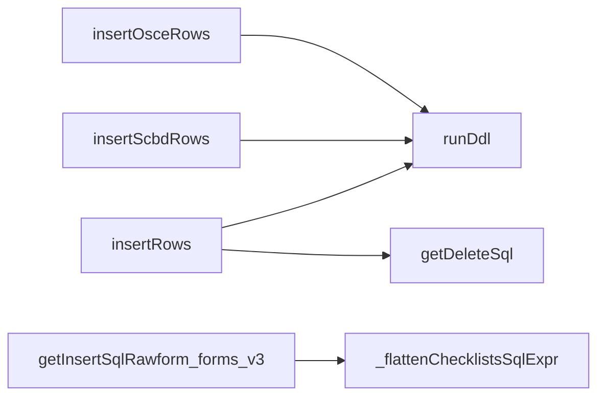
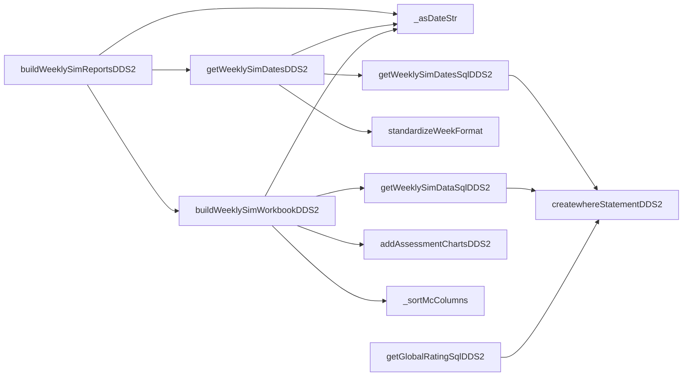
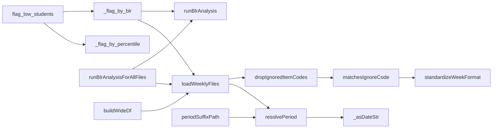

# `general_utils.py`

> Ingest layer plus DDS2 weekly-sim reporting: fetches assessment records from the DASH API, builds the Postgres DDL/INSERT SQL that lands them in `rawforms` / `rawform_forms_v3` / `scbd` / `osce`, then queries those tables to build the DDS2 weekly simulation Excel workbooks and the BLR / percentile student-flagging analysis on top of them.

> **Changed since generation (2026-08-14).** The module has roughly doubled (weekly-sim work through 2026-08-18). Relevant to this doc: the `clinical_incident` expression in `getInsertSqlRawform_forms_v3` was rewritten on 2026-08-18 — see item 6 of that function's entry in §5 — because it read only one of the two shapes DASH uses and lost 159 incidents.

| | |
|---|---|
| **Lines of code** | 3607 *(1909 at generation)* |
| **Top-level functions** | 85 (+ nested) |
| **Classes** | 1 (`FlagMethod`) |
| **Module constants** | 67 |
| **Imports from this codebase** | `variableUtils` (star import), `Utils` (`autoFitColumns`, `readDf`) |
| **Imported by** | `main.ipynb` (`from general_utils import *`, notebook line 70), and — since 2026-08-18 — **`flagging_utils.py`** for `SEMESTER_SPLIT_DATE` / `PERIOD_*` / `resolvePeriod` / `periodSuffixPath`, so both pipelines split the year on the same constant. Not circular: this module imports nothing from `flagging_utils`. |
| **Run how** | Imported by `main.ipynb` via `from general_utils import *`. 26 of its functions are called directly from notebook cells. It has no `__main__` block and is not a CLI script. |

---

> **2026-09-30** — re-added `getDeleteStudentsSql(tableName, studentNumbers=None, colName="student_number")` (after `getDeleteSql`): returns `DELETE FROM … WHERE student_number IN (…)` for `EXCLUDED_STUDENT_NUMBERS` (from variableUtils), `""` if empty. Called in cell 6 `processForms()`. See `_handover_docs/HANDOVER_boh1_sim_flagging_preset.md` §8.

## 1. Purpose and role in the pipeline

This module is the **first stage of the MDS 2026 data pipeline** and, separately, the **whole DDS2 weekly-simulation reporting chain**. Those are the two things it does; they are joined only by the fact that the second reads the tables the first writes.

**Ingest half (lines 23–769).** The University of Melbourne Dental School assessment platform ("DASH", `https://api.unimelb-dash.com`) exposes assessments as paginated JSON. `fetchAllAssessments` walks that pagination; `toRows` / `toRowsScbd` / `toRowsOsce` flatten each record into a dict of bind parameters; `getInsertSqlRawforms`, `getScbdInsertSql`, `getOsceInsertSql` return the parameterised `INSERT` statements; `insertRows` / `insertScbdRows` / `insertOsceRows` create the table (via `runDdl` on the matching `CREATE_*_TABLE_SQL` constant) and execute the insert in batches. Nothing in this module opens a connection itself — the caller (the notebook) owns the SQLAlchemy `engine`.

Four physical tables are involved. `rawforms` holds one row per assessment with the whole `forms` blob in a single `JSONB` column. `rawform_forms_v3` is the *exploded* table: `getInsertSqlRawform_forms_v3` returns one giant `INSERT … SELECT` that cross-joins laterally over `rawforms.forms` and writes one row per (assessment, form_code) with the student/assessor payloads split out into typed columns. `scbd` and `osce` are flatter, single-form tables built purely in Python (no SQL-side explosion). `getInsertSqlRawform_forms` is the **older v2** version of the exploding INSERT, kept in the file but not called from the notebook.

**Reporting half (lines 779–1907).** `getWeeklySimDataSqlDDS2` pulls one row per (assessment, checklist item code) for a single DDS2 Simulation date, with the scale ratings (GR/TS/CS/PS/PR/PEC) pivoted into columns and an O-code→0..1 average as "Assessor Score" / "Student Score". `buildWeeklySimWorkbookDDS2` turns that into `DDS2/Weekly Sim/dds2 <date> assessment_data.xlsx` with an openpyxl chart sheet; `buildWeeklySimReportsDDS2` batches it over every date discovered by `getWeeklySimDatesDDS2`. Those workbooks are then read *back off disk* by `loadWeeklyFiles` and reshaped by `buildWideDf` into a students × item-code matrix, which `flag_low_students` marks Pass/Fail using either a per-column percentile or a per-date **BLR (borderline regression)** cutoff from `runBlrAnalysis`.

The disk round-trip is deliberate: the weekly workbooks are the analyst's own artefact and are edited/inspected between the two halves. A consequence is that `DDS2/Weekly Sim` holds both semesters' workbooks side by side, which is why the `PERIOD` machinery (`PERIOD_FHY` / `PERIOD_SHY` / `PERIOD_ALL`, `resolvePeriod`, `periodSuffixPath`) exists at all.

Downstream, `risk_report.generate` consumes the combined workbook this module's helpers produce (notebook line ~1823).

---

## 2. External dependencies

| Library / resource | Used for |
|---|---|
| `requests` | `fetchAllAssessments` — HTTP GET against the DASH API with `Authorization: Token <bearerToken>` (Django REST Framework token, **not** Bearer), 60 s timeout, follows the `next` pagination link. |
| `pandas` (`pd`) | DataFrames everywhere; `pd.read_excel` / `to_excel`, `json_normalize`, `pivot_table`, `Timestamp` date coercion. |
| `sqlalchemy.text` | Wraps every SQL string before `conn.execute`. All DB access goes through an `engine` passed in by the caller. |
| `psycopg.types.json.Json` | Wraps dicts for `JSONB` bind parameters in `toRowsScbd` / `toRowsOsce`. (`toRows` does **not** wrap — the notebook does it at call site.) |
| `scipy.stats` | `stats.linregress` in `runBlrAnalysis`. |
| `openpyxl` | `load_workbook`, and the whole `openpyxl.chart` stack (`ScatterChart`, `BarChart`, `Reference`, `Series`, `Trendline`, `Marker`, `GraphicalProperties`, `LineProperties`, `DataLabelList`, `ChartLines`) for `addAssessmentChartsDDS2`; `FormulaRule`/`ColorChoice` are imported but unused. |
| `enum.Enum` | `FlagMethod`. |
| `os`, `re`, `fnmatch` | Path building / `makedirs`, week-key regex, glob matching of ignore patterns. |
| `variableUtils` (star) | Supplies `ITEM_CODE_COL` (`"item_code"`), `DEFAULT_DATE_REGEX`, `DEFAULT_FILE_PATTERN`, `DEFAULT_ID_COLS` (`["student_number"]`), `FAIL_FILL`, `FAIL_TEXT`, `excludeNames`, `allCohorts`, `year`. |
| `Utils` | `readDf(engine, sql, params)` — `pd.read_sql(text(sql), conn, params)`; `autoFitColumns(ws)`. |
| **Postgres** | Tables `rawforms`, `rawform_forms_v3`, `scbd`, `osce` (and the v2-shaped `rawform_forms` DDL, which is misnamed — see Gotchas). Requires `jsonb` support and the `Australia/Melbourne` session timezone for correct `::date` behaviour. |
| **Filesystem** | Reads/writes `DDS2/Weekly Sim/*.xlsx` (folder configurable). |
| **Env vars** | None read directly. The DASH token is obtained in the notebook (`get_token()` / `DASH_TOKEN`) and passed in as `bearerToken`. |

---

## 3. Module-level constants and variables

### 3.1 Table names

| Name | Type | Value | Purpose |
|---|---|---|---|
| `RAWFORMS_NAME` | `str` | `"rawforms"` | Raw one-row-per-assessment table. Line 23. |
| `RAWFORM_FORMS_NAME` | `str` | `"rawform_forms_v3"` | Table the *exploded* form rows live in. Line 24. **Note the value is already `rawform_forms_v3`**, so every "v2-named" helper (`getInsertSqlRawform_forms`, `CREATE_RAWFORM_FORMS_TABLE_SQL`) and every DDS2 weekly query points at the v3 table. |
| `RAWFORM_FORMS_V3_NAME` | `str` | `"rawform_forms_v3"` | Line 392. Duplicate of `RAWFORM_FORMS_NAME` — same string, two names. |
| `SCBD_NAME` | `str` | `"scbd"` | SCBD (structured case-based discussion) table. Line 25. |
| `OSCE_NAME` | `str` | `"osce"` | OSCE table. Line 26. |

### 3.2 DDL constants

All are f-strings interpolating the table-name constants above. Each is intended to be passed to `runDdl`, which splits on `;`.

| Name | Lines | Shape / purpose |
|---|---|---|
| `CREATE_RAWFORMS_TABLE_SQL` | 29–49 | `CREATE TABLE IF NOT EXISTS rawforms` — `id BIGSERIAL PK`, `assessmentId BIGINT`, student identity columns, `datetimeUtc TIMESTAMPTZ`, `cohort/subject/type TEXT`, `completed BOOLEAN`, `forms JSONB NOT NULL`, `insertedAt TIMESTAMPTZ DEFAULT now()`. Plus a **unique** index `uq_rawforms_assessmentId` (this is what makes `ON CONFLICT (assessmentId)` work) and b-tree indexes on `datetimeUtc`, `student_number`, and a **GIN** index on `forms`. |
| `CREATE_RAWFORM_FORMS_TABLE_SQL` | 51–95 | The **v2** exploded-form schema: `PRIMARY KEY (form_code, assessmentid)`, `student_data`/`assessor_data` JSONB, the three reflection/incident text columns, `patient_complexity`, `role`, `clinic`, `scales`, `checklists`, `version`, and *separate* `patient_age` / `patient_drn` / `patient_details` / `patient_interpreter` columns. Creates it under the name `rawform_forms_v3` (see Gotchas). No indexes. |
| `CREATE_SCBD_TABLE_SQL` | 97–119 | `scbd` — `assessmentid BIGINT PRIMARY KEY`, `student_name`, `assessor_name`, `datetimeutc`, `cohort`, `subject`, `submitted`, `version`, `global_rating SMALLINT`, `assessor_comments`, `checklist_key`, `checklist_data JSONB`, `form JSONB`. Indexes on `datetimeutc`, `cohort`, `student_name`, GIN on `form`. **Has no `student_number` column.** |
| `CREATE_RAWFORM_FORMS_V3_TABLE_SQL` | 394–445 | The **v3** exploded-form schema. Same key and most columns as v2, but replaces the four `patient_*` columns with a single `patient_data JSONB`, and adds `context_schema_snapshot`, `student_config`, `assessor_config`, `assessor_email`. Indexes on `datetimeutc`, `cohort`, `student_number`, GIN on `student_data` and `assessor_data`. This is the DDL the notebook actually runs (notebook line 183). |
| `CREATE_OSCE_TABLE_SQL` | 652–676 | `osce` — like `scbd` plus `station SMALLINT`, `visible BOOLEAN`, `scales_data JSONB`. Indexes on `datetimeutc`, `cohort`, `student_name`, GIN on `form`. Also has no `student_number`. |

### 3.3 Routing / scoring constants

| Name | Type | Value | Purpose |
|---|---|---|---|
| `RAWFORM_FORMS_V3_EXCLUDE_COHORTS` | `tuple[str, str]` | `("DDS4", "BOH3")` | Line 448. Interpolated **literally** into the v3 INSERT as `AND r.cohort NOT IN ('DDS4', 'BOH3')`. These final-year cohorts have their own `dds4_boh3_forms_v3` table (per the comment at line 379–390) and are handled elsewhere. |
| `DDS2_SEMESTER_SPLIT_DATE` | `str` | `"2026-06-15"` | Line 779. The sem-1/sem-2 boundary. Default `minDate` for the weekly-sim builders, and the pivot point for `PERIOD_FHY`/`PERIOD_SHY`. Comment: everything on/after is semester 2; to build semester 1 pass `minDate=None, maxDate='2026-06-14'`. |
| `WEEKLY_SIM_SCORE_MAP` | `dict[str, float]` | 7 entries | Lines 784–792. O-code → 0..1 score used when expanding the flattened checklist JSON into MC columns. Mirrors the `CASE` in `getWeeklySimDataSqlDDS2` so the Python-side MC columns and the SQL-side scores agree. |

```python
WEEKLY_SIM_SCORE_MAP = {
    "O1": 1.00, "O2": 0.80, "O3": 0.60, "O4": 0.40, "O5": 0.00,
    "Yes": 1.00, "No": 0.00,
}
```

### 3.4 Regex and period selectors

| Name | Type | Value | Purpose |
|---|---|---|---|
| `_WEEK_KEY_RE` | `re.Pattern` | `r'^(?P<prefix>.*?)[-\s]*Week[-\s]*(?P<num>\d{1,2})$'`, `IGNORECASE` | Line 1000. Drives `standardizeWeekFormat`. Requires the week number at the **end** of the code. |
| `PERIOD_FHY` | `str` | `"FHY"` | Line 1361. First half year — dates strictly **before** `DDS2_SEMESTER_SPLIT_DATE`. |
| `PERIOD_SHY` | `str` | `"SHY"` | Line 1362. Second half year — dates **on/after** the split. |
| `PERIOD_ALL` | `str` | `"ALL"` | Line 1363. Whole year, no date filter (the original behaviour). |

---

## 4. Classes

### `FlagMethod(str, Enum)`

*Line 1532.* "Method used to identify low-performing students." Inheriting from `str` means `FlagMethod.PERCENTILE == "percentile"` is `True`, so callers can pass either the enum member or the plain string; `flag_low_students` normalises with `FlagMethod(method)`.

| Member | Value | Meaning |
|---|---|---|
| `PERCENTILE` | `"percentile"` | Threshold = the per-column quantile (default 0.15). Handled by `_flag_by_percentile`. |
| `BLR` | `"blr"` | Threshold = the borderline-regression cutoff refitted per date. Handled by `_flag_by_blr`; requires `folder_path`. |

No methods.

---

## 5. Function reference

### 5.1 DASH ingest → `rawforms`

#### `getDeleteSql(formName=None)`

*Lines 121–130.* Returns a `DELETE` that removes test/dummy students from a table.

**Parameters**

| Name | Type | Default | Description |
|---|---|---|---|
| `formName` | `str` | `None` | Table name interpolated into `Delete from {formName}`. The default produces the literal string `Delete from None`. |

**Returns** — `str`, a single `DELETE … ;` statement.

**Behaviour** — deletes rows where `lower(student_name)` is one of `'kunal patel'`, `'suhrid gupta'`, `'test student'`, `'test1 student1'`, **or** `student_number is null`. The name list is hard-coded here and only partly overlaps `excludeNames` from `variableUtils` (which lacks `test1 student1`).

**Calls** — none. **Called by** — `general_utils:insertRows`; `main.ipynb` (4 call sites: after the v3 explode with `RAWFORM_FORMS_V3_NAME`, after SCBD insert with `SCBD_NAME`, commented out for OSCE, and against `stdTable` in the DDS4/BOH3 standardisation cell).

**Example** (notebook line 186)

```python
conn.execute(text(getDeleteSql(F"{RAWFORM_FORMS_V3_NAME}")))
```

#### `getInsertSqlRawforms(replace=False)`

*Lines 132–177.* Returns the parameterised `INSERT` for the `rawforms` table.

**Parameters**

| Name | Type | Default | Description |
|---|---|---|---|
| `replace` | `bool` | `False` | `True` → `ON CONFLICT (assessmentId) DO UPDATE` refreshing every column and setting `insertedAt = now()`. `False` → `ON CONFLICT (assessmentId) DO NOTHING`. |

**Returns** — `str` with named bind params `:assessmentId, :student_number, :student_name, :student_email, :datetimeUtc, :cohort, :subject, :type, :completed, :forms`.

**Behaviour**

1. Builds the `onconflict` fragment from `replace`.
2. The statement is `INSERT … SELECT :param, … WHERE :datetimeUtc >= TIMESTAMPTZ '2026-01-01'` — i.e. it is an `INSERT … SELECT` with a guard, not a `VALUES` list, so **any row whose `datetimeUtc` is before 2026-01-01 is silently dropped** rather than rejected.
3. The upsert relies on the unique index `uq_rawforms_assessmentId` created by `CREATE_RAWFORMS_TABLE_SQL`.

**Calls** — none. **Called by** — `main.ipynb`.

**Example** (notebook lines 170–174)

```python
insertSql = getInsertSqlRawforms(replaceExisting)
for row in rows:
    row["forms"] = Json(row["forms"])
insertRows(engine, rows, insertSql)
```

#### `runDdl(conn, ddl)`

*Lines 179–182.* Executes a multi-statement DDL string one statement at a time.

**Parameters**

| Name | Type | Default | Description |
|---|---|---|---|
| `conn` | SQLAlchemy `Connection` | — | Must already be inside a transaction (`engine.begin()`). |
| `ddl` | `str` | — | One or more SQL statements separated by `;`. |

**Returns** — `None`.

**Behaviour** — `ddl.strip().split(";")`, then `conn.execute(text(stmt))` for each non-blank fragment. The split is purely textual: a `;` inside a string literal, a `DO $$ … $$` block or a function body would be split incorrectly. All current `CREATE_*_TABLE_SQL` constants are safe under this rule.

**Side effects** — executes DDL/DML against the database.

**Calls** — none. **Called by** — `general_utils:insertRows`, `general_utils:insertScbdRows`, `general_utils:insertOsceRows`; `main.ipynb` (8 call sites — the most-called function in the module).

**Example** (notebook line 183)

```python
with engine.begin() as conn:
    runDdl(conn, CREATE_RAWFORM_FORMS_V3_TABLE_SQL)
```

#### `fetchAllAssessments(apiUrl, bearerToken)`

*Lines 184–213.* Pulls every page of an assessment listing from the DASH API.

**Parameters**

| Name | Type | Default | Description |
|---|---|---|---|
| `apiUrl` | `str` | — | Full first-page URL, e.g. `https://api.unimelb-dash.com/assessment/caf/v3/get?page_size=max&page=1&cohort=…&year=2026&ordering=datetime,-cohort`. |
| `bearerToken` | `str` | — | DASH token. Sent as `Authorization: Token <token>` (DRF token scheme), despite the parameter name. |

**Returns** — `list[dict]`, the concatenation of every page's `results`.

**Behaviour**

1. Opens one `requests.Session` and loops while `nextUrl` is truthy.
2. `session.get(nextUrl, headers=…, timeout=60)`, then `raise_for_status()` — HTTP errors propagate, nothing is swallowed.
3. Requires a `results` list in the JSON body, else raises `ValueError("Unexpected response: missing 'results' list")`.
4. `nextUrl = payload.get("next")` drives pagination.
5. Several debug `print`/`break` lines are commented out (lines 195–198, 204, 211).

**Side effects** — network I/O; prints a running `Fetched N records, total so far: M` line per page.

**Calls** — none. **Called by** — `main.ipynb` (5 call sites: CAF/v3, SCBD, OSCE and two notebook-local copies).

**Example** (notebook line 156)

```python
records = fetchAllAssessments(apiUrl, bearerToken)
```

#### `toRows(records, formCol='forms')`

*Lines 215–239.* Flattens raw CAF/v3 API records into bind-parameter dicts for `getInsertSqlRawforms`.

**Parameters**

| Name | Type | Default | Description |
|---|---|---|---|
| `records` | `list[dict]` | — | Output of `fetchAllAssessments`. |
| `formCol` | `str` | `'forms'` | Name of the **output key** holding the forms blob. The value read from the record is always `r.get("forms")` regardless. |

**Returns** — `list[dict]` with keys `assessmentId, student_number, student_name, student_email, datetimeUtc, cohort, subject, type, completed` and `formCol`.

**Behaviour**

1. Skips any record whose `student` is missing or not a dict.
2. `student_name` is `first_name + " " + last_name` — a `KeyError` if either key is absent (unlike the other fields, which use `.get`).
3. Skips records with a falsy `student_number`.
4. `assessmentId` = `r["assessment_id"]` falling back to `r["id"]`.
5. The `forms` value is left as a plain Python object — the notebook wraps it in `Json(...)` before insert (notebook lines 172–173).

**Calls** — none. **Called by** — `main.ipynb` (3 call sites, including notebook-local copies).

#### `insertRows(engine, rows, insertSql, batchSize=1000)`

*Lines 241–246.* Creates `rawforms`, batch-inserts, then cleans test students.

**Parameters**

| Name | Type | Default | Description |
|---|---|---|---|
| `engine` | SQLAlchemy `Engine` | — | Transaction opened with `engine.begin()`. |
| `rows` | `list[dict]` | — | From `toRows`. |
| `insertSql` | `str` | — | From `getInsertSqlRawforms`. |
| `batchSize` | `int` | `1000` | Rows per `executemany`. |

**Returns** — `None`.

**Behaviour** — inside one transaction: `runDdl(conn, CREATE_RAWFORMS_TABLE_SQL)` → slice `rows` into `batchSize` chunks and `conn.execute(text(insertSql), chunk)` → `runDdl(conn, getDeleteSql("rawforms"))`. Note the DDL and the delete target `rawforms` **unconditionally**, whatever `insertSql` was passed.

**Side effects** — DDL + INSERT + DELETE against the database; everything commits or rolls back as one unit.

**Calls** — `general_utils:runDdl`, `general_utils:getDeleteSql`. **Called by** — `main.ipynb`.

#### `buildCohortList(useAll, allCohorts, includeCohorts, excludeCohorts)`

*Lines 248–254.* Resolves the cohort selection into an ordered list.

**Parameters**

| Name | Type | Default | Description |
|---|---|---|---|
| `useAll` | `bool` | — | `True` → start from `allCohorts`; `False` → start from `includeCohorts`. |
| `allCohorts` | `list[str]` | — | Usually `variableUtils.allCohorts` = `["DDS4","BOH3","DDS1","DDS2","DDS3","BOH2","BOH1"]`. |
| `includeCohorts` | `list[str]` | — | Explicit selection when `useAll` is `False`. |
| `excludeCohorts` | `list[str]` | — | Subtracted in both branches. |

**Returns** — `list[str]`, filtered **in `allCohorts` order** (so an entry of `includeCohorts` not present in `allCohorts` is silently dropped, and ordering of `includeCohorts` is ignored).

**Called by** — `main.ipynb` (3 call sites).

**Example** (notebook line 143)

```python
cohortList = buildCohortList(useAll, allCohorts, includeCohorts, excludeCohorts)
cohortText = ",".join(cohortList)
```

### 5.2 Form separation — `rawform_forms` (v2, legacy)

#### `getInsertSqlRawform_forms(replace=False)`

*Lines 259–375.* Returns the **v2** `INSERT … SELECT` that explodes `rawforms.forms` into one row per (form_code, assessmentid).

**Parameters**

| Name | Type | Default | Description |
|---|---|---|---|
| `replace` | `bool` | `False` | `True` → `ON CONFLICT (form_code, assessmentid) DO UPDATE` over all 27 payload columns + `insertedat = now()`; `False` → `DO NOTHING`. |

**Returns** — `str`, a self-contained statement with no bind parameters.

**Behaviour** — reads `FROM rawforms r` and:

1. `CROSS JOIN LATERAL` that accepts **both** shapes of the `forms` blob: `jsonb_each(r.forms)` when `jsonb_typeof(r.forms) = 'object'`, `UNION ALL` `jsonb_array_elements(r.forms)` keyed on `value->>'form_key'` when it is an array.
2. A second lateral resolves `studentJson` = `COALESCE(form_value->'student_data', form_value->'data'->'student')` and `assessorJson` likewise — i.e. it tolerates two nesting conventions.
3. `student_data` is `studentJson - 'reflection'`; `assessor_data` is `assessorJson` minus `reflection`, `patient_complexity`, `clinical_incident`. Those keys are promoted to their own columns.
4. `clinical_incident` is `NULLIF(COALESCE(assessorJson->>'critical_incident', assessorJson->>'clinical_incident'), '')` — handles both spellings.
5. Scalars pulled from `form_value`: `role`, `clinic` (`COALESCE(clinic_type, clinic)`), `scales`, `checklists`, `version::int`, `patient_age::int`, `patient_drn`, `assessor_name`, `patient_details`, `patient_interpreter::boolean`, `submitted_by_student`/`submitted_by_assessor::boolean`, `additional_checklists`.
6. `patient_complexity` comes from `assessorJson->'patient_complexity'->>'scale'` (v2 shape: the graded level is under `scale`).
7. Filter: `WHERE f.form_code IS NOT NULL AND r.datetimeUtc >= TIMESTAMPTZ '2026-01-01'`. **No cohort exclusion** — unlike v3, this would also pull DDS4/BOH3.
8. Four scalar columns (`time_mgmt`, `professionalism`, `communication`, `entrustment`) are commented out throughout, in the INSERT list and the SELECT list (lines 302, 315–320, 334–337).

**Target table** — `RAWFORM_FORMS_NAME`, whose value is `"rawform_forms_v3"` — so this v2 statement writes into the v3-named table, which does not have `patient_age` / `patient_drn` / `patient_details` / `patient_interpreter` columns under the v3 DDL.

**Calls** — none. **Called by** — nothing in this module and nothing in `main.ipynb`. Superseded by `getInsertSqlRawform_forms_v3`.

### 5.3 Form separation — `rawform_forms_v3`

The comment block at lines 377–390 records the storage decisions: `scales` stay in the new nested shape under `*_data->'scales'`; `checklists` are kept nested **and** flattened up to the top level of `student_data`/`assessor_data` in the old v2 shape so existing item-code reports keep working; patient info collapses into a single `patient_data` JSONB; `context_schema_snapshot` and `assessor_email` are new.

#### `_flattenChecklistsSqlExpr(rawExpr)`

*Lines 451–468.* Returns a SQL **scalar expression** (not a statement) that converts a nested `*_data` JSONB into the old flat shape `{item_code: {MCk: <key-string>}}`.

**Parameters**

| Name | Type | Default | Description |
|---|---|---|---|
| `rawExpr` | `str` | — | A SQL expression yielding the raw `*_data` jsonb, e.g. `"sdr.raw"`. Interpolated **twice** into the returned text. |

**Returns** — `str`, a `COALESCE((SELECT jsonb_object_agg(…)), '{}'::jsonb)` expression.

**Behaviour** — iterates `(rawExpr)->'checklists'` with `jsonb_each`, guarding with `CASE WHEN jsonb_typeof(...) = 'object' … ELSE '{}'::jsonb END` so a missing or non-object `checklists` yields `'{}'` instead of an error. For each item code it aggregates the MC entries as `COALESCE(mc_val->>'key', mc_val#>>'{}')` — i.e. it accepts both `{"key": "O2"}` objects and bare JSON scalars. Braces are doubled (`'{{}}'`) because the whole thing is an f-string.

**Calls** — none. **Called by** — `general_utils:getInsertSqlRawform_forms_v3`.

#### `getInsertSqlRawform_forms_v3(replace=False)`

*Lines 471–563.* The **v3** `INSERT … SELECT` that explodes `rawforms` into `rawform_forms_v3` for the non-final-year cohorts.

**Parameters**

| Name | Type | Default | Description |
|---|---|---|---|
| `replace` | `bool` | `False` | `True` → `ON CONFLICT (form_code, assessmentid) DO UPDATE` over all payload columns + `insertedat = now()`; `False` → `DO NOTHING`. |

**Returns** — `str`, self-contained (no bind parameters).

**Behaviour**

1. Builds the flattening expressions for the student and assessor sides via `_flattenChecklistsSqlExpr("sdr.raw")` / `("adr.raw")`.
2. Same dual-shape `CROSS JOIN LATERAL` over `r.forms` (object *or* array with `form_key`) as v2.
3. Three more laterals default the pieces to `'{}'::jsonb`: `fc.ctx` = `form_value->'form_context'`, `sdr.raw` = `form_value->'student_data'`, `adr.raw` = `form_value->'assessor_data'`.
4. `student_data` / `assessor_data` are written as `raw || <flattened checklists>` — the nested v3 payload **merged with** a v2-shaped flat copy, so old item-code reporting still resolves `student_data->'FP-Week-03'->>'MC1'`.
5. Reflections now live at `raw->'texts'->>'reflection'` (v3 nesting), not at the top level.
6. `clinical_incident` — **rewritten 2026-08-18.** It was a `string_agg(x->>'value', '; ' ORDER BY x->>'value')` over `adr.raw->'multi-select'->'clinical-incident'` **and nothing else**, on the assumption that v3 always makes this a multi-select. It does not: the DDS2 / BOH2 / BOH1 / DDS1 2026 templates record an incident as a **radio plus a text field**, so the column came back NULL for all of them and every incident report downstream was empty — **159 forms lost** (DDS2 Sim 40, DDS2 Clinic 35, BOH2 Clinic 32, BOH1 Sim 23, DDS1 Sim 20, BOH2 Sim 9) against 87 rows carrying the multi-select shape. It is now a `COALESCE` of both:

    ```sql
    COALESCE(
      (SELECT string_agg(x->>'value', '; ' ORDER BY x->>'value')
         FROM jsonb_array_elements(COALESCE(adr.raw->'multi-select'->'clinical-incident','[]'::jsonb)) x),
      CASE WHEN lower(COALESCE(adr.raw->'radio'->>'clinical-incident-occurred','')) = 'yes'
           THEN COALESCE(NULLIF(TRIM(COALESCE(adr.raw->'texts'->>'clinical-incident','')), ''),
                         'Yes (no details recorded)')
      END
    ) AS clinical_incident
    ```

    ~66 of the 159 are `"yes"` with no detail typed, hence the placeholder — an empty string there would read as "no incident". **Rows already in the table keep their NULL until it is reloaded**; `boh2_dds2_dds3_utils.clinicalIncidentSqlExpr` applies the same resolution at READ time, so reports are correct without a reload. See `_handover_docs/HANDOVER_dds2_clinic_flagging_fhy.md` §7.
7. `patient_complexity` is `adr.raw->'scales'->'scale-patient-complexity'->>'key'` — v3 prefixes scale keys with `scale-` and stores the graded level under `key` (v2 used `scale`).
8. `role` / `clinic` come from `form_context` (`ctx->>'role'`, `ctx->>'clinic_type'`), and `patient_data` is the whole `ctx->'patient'`.
9. Filter: `WHERE f.form_code IS NOT NULL AND r.cohort NOT IN ('DDS4', 'BOH3') AND r.datetimeUtc >= TIMESTAMPTZ '2026-01-01'`. The cohort tuple is interpolated by Python `repr`.

**Calls** — `general_utils:_flattenChecklistsSqlExpr`. **Called by** — `main.ipynb`.

**Example** (notebook lines 182–186)

```python
def processForms():
    with engine.begin() as conn:
        runDdl(conn, CREATE_RAWFORM_FORMS_V3_TABLE_SQL)
        insertSql = getInsertSqlRawform_forms_v3(replace = replaceExisting)
        conn.execute(text(insertSql))
        conn.execute(text(getDeleteSql(F"{RAWFORM_FORMS_V3_NAME}")))
```

### 5.4 SCBD ingest

#### `getScbdInsertSql(replace=False)`

*Lines 569–601.* Parameterised `INSERT … VALUES` into `scbd`.

**Parameters** — `replace` (`bool`, default `False`): `ON CONFLICT (assessmentid) DO UPDATE` over all columns + `insertedat = now()`, else `DO NOTHING`.

**Returns** — `str` with bind params `:assessmentId, :student_name, :assessor_name, :datetimeUtc, :cohort, :subject, :submitted, :version, :global_rating, :assessor_comments, :checklist_key, :checklist_data, :form`.

**Behaviour** — unlike the rawforms insert, this is a plain `VALUES` list with **no `2026-01-01` date guard**.

**Called by** — `main.ipynb`.

#### `toRowsScbd(records)`

*Lines 603–641.* Flattens SCBD API records into bind dicts.

**Returns** — `list[dict]` matching `getScbdInsertSql`'s parameters.

**Behaviour**

1. Skips records whose `student` is missing or not a `str` (SCBD returns the student as a name string, not the dict `toRows` expects).
2. Skips `student.lower() in excludeNames` (from `variableUtils`: `{"kunal patel", "suhrid gupta", "test student"}`) — filtering happens **before** insert here, in addition to `getDeleteSql` afterwards.
3. `assessorData` = `(r["form"] or {})["data"]["assessor"]`.
4. `global_rating` = `int(assessorData["scale-global-rating"]["scale"])` if present — SCBD uses the **v2** `scale` key, not v3's `key`.
5. **Checklist detection is positional**: the first key that is neither `comments` nor `scale-global-rating` and whose value is a dict becomes `checklist_key`/`checklist_data`, then `break`. Dict ordering therefore decides the answer when a form has more than one candidate.
6. `checklist_data` and `form` are wrapped in `psycopg` `Json(...)`; `checklist_data` is `None` when empty.

**Called by** — `main.ipynb`.

#### `insertScbdRows(engine, rows, insertSql, batchSize=1000)`

*Lines 643–647.* `runDdl(conn, CREATE_SCBD_TABLE_SQL)` then batched inserts, inside one `engine.begin()` transaction. Unlike `insertRows`, it does **not** run `getDeleteSql` — the notebook does that separately (line 373).

**Side effects** — DDL + INSERT against the database.

**Calls** — `general_utils:runDdl`. **Called by** — `main.ipynb`.

### 5.5 OSCE ingest

#### `getOsceInsertSql(replace=False)`

*Lines 678–712.* Parameterised `INSERT … VALUES` into `osce`. `replace=True` → `ON CONFLICT (assessmentid) DO UPDATE` over all columns; else `DO NOTHING`. Bind params add `:station`, `:visible`, `:scales_data` to the SCBD set. No date guard.

**Called by** — `main.ipynb`.

#### `toRowsOsce(records)`

*Lines 714–763.* Flattens OSCE API records.

**Behaviour** — same student-name/`excludeNames` guards as `toRowsScbd`, then:

1. Collects **every** `scale-*` key from `assessorData` into a flat `{key: int}` dict, skipping values that fail `int()` (caught `ValueError`/`TypeError`, silently ignored).
2. `global_rating = scalesData.get("scale-global-rating")` — read from that dict rather than re-parsed.
3. Checklist detection: the first key **not** starting with `scale-` whose value is a dict, then `break`. Positional, as in SCBD.
4. `checklist_data`, `scales_data`, `form` wrapped in `Json(...)`; the first two are `None` when empty.

**Called by** — `main.ipynb`.

#### `insertOsceRows(engine, rows, insertSql, batchSize=1000)`

*Lines 765–769.* `runDdl(conn, CREATE_OSCE_TABLE_SQL)` then batched inserts in one transaction. No delete step.

**Calls** — `general_utils:runDdl`. **Called by** — `main.ipynb`.

### 5.6 DDS2 weekly-sim SQL builders

#### `createwhereStatementDDS2(prefix, date=None, minDate=None, maxDate=None, cohort='DDS2', type_='Simulation')`

*Lines 795–818.* The `WHERE` clause shared by every DDS2 weekly-sim query.

**Parameters**

| Name | Type | Default | Description |
|---|---|---|---|
| `prefix` | `str` | — | Table alias, e.g. `'f'`. |
| `date` | `str \| None` | `None` | Single day. Emitted **first** as `{prefix}.datetimeutc::date = DATE '{date}'`. |
| `minDate` | `str \| None` | `None` | Inclusive `>=` bound on `datetimeutc::date`. |
| `maxDate` | `str \| None` | `None` | Inclusive `<=` bound. |
| `cohort` | `str` | `'DDS2'` | `{prefix}.cohort = '{cohort}'`. |
| `type_` | `str` | `'Simulation'` | `{prefix}.type = '{type_}'`. |

**Returns** — `str` beginning `"\n      where "` with clauses joined by `"\n      and "`. Always includes the bare boolean `{prefix}.submitted_by_assessor`.

**Timezone note (from the docstring, lines 797–806)** — all three date comparisons use `datetimeutc::date`, which resolves in the **Postgres session timezone**. The DASH feed stores each session as local midnight (13:00Z under AEDT, 14:00Z under AEST), so the `::date` only matches the human-facing session date while the session `TimeZone` is `Australia/Melbourne`. Discovery and extraction both go through this helper so they cannot disagree about a date.

**Values are interpolated, not bound** — `cohort`, `type_` and the dates are f-string-substituted straight into the SQL.

**Called by** — `getGlobalRatingSqlDDS2`, `getWeeklySimDatesSqlDDS2`, `getWeeklySimDataSqlDDS2`.

#### `getGlobalRatingSqlDDS2(date='2026-04-13', minDate=None, maxDate=None)`

*Lines 820–840.* SQL for the global-rating (GR) distribution for one DDS2 sim date, or an inclusive range.

**Returns** — `str` producing columns `global_rating`, `n`, grouped and ordered by `global_rating`.

**Behaviour** — reads `FROM rawform_forms_v3 f CROSS JOIN LATERAL jsonb_each(COALESCE(f.assessor_data->'scales','{}'::jsonb))` and keeps `k.key = 'scale-global-rating'`, taking `NULLIF(v->>'key','')::int`. The docstring records the v3 shape explicitly: scales are nested under `assessor_data->'scales'` with **prefixed** keys and the graded level under `->>'key'`.

**Called by** — `main.ipynb` (2 call sites, one commented).

**Example** (notebook line 1628)

```python
date = datesDf["date"].iloc[-1] if not datesDf.empty else '2026-02-02'
ratingDist = readDf(engine, getGlobalRatingSqlDDS2(date))
```

#### `getWeeklySimDatesSqlDDS2(minDate=DDS2_SEMESTER_SPLIT_DATE, maxDate=None, cohort='DDS2', type_='Simulation')`

*Lines 843–881.* SQL listing every assessment date that has weekly-sim data, with counts.

**Returns** — `str` producing one row per `datetimeutc::date`: `date`, `n_forms` (assessor-submitted forms), `n_students` (distinct `student_number`), `week_keys` (comma-separated checklist/item codes used that day, e.g. `'FP-Week-03'`, `'Paeds-2026-Week-02'`) so a low-volume catch-up day is obvious before a workbook is built for it.

**Behaviour** — CTE `forms` applies `createwhereStatementDDS2('f', None, minDate, maxDate, cohort, type_)` against `rawform_forms_v3`. CTE `weekkeys` finds the checklist keys by **exclusion**: any top-level key of `assessor_data` that is a JSON object, is not `LIKE 'scale-%%'`, is not one of the structural keys `('radio','texts','scales','checklists','multi-select')`, and does not itself contain a `scale` key. (`%%` is doubled for the DBAPI paramstyle.)

**Called by** — `general_utils:getWeeklySimDatesDDS2`.

#### `getWeeklySimDataSqlDDS2(date='2026-04-13')`

*Lines 884–998.* The main weekly-sim extraction query for one date.

**Returns** — `str` producing one row per (assessment, `item_code`) with columns: `student_number`, `student_name`, `student_email`, `assessor_name`, `item_code`, `date`, `mc_json`, `GR`, `TS`, `CS`, `PS`, `PR`, `PEC`, `"Assessor Score"`, `"Student Score"`, `clinical_incident`, `assessor_reflection`, `student_reflection`, `assessmentid`, `form_code`. Ordered by `cohort, student_number, datetimeutc, form_code, item_code`.

**Behaviour** — three CTEs over `rawform_forms_v3`, each filtered by `createwhereStatementDDS2('f', date)`:

1. **`base`** — one row per (form_code, assessmentid). `LEFT JOIN LATERAL jsonb_each(assessor_data->'scales')` guarded by `jsonb_typeof(s.value)='object' AND (s.value ? 'key')`, then `MAX(CASE WHEN s.key = … THEN NULLIF(s.value->>'key','')::int END)` pivots six scales into columns: `scale-global-rating`→**GR**, `scale-time-mgmt`→**TS**, `scale-communication`→**CS**, `scale-professionalism`→**PS**, `scale-practice-readiness`→**PR**, `scale-position-ergonomics`→**PEC**.
2. **`sessionChecklist`** — one row per (assessment, checklist key) from `assessor_data`, keeping the raw object as `mc_json` and computing `assessor_score01` = `ROUND(AVG(CASE …), 2)` over `jsonb_each_text` of the checklist, with the magic map **O1→1.00, O2→0.80, O3→0.60, O4→0.40, O5→0.00, Yes→1.00, No→0.00, anything else → NULL**. This is the SQL twin of `WEEKLY_SIM_SCORE_MAP`.
3. **`studentRubricAvgPerSession`** — identical computation over `student_data`, yielding `student_score01`.

The final `SELECT` inner-joins `base` to `sessionChecklist` on (assessmentid, form_code) and **left**-joins the student side on (assessmentid, form_code, item_code), so an assessor-only form still produces rows with a null "Student Score".

**Called by** — `general_utils:buildWeeklySimWorkbookDDS2`.

### 5.7 Week-key normalisation and Excel charts

#### `standardizeWeekFormat(itemCode)`

*Lines 1003–1028.* Normalises a weekly checklist/item code so it sorts and groups correctly.

**Parameters** — `itemCode` (any). Non-`str` values are returned unchanged.

**Returns** — the normalised code, or the input unchanged if `_WEEK_KEY_RE` does not match.

**Behaviour** — two fixes only: the week number is zero-padded to 2 digits, and the separator before `Week` becomes a hyphen (all runs of whitespace/hyphens in the prefix collapse to a single `-`, and leading/trailing hyphens are stripped). If the prefix is empty the result is `Week-NN`. Documented cases: `'2026-Week-1'`→`'2026-Week-01'`, `'FP-Week-3'`→`'FP-Week-03'`, `'Paeds 2026-Week-1'`→`'Paeds-2026-Week-01'`. The motivating bug is recorded in the docstring: DDS2 semester 2 shipped the Paeds checklist under both `'Paeds 2026-Week-1'` (space) and `'Paeds-2026-Week-2'` (hyphen), which otherwise split one item into two in every pivot. Non-week codes (`'positioning'`, `'DDS2-MAR-31'`, `'19-Jan-SIM'`) pass through untouched.

**Called by** — `general_utils:getWeeklySimDatesDDS2`, `general_utils:matchesIgnoreCode`; also applied directly in `buildWeeklySimWorkbookDDS2`, `loadWeeklyFiles` and `getChecklistBank`.

#### `_sortMcColumns(columns)`

*Lines 1031–1036.* Orders MC columns numerically (MC1, MC2, … MC10) instead of lexically.

**Returns** — `list`, sorted by the key below.

| Nested function | Signature | Description |
|---|---|---|
| `key` | `key(col)` | Returns `(0, int(n))` for a column matching `^MC(\d+)$`, else `(1, str(col))` — so MC columns come first in numeric order and everything else follows alphabetically. |

**Called by** — `general_utils:buildWeeklySimWorkbookDDS2`.

#### `addAssessmentChartsDDS2(filepath, sheet1Name='Sheet1', chartSheetName='Charts', blrFilter=None)`

*Lines 1038–1190.* Adds three charts on a second sheet of an existing workbook.

**Parameters**

| Name | Type | Default | Description |
|---|---|---|---|
| `filepath` | `str` | — | Existing `.xlsx`, opened with `load_workbook` and **saved back in place**. |
| `sheet1Name` | `str` | `'Sheet1'` | Data sheet; must have header row 1 containing `GR`, `Assessor Score`, `Student Score` (a `KeyError` otherwise). |
| `chartSheetName` | `str` | `'Charts'` | Deleted first if it already exists, then recreated. |
| `blrFilter` | any | `None` | **Accepted but never referenced in the body.** The docstring says chart 3 is "optionally filtered"; no filtering is implemented. |

**Returns** — `None`.

**Behaviour**

1. Deletes and recreates the chart sheet, so re-running is idempotent.
2. **Chart 1** (anchored `A1`): scatter of Student Score (y) vs Assessor Score (x), both axes fixed 0–1 with major unit 0.1, marker fill `1F77B4`, no connecting line, light-grey (`D9D9D9`) gridlines. A dashed grey `y = x` reference series is drawn from two helper cells written at row 80, columns 5–6 of the chart sheet.
3. **Chart 2** (anchored `J1`): bar chart of GR counts. GR values are read out of the data sheet with `iter_rows`, counted with `pd.Series(...).value_counts().sort_index()`, and written to the chart sheet starting at row 45, columns 1–2 — that helper block is visible to the user.
4. **Chart 3** (anchored `A22`): scatter of Assessor Score (y, 0–1) vs GR (x, 0–5) with a **linear trendline** displaying the equation and R².
5. `wb.save(filepath)`.

**Side effects** — rewrites the workbook at `filepath`; writes helper values into the `Charts` sheet at rows 45+ and 80–81.

**Called by** — `general_utils:buildWeeklySimWorkbookDDS2`.

### 5.8 DDS2 weekly-sim: date discovery and workbook building

#### `_asDateStr(value)`

*Lines 1194–1200.* Coerces `str` / `date` / `datetime` / `pd.Timestamp` to `'YYYY-MM-DD'`. `None` → `None`. Strings go through `pd.to_datetime` (so pandas' parsing rules, including its day/month heuristics, apply); everything else through `pd.Timestamp`.

**Called by** — `getWeeklySimDatesDDS2`, `buildWeeklySimWorkbookDDS2`, `buildWeeklySimReportsDDS2`, `resolvePeriod`.

#### `getWeeklySimDatesDDS2(engine, minDate=DDS2_SEMESTER_SPLIT_DATE, maxDate=None, cohort='DDS2', type_='Simulation', minForms=1)`

*Lines 1203–1228.* Every DDS2 weekly-sim assessment date in the DB, as a DataFrame.

**Parameters**

| Name | Type | Default | Description |
|---|---|---|---|
| `engine` | SQLAlchemy `Engine` | — | Passed to `Utils.readDf`. |
| `minDate` | `str \| date \| None` | `DDS2_SEMESTER_SPLIT_DATE` (`'2026-06-15'`) | Inclusive lower bound. Defaults to the split so semester 1 — whose workbooks are already built — is never returned; pass `None` for the whole year. |
| `maxDate` | `str \| date \| None` | `None` | Inclusive upper bound. |
| `cohort` | `str` | `'DDS2'` | |
| `type_` | `str` | `'Simulation'` | |
| `minForms` | `int` | `1` | Drops low-volume days. Only applied when `> 1`. DDS2 has a handful of 1–3 form days that are individual catch-ups/tests rather than a cohort session. |

**Returns** — `pd.DataFrame` with columns `date` (str `'YYYY-MM-DD'`), `n_forms`, `n_students`, `week_keys`. If the query returns nothing, an empty frame with an added empty string-typed `date` column.

**Behaviour** — builds the SQL via `getWeeklySimDatesSqlDDS2(_asDateStr(minDate), _asDateStr(maxDate), cohort, type_)`, runs it through `readDf`, formats `date` as a string, then splits `week_keys` on `,`, pushes each through `standardizeWeekFormat`, de-duplicates and re-joins sorted — so the discovered codes match what the data build will produce.

**Side effects** — database read.

**Calls** — `general_utils:_asDateStr`, `general_utils:getWeeklySimDatesSqlDDS2`, `Utils:readDf`, `general_utils:standardizeWeekFormat`. **Called by** — `general_utils:buildWeeklySimReportsDDS2`; `main.ipynb`.

**Example** (notebook line 1623)

```python
datesDf = getWeeklySimDatesDDS2(engine, minDate=DDS2_SEMESTER_SPLIT_DATE)
```

#### `buildWeeklySimWorkbookDDS2(engine, date, folder='DDS2/Weekly Sim', scoreMap=None, fileTemplate='dds2 {date} assessment_data.xlsx', blrFilter='BLR', sheet1Name='Sheet1', chartSheetName='Charts', returnDf=False)`

*Lines 1231–1266.* Builds **one** weekly-sim workbook for a single date. Described in the docstring as the old notebook `createDateReport` lifted out of `main.ipynb`, with the v3 data pull, week-key normalisation and numeric MC column ordering.

**Parameters**

| Name | Type | Default | Description |
|---|---|---|---|
| `engine` | `Engine` | — | |
| `date` | `str \| date \| Timestamp` | — | Coerced by `_asDateStr`. |
| `folder` | `str` | `'DDS2/Weekly Sim'` | Created with `os.makedirs(exist_ok=True)`. |
| `scoreMap` | `dict \| None` | `None` | `None` → `WEEKLY_SIM_SCORE_MAP`. |
| `fileTemplate` | `str` | `'dds2 {date} assessment_data.xlsx'` | `.format(date=date)`. |
| `blrFilter` | `str` | `'BLR'` | Forwarded to `addAssessmentChartsDDS2`, which ignores it. |
| `sheet1Name` | `str` | `'Sheet1'` | Data sheet name (must match what `to_excel` produces). |
| `chartSheetName` | `str` | `'Charts'` | |
| `returnDf` | `bool` | `False` | `True` → return `(path, dataDf)` instead of just `path`. |

**Returns** — the file path (or `None` when the query returned no rows); as a 2-tuple with the DataFrame when `returnDf=True`.

**Behaviour**

1. `readDf(engine, getWeeklySimDataSqlDDS2(date))`. Empty → prints `  [<date>] no rows returned — nothing written.` and returns `None`.
2. Normalises `item_code` with `standardizeWeekFormat`.
3. `pd.json_normalize(dataDf["mc_json"])` expands the flattened checklist JSON (`{'MC1': 'O2', …}`) into one column per MC key; `replace(scoreMap)` maps O-codes/Yes/No to 0..1; `apply(pd.to_numeric, errors="coerce")` turns anything unmapped into `NaN`; `_sortMcColumns` reorders MC1…MC10 numerically.
4. Concatenates the MC block onto the data (dropping `mc_json`) on `axis=1` — this relies on both frames having the same positional RangeIndex.
5. `to_excel(filePath, index=False)`, then reopens with `pd.ExcelWriter(..., mode="a", if_sheet_exists="overlay")` purely to call `autoFitColumns` on the sheet.
6. `addAssessmentChartsDDS2(filePath, …)` adds the chart sheet.

**Side effects** — creates `folder`; writes/overwrites the workbook (three separate open/save cycles); prints.

**Calls** — `general_utils:_asDateStr`, `Utils:readDf`, `general_utils:getWeeklySimDataSqlDDS2`, `general_utils:standardizeWeekFormat`, `general_utils:_sortMcColumns`, `Utils:autoFitColumns`, `general_utils:addAssessmentChartsDDS2`. **Called by** — `general_utils:buildWeeklySimReportsDDS2`; `main.ipynb` (commented-out ad-hoc call, notebook line 1673).

**Example** (notebook line 1673, commented)

```python
# path, dataDf = buildWeeklySimWorkbookDDS2(engine, '2026-08-10', folder=folder, returnDf=True)
```

#### `buildWeeklySimReportsDDS2(engine, folder='DDS2/Weekly Sim', dates=None, minDate=DDS2_SEMESTER_SPLIT_DATE, maxDate=None, skipExisting=True, minForms=1, dryRun=False, scoreMap=None, fileTemplate='dds2 {date} assessment_data.xlsx', blrFilter='BLR', cohort='DDS2', type_='Simulation')`

*Lines 1269–1348.* Builds a weekly-sim workbook for every assessment date in range. This is the batch entry point the notebook runs weekly.

**Parameters**

| Name | Type | Default | Description |
|---|---|---|---|
| `engine` | `Engine` | — | |
| `folder` | `str` | `'DDS2/Weekly Sim'` | Created if missing. |
| `dates` | list \| scalar \| `None` | `None` | Explicit dates (`'2026-07-13'`, `date`, `Timestamp` — mixed is fine); a scalar is wrapped in a list. `None` → dates come from `getWeeklySimDatesDDS2`. An explicit list is **still** filtered by `minDate`/`maxDate`, so a stray semester-1 date cannot sneak back in; pass `minDate=None` to disable. |
| `minDate` | `str \| None` | `DDS2_SEMESTER_SPLIT_DATE` | Inclusive lower bound = the sem 1/sem 2 boundary, so already-built semester 1 workbooks are never reconsidered. |
| `maxDate` | `str \| None` | `None` | Inclusive upper bound. For semester 1 use `minDate=None, maxDate='2026-06-14'`. |
| `skipExisting` | `bool` | `True` | Never overwrites an existing workbook, so the run is safe to repeat weekly. `False` forces a rebuild. |
| `minForms` | `int` | `1` | Skip dates with fewer than this many assessor-submitted forms. |
| `dryRun` | `bool` | `False` | Print/return the plan without touching any file. |
| `scoreMap`, `fileTemplate`, `blrFilter` | | | Forwarded to `buildWeeklySimWorkbookDDS2`. |
| `cohort`, `type_` | `str` | `'DDS2'`, `'Simulation'` | Forwarded to the date discovery only. |

**Returns** — a summary `pd.DataFrame` with columns `date, n_forms, n_students, week_keys, status, path`. `status` ∈ `built` / `skipped-exists` / `skipped-low-volume` / `skipped-out-of-range` / `no-rows` / `planned` / `error: <Type>: <msg>`.

**Behaviour**

1. Normalises both bounds with `_asDateStr` and `os.makedirs(folder)`.
2. Always calls `getWeeklySimDatesDDS2(..., minForms=1)` — the discovery pass is deliberately unfiltered so `counts` holds every date's form/student counts; `minForms` is applied later per date.
3. Builds `plan` from `counts.keys()` or from the caller's `dates`.
4. Per date, the status ladder is evaluated in order: out-of-range → not in `counts` (`no-rows`) → below `minForms` → existing file (`skipped-exists`) → `dryRun` (`planned`) → build. Date comparisons are plain **string** comparisons, valid because everything is ISO `YYYY-MM-DD`.
5. Build failures are caught per date (`except Exception`) and recorded as `error: …` so one bad date does not abort the batch — but the traceback is lost.
6. Prints one aligned line per date and a closing summary naming `minDate`, `maxDate`, `skipExisting`, `minForms`.

**Side effects** — creates the folder, writes workbooks, prints heavily.

**Calls** — `general_utils:_asDateStr`, `general_utils:getWeeklySimDatesDDS2`, `general_utils:buildWeeklySimWorkbookDDS2`. **Called by** — `main.ipynb` (4 call sites, 3 commented alternatives).

**Example** (notebook lines 1651–1659)

```python
summary = buildWeeklySimReportsDDS2(
    engine,
    folder=folder,
    minDate=DDS2_SEMESTER_SPLIT_DATE,   # inclusive; None = no lower bound
    maxDate=None,                       # inclusive; e.g. '2026-06-14' for sem 1
    skipExisting=True,
    minForms=20,
    dryRun=DRY_RUN,
)
```

### 5.9 Period selection, file loading and item-code filtering

The comment block at lines 1351–1360 explains why this exists: semester 1 and semester 2 workbooks live side by side in `DDS2/Weekly Sim`, so a plain folder glob mixes them. The boundary is derived from `DDS2_SEMESTER_SPLIT_DATE`, so moving that one constant moves both halves and they stay complementary (FHY + SHY == ALL, no overlap).

#### `resolvePeriod(period=PERIOD_ALL, minDate=None, maxDate=None, splitDate=None)`

*Lines 1366–1389.* Turns a period name into an inclusive `(minDate, maxDate, label)` triple.

**Parameters**

| Name | Type | Default | Description |
|---|---|---|---|
| `period` | `str \| None` | `PERIOD_ALL` | `'FHY'`/`'SHY'`/`'ALL'`, case-insensitive, plus aliases `SEM1`/`S1`/`H1` and `SEM2`/`S2`/`H2`, and `''`. `None` → treated as `ALL`. |
| `minDate` | `str \| None` | `None` | Explicit bound; **wins over** the period's own bound (so `period='SHY', maxDate='2026-07-31'` narrows the half year). |
| `maxDate` | `str \| None` | `None` | Same. |
| `splitDate` | `str \| None` | `None` | Overrides `DDS2_SEMESTER_SPLIT_DATE`. |

**Returns** — `(minDate, maxDate, label)` with dates as `'YYYY-MM-DD'` strings or `None`.

**Behaviour** — `dayBeforeSplit` = split − 1 day. Bounds are `FHY → (None, dayBeforeSplit)`, `SHY → (splitDate, None)`, `ALL → (None, None)`. An unrecognised period raises `ValueError(f"Unknown period {period!r} — use 'FHY', 'SHY' or 'ALL'.")`. The override is `_asDateStr(minDate) or bounds[0]`, so a falsy explicit value falls back to the period bound.

**Calls** — `general_utils:_asDateStr`. **Called by** — `general_utils:periodSuffixPath`, `general_utils:loadWeeklyFiles`; `main.ipynb`.

#### `periodSuffixPath(path, period=PERIOD_ALL)`

*Lines 1392–1400.* `'…/x.xlsx'` + `'SHY'` → `'…/x (SHY).xlsx'`.

**Returns** — `str`. `ALL`/`None` returns `path` unchanged, so existing whole-year filenames (and anything downstream pointing at them) keep working exactly as before.

**Behaviour** — resolves the label via `resolvePeriod(period)` (dates are discarded), then `os.path.splitext` + f-string. Note it validates the period as a side effect, so an unknown period raises here too.

**Calls** — `general_utils:resolvePeriod`. **Called by** — `main.ipynb` (4 call sites: the BLR output, the combined workbook, and the risk-report in/out paths).

**Example** (notebook lines 1821–1822)

```python
riskIn  = periodSuffixPath(os.path.join(folder, "dds2 combined scores and ratings.xlsx"), PERIOD)
riskOut = periodSuffixPath(os.path.join(folder, "dds2 sim risk report.xlsx"), PERIOD)
```

#### `matchesIgnoreCode(itemCode, ignoreCodeList)`

*Lines 1403–1422.* `True` if `itemCode` matches any entry in `ignoreCodeList`.

**Behaviour** — returns `False` immediately for an empty/None list. Entries are shell-style glob patterns matched case-insensitively via `fnmatch.fnmatch` on `casefold()`ed strings (a pattern with no wildcard is just an exact match). **Both sides** are pushed through `standardizeWeekFormat` first, so listing the raw DASH spelling `'Paeds 2026-Week-1'` still matches the normalised `'Paeds-2026-Week-01'` in the workbooks. Documented patterns: `'positioning'`, `'2026-Week-*'`, `'Paeds*'`, `'*-Week-0?'`.

**Calls** — `general_utils:standardizeWeekFormat`. **Called by** — `general_utils:dropIgnoredItemCodes`.

#### `dropIgnoredItemCodes(weeklyFiles, ignoreCodeList=None, minItemCount=0, verbose=True, idCol='student_number')`

*Lines 1425–1486.* Drops unwanted item codes from a `[(dateStr, df), ...]` list.

**Parameters**

| Name | Type | Default | Description |
|---|---|---|---|
| `weeklyFiles` | `list[tuple[str, DataFrame]]` | — | As produced by `loadWeeklyFiles`. |
| `ignoreCodeList` | `list[str] \| None` | `None` | Glob patterns (see `matchesIgnoreCode`). Default = drop nothing. |
| `minItemCount` | `int` | `0` | Drop any item code sat by fewer than this many **distinct** students across the whole loaded set. `0` = off. The automatic version of the ignore list: a code done by one catch-up student still gets its own column and its own percentile threshold computed over n=1, which is meaningless. Counted across all dates together, so a code split over two dates is judged on its combined student count. |
| `verbose` | `bool` | `True` | Prints what was dropped. Silent dropping would make the combined workbook look complete when it isn't. |
| `idCol` | `str` | `'student_number'` | Column used to count distinct students. |

**Returns** — a new `[(dateStr, df), ...]`; dates left with no rows are removed entirely.

**Behaviour**

1. Early-returns the input unchanged if neither filter is set, or if no frame has an `item_code` column.
2. Collects `dropped: code -> reason` — first from the glob list, then from the low-count rule (reason string `f"minItemCount (n={len(seen)})"`).
3. When `idCol` is absent from a frame, the low-count counter falls back to `range(len(grp))`, which mixes positional integers into the student set.
4. Rebuilds the list, skipping emptied dates, and prints a summary of dropped codes plus any dropped dates.

**Side effects** — prints when `verbose`.

**Calls** — `general_utils:matchesIgnoreCode`. **Called by** — `general_utils:loadWeeklyFiles`.

#### `loadWeeklyFiles(folderPath, dateRegex=DEFAULT_DATE_REGEX, filePattern=DEFAULT_FILE_PATTERN, period=PERIOD_ALL, minDate=None, maxDate=None, ignoreCodeList=None, minItemCount=0, verbose=True)`

*Lines 1489–1530.* Loads the weekly assessment workbooks in a folder as `[(dateStr, df), ...]`.

**Parameters** — `dateRegex` defaults to `variableUtils.DEFAULT_DATE_REGEX` (`r"\d{4}-\d{2}-\d{2}"`), `filePattern` to `DEFAULT_FILE_PATTERN` (`r"assessment_data\.xlsx$"`, matched case-insensitively). `period`/`minDate`/`maxDate` are resolved through `resolvePeriod`; the remaining three are forwarded to `dropIgnoredItemCodes`.

**Returns** — `list[tuple[str, DataFrame]]`, sorted by date string.

**Behaviour**

1. The date comes from the **filename**, not the file contents (files are named `dds2 <YYYY-MM-DD> assessment_data.xlsx`), so the range filter is a plain string comparison — ISO dates sort and compare correctly as text.
2. Skips Excel lock files (`~$…`), files not matching `filePattern`, and files with no date in the name.
3. Reads each match with `pd.read_excel(engine="openpyxl")` and renames `'Assessor Score'` → `'assessor_score'` **in place** (`'Student Score'` is left alone).
4. Re-applies `standardizeWeekFormat` to `item_code` on load, so a workbook written before the normaliser was generalised still lines up — and so `ignoreCodeList` only ever has to match one spelling.
5. Returns via `dropIgnoredItemCodes`.

**Side effects** — reads every matching file from disk; prints (via `dropIgnoredItemCodes`) when `verbose`.

**Calls** — `general_utils:resolvePeriod`, `general_utils:dropIgnoredItemCodes`. **Called by** — `general_utils:buildWideDf`, `general_utils:runBlrAnalysisForAllFiles`, `general_utils:_flag_by_blr`.

### 5.10 Reshaping and diagnostics

#### `printDuplicateItemStudents(longDf, idCols, valueCol)`

*Lines 1537–1579.* Prints students who have done the same item code more than once, with dates and scores.

**Parameters** — `longDf` (long-format frame with `idCols`, `item_code`, `date`, `valueCol`), `idCols` (`list[str]`), `valueCol` (`str`, e.g. `"assessor_score"`).

**Returns** — a `DataFrame` of duplicate combos with list-valued `dates` and `scores` columns — **or `None` (a bare `return`) when there are no duplicates.**

**Behaviour**

1. `groupby(idCols + [item_code, "date"])[valueCol].max()` collapses to one score per student/item/date.
2. Counts distinct dates per (student, item); anything `> 1` is a duplicate.
3. Builds `dupsDf` by merging and aggregating dates/scores into lists.
4. Separately loops the duplicate rows, rebuilding a boolean mask per row and printing a header plus one `    <date>  →  <score>` line per attempt.

**Side effects** — prints.

**Called by** — `main.ipynb` (inside the notebook's `exportCombinedNotebook`, line 1767, whose result is written to the `repeated_attempts` sheet).

#### `getChecklistBank(engine, cohort: str = 'DDS2', type_: str = 'Simulation') -> pd.DataFrame`

*Lines 1581–1619.* Extracts the checklist **definitions** (week name + MC descriptions) from the stored form configs.

**Returns** — `pd.DataFrame` with `week_key`, `week_name`, `mc_key`, `mc_desc`, `mc_key_len`, `mc_id`.

**Behaviour**

1. `SELECT DISTINCT … FROM rawform_forms_v3` with three `LATERAL` joins: `jsonb_each(COALESCE(assessor_config->'checklists'->'selected', student_config->'checklists'->'selected', '{}'::jsonb))` for the week entries, `jsonb_each(week_val->'fields')` for the MC entries, and a scalar lateral pulling `week_val->>'name'` and `mc_val#>>'{}'`. The comment records why: **in v3 the checklist definitions live in the config, not the data column**, and BOH1 student-only / BOH2 Smile Squad forms have only `student_config`, hence the fallback.
2. Filters `cohort = :cohort`, `type = :type_`, `submitted_by_assessor = true`, `week_val ? 'fields'`, and `datetimeutc >= TIMESTAMPTZ '2026-01-01'`. `cohort` and `type_` are proper **bind parameters** here (the only DDS2 query that parameterises them).
3. `ORDER BY week_key, mc_key_len, mc_key` (ascending length).
4. Normalises `week_key` with `standardizeWeekFormat`, then `drop_duplicates(subset=["week_key","mc_key"], keep="first")`.
5. Assigns stable analysis IDs: the unique `mc_desc` values are sorted alphabetically and mapped to `CH1`, `CH2`, … in `mc_id`.

**Side effects** — database read.

**Calls** — `Utils:readDf`. **Called by** — `main.ipynb`.

**Example** (notebook lines 1678–1680)

```python
cohort = "DDS2"
type_ = "Clinic"
checklistBank = getChecklistBank(engine, cohort, type_) # week_key	week_name	mc_key	mc_desc mc_id columns
```

#### `buildWideDf(folderPath, valueCol, dateRegex=DEFAULT_DATE_REGEX, filePattern=DEFAULT_FILE_PATTERN, idCols=DEFAULT_ID_COLS, pivotCol='date', period=PERIOD_ALL, minDate=None, maxDate=None, ignoreCodeList=None, minItemCount=0, verbose=True)`

*Lines 1621–1650.* Pivots the weekly workbooks into a wide students × `pivotCol` matrix.

**Parameters** — `valueCol` is the measure to pivot (`"assessor_score"`, `"GR"`, `"PR"` in the notebook). `pivotCol` defaults to `"date"` but the notebook passes `ITEM_CODE_COL` (`"item_code"`), so the "date columns" downstream are in practice item codes. Everything else is forwarded to `loadWeeklyFiles`.

**Returns** — a 3-tuple `(wideDf, longDf, missingDf)`. When nothing loads, three empty frames with only `idCols`.

**Behaviour**

1. Loads via `loadWeeklyFiles`, then per file keeps `idCols + [valueCol, item_code]` and stamps a `date` column from the filename. Files missing any required column are **silently skipped**.
2. `pivot_table(index=idCols, columns=pivotCol, values=valueCol, aggfunc="max")` — repeat attempts collapse to the maximum.
3. Non-id columns are sorted, coerced with `pd.to_numeric(errors="coerce")` and rounded to 2 dp; `'Avg Score'` is the row mean (of the pivoted columns only, `NaN`-skipping).
4. `missingDf` lists, per student, the pivot columns that are `NaN` (column `missing_item_codes`), keeping only students with at least one gap.

**Calls** — `general_utils:loadWeeklyFiles`. **Called by** — `main.ipynb` (3 call sites — scores, global ratings, practice readiness).

**Example** (notebook lines 1744–1752)

```python
common = dict(folderPath=folder_path, idCols=id_cols, dateRegex=date_regex, filePattern=file_pattern,
              pivotCol = ITEM_CODE_COL, period=PERIOD_ALL, minDate=min_date, maxDate=max_date,
              ignoreCodeList=ignore_code_list, minItemCount=min_item_count)
score_df, score_long_df, score_missing_df = buildWideDf(valueCol="assessor_score", **common)
```

### 5.11 BLR (borderline regression) analysis

#### `runBlrAnalysis(df, dateStr, borderlineGr, mcCols=None, grCol='GR')`

*Lines 1652–1723.* Runs the full BLR analysis for a single day's data.

**Parameters**

| Name | Type | Default | Description |
|---|---|---|---|
| `df` | `DataFrame` | — | One weekly workbook. Must have `grCol`, `assessor_score`, `student_number`, `student_name`, `assessor_name`. |
| `dateStr` | `str` | — | Echoed into the result. |
| `borderlineGr` | `int` | — | The GR value defining the borderline group (2 in the notebook). |
| `mcCols` | `list[str] \| None` | `None` | `None` → every column whose name starts with `"MC"`. |
| `grCol` | `str` | `'GR'` | Global-rating column. |

**Returns** — `dict` with `date`, `n`, `borderlineMean`, `borderlineSd`, `regressionCutoff`, `slope`, `intercept`, `rSquared`, `pVal`, `overallMean`, `overallSd`, `cronbachAlpha`, `ratingStats`, `itemStatsDf`, `belowCutoffDf`, `df`. The five score-like figures are **multiplied by 100** and rounded to 2 dp (percentages); slope/intercept/r²/alpha are not.

**Behaviour**

1. Borderline-group method: mean and SD of `assessor_score` where `GR == borderlineGr`.
2. `stats.linregress(df[grCol], df["assessor_score"])`; the cutoff is `slope * borderlineGr + intercept`.
3. Per-rating-group `mean`/`std`/`count`, renamed `meanScore`/`sdScore`/`n`.
4. Item analysis per MC column: mean, borderline-group mean, and item-total correlation with `assessor_score` (all rounded to 3 dp).
5. Cronbach's alpha over the MC columns with `dropna()` (listwise deletion): `(k/(k-1)) * (1 - Σitem_var / total_var)`, `ddof=1`. If `k <= 1` it evaluates `np.nan` — **`np` is not imported anywhere in this module or in `variableUtils`**, so that branch raises `NameError`.
6. `belowCutoffDf` — students with `assessor_score <= regressionCutoff` (compared on the **0..1** scale, before the ×100), sorted ascending.

**Side effects** — prints `Running BLR analysis for <date> (n=…)…`.

**Called by** — `general_utils:runBlrAnalysisForAllFiles`, `general_utils:_flag_by_blr`.

#### `runBlrAnalysisForAllFiles(folderPath, borderlineGr=2, dateRegex='\\d{4}-\\d{2}-\\d{2}', filePattern='assessment_data\\.xlsx$', period=PERIOD_ALL, minDate=None, maxDate=None, ignoreCodeList=None, minItemCount=0)`
*Lines 1725–1745.* Runs `runBlrAnalysis` over every weekly file in a folder.

**Returns** — a `DataFrame`, one row per date, whose columns are the `runBlrAnalysis` dict keys (so `ratingStats`, `itemStatsDf`, `belowCutoffDf` and `df` are **object columns holding DataFrames**). An empty `DataFrame` when nothing matched.

**Behaviour** — `loadWeeklyFiles(...)` with `verbose` left at its default `True`; prints `No weekly files matched in <folder> for period=<period>.` and returns empty if the folder yields nothing. `period` restricts which workbooks are analysed — semester 1 and 2 sit in the same folder, so `'ALL'` pools both. `ignoreCodeList`/`minItemCount` drop item codes **before** the regression is fitted, so an ignored code contributes nothing to that date's cutoff. Note the two regex defaults are written out literally here rather than referencing `DEFAULT_DATE_REGEX`/`DEFAULT_FILE_PATTERN` (the values are identical).

**Calls** — `general_utils:loadWeeklyFiles`, `general_utils:runBlrAnalysis`. **Called by** — `main.ipynb`.

**Example** (notebook lines 1702–1705)

```python
blrResultsDf = runBlrAnalysisForAllFiles(folderPath=folder, borderlineGr=2, period=PERIOD,
                                         ignoreCodeList=IGNORE_CODES, minItemCount=MIN_ITEM_COUNT)
blrResultsDf.drop(columns=["df", "belowCutoffDf"], inplace=True, errors="ignore")
blrResultsDf.to_excel(blrOut, index=False)
```

### 5.12 Student flagging

#### `highlightFlaggedCells(ws, flagged_df, thresholds, id_cols)`

*Lines 1750–1775.* Highlights cells in the `scores_flagged` sheet where the student's score is at or below that column's threshold, and the `Pass/Fail` cell for Fail rows.

**Parameters** — `ws` (openpyxl worksheet), `flagged_df` (the frame that was written to it), `thresholds` (`pd.Series`/dict keyed by column name), `id_cols` (`list[str]`).

**Returns** — `None`.

**Behaviour** — treats every column that is not in `id_cols + ["Avg Score", "low_count", "Pass/Fail"]` as a data column. Builds a 1-based name→index map **from `flagged_df.columns` order**, so it is only correct if the frame was written starting at column A with `index=False`. Iterates rows from Excel row 2, filling matching cells with `FAIL_FILL` (light red `FFC7CE`) and `FAIL_TEXT` (dark red `9C0006`) from `variableUtils`. `pd.notna` guards mean a missing score or a missing threshold is never highlighted.

**Side effects** — mutates the worksheet in place (the caller saves).

**Called by** — `main.ipynb` (line 1790, inside the `ExcelWriter` block).

#### `_flag_by_percentile(score_df: pd.DataFrame, id_cols: list[str], percentile: float=0.15, min_low_count: int=3) -> tuple[pd.DataFrame, pd.Series]`
*Lines 1777–1803.* Flags students who score at or below the per-column percentile threshold in at least `min_low_count` columns.

**Behaviour** — data columns = everything not in `id_cols` and not `"Avg Score"`. `thresholds = score_df[date_cols].quantile(percentile)` — computed **per column**, over the students present in that column. A copy of the input gains `low_count` (`Int64`) and `Pass/Fail` (`"Fail"` when `low_count >= min_low_count`).

| Nested function | Signature | Description |
|---|---|---|
| `_count_low` | `_count_low(row)` | Counts columns where the value is non-null **and** `<= thresholds[c]`. Missing values never count as low. |

**Returns** — `(result, thresholds)`.

**Called by** — `general_utils:flag_low_students`.

#### `_flag_by_blr(folder_path: str, score_df: pd.DataFrame, id_cols: list[str], borderline_gr: int=2, min_low_count: int=3, date_regex: str=DEFAULT_DATE_REGEX, file_pattern: str=DEFAULT_FILE_PATTERN, period: str=PERIOD_ALL, min_date: str | None=None, max_date: str | None=None, ignore_code_list: list[str] | None=None, min_item_count: int=0) -> tuple[pd.DataFrame, pd.Series]`
*Lines 1805–1851.* Flags students who fall at or below the BLR regression cutoff in at least `min_low_count` dates.

**Behaviour**

1. Re-reads the raw workbooks with `loadWeeklyFiles(..., verbose=False)` — it needs the per-form MC/GR detail that `score_df` no longer has.
2. For each loaded file whose **date string is one of `score_df`'s columns**, runs `runBlrAnalysis` and stores `res["regressionCutoff"] / 100` (dividing back out of the percentage `runBlrAnalysis` returns).
3. `thresholds = pd.Series(cutoffs).reindex(date_cols)` — any column with no matching file gets `NaN`.
4. Same `low_count` / `Pass/Fail` construction as the percentile method, with an extra `pd.notna(thresholds.get(c))` guard so `NaN`-threshold columns are ignored.

| Nested function | Signature | Description |
|---|---|---|
| `_count_low` | `_count_low(row)` | Counts columns where both the value and the threshold are non-null and `row[c] <= thresholds[c]`. |

**Side effects** — reads every matching workbook from disk again; `runBlrAnalysis` prints one line per date.

**Calls** — `general_utils:loadWeeklyFiles`, `general_utils:runBlrAnalysis`. **Called by** — `general_utils:flag_low_students`.

#### `flag_low_students(score_df: pd.DataFrame, method: FlagMethod | str=FlagMethod.PERCENTILE, id_cols: list[str] | None=None, min_low_count: int=3, percentile: float=0.15, folder_path: str | None=None, borderline_gr: int=2, date_regex: str=DEFAULT_DATE_REGEX, file_pattern: str=DEFAULT_FILE_PATTERN, period: str=PERIOD_ALL, min_date: str | None=None, max_date: str | None=None, ignore_code_list: list[str] | None=None, min_item_count: int=0) -> tuple[pd.DataFrame, pd.Series]`
*Lines 1853–1907.* Unified interface for flagging low-performing students.

**Parameters**

| Name | Type | Default | Description |
|---|---|---|---|
| `score_df` | `DataFrame` | — | Wide table from `buildWideDf`. |
| `method` | `FlagMethod \| str` | `FlagMethod.PERCENTILE` | `"percentile"` → flag if score ≤ per-column percentile in ≥ `min_low_count` columns. `"blr"` → flag if score ≤ BLR regression cutoff in ≥ `min_low_count` dates. |
| `id_cols` | `list[str] \| None` | `None` | `None` → `list(DEFAULT_ID_COLS)` = `["student_number"]`. |
| `min_low_count` | `int` | `3` | Fail threshold. |
| `percentile` | `float` | `0.15` | Percentile method only. Bottom 15%. |
| `folder_path` | `str \| None` | `None` | **Required** for `blr` — needs the raw files to compute the regression. `ValueError("folder_path is required for BLR flagging")` otherwise. |
| `borderline_gr` | `int` | `2` | Global-rating value defining the borderline group. |
| `date_regex`, `file_pattern`, `period`, `min_date`, `max_date`, `ignore_code_list`, `min_item_count` | | | Forwarded to `_flag_by_blr` only; **ignored entirely by the percentile path**. |

**Returns** — `(flagged_df, thresholds)` — the score table with `Pass/Fail` + `low_count` columns, and a `Series` of the per-column thresholds that were applied.

**Behaviour** — normalises `method` through `FlagMethod(method)` (raises `ValueError` for an unknown string), dispatches, and ends with an unreachable `raise ValueError(f"Unknown method: {method}")` guard.

**Calls** — `general_utils:_flag_by_percentile`, `general_utils:_flag_by_blr`. **Called by** — `main.ipynb`.

**Example** (notebook lines 1769–1773)

```python
flagged_df, thresholds = flag_low_students( score_df,  method=method, id_cols=id_cols,
            min_low_count=min_low_count, percentile=percentile, folder_path=folder_path,
            borderline_gr=borderline_gr, date_regex=date_regex,   file_pattern=file_pattern,
            period=PERIOD_ALL, min_date=min_date, max_date=max_date,
            ignore_code_list=ignore_code_list, min_item_count=min_item_count)
```

---

## 6. Call graph (this module)

Restricted to functions with at least one intra-module edge, split by section.

### 6.1 Ingest and SQL builders



### 6.2 DDS2 weekly-sim SQL and workbook build



### 6.3 Period selection, loading, analysis and flagging



Cross-module edges out: `getWeeklySimDatesDDS2` → `Utils:readDf`; `buildWeeklySimWorkbookDDS2` → `Utils:readDf`, `Utils:autoFitColumns`; `getChecklistBank` → `Utils:readDf`. No other module in `src/` calls into `general_utils`.

---

## 7. Gotchas and known issues

**Table naming**

- **`RAWFORM_FORMS_NAME = "rawform_forms_v3"` (line 24) is a landmine.** The name says v2, the value says v3. Consequences: (a) `CREATE_RAWFORM_FORMS_TABLE_SQL` (lines 51–95) issues `CREATE TABLE IF NOT EXISTS rawform_forms_v3` with the **v2 column set** — on a fresh database, whichever DDL runs first wins and the other silently no-ops thanks to `IF NOT EXISTS`; (b) `getInsertSqlRawform_forms` (v2, line 296) would insert `patient_age` / `patient_drn` / `patient_details` / `patient_interpreter` into a table that has none of those columns under the v3 DDL; (c) all the DDS2 weekly-sim queries and `getChecklistBank` read `RAWFORM_FORMS_NAME`, i.e. the v3 table, which is correct but only by accident of the value.
- `RAWFORM_FORMS_V3_NAME` (line 392) duplicates the same literal. Two constants, one string.
- `getInsertSqlRawform_forms` (lines 259–375) and `CREATE_RAWFORM_FORMS_TABLE_SQL` are **dead code** — nothing in this module or `main.ipynb` calls them. Roughly 160 lines of superseded SQL kept alongside the live v3 version.

**Hard-coded dates and years**

- `TIMESTAMPTZ '2026-01-01'` is hard-coded as a lower bound in four places: `getInsertSqlRawforms` (line 173), `getInsertSqlRawform_forms` (line 372), `getInsertSqlRawform_forms_v3` (line 560) and `getChecklistBank` (line 1604). In the rawforms insert this is inside `INSERT … SELECT … WHERE`, so pre-2026 rows are **silently discarded**, not rejected. A 2027 run needs all four edited.
- `DDS2_SEMESTER_SPLIT_DATE = "2026-06-15"` (line 779) is the default `minDate` of `getWeeklySimDatesDDS2` and `buildWeeklySimReportsDDS2` and the pivot for FHY/SHY — year-specific.
- `getGlobalRatingSqlDDS2` and `getWeeklySimDataSqlDDS2` default `date='2026-04-13'` (lines 820, 884) — a stale sem-1 date that will silently return nothing if called with no argument.

**`getDeleteSql` and the tables it is pointed at**

- It filters on `student_number is null` (line 127), but **neither `scbd` nor `osce` has a `student_number` column** (lines 97–119, 652–676). `runDdl(conn, getDeleteSql(f"{SCBD_NAME}"))` at notebook line 373 will therefore raise `UndefinedColumn`; the equivalent OSCE call at notebook line 1507 is commented out.
- Default `formName=None` produces the literal SQL `Delete from None`.
- The hard-coded name list (`'kunal patel'`, `'suhrid gupta'`, `'test student'`, `'test1 student1'`) duplicates and diverges from `variableUtils.excludeNames`, which omits `test1 student1`. Two lists to keep in sync.
- `insertRows` (lines 243, 246) always creates and cleans **`rawforms`** regardless of the `insertSql` it was handed — passing a different table's INSERT would produce a confusing mix.

**SQL construction**

- `createwhereStatementDDS2` f-string-interpolates `date`, `minDate`, `maxDate`, `cohort` and `type_` straight into the SQL (lines 807–817). No quoting, no bind parameters. `getChecklistBank` is the only DDS2 query that parameterises properly.
- `RAWFORM_FORMS_V3_EXCLUDE_COHORTS` is interpolated via tuple `repr` into `NOT IN {…}` (line 559). It happens to render as valid SQL for a 2-tuple; reducing it to **one** cohort would emit `NOT IN ('DDS4',)` — a syntax error.
- `runDdl` splits DDL on a bare `;` (line 180). Safe for the current constants, but a `DO $$ … $$` block, a function body or a semicolon inside a string literal would be split incorrectly.
- `%%` in `LIKE 'scale-%%'` (lines 867, 936, 960) is paramstyle escaping for the DBAPI, not a typo — do not "fix" it to a single `%`.

**Timezone**

- Every DDS2 date filter is `datetimeutc::date`, which resolves in the **Postgres session timezone** (documented at lines 797–806). DASH stores each session as local midnight (13:00Z under AEDT, 14:00Z under AEST), so results are only correct while the session `TimeZone` is `Australia/Melbourne`. Nothing in this module sets or asserts it; a connection with a different `TimeZone` shifts every session onto the wrong day.

**Runtime bugs**

- `runBlrAnalysis` line 1698 evaluates `np.nan` when `k <= 1`, but **`numpy` is never imported** in `general_utils.py` or `variableUtils.py` → `NameError` for any file with 0 or 1 MC columns.
- `printDuplicateItemStudents` returns `None` via a bare `return` at line 1551 when there are no duplicates, while returning a DataFrame otherwise. The notebook (line 1795) calls `duplicates.to_excel(...)` unconditionally → `AttributeError: 'NoneType' object has no attribute 'to_excel'` on a clean dataset.
- Notebook line 337 calls `buildCohortList()` with **no arguments** ("reuses the function already defined above"), which is a `TypeError` — all four parameters are required.
- `toRows` line 222 uses `studentInfo["first_name"] + " " + studentInfo["last_name"]` (subscript, not `.get`) while every neighbouring field uses `.get` — a record with a `student` dict missing either name key raises `KeyError`.
- `dropIgnoredItemCodes` line 1463 falls back to `range(len(grp))` when `idCol` is absent, mixing positional integers into what is supposed to be a set of student numbers, so the `minItemCount` count can be wrong rather than absent.

**Dead / misleading parameters and comments**

- `addAssessmentChartsDDS2`'s `blrFilter` parameter (line 1038) is never referenced in the body, despite the docstring promising chart 3 is "optionally filtered". `buildWeeklySimWorkbookDDS2` and `buildWeeklySimReportsDDS2` both plumb it through, so it looks live from the call site.
- `toRows`'s `formCol` renames the output key but the value is always `r.get("forms")` (line 237) — passing `formCol="data"` would produce a `data` key holding the forms blob.
- `getChecklistBank` line 1612 comments "keeping the first (should be the most complete description due to ordering by length **desc**)" but the SQL is `ORDER BY week_key, mc_key_len, mc_key` — **ascending**, and on the length of `mc_key`, not of `mc_desc`. The comment does not describe the code.
- `runBlrAnalysisForAllFiles` re-types the regex defaults literally (line 1725) instead of using `DEFAULT_DATE_REGEX` / `DEFAULT_FILE_PATTERN`; the values match today but will drift.
- `flag_low_students` accepts seven loading parameters (`date_regex`, `file_pattern`, `period`, `min_date`, `max_date`, `ignore_code_list`, `min_item_count`) that are **silently ignored** on the percentile path.
- The `date`/`date_cols`/`dateStr` vocabulary throughout the flagging code assumes the wide frame is pivoted by date, but the notebook passes `pivotCol=ITEM_CODE_COL`, so those columns are item codes. `_flag_by_blr` matches file dates against those column names (line 1832), so **BLR flagging silently produces an all-`NaN` threshold Series (and therefore zero fails) when the frame was pivoted by item code**.
- `openpyxl.formatting.rule.FormulaRule` (line 11) and `openpyxl.drawing.fill.ColorChoice` (line 18) are imported and never used.
- `fetchAllAssessments` keeps four commented-out debug prints and a commented `break` (lines 195–198, 211) that would truncate pagination if re-enabled.

**Fragile assumptions**

- `toRowsScbd` and `toRowsOsce` identify the checklist by taking the **first** dict-valued key that is not a scale/comment and then `break`ing (lines 620–624, 740–744). Result depends on JSON key order.
- `buildWeeklySimWorkbookDDS2` line 1258 concatenates `mcDf` onto `dataDf` on `axis=1`, relying on both having identical positional indexes.
- `highlightFlaggedCells` derives Excel column indexes from `flagged_df.columns` order (line 1759), so it silently mis-highlights if the sheet was written with `index=True` or with reordered columns.
- `loadWeeklyFiles` renames only `'Assessor Score'` → `'assessor_score'` (line 1522); `'Student Score'` keeps its spaced name, so the two measures are referenced inconsistently downstream.
- `standardizeWeekFormat`'s regex anchors the week number at the **end** of the string, so `'FP-Week-3 (catchup)'` would not normalise.
- `buildWideDf` line 1629 silently skips any workbook missing a required column — a schema change in one file drops that date from the analysis with no message.
- `main.ipynb` later **redefines** `runDdl`, `fetchAllAssessments`, `toRows` and `insertRows` locally (notebook lines 1889–1965, 2090+). After those cells execute, the notebook namespace no longer holds this module's versions.
