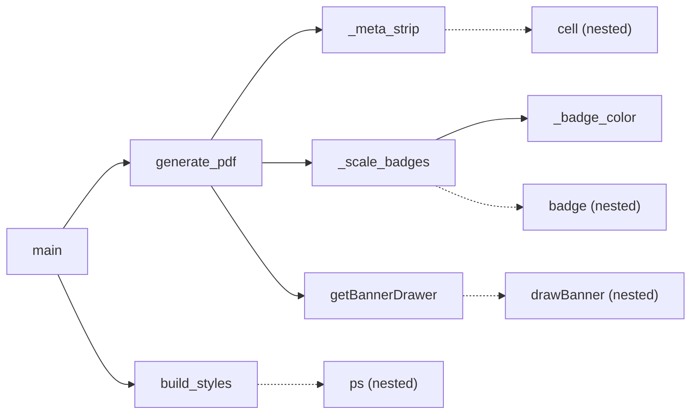

# `generate_mcex_reports.py`

> Standalone script that turns a scored Mini-CEX (mCEX) spreadsheet into one A4 PDF per student for DENT90148 Oral Medicine (OMed) History Taking, styled to match the University banner used elsewhere in the codebase.

| | |
|---|---|
| **Lines of code** | 277 |
| **Top-level functions** | 7 (`getBannerDrawer`, `build_styles`, `_badge_color`, `_meta_strip`, `_scale_badges`, `generate_pdf`, `main`) + 4 nested = 11 total |
| **Classes** | 0 |
| **Module constants** | 28 |
| **Imports from this codebase** | **none** — it deliberately re-implements the banner and palette instead of importing `Utils` / `variableUtils` (see [§5.1](#51-banner)) |
| **Imported by** | nothing. No module in `src/` imports it, and `main.ipynb` never imports it — see [§7](#7-gotchas-and-known-issues) |
| **Run how** | CLI script (`python generate_mcex_reports.py`); `if __name__ == "__main__": main()` at lines 276–277 |

## 1. Purpose and role in the pipeline

**Mini-CEX** (mini Clinical Evaluation Exercise) is a short observed clinical encounter scored against a checklist plus global scales. This module renders the *reporting* end of that workflow for one specific assessment: **DENT90148 Oral Medicine Clinical Examination — OMed History Taking Assessment** (the banner strings are hard-coded at lines 262–265).

Its input is a single Excel file of already-scored mCEX rows, one row per student (`EXCEL_PATH`, line 18). The module does **not** fetch from the DASH API or the warehouse; the scoring has already happened upstream. In `main.ipynb` there is a cell (notebook lines 2399–2440) that creates the mCEX view, computes `Score` and `%Score`, and writes `mcex/{cohort}/mcex {date} scores.xlsx` — the same filename shape as this module's `EXCEL_PATH` (`2026\mcex\DDS2\mcex apr 15 scores.xlsx`). That notebook cell is the de facto producer of this module's input, although nothing programmatically links them.

Each row is expected to carry: `studentname`, `assessorname` (with optional override `assessorname2`), `datetimeutc`, the global rating `GR` (1–5), practice readiness `PR` (1–4), `Score` (out of 18), `%Score`, free-text `comments`, an optional `Result`, and one column per checklist code `MC1`…`MC18` holding 0/1.

Output is one PDF per row, named `{sanitised studentname}.pdf`, into `OUT_DIR` (line 19). The page is built as: navy banner drawn on the canvas → three-cell navy metadata strip (student / assessor / date) → three coloured badges (global rating, practice readiness, score) → practice-readiness sentence → the 18-item OMed checklist with pass/fail marks and section headers → assessor comments → result.

The module is self-contained by design: the docstring at lines 1–4 states the banner "matches `getBannerDrawer()` in `Utils.py` (uniColor `#010d44`)", and the palette comment at line 22 says it "matches `variableUtils.py`" — but the values are copied in as local literals rather than imported.

## 2. External dependencies

| Library / resource | Used for |
|---|---|
| `os` | `os.makedirs(OUT_DIR, exist_ok=True)` at import time (line 20); `os.path.join` for output paths (line 273) |
| `re` | `re.sub(r'[^\w\s-]', '', ...)` filename sanitisation (line 272) |
| `pandas` (as `pd`) | `pd.read_excel` (line 269), `pd.notna` null checks, `pd.to_datetime` for the date string (line 209) |
| `reportlab.lib.pagesizes.A4` | Unpacked into `PAGE_W, PAGE_H` (line 40) and used as the doc page size |
| `reportlab.lib.colors` | `colors.HexColor(...)` palette, `colors.white`, `colors.grey` |
| `reportlab.lib.styles` | `getSampleStyleSheet`, `ParagraphStyle` |
| `reportlab.lib.units.inch` | Margin arithmetic (lines 41–42) |
| `reportlab.lib.enums` | `TA_LEFT`, `TA_CENTER`, `TA_JUSTIFY` alignments |
| `reportlab.platypus` | `SimpleDocTemplate`, `Paragraph`, `Spacer`, `HRFlowable`, `Table`, `TableStyle` |
| **Fonts** | Attempts `Calibri-Bold` and falls back to `Helvetica-Bold` (lines 93–97). Calibri is only available if registered elsewhere in the process — running this file alone always uses the fallback |
| **Filesystem** | Reads `EXCEL_PATH`; creates and writes PDFs into `OUT_DIR` |
| **Network / DB / env vars** | none |

## 3. Module-level constants and variables

### 3.1 Paths (lines 18–20)

| Name | Type | Value / shape | Purpose |
|---|---|---|---|
| `EXCEL_PATH` | `str` | `"2026\\mcex\\DDS2\\mcex apr 15 scores.xlsx"` | Scored mCEX spreadsheet, one row per student |
| `OUT_DIR` | `str` | `"2026\\mcex\\DDS2\\mcex_reports 2"` | Output folder; created at import time by line 20 |

### 3.2 Palette (lines 23–37)

| Name | Type | Value | Purpose |
|---|---|---|---|
| `UNI_COLOR` | `str` | `"#010d44"` | Local copy of `variableUtils.uniColor` — University navy |
| `TEXT_COLOR` | `str` | `"#4f5fb2"` | Local copy of the secondary text colour |
| `C_UNI` | `Color` | `HexColor(UNI_COLOR)` | Banner fill, metadata strip background, headings, final rule |
| `C_TEXT` | `Color` | `HexColor(TEXT_COLOR)` | **Unused** — defined at line 27, never referenced |
| `C_GREY` | `Color` | `#404040` | Practice-readiness sentence and comment text |
| `C_LBLUE` | `Color` | `#DEEAF1` | Thin separator rules |
| `C_GREEN` | `Color` | `#375623` | Dark green badge text |
| `C_RED` | `Color` | `#c00000` | Dark red badge text and failed-checklist rows |
| `C_AMBER` | `Color` | `#bf8f00` | Dark amber badge text |
| `C_GREEN_BG` | `Color` | `#E2EFDA` | Pastel green badge background |
| `C_RED_BG` | `Color` | `#FCE4D6` | Pastel red badge background |
| `C_AMBER_BG` | `Color` | `#FFF2CC` | Pastel amber badge background |

`C_RED` and `C_AMBER` are each **assigned twice** — lines 31/36 and 32/37 — with identical values. The second pair (lines 36–37) is a redundant re-assignment left over from an earlier "solid background, white text" design, as the trailing comments show.

### 3.3 Page geometry (lines 40–48)

| Name | Type | Value | Purpose |
|---|---|---|---|
| `PAGE_W`, `PAGE_H` | `float`, `float` | Unpacked from `A4` | Page dimensions used by the banner drawer |
| `LEFT_MARGIN`, `RIGHT_MARGIN` | `float` | `0.5 * inch` (= 36 pt) | Matches `variableUtils.leftMargin` per the inline comment |
| `TOP_MARGIN`, `BOTTOM_MARGIN` | `float` | `0.5 * inch` | Document margins |
| `CONTENT_W` | `float` | `PAGE_W - LEFT_MARGIN - RIGHT_MARGIN` | Comment records this as 523.3 pt; used to size the 3-column tables |
| `BANNER_H` | `int` | `110` | Height of the navy bar. **Differs from `Utils.py`'s 132** |
| `BANNER_TOP` | `float` | `PAGE_H - BANNER_H` | y-origin of the banner rectangle |
| `BANNER_SPACER` | `float` | `BANNER_H - TOP_MARGIN` (= 74 pt) | Leading `Spacer` that pushes the story below the banner, since the banner is drawn on the canvas and is invisible to the flowable layout |

### 3.4 Checklist and label maps (lines 51–82)

| Name | Type | Value / shape | Purpose |
|---|---|---|---|
| `CHECKLIST` | `list[tuple[str, str]]`, 18 items | `("MC1", "Introduces self and explains…")` … `("MC18", …)` | Ordered code → item text. Drives both the render order and the column lookup `row.get(code, 0)` |
| `SECTION_HEADERS` | `dict[str, str]`, 3 items | `{"MC1": "History Taking", "MC12": "Recount of History Items", "MC16": "Clinical Decision Making"}` | A section heading is emitted immediately *before* the item whose code is a key — splitting the 18 items into 3 blocks (MC1–11, MC12–15, MC16–18) |
| `GR_LABELS` | `dict[int, str]`, 5 items | `1: "Unsatisfactory" … 5: "Excellent"` | Global Rating (GR) wording under the first badge |
| `PR_LABELS` | `dict[int, str]`, 4 items | Level 1–4 supervision descriptions | Practice Readiness wording |

Representative entries:

```python
CHECKLIST = [
    ("MC1",  "Introduces self and explains purpose of consultation."),
    ("MC8",  "Severity: Uses a pain scale (e.g. 0-10) to gauge subjective intensity."),
    ("MC18", "Communicates a summary of relevant findings in technical terms."),
]
PR_LABELS = {
    1: "Level 1 - Not ready to practice in a clinical setting.",
    4: "Level 4 - Ready with indirect supervision.",
}
```

## 4. Classes

None.

## 5. Function reference

### 5.1 Banner

#### `getBannerDrawer(title, subtitle)`

*Lines 86–100.* Returns a ReportLab `onFirstPage` callback that paints the navy banner with two lines of white text.

**Parameters**

| Name | Type | Default | Description |
|---|---|---|---|
| `title` | `str` | — | First (larger) banner line |
| `subtitle` | `str` | — | Second (smaller) banner line |

**Returns** — a function `drawBanner(canvas, doc)` suitable for `SimpleDocTemplate.build(..., onFirstPage=...)`.

**Behaviour**

1. `canvas.saveState()`, fill `C_UNI`, draw a full-width rectangle from `BANNER_TOP` of height `BANNER_H` (lines 88–90).
2. Switch fill to white, set x to `LEFT_MARGIN`.
3. `try: canvas.setFont("Calibri-Bold", 22) except: canvas.setFont("Helvetica-Bold", 22)` then draw `title` at `PAGE_H - 48` (lines 93–95).
4. Same try/except at size 15, draw `subtitle` at `PAGE_H - 78` (lines 96–98).
5. `canvas.restoreState()`.

**Side effects** — draws directly onto the ReportLab canvas. Reads the module globals `C_UNI`, `BANNER_TOP`, `BANNER_H`, `PAGE_W`, `PAGE_H`, `LEFT_MARGIN`.

**Nested functions**

| Name | Signature | One line |
|---|---|---|
| `drawBanner` | `drawBanner(canvas, doc)` | Lines 87–99; the returned closure that paints the banner. `doc` is accepted but never used |

**Called by** — `generate_mcex_reports:generate_pdf` (line 262).

##### Comparison with `Utils.getBannerDrawer` — is it a duplicate?

**Yes, it is a near-duplicate re-implementation, but the two are not identical and are not interchangeable.** `Utils.py` lines 530–568 define a function of the same name and the same shape (`getBannerDrawer(firstline, secondline)` returning a `drawBanner(canvas, doc)` closure). Both fill a full-width rectangle at the top of the page in navy `#010d44`, both draw two left-aligned white text lines at `variableUtils.leftMargin` / `LEFT_MARGIN` (both 0.5 inch), and both wrap the Calibri font selection in a bare `try/except` with a Helvetica-Bold fallback. Differences:

| Aspect | `Utils.getBannerDrawer` (Utils.py 530–568) | `generate_mcex_reports.getBannerDrawer` (86–100) |
|---|---|---|
| Parameter names | `firstline`, `secondline` | `title`, `subtitle` |
| Docstring | Present (lines 531–537) | None |
| Page size | Read from `doc.pagesize` at draw time — works in landscape | Module globals `PAGE_W, PAGE_H` fixed to A4 portrait |
| Banner height | `bannerHeight = 132` (local variable) | `BANNER_H = 110` (module constant) |
| Colour source | `colors.HexColor(variableUtils.uniColor)` | `C_UNI`, from a locally re-declared `UNI_COLOR = "#010d44"` |
| Left margin source | `variableUtils.leftMargin` | Locally re-declared `LEFT_MARGIN = 0.5 * inch` |
| Font sizes | 30 then 24 | 22 then 15 |
| Text baselines | `pageHeight - 72` and `pageHeight - 72 - 36` (`topOffset`/`lineSpacing`) | `PAGE_H - 48` and `PAGE_H - 78` |
| Text interpolation | `f"{firstline}"` / `f"{secondline}"` | Raw `title` / `subtitle` |
| Fill-colour ordering | Sets white *after* selecting the first font (line 557) | Sets white *before* (line 91) — no visual difference |

Practical consequence: the two produce visibly different banners (110 pt vs 132 pt tall, noticeably smaller type here). The duplication exists so the script has no dependency on `Utils`/`variableUtils`; the cost is that a change to the University navy or to the shared banner geometry must be made in two places. Note also that in `main.ipynb` every `getBannerDrawer` call (notebook lines 2948, 3236, 3296, 3299) resolves to the **`Utils` version** via `from Utils import *` (notebook line 69) — not to this one.

### 5.2 Styles

#### `build_styles()`

*Lines 104–122.* Builds the dictionary of `ParagraphStyle`s used across the report.

**Parameters** — none. **Returns** — `dict[str, ParagraphStyle]` with 12 keys:

| Key | Font / size | Colour | Used for |
|---|---|---|---|
| `meta_label` | Helvetica-Bold 8, centred | `#aabbdd` | "STUDENT" / "ASSESSOR" / "DATE" captions |
| `meta_value` | Helvetica-Bold 12, centred | white | The metadata values |
| `badge_val` | Helvetica-Bold 26, centred | white (overridden per badge) | Large badge number |
| `badge_sub` | Helvetica 8, centred | white (overridden per badge) | Badge caption |
| `subheading` | Helvetica-Bold 14, centred | `C_UNI` | "OMed Checklist" |
| `subheading_l` | Helvetica-Bold 13, left | `C_UNI` | "Assessor Comments", "Result" |
| `cl_section` | Helvetica-Bold 10 | `C_UNI` | Checklist section headers |
| `cl_pass` | Helvetica 9, `leftIndent=8` | `#1a5c1a` | A passed checklist item |
| `cl_fail` | Helvetica 9, `leftIndent=8` | `C_RED` | A failed checklist item |
| `pr_desc` | Helvetica 9 | `C_GREY` | Practice-readiness sentence |
| `comment` | Helvetica-Oblique 10, `TA_JUSTIFY` | `C_GREY` | Assessor comments and result text |
| `footer` | Helvetica-Oblique 8, centred | grey | **Unused** — the only consumer is commented out at line 258 |

**Behaviour** — defines a one-line nested helper and calls it 12 times.

**Nested functions**

| Name | Signature | One line |
|---|---|---|
| `ps` | `ps(name, **kw)` | Lines 107–108; `s[name] = ParagraphStyle(name, parent=base["Normal"], **kw)` — every style inherits from `Normal` |

**Called by** — `generate_mcex_reports:main`.

### 5.3 Badge and strip builders

#### `_badge_color(val, max_val)`

*Lines 125–130.* Maps a value to a `(background, text)` colour pair. Docstring: *"Map a value to (bg_color, text_color) using original pastel backgrounds."*

**Parameters**

| Name | Type | Default | Description |
|---|---|---|---|
| `val` | numeric | — | The achieved value |
| `max_val` | numeric | — | The maximum; `0`/falsy forces `ratio = 0` |

**Returns** — `tuple[Color, Color]`.

**Behaviour** — `ratio = val / max_val if max_val else 0`; then `< 0.6` → red pair, `< 0.8` → amber pair, otherwise green pair. The 0.6/0.8 thresholds are inline magic numbers.

**Called by** — `generate_mcex_reports:_scale_badges` (twice directly plus once inline).

#### `_meta_strip(student, assessor, date_str, styles)`

*Lines 133–156.* Builds the three-cell navy metadata strip. Docstring: *"Three equal-width cells, navy background, matching banner colour."*

**Parameters**

| Name | Type | Default | Description |
|---|---|---|---|
| `student` | `str` | — | Student name |
| `assessor` | `str` | — | Assessor name (already resolved by the caller) |
| `date_str` | `str` | — | Pre-formatted date, may be `""` |
| `styles` | `dict` | — | Style dict from `build_styles()` |

**Returns** — a ReportLab `Table` flowable, one row of three `CONTENT_W / 3`-wide cells at a fixed 52 pt row height.

**Behaviour** — each cell is a two-`Paragraph` list (label above value); the `TableStyle` sets `C_UNI` background, middle/centre alignment, 8 pt vertical and 6 pt horizontal padding, and a 0.5 pt `#2a3a7a` `LINEAFTER` on the first two columns as a divider.

**Nested functions**

| Name | Signature | One line |
|---|---|---|
| `cell` | `cell(label, value)` | Lines 137–139; returns `[Paragraph(label, meta_label), Paragraph(value, meta_value)]` |

**Called by** — `generate_mcex_reports:generate_pdf`.

#### `_scale_badges(gr, pr, score, pct, styles)`

*Lines 159–197.* Builds the row of three coloured badges. Docstring: *"Three coloured badges — pastel backgrounds with matching dark text."*

**Parameters**

| Name | Type | Default | Description |
|---|---|---|---|
| `gr` | `int` | — | Global Rating, scored out of 5 |
| `pr` | `int` | — | Practice Readiness level, scored out of 4 |
| `score` | `int` | — | Checklist score, out of 18 |
| `pct` | `float` | — | Percentage score, rendered to 0 dp |
| `styles` | `dict` | — | Style dict from `build_styles()` |

**Returns** — a ReportLab `Table` flowable: one row, three equal columns.

**Behaviour**

1. `_badge_color(gr, 5)` and `_badge_color(score, 18)` produce the first and third colour pairs (lines 163–164). The middle badge calls `*_badge_color(pr, 4)` inline in the argument list (line 186).
2. The nested `badge` helper clones `badge_val`/`badge_sub` with the per-badge text colour so the same style dict can be reused across badges.
3. Captions are `f"Global Rating: {gr}/5 - {GR_LABELS.get(gr,'')}"`, `f"Practice Readiness: Level {pr}"`, and `f"{pct:.0f}%  Score"`; the third badge's big text is the hard-coded `f"{score}/18"` (lines 185–187).

**Nested functions**

| Name | Signature | One line |
|---|---|---|
| `badge` | `badge(big_text, small_text, bg, fg)` | Lines 166–182; a 2-row single-column `Table` with the given background and recoloured text styles |

**Calls** — `generate_mcex_reports:_badge_color`. **Called by** — `generate_mcex_reports:generate_pdf`.

### 5.4 Page assembly

#### `generate_pdf(row, styles, out_path)`

*Lines 200–265.* Builds and writes one student's mCEX PDF.

**Parameters**

| Name | Type | Default | Description |
|---|---|---|---|
| `row` | `pandas.Series` | — | One row of the scored spreadsheet |
| `styles` | `dict` | — | Style dict from `build_styles()` |
| `out_path` | `str` | — | Full path of the `.pdf` to write |

**Returns** — `None`; the effect is the written file.

**Behaviour**

1. Creates a `SimpleDocTemplate` on A4 with all four margins at `0.5 * inch` (lines 201–205).
2. **Assessor resolution** — uses `row["assessorname2"]` when `pd.notna(row.get("assessorname2"))`, else `row["assessorname"]` (line 207), i.e. `assessorname2` is a manual override column.
3. **Date** — when `datetimeutc` is present, formats as `f"{dt.day} {dt.strftime('%B %Y')}"` (e.g. "15 April 2026"); otherwise `""` (lines 208–212).
4. Coerces `GR`, `PR` to `int`, `%Score` to `float`, `Score` to `int` (lines 214–217). `comments` is stringified and stripped, defaulting to `""`; `Result` defaults to `""` (lines 218–219).
5. Starts the story with `Spacer(1, BANNER_SPACER)` to clear the canvas-drawn banner (line 222).
6. Appends `_meta_strip(...)`, then `_scale_badges(...)`, then a bold practice-readiness sentence from `PR_LABELS.get(pr, f'Level {pr}')`, then a `C_LBLUE` rule (lines 225–232).
7. **Checklist loop** (lines 236–242): for each `(code, label)` in `CHECKLIST`, first emits a section heading if `code in SECTION_HEADERS`; then reads `int(row.get(code, 0))`, choosing `cl_pass`/`cl_fail` style and the literal marker `"[Yes]"` / `"[No] "` (note the trailing space padding on `[No]`), and renders `f"{mark}  <b>{code}</b>  {label}"`.
8. Emits assessor comments in quotation marks only if non-empty (lines 248–250), then `Result` only if non-empty (lines 253–255), then a closing `C_UNI` rule.
9. `doc.build(story, onFirstPage=getBannerDrawer("DENT90148 Oral Medicine Clinical Examination", f"OMed History Taking Assessment"))` (lines 262–265). Both banner strings are hard-coded; the second uses an f-string with no placeholders.

**Side effects** — **writes a PDF file** at `out_path`. Reads module globals `CHECKLIST`, `SECTION_HEADERS`, `PR_LABELS`, `C_LBLUE`, `C_UNI`, `BANNER_SPACER`, and the margin constants.

**Calls** — `generate_mcex_reports:_meta_strip`, `generate_mcex_reports:_scale_badges`, `generate_mcex_reports:getBannerDrawer`. **Called by** — `generate_mcex_reports:main`.

### 5.5 Entry point

#### `main()`

*Lines 268–274.* Reads the spreadsheet and emits one PDF per row.

**Parameters** — none. **Returns** — `None`.

**Behaviour**

1. `df = pd.read_excel(EXCEL_PATH)` (line 269) — no `dtype` coercion, no sheet name, no deduplication.
2. `styles = build_styles()` once (line 270).
3. For every row: `name_clean = re.sub(r'[^\w\s-]', '', str(row["studentname"])).strip()` and `generate_pdf(row, styles, os.path.join(OUT_DIR, f"{name_clean}.pdf"))` (lines 271–273). Unlike `generate_reports.py`, spaces are **not** replaced with underscores and no student identifier is appended.
4. Prints `f"Done - {len(df)} PDFs written to: {OUT_DIR}"` (line 274).

**Side effects** — reads `EXCEL_PATH`; writes `len(df)` PDFs into `OUT_DIR`; prints to stdout. Depends on the module globals `EXCEL_PATH` and `OUT_DIR`.

**Calls** — `generate_mcex_reports:build_styles`, `generate_mcex_reports:generate_pdf`. **Called by** — nothing; only the `__main__` guard at line 277.

**Example** — no real call site exists in `main_notebook_code.py` (see §7).

## 6. Call graph (this module)



## 7. Gotchas and known issues

- **Not a notebook module, despite the facts file.** `notebook_entry_points` lists `main` (×10) and `getBannerDrawer` (×4). Both are **name collisions**: `main_notebook_code.py` has no `import generate_mcex_reports`, its `main()` calls (notebook lines 176, 1408, 1970, 2112, 2440) are to notebook-local functions, and its four `getBannerDrawer` calls (notebook lines 2948, 3236, 3296, 3299) resolve to `Utils.getBannerDrawer` via `from Utils import *` at notebook line 69.
- **`getBannerDrawer` duplicates `Utils.getBannerDrawer`** (Utils.py 530–568) with different geometry — 110 pt vs 132 pt banner, 22/15 pt vs 30/24 pt fonts, hard-coded A4 vs `doc.pagesize`. The navy `#010d44` and the 0.5-inch left margin are copied literals rather than references to `variableUtils`, so a palette change in `variableUtils.py` will silently not reach this file. Full comparison in §5.1.
- **`C_RED` and `C_AMBER` are defined twice** (lines 31/36 and 32/37) with the same values; the trailing comments describe a "solid, white text readable" design that no longer applies. Harmless today, but confusing and a trap if someone edits only the first definition.
- **Import-time `os.makedirs`** at line 20 — importing the module creates the output directory tree relative to the CWD.
- **Windows-style relative paths** at lines 18–19 (`"2026\\mcex\\DDS2\\..."`) will not resolve on Linux/macOS.
- **Hard-coded denominators.** `18` appears both as the `_badge_color(score, 18)` max (line 164) and as the literal `f"{score}/18"` (line 187), and must stay in sync with `len(CHECKLIST)`. Likewise `5` for GR and `4` for PR.
- **Bare `except:` around font selection** (lines 93–97). This swallows *any* exception, not just a missing font, and would mask e.g. a `KeyboardInterrupt` during rendering.
- **Missing/blank checklist values are scored as fail.** `int(row.get(code, 0))` (line 239) treats an absent column as 0; a `NaN` value raises `ValueError` instead. There is no distinction between "not assessed" and "not done".
- **Filename collisions.** `main()` names files purely from the sanitised student name (lines 272–273). Two students with the same name, or one student with two mCEX rows in the same spreadsheet, silently overwrite each other — the printed count `len(df)` will then over-report the number of files.
- **No deduplication or validation of the input.** Every row is rendered; there is no best-attempt logic (contrast `generate_reports.py`), no schema check, and no try/except, so one malformed row aborts the run part-way.
- **Dead code.** `C_TEXT` (line 27) is never used; the `footer` style (line 121) has no live consumer because its only use is commented out at line 258; lines 258–260 are commented-out remnants including a duplicated "add result" note.
- **`f"OMed History Taking Assessment"`** at line 264 is an f-string with no interpolation — harmless, but a sign the subtitle was once dynamic.
