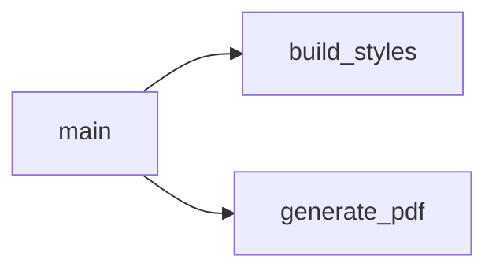

# `generate_reports.py`

> Standalone script that turns a Canvas quiz export for DENT90112 Class Test 1 (Cariology) into one A4 PDF feedback report per student, with the student's per-question result set against the class % correct.

| | |
|---|---|
| **Lines of code** | 367 |
| **Top-level functions** | 3 (`build_styles`, `generate_pdf`, `main`) |
| **Classes** | 0 |
| **Module constants** | 10 |
| **Imports from this codebase** | none (only `os`, `re`, `pandas`, `reportlab`) |
| **Imported by** | nothing. No module in `src/` imports it, and `main.ipynb` never imports it — see [§7](#7-gotchas-and-known-issues) |
| **Run how** | CLI script (`python generate_reports.py`); the `if __name__ == "__main__": main()` guard is at lines 366–367 |

## 1. Purpose and role in the pipeline

This module sits **outside** the main DASH assessment pipeline. Unlike the `boh*`/`dds*` utility modules, it does not touch the Postgres warehouse, the `rawform_forms_v3` tables or the DASH API. Its single input is a **Canvas quiz export** — an `.xlsx` produced by the Canvas LMS "Student Analysis" download for one quiz — and its single output is a directory of per-student PDFs.

The subject is fixed: DENT90112 *Plaque Related Diseases*, **Class Test 1 – Cariology**, a 20-question MCQ test. The 20 explanatory paragraphs shown to students are hard-coded in the module as `FEEDBACK` (lines 40–165); the file's own comment records that they were "copied from the Word template" (line 39). The module therefore encodes the content of one specific assessment in one specific teaching period, not a reusable feedback engine.

The processing is small and self-contained. `main()` (lines 313–363) reads the Excel export with no header row, applies its own 52-name column schema, coerces the score columns to numeric, resolves multiple attempts down to one **best attempt** per student (highest `total_score`, ties broken by highest `attempt`), then derives two class statistics from those best attempts only: an overall class average percentage and a per-question percentage-correct vector. Those two figures are the only cohort context that appears in a student's report.

`build_styles()` (lines 179–235) constructs the ReportLab `ParagraphStyle` dictionary once, and `generate_pdf()` (lines 238–309) assembles and writes one PDF per row of the best-attempt frame. Report authorship is hard-coded in the closing block (line 307).

There is no database, no network access and no environment variable use anywhere in the module. The only external state is the two path constants at lines 34–35.

## 2. External dependencies

| Library / resource | Used for |
|---|---|
| `os` | `os.makedirs(OUT_DIR, exist_ok=True)` at import time (line 36); `os.path.join` for output filenames (line 359) |
| `re` | `re.sub(r'[^\w\s-]', '', ...)` to sanitise the student name into a filename (line 358) |
| `pandas` (as `pd`) | `pd.read_excel` (line 315), `pd.to_numeric` coercion (line 334), sorting/deduplication/aggregation (lines 337–348) |
| `reportlab.lib.pagesizes.A4` | Page size for every report (line 243) |
| `reportlab.lib.colors` | `colors.HexColor(...)` for the palette constants (lines 170–176) |
| `reportlab.lib.styles` | `getSampleStyleSheet`, `ParagraphStyle` — style construction in `build_styles()` |
| `reportlab.lib.units.cm` | Page margins (lines 245–246) |
| `reportlab.lib.enums` | `TA_JUSTIFY` for the body style (line 202). `TA_LEFT` is imported (line 28) but never used |
| `reportlab.platypus` | `SimpleDocTemplate`, `Paragraph`, `HRFlowable`, `KeepTogether` for the flowable story. `Spacer` is imported (line 30) but never used |
| **Filesystem** | Reads `EXCEL_PATH`; creates `OUT_DIR` and writes one `.pdf` per student into it |
| **Network / DB** | none |
| **Environment variables** | none |

## 3. Module-level constants and variables

### Paths (lines 34–36)

| Name | Type | Value / shape | Purpose |
|---|---|---|---|
| `EXCEL_PATH` | `str` (raw literal) | `r"2026\Extra\dds1 test feedback\Class Test 1_ Cariology_DENT90112.xlsx"` | Canvas quiz export read by `main()`. Relative path with Windows separators |
| `OUT_DIR` | `str` (raw literal) | `r"2026\Extra\dds1 test feedback\student_reports"` | Destination folder for the generated PDFs |

`os.makedirs(OUT_DIR, exist_ok=True)` is executed at line 36 — i.e. **at import time**, before any function is called.

### Feedback text (lines 40–167)

| Name | Type | Value / shape | Purpose |
|---|---|---|---|
| `FEEDBACK` | `list[str]`, length 20 | 20 explanation paragraphs, one per question, in Q1–Q20 order (≈6.4 kB of text) | The explanatory paragraph printed under each question header in every student's PDF. Indexed positionally as `FEEDBACK[q]` at line 297 |

Entries are plain strings that may contain ReportLab inline markup — species names are italicised with `<i>…</i>` tags, e.g.:

```python
# Q5
"This question was about glucosyltransferase enzymes, one of the major virulence "
"factors of <i>Streptococcus mutans</i>. To answer this question correctly you needed "
"to recognise that these enzymes produce extracellular polysaccharides from sucrose.",

# Q13
"This question tested your understanding of the composition of the dental hard tissues "
"in terms of organic, inorganic and water composition.",
```

Line 167 asserts the invariant at import time:

```python
assert len(FEEDBACK) == 20, "Must have exactly 20 feedback entries"
```

### Colour palette (lines 170–176)

All are `reportlab.lib.colors.Color` objects built by `colors.HexColor`.

| Name | Type | Value | Purpose |
|---|---|---|---|
| `DARK_BLUE` | `Color` | `#1F3864` | Title, salutation, score label text; the 2 pt rule under the header (line 256) |
| `MID_BLUE` | `Color` | `#2E75B6` | Subtitle and the large score value; also hard-coded again as a literal inside the question-header markup (line 292) |
| `LIGHT_BLUE` | `Color` | `#DEEAF1` | Thin horizontal rules around the score box and closing block |
| `GREEN` | `Color` | `#375623` | Text colour of a **Correct** question header |
| `RED` | `Color` | `#C00000` | Text colour of an **Incorrect** question header |
| `GREY_TEXT` | `Color` | `#404040` | Body, per-question feedback and closing text |
| `LIGHT_GREY` | `Color` | `#F2F2F2` | **Unused** — defined at line 176 but never referenced |

## 4. Classes

None. The module defines no classes.

## 5. Function reference

The file is organised by its own banner comments: paths, feedback text, palette, then style construction, PDF construction and `main`.

### 5.1 Style construction

#### `build_styles()`

*Lines 179–235.* Builds and returns the dictionary of ReportLab paragraph styles used by `generate_pdf`.

**Parameters** — none.

**Returns** — `dict[str, ParagraphStyle]` with exactly these 10 keys:

| Key | Font / size | Colour | Used for |
|---|---|---|---|
| `title` | Helvetica-Bold 14 | `DARK_BLUE` | "DENT90112 Plaque Related Diseases" |
| `subtitle` | Helvetica 10 | `MID_BLUE` | "Class Test 1 – Cariology: Individual Feedback Report" |
| `salutation` | Helvetica-Bold 11 | `DARK_BLUE` | "Dear \<first name\>," |
| `body` | Helvetica 10, leading 15, `TA_JUSTIFY` | `GREY_TEXT` | Intro paragraphs and the signature line |
| `score_label` | Helvetica-Bold 11 | `DARK_BLUE` | "Your Class Test 1 score:" |
| `score_value` | Helvetica-Bold 20 | `MID_BLUE` | The large "N / 20" |
| `q_header_correct` | Helvetica-Bold 10 | `GREEN` | Question header when the student scored 1 |
| `q_header_incorrect` | Helvetica-Bold 10 | `RED` | Question header when the student scored 0 |
| `q_feedback` | Helvetica 9, leading 13, `leftIndent=12` | `GREY_TEXT` | The `FEEDBACK[q]` paragraph |
| `closing` | Helvetica-Oblique 10 | `GREY_TEXT` | "We hope you found this feedback useful…" |

**Behaviour**

1. Calls `getSampleStyleSheet()` once and uses `base["Normal"]` as the parent of every style (lines 180, 184 onwards).
2. Populates a plain `dict` — not a ReportLab `StyleSheet1` — so styles are looked up as `styles["body"]`, never by ReportLab name resolution.

**Side effects** — none. Depends on the module-level palette constants.

**Calls** — `getSampleStyleSheet`, `ParagraphStyle` (library only; no intra-module calls). **Called by** — `generate_reports:main` (twice, see §7).

### 5.2 PDF construction

#### `generate_pdf(student_row, class_avg_pct: float, class_pct: list[float], styles: dict, out_path: str)`

*Lines 238–309.* Builds one student's PDF report. Docstring: *"Build one student's PDF report."*

**Parameters**

| Name | Type | Default | Description |
|---|---|---|---|
| `student_row` | `pandas.Series` (a row of the best-attempt frame) | — | Must expose `name`, `total_score` and `q1_score` … `q20_score` |
| `class_avg_pct` | `float` | — | Class average as a percentage; printed to 0 dp in the salutation paragraph |
| `class_pct` | `list[float]` | — | 20 per-question class percentages, indexed positionally |
| `styles` | `dict` | — | The dict returned by `build_styles()` |
| `out_path` | `str` | — | Full path of the `.pdf` to write |

**Returns** — `None`. The result is the file written at `out_path`.

**Behaviour**

1. Creates a `SimpleDocTemplate` on A4 with 2 cm top/bottom and 2.5 cm left/right margins (lines 241–246).
2. Derives `first_name` as the first whitespace-delimited token of `student_row["name"]` (line 248) and casts `total_score` to `int` (line 249).
3. Header block: fixed title and subtitle paragraphs plus a 2 pt `DARK_BLUE` rule (lines 254–256).
4. Salutation and two fixed body paragraphs; the class average is interpolated as `{class_avg_pct:.0f}%` in bold (lines 259–269).
5. Score box: the literal string `f"{total_score} / 20"` — the denominator 20 is hard-coded (line 273).
6. Loops `q` over `range(20)` (line 284). For each question it reads `student_row[f"q{q+1}_score"]`, coerces to `int`, and treats **1 as Correct and anything else as Incorrect** (line 287). The header style is chosen on the same test (line 288).
7. The question header interpolates the class percentage inside a `<font color='#2E75B6'>` tag — a hard-coded hex duplicate of `MID_BLUE` (lines 290–293).
8. Header + `FEEDBACK[q]` are wrapped in a `KeepTogether` so a question and its explanation never split across a page (lines 295–299).
9. Closing rule, italic closing line, and a bold hard-coded signature `"Samantha Byrne and James Fernando"` (lines 302–307).
10. `doc.build(story)` writes the file (line 309).

**Side effects** — **writes a PDF file** to `out_path`. Reads the module-level `FEEDBACK` list and the palette constants (`DARK_BLUE`, `LIGHT_BLUE`) directly rather than receiving them as arguments.

**Calls** — library only (`SimpleDocTemplate`, `Paragraph`, `HRFlowable`, `KeepTogether`, `doc.build`); no intra-module calls. **Called by** — `generate_reports:main`.

### 5.3 Entry point

#### `main()`

*Lines 313–363.* Loads the Canvas export, reduces it to best attempts, computes class statistics and writes one PDF per student.

**Parameters** — none. **Returns** — `None`.

**Behaviour**

1. **Load** — `pd.read_excel(EXCEL_PATH, header=None)` (line 315). Row 0 is captured into `header` (line 316, never used) and dropped; the remainder is re-indexed (line 317).
2. **Local magic numbers** — `N_QUESTIONS = 20` (line 319) and `META = 8` with the comment "first 8 cols are metadata" (line 320). `META` is never referenced afterwards.
3. **Rename columns** — builds a 52-element name list and assigns it wholesale to `df.columns` (lines 323–330): 8 metadata columns (`name`, `id`, `sis_id`, `section`, `section_id`, `section_sis_id`, `submitted`, `attempt`), then for each of 20 questions an `q{i}_ans` / `q{i}_score` pair (40 columns), then 4 trailing summary columns (`n_correct`, `n_incorrect`, `total_score`, `%_score`). The export must have exactly this shape and order.
4. **Coerce numerics** — `pd.to_numeric(..., errors="coerce")` over `attempt`, `total_score`, `%_score` and the 20 `q*_score` columns (lines 333–334). Non-numeric cells silently become `NaN`.
5. **Best attempt** — sorts by `["total_score", "attempt"]` both descending, then `drop_duplicates(subset=["id"])` keeps the first row per student, i.e. highest score with the highest attempt number as tie-break (lines 337–341). This matches the module docstring.
6. **Class statistics** — `class_avg_pct = best["total_score"].mean() / 20 * 100` (line 344); `class_pct[q] = best[f"q{q+1}_score"].mean() * 100` (lines 345–348). The second only yields a "% correct" because each question score is 0 or 1.
7. **Styles** — `build_styles()` is called at line 351 into `styles` (never used) and again at line 354 into `styles_built` (the one actually passed on).
8. **Emit** — iterates `best.iterrows()`; the filename is `f"{name_clean} ({ssid}) Feedback.pdf"` where `name_clean` strips every character that is not word/whitespace/hyphen and replaces spaces with underscores (lines 356–360).
9. Prints `f"Done — {generated} PDFs written to: {OUT_DIR}"` (line 363).

**Side effects** — reads `EXCEL_PATH`; writes N PDFs into `OUT_DIR`; prints a completion line to stdout. Depends on the module globals `EXCEL_PATH` and `OUT_DIR`.

**Calls** — `generate_reports:build_styles`, `generate_reports:generate_pdf`, plus `pd.read_excel`, `pd.to_numeric`, `re.sub`, `os.path.join`. **Called by** — nothing in the codebase; only the `__main__` guard at line 367.

**Example** — no real call site exists. `main_notebook_code.py` contains no `import generate_reports`; its `main()` calls (notebook lines 176, 1408, 1970, 2112, 2440) all refer to `main` functions defined inside the notebook itself.

## 6. Call graph (this module)



`build_styles` and `generate_pdf` make no intra-module calls; every other call in the file is into `pandas` or `reportlab`.

## 7. Gotchas and known issues

- **Not a notebook module.** The machine-parsed `notebook_entry_points` claims `main` is called from `main.ipynb` 10 times. This is a **name collision, not a real edge**: `main_notebook_code.py` has no `import generate_reports`, and each of its `main()` call sites (notebook lines 176, 1408, 1970, 2112, 2440) invokes a `main` defined in the same notebook cell. Treat this file as a standalone script.
- **Import-time side effects.** `os.makedirs(OUT_DIR, exist_ok=True)` runs at line 36 and `assert len(FEEDBACK) == 20` at line 167 on *import*, not on `main()`. Merely importing the module creates a directory tree under the current working directory.
- **Windows-only relative paths.** `EXCEL_PATH` and `OUT_DIR` (lines 34–35) use backslash separators and are relative to the CWD. On Linux/macOS the backslashes are part of the filename, so `read_excel` fails and `makedirs` creates a single oddly named directory.
- **`build_styles()` is called twice.** Line 351 assigns to `styles`, line 354 assigns to `styles_built`; only `styles_built` is passed to `generate_pdf` (line 360). Line 351 is dead work.
- **Dead code.** `header` (line 316) is computed and never read; `META = 8` (line 320) is never used; `LIGHT_GREY` (line 176) is never used; `TA_LEFT` (line 28) and `Spacer` (line 30) are imported but never used.
- **Rigid column contract.** The wholesale `df.columns = col_names` assignment (line 330) requires the Canvas export to have exactly 52 columns in exactly that order. A changed Canvas export layout raises `ValueError: Length mismatch` rather than a useful message.
- **Hard-coded denominators and content.** `/ 20` appears at line 344 and the literal `"/ 20"` at line 273; `range(20)` at line 284 and `N_QUESTIONS = 20` at line 319 must all agree with `len(FEEDBACK)`. Re-using the script for a different test means editing the source in at least five places.
- **Hard-coded authorship and course text.** The signature "Samantha Byrne and James Fernando" (line 307) and every header/body string (lines 254–281) are literals inside `generate_pdf`.
- **Duplicated colour literal.** `#2E75B6` is both `MID_BLUE` (line 171) and an inline `<font color='...'>` string (line 292); changing the palette constant alone will not change the question headers.
- **Silent numeric coercion.** `errors="coerce"` (line 334) turns malformed scores into `NaN`. A `NaN` `total_score` sorts last but is still emitted, and `int(student_row["total_score"])` at line 249 will then raise `ValueError` mid-run, after some PDFs have already been written.
- **Filename collisions.** Output names combine the sanitised student name with `sis_id` (line 359). If `sis_id` is missing/`NaN` for two students with the same name, one PDF silently overwrites the other.
- **Partial-failure behaviour.** There is no try/except anywhere; a single bad row aborts the run, leaving `OUT_DIR` in a partially populated state with no record of which students were done.
