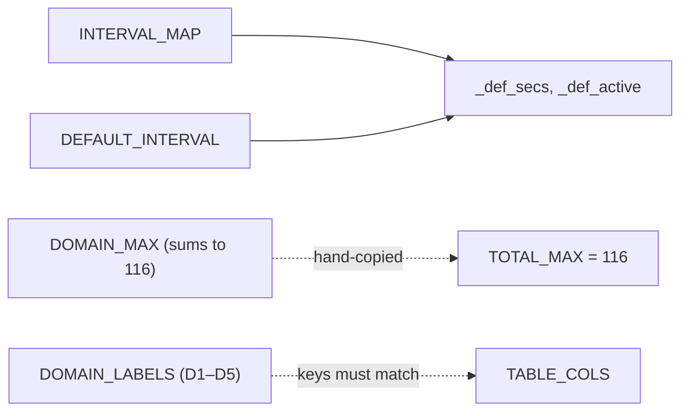

# `gradio_utils.py`

> Pure configuration module: every constant (API endpoint, colour palette, scoring
> map, table column layout, auto-refresh intervals, sort options) used by the DDS4
> viva Gradio dashboard, extracted out of `viva_gradio.py` to keep that file shorter.

| | |
|---|---|
| **Lines of code** | 130 |
| **Top-level functions** | 0 |
| **Classes** | 0 |
| **Module constants** | 34 named assignments (+ the `_def_secs, _def_active` tuple unpack on line 114, giving 36 module-level names in total) |
| **Imports from this codebase** | none (the module imports nothing at all — not even stdlib) |
| **Imported by** | `viva_gradio.py` only (`from gradio_utils import *`, line 21, plus an explicit underscore import on line 22). **Not** imported by `main.ipynb`, and **not** used by `scbd_gradio.py`, which keeps its own duplicated copies of several of these constants. |
| **Run how** | Never run directly. Imported at process start by the Gradio app (`python viva_gradio.py`). |

## 1. Purpose and role in the pipeline

`gradio_utils.py` is the settings file for the **DASH Viva Exam Live Monitor** — the
Gradio web dashboard that polls the DASH assessment API and renders DDS4 viva
(oral examination) records as a live HTML table. It contains no logic: it is a flat
list of module-level assignments, consumed exclusively by `viva_gradio.py`.

It sits entirely outside the report/PDF generation pipeline that the rest of the
codebase (`main.ipynb`, `Utils`, `boh3_dds4_utils`, …) implements. Nothing here
touches the database, the filesystem, or pandas. It consumes nothing and produces
nothing at runtime — it is read once, at import time, and its values are then
interpolated into HTML/CSS strings, used as lookup tables during parsing and
scoring, and used as `gr.*` widget defaults.

The constants fall into six groups, matching the `# ── … ──` banner comments in the
source:

1. **API / data selection** (lines 3–14): where to fetch from, which *cohort*
   (a year-level student group, e.g. DDS4 = 4th-year Doctor of Dental Surgery) to
   fetch, which test students to drop, and the display order of the five DDS4 viva
   *domains* (the rubric sections a viva is marked against).
2. **Colour palette** (lines 15–30): navy/purple brand colours, *GR* (Global Rating,
   the assessor's overall 1–5 judgement) colour ramp, cohort badge colours, and
   colours for *MC* responses (the multiple-choice checklist items inside each
   domain).
3. **Scoring** (lines 33–64): the MC-label → integer map, official per-domain maxima,
   and the derived total.
4. **Export** (lines 67–71): the column list for the plain XLSX summary export.
5. **UI / layout** (lines 73–103): sizes, heights, font sizes, and the per-column
   show/width table.
6. **Auto-refresh and sort** (lines 106–129): the refresh-interval dropdown map, the
   sort dropdown map, and two private strings/lists used by the stat-card row.

Because `viva_gradio.py` uses `from gradio_utils import *`, every non-underscore name
below lands in the app's global namespace. Names beginning with `_` (`_WRAP`,
`_CARD_LABELS`, `_def_secs`, `_def_active`) are **skipped by the star import** — this
is why `viva_gradio.py` line 22 has a second, explicit
`from gradio_utils import _WRAP, _CARD_LABELS, _def_active, _def_secs`. Renaming any
of those four requires editing that line too.

## 2. External dependencies

| Library / resource | Used for |
|---|---|
| *(none)* | The module has no `import` statements and calls only the builtin `set()` (line 5). It has no side effects, no I/O, no network and no environment-variable reads. |

Resources *described* by the constants but accessed elsewhere:

| Resource | Constant | Accessed in |
|---|---|---|
| DASH REST API host | `API_BASE` | `viva_gradio.fetch_all()` (line 48) |
| Assessment type path segment | `ASSESS_TYPE` | `viva_gradio.fetch_all()` (line 48) |

Note that the API **token** is *not* here — it is read from `.env` as `DASH_TOKEN`
inside `viva_gradio.py` (line 25).

## 3. Module-level constants and variables

Every module-level assignment in source order. "Consumed at" line numbers refer to
`/home/claude/docgen/src/viva_gradio.py` unless stated otherwise.

### 3.1 API and data selection (lines 3–14)

| Name | Type | Value / shape | Purpose |
|---|---|---|---|
| `API_BASE` | `str` | `"https://api.unimelb-dash.com"` | Base URL of the DASH assessment API. Consumed at line 48 to build `f"{API_BASE}/assessment/{ASSESS_TYPE}/get?{params}"`. Requests are authenticated with a Django REST Framework token header (`Authorization: Token <token>`), built in `fetch_all()`. |
| `ASSESS_TYPE` | `str` | `"viva"` | Path segment selecting the assessment type. Consumed at line 48 only. Changing it to another assessment type would repoint the whole dashboard, but the parsing code is DDS4-viva specific, so it is effectively fixed. |
| `EXCLUDE` | `set[str]` (3 items) | `set(['kunal patel', 'suhrid gupta', 'test student'])` | Lower-cased names of test/dummy students to drop. Consumed at line 133: `if not student or student.lower() in EXCLUDE: continue` in `parse_records()`. Matching is exact and case-folded — a record with trailing punctuation or a middle name will not be excluded. The inline comment notes "empty = include all". |
| `ALL_COHORTS` | `list[str]` (3 items) | `["DDS2", "DDS3", "DDS4"]` | Choice list for the Cohorts `gr.CheckboxGroup` (line 1004). Note the widget's *default* value is hard-coded separately as `["DDS3", "DDS4", "DDS2"]` at line 1004, not derived from this list. |
| `DOMAIN_ORDER` | `list[str]` (5 items) | `["DDS4-1", …, "DDS4-5"]` | The canonical display order of the five DDS4 viva rubric domains. The source comment stresses that the parser *discovers* domains dynamically, so this list "only drives display ordering". It is the most widely used constant in the app — consumed at lines 88 (building `<domain>_comments` keys), 164 (per-domain scoring loop), 343 (full-form modal domain sections), 634 and 657 (table header and body domain columns), 764, 813 and 841 (detailed XLSX: MC key discovery, domain blocks, per-domain comment columns). |
| `MAX_ROWS` | `int` | `500` | Hard cap on rows *rendered* in the HTML table. Consumed at lines 646 (`display = rows[:MAX_ROWS]`), 678 and 681 (the "Showing 500 of N records — use search to narrow down" footer row). It does **not** cap exports, which write every filtered row. |

### 3.2 Colours (lines 15–30)

| Name | Type | Value / shape | Purpose |
|---|---|---|---|
| `NAVY` | `str` | `"#010d44"` | DASH brand navy. Consumed at line 531 (comment-label colour in `comments_cell()`) and line 960 (the `#dash-header` CSS rule). The same literal `#010d44` is *also* hard-coded, not referenced via `NAVY`, at lines 329, 361, 486 and 573, and as `"010D44"` (openpyxl hex, no `#`) at line 786. |
| `PURPLE` | `str` | `"#4f5fb2"` | **Never referenced.** The identical literal `"#4f5fb2"` is hard-coded at line 282 as the "Avg global rating" stat-card colour. |
| `GR_COLORS` | `list[str]` (6 items) | `["", "#ef4444", "#f97316", "#eab308", "#22c55e", "#10b981"]` | Global-Rating colour ramp, **1-indexed**: index 0 is a deliberately empty placeholder so `GR_COLORS[gr_int]` works directly for GR 1–5 (red → orange → yellow → green → emerald). Consumed at line 326 (`build_form_html`) and line 503 (`gr_badge`); both guard with `1 <= gi <= 5`. |
| `COHORT_COLORS` | `dict[str, str]` (7 entries) | cohort code → hex | Badge colour per cohort. Consumed at line 510 in `cohort_badge()`, with fallback `"#64748b"`. Covers `DDS1`–`DDS4` and `BOH1`–`BOH3` (BOH = Bachelor of Oral Health), i.e. more cohorts than `ALL_COHORTS` offers. |
| `MC_COLORS` | `dict[str, str]` (5 entries) | MC response label → hex | Colour for each multiple-choice checklist response in the full-form modal. Consumed at line 371 in `build_form_html()`, fallback `"#64748b"`. Note it has **no** entries for the `"Yes"`/`"No"` responses that `MC_SCORE` scores, so Yes/No items render in the grey fallback colour. |

```python
COHORT_COLORS = {"DDS1": "#818cf8", "DDS2": "#a78bfa", …, "BOH3": "#2dd4bf"}
MC_COLORS     = {"Done well": "#15803d",   # green
                 "Done": "#2563eb",        # blue
                 "Not done": "#dc2626"}    # red
```

### 3.3 Scoring and labels (lines 33–71)

| Name | Type | Value / shape | Purpose |
|---|---|---|---|
| `MC_SCORE` | `dict[str, int]` (7 entries) | response label → 0–4 | The scoring rubric: `Done well`=4, `Done`=3, `Mostly done`=2, `Sometimes done`=1, `Not done`=0, plus binary `Yes`=1 / `No`=0. The comment says "equal weighting per criterion". Consumed at line 111 in `_domain_score()` (`sum(MC_SCORE.get(v, 0) …)`, so any unrecognised label silently scores 0) and at line 820 in the detailed XLSX export, where the label is replaced by its numeric score in the cell. |
| `DOMAIN_LABELS` | `dict[str, str]` (5 entries) | `"DDS4-1"` → `"D1"`, … `"DDS4-5"` → `"D5"` | Short column headings for the table. Consumed at lines 245–246 (`make_df()`, reverse-mapped `D1…D5` back to domain keys via `next(…)`), 635 and 658 (table header / body), 842 (per-domain comment column names in the detailed export). |
| `GR_LABELS` | `dict[int, str]` (5 entries) | `1: "Unsatisfactory"`, `2: "Borderline"`, `3: "Satisfactory"`, `4: "Good"`, `5: "Excellent"` | Word form of the Global Rating. Consumed at line 185 to populate the `GR_label` row key, which is displayed in the full-form modal (lines 336 and 425). Keys are `int`, and `parse_records()` coerces `gr_int` to `int` before lookup. |
| `DOMAIN_MAX` | `dict[str, int]` (5 entries) | `{"DDS4-1": 16, "DDS4-2": 19, "DDS4-3": 34, "DDS4-4": 31, "DDS4-5": 16}` | Official maximum score per domain. The comment explains why these are not simply `4 × n_items`: "not all items go to 4; some cap at 3 or less". Consumed at line 112 in `_domain_score()` — with fallback `len(items) * 4` for any domain not listed — and at line 824 to label the detailed-export column `Score /<max>`. |
| `EXPORT_COLUMNS` | `list[str]` (14 items, built by `+` of three list literals) | `["Date","Student","Assessor","Cohort","Subject","GR"] + ["D1"…"D5"] + ["Overall","Submitted","Comments"]` | Column order for the **plain summary** XLSX export. Consumed throughout `make_df()` (lines 236, 237, 239, 244, 254). The comment notes "table view uses a wider set rendered in HTML" — the on-screen table is driven by `TABLE_COLS`, not this list, so the two can drift. |
| `TOTAL_MAX` | `int` | `116` | Sum of the five `DOMAIN_MAX` values (16+19+34+31+16 = 116), used as the denominator for the overall-percentage colouring. Consumed at lines 613 and 618 (`overall_cell()` colour thresholds and the `/116` suffix), 637 (the `Total` header tooltip) , 833 (`Overall /116` export column label) and 925 (that column's width rule). It is **hard-coded, not computed** from `DOMAIN_MAX`, so editing a domain maximum silently desynchronises it. |

### 3.4 UI / layout (lines 73–82)

| Name | Type | Value / shape | Purpose |
|---|---|---|---|
| `DASH_MAX_WIDTH` | `str` (CSS length) | `"1800px"` | `max-width` of `.gradio-container`. Interpolated into the `css` f-string at line 950, which is passed to `demo.launch(css=css)` (line 1070). |
| `TABLE_MAX_HEIGHT` | `str` | `"600px"` | `max-height` of the scrollable table wrapper `<div>`; line 686. |
| `TABLE_FONT_SIZE` | `str` | `"12px"` | Font size shared by the table's `TH` and `TD` style strings; lines 487–488. |
| `CHART_FIGSIZE` | `tuple[int, float]` | `(18, 3.8)` | Documented as "matplotlib figure size (width, height)". **Never referenced** — `viva_gradio.py` does not import matplotlib and renders no chart. |
| `CHART_BAR_WIDTH` | `float` | `0.55` | Documented as bar width for a "GR distribution chart". **Never referenced** — same as above. |
| `STAT_VALUE_FONT_SIZE` | `str` | `"18px"` | Font size of the big number in each stat card; line 262 in `_stat_card()`. |
| `STAT_LABEL_FONT_SIZE` | `str` | `"10px"` | Font size of the uppercase label in each stat card; line 263. |
| `COMMENTS_MAX_HEIGHT` | `str` | `"36px"` | Collapsed height of the comments cell before it scrolls; line 591 in `comments_cell()`. Double-clicking the cell opens the full-text modal. |
| `COMMENTS_MIN_WIDTH` | `str` | `"400px"` | **Never referenced.** Comments width is governed by the `TABLE_COLS["Comments"]["width"] = None` colgroup rule instead. |
| `COMMENTS_MAX_WIDTH` | `str` | `"none"` | **Never referenced.** Same as above. |

### 3.5 Table column configuration (lines 88–103)

| Name | Type | Value / shape | Purpose |
|---|---|---|---|
| `TABLE_COLS` | `dict[str, dict]` (14 entries) | column key → `{"show": bool, "width": int \| None}` | Single source of truth for which columns the HTML table renders and how wide each is. Consumed by the nested helpers `_on()` (line 491, reads `show`, default `True` for unknown keys) and `_col()` (line 494, reads `width`, emitting `<col style="width:Npx">` or a bare `<col>`), which are called from `_add_col()` and the row loop (line 620 onwards). Also referenced by name in the maintenance comment at line 295. |

Shape and the two non-obvious entries:

```python
TABLE_COLS = {
    "Date":      {"show": False, "width": 72},    # hidden by default
    "Student":   {"show": True,  "width": 100},
    …
    "View":      {"show": True,  "width": 36},    # eye icon → full form modal
    "Comments":  {"show": True,  "width": None},  # None = fills remaining space
}
```

- Keys are the *display* keys, so the domain columns are named `D1`–`D5` (matching
  `DOMAIN_LABELS.values()`), not `DDS4-1`–`DDS4-5`. The table code looks them up via
  `DOMAIN_LABELS.get(d, d)` at lines 635 and 658.
- `Date` and `Cohort` ship with `"show": False`, so the default dashboard shows
  Student, Assessor, GR, D1–D5, Total, Sub, View and Comments — 13 of the 14 keys
  exist as columns, `Total` maps to the `Overall` score cell.
- `"width": None` on `Comments` deliberately emits `<col>` with no width so the
  fixed-layout table gives it the remainder.
- Setting `TABLE_COLS["View"]["show"] = False` is the documented way to hide the
  full-form modal column without deleting code (comment at line 295 of
  `viva_gradio.py`).

### 3.6 Auto-refresh, sorting, and stat-card helpers (lines 106–129)

| Name | Type | Value / shape | Purpose |
|---|---|---|---|
| `INTERVAL_MAP` | `dict[str, tuple[int, bool]]` (5 entries) | dropdown label → `(seconds, active)` | Drives the `gr.Timer` that powers auto-refresh. Consumed at line 33 in `set_interval()` (`secs, active = INTERVAL_MAP.get(choice, INTERVAL_MAP[DEFAULT_INTERVAL])` → `gr.Timer(value=secs, active=active)`) and at line 996 to populate the Refresh dropdown's choices via `list(INTERVAL_MAP.keys())`. `"Manual only"` maps to `(60, False)` — the interval is irrelevant because `active=False` stops the timer firing. |
| `DEFAULT_INTERVAL` | `str` | `"Every 30 sec"` | Must be a key of `INTERVAL_MAP`. Used as the dropdown's initial `value` (line 996) and as the fallback inside `set_interval()` (line 33). |
| `_def_secs`, `_def_active` | `int`, `bool` | `30`, `True` — unpacked from `INTERVAL_MAP[DEFAULT_INTERVAL]` on line 114 | The timer's construction-time values: `timer = gr.Timer(value=_def_secs, active=_def_active)` at line 981. Because they are tuple-unpacked (not simple assignments) they do not appear in the machine-parsed `constants[]` list, and because they are underscore-prefixed they are excluded from `import *` — hence the explicit import at `viva_gradio.py` line 22. |
| `SORT_OPTIONS` | `dict[str, tuple[str, bool]]` (8 entries) | dropdown label → `(row_key, descending)` | Sort dropdown. Consumed at line 225 in `apply_filters()` (`sort_col, descending = SORT_OPTIONS.get(sort_opt, ("_ts", True))`) and at line 1013 for the dropdown choices. The row keys refer to keys produced by `parse_records()`: `_ts` (epoch seconds), `Student`, `GR_int`, `Submitted`. `apply_filters()` special-cases `_ts` and `GR_int` as floats and lower-cases everything else. |
| `DEFAULT_SORT` | `str` | `"Date — newest first"` (em dash) | Must be a key of `SORT_OPTIONS`. Used as the default argument of `apply_filters`, `do_load`, `do_filter`, `do_export` and `do_export_detailed` (lines 206, 698, 731, 738, 749), as the dropdown's initial value (line 1013), and in the `demo.load` startup lambda (line 1042). |
| `_WRAP` | `str` (CSS) | `"display:flex;gap:8px;flex-wrap:nowrap;width:100%;padding:2px 0 4px;"` | Inline style for the flex row that holds the stat cards. Consumed at lines 272 and 286 in `build_stats_html()`. |
| `_CARD_LABELS` | `list[str]` (5 items) | `["Total records", "Submitted", "Avg global rating", "Unique students", "Assessors active"]` | Labels for the **empty state** only: `build_stats_html()` line 271 iterates it to render five "—" placeholder cards when there are no rows. The populated cards at lines 280–284 repeat the same five label strings as hard-coded literals, so the two must be kept in sync manually. |

```python
INTERVAL_MAP = {"Manual only": (60, False), "Every 15 sec": (15, True),
                "Every 30 sec": (30, True),  …}
SORT_OPTIONS = {"Date — newest first": ("_ts", True),
                "Student A → Z": ("Student", False),
                "GR — highest first": ("GR_int", True), …}
```

## 4. Classes

None. The module defines no classes.

## 5. Function reference

None. The module defines no functions, and executes no module-level calls other
than the builtin `set(...)` on line 5 and the dictionary lookup
`INTERVAL_MAP[DEFAULT_INTERVAL]` on line 114.

## 6. Call graph (this module)

There are no functions and therefore no intra-module call edges. The only
module-level dependency is the derivation on line 114:



## 7. Gotchas and known issues

- **Five constants are dead.** `PURPLE` (line 16), `CHART_FIGSIZE` (line 76),
  `CHART_BAR_WIDTH` (line 77), `COMMENTS_MIN_WIDTH` (line 81) and
  `COMMENTS_MAX_WIDTH` (line 82) are never referenced anywhere in
  `viva_gradio.py`. `CHART_FIGSIZE` / `CHART_BAR_WIDTH` describe a matplotlib "GR
  distribution chart" that the app does not render (matplotlib is listed in the
  install line of the `viva_gradio.py` docstring but never imported).
- **Colours are duplicated as literals rather than referenced.** `PURPLE`'s value
  `#4f5fb2` is hard-coded at `viva_gradio.py:282`; `NAVY`'s value `#010d44` is
  hard-coded at `viva_gradio.py:329, 361, 486, 573` and as `"010D44"` at line 786.
  Changing `NAVY` or `PURPLE` here therefore only re-skins part of the dashboard.
- **`TOTAL_MAX = 116` (line 71) is hand-computed, not derived.** It happens to equal
  `sum(DOMAIN_MAX.values())` today. Editing any value in `DOMAIN_MAX` (lines 58–64)
  without editing line 71 will silently produce wrong overall percentages and a
  wrong `/116` denominator in both the table and the export.
- **The project's `CLAUDE.md` records `COMMENTS_MAX_HEIGHT = "72px"`, but the source
  is `"36px"` (line 80).** The documented value and the code have drifted; trust the
  source.
- **Underscore names are invisible to `import *`.** `_WRAP`, `_CARD_LABELS`,
  `_def_secs` and `_def_active` are only available to `viva_gradio.py` because of the
  explicit second import on its line 22. Adding a new `_`-prefixed constant here and
  expecting the star import to pick it up will raise `NameError` at runtime.
- **`_def_secs, _def_active` (line 114) is a tuple unpack**, so static tooling that
  scans for simple module-level assignments (including the `constants[]` inventory
  for this codebase) does not list it. It is nevertheless part of the public-ish
  surface — `viva_gradio.py:981` depends on both names.
- **`TABLE_COLS` keys are display labels, not domain keys.** The domain columns must
  be spelled `D1`–`D5` to match `DOMAIN_LABELS.values()`; writing `DDS4-1` there
  would be silently ignored, because `_on()` defaults unknown keys to
  `show=True` and `_col()` defaults unknown widths to a plain `<col>`.
- **`_CARD_LABELS` is only used for the empty state.** The five populated stat cards
  in `build_stats_html()` (lines 280–284) repeat the label strings inline, so editing
  `_CARD_LABELS` alone changes only the "no data" placeholders.
- **`MC_COLORS` has no `Yes`/`No` entries** even though `MC_SCORE` scores them
  (1 / 0). Yes/No checklist items therefore render in the grey `#64748b` fallback in
  the full-form modal.
- **`ALL_COHORTS` (line 6) is not the widget default.** The `gr.CheckboxGroup` default
  is the separate literal `["DDS3", "DDS4", "DDS2"]` at `viva_gradio.py:1004`, and the
  startup `demo.load` lambda repeats it again at line 1042. Three places to change.
- **`EXCLUDE` matching is exact and case-folded only** (`student.lower() in EXCLUDE`,
  `viva_gradio.py:133`). Test students entered with a different spelling, a middle
  name, or stray whitespace inside the name will not be filtered out.
- **`scbd_gradio.py` does not use this module.** It re-declares its own `API_BASE`,
  `EXCLUDE`, `MAX_ROWS`, `NAVY`, `PURPLE`, `GR_COLORS`, `COHORT_COLORS` and
  `INTERVAL_MAP` at its lines 26–43. The two dashboards' shared settings must be kept
  in sync by hand.
- **`DOMAIN_ORDER`, `DOMAIN_LABELS` and `DOMAIN_MAX` are three parallel structures
  keyed on the same five domain codes** (lines 10, 44, 58). Adding a sixth DDS4
  domain means editing all three plus `TOTAL_MAX` and `EXPORT_COLUMNS`.
- **`ASSESS_TYPE = "viva"` is the only thing making this a viva dashboard at the API
  level**, but all downstream parsing (`scale-global-rating`, `<domain>_comments`,
  `MC*` keys) is viva-specific, so it is not a general switch.
