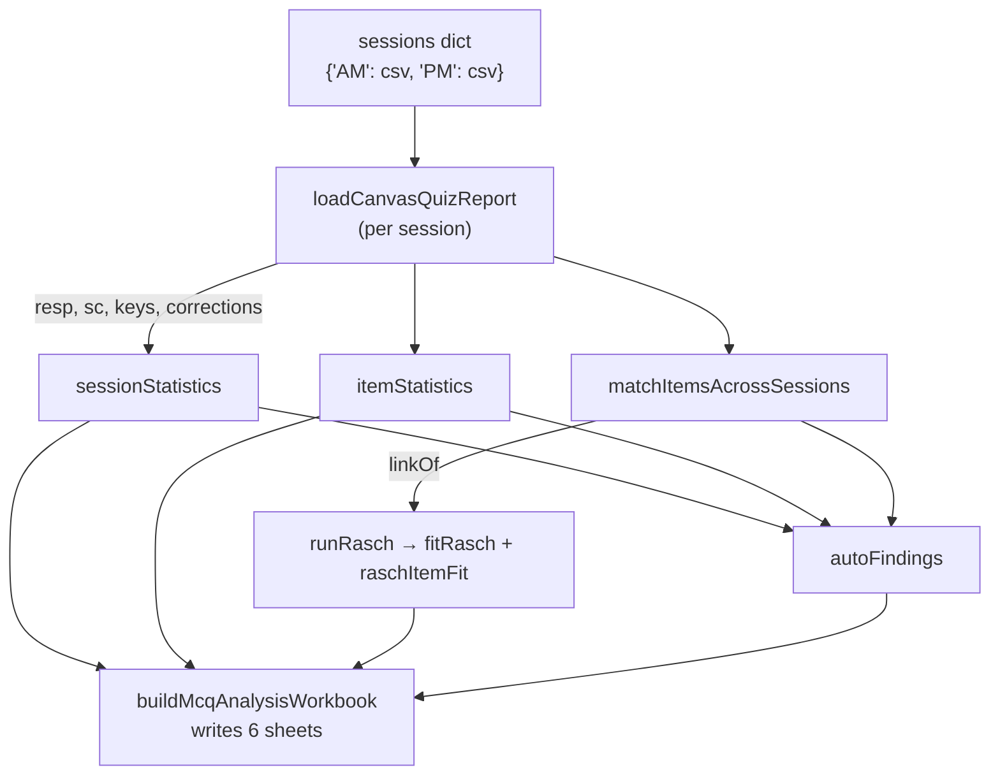

# `mcq_analysis_utils.py`

> Turns Canvas **Quiz → Student Analysis Report** CSV exports into the coordinator MCQ workbook. The workbook has cohort performance, AM/PM comparison, per-question difficulty and discrimination, distractors, student scores with Rasch ability, a % correct chart and an IRT item calibration. It handles fixed papers, random-pool papers (k of n items per student) and multi-session exams.

| | |
|---|---|
| **Added** | 2026-10-01 (built from the DENT90148 Fixed Pros analysis; the workbook layout follows Kunal's hand-trimmed version of that file) |
| **Lines of code** | 485 |
| **Top-level functions** | 20 (14 public, 6 internal `_` helpers) |
| **Classes** | 0 |
| **Module constants** | `META_COLS`, `TAIL_COLS`, `TIER_STYLE`, `THIN`, colour hex strings (`NAVY`, `BLUE`, `HDR`, `UOM_BLUE`, `UOM_ORANGE`) |
| **Public API** (`__all__`) | `loadCanvasQuizReport`, `itemStatistics`, `sessionStatistics`, `matchItemsAcrossSessions`, `fitRasch`, `raschItemFit`, `kr20`, `difficultyFlag`, `buildMcqAnalysisWorkbook` |
| **Imports from this codebase** | none |
| **Imported by** | `main.ipynb`, section **MCQ Exam Analysis** (directly above `### SCBD`) |
| **Dependencies** | `glob`, `math`, `re`, `numpy`, `pandas`, `openpyxl` (`Workbook`, `PatternFill`, `Font`, `Alignment`, `Border`, `Side`, `BarChart`, `Reference`, `get_column_letter`). There is no scipy, so the Rasch fit and the tests are implemented by hand |
| **Input** | One Canvas Student Analysis Report CSV per session (e.g. `Extra/DDS2/Endodontics AM DENT90148- Requires Respondus LockDown Browser Quiz Student Analysis Report.csv`) |
| **Output** | One `.xlsx` per exam (6 sheets, see §5) |
| **Run how** | `from mcq_analysis_utils import buildMcqAnalysisWorkbook` → `buildMcqAnalysisWorkbook({...sessions}, outPath, examTitle, ...)` |

`__all__` is defined on purpose. `main.ipynb` star-imports many modules, and openpyxl names must not shadow reportlab's `Table` / `Paragraph` / `Image` (see the import-star rules). Every function the notebook calls has no leading underscore.

---

## 1. Purpose and role

Coordinators run MCQs in Canvas (Respondus LockDown Browser). After each exam they want to know:
- how the cohort did and whether the AM and PM sessions are comparable;
- which questions were hard;
- which wrong answers attracted students;
- which questions are badly behaved (key or wording problems);
- who scored lowest.

This module standardises that analysis so each new exam is a single dict entry in the notebook.

Exams analysed with it so far (all DENT90148, DDS2, files in `Extra/DDS2/`):

| Exam | Date | Sessions | Shape | Output |
|---|---|---|---|---|
| Fixed Prosthodontics | 22/09/2026 | AM 54, PM 51 | Fixed 20-item papers, **different questions** per session | `DENT90148_FixedPros_MCQ_Analysis_22Sep2026.xlsx`. Built by the prototype script, then hand-trimmed by Kunal. The notebook entry is commented out so this file is not overwritten |
| Endodontics | 15/07/2026 | AM 53, PM 52 | **Random 20 of 38**; the same 38-question bank in both sessions (Canvas IDs differ) | `DENT90148_Endodontics_MCQ_Analysis_15Jul2026.xlsx` |
| Oral Medicine (Portfolio) | 28/08/2026 | single, 106 | Fixed 30-item paper | `DENT90148_OralMedicine_MCQ_Analysis_28Aug2026.xlsx` |

---

## 2. Input format — Canvas Student Analysis Report CSV

The column layout is validated by `loadCanvasQuizReport`, which raises `ValueError` if it doesn't match:

| Columns | Content |
|---|---|
| 0–7 (`META_COLS`) | `name, id, sis_id, section, section_id, section_sis_id, submitted, attempt`. `sis_id` = student number; `id` = Canvas user id; `submitted` = UTC string `2026-09-22 01:45:25 UTC` |
| 8 … −4, in pairs | `"<questionId>: <stem text with \n>"` (the response text) followed by `"1.0"`, `"1.0.1"`, … (that item's points) |
| last 3 (`TAIL_COLS`) | `n correct, n incorrect, score` |

Example header pair:
```
"3099933: \nQuestion\nWhat is a key design feature of an endocrown preparation ...?", "1.0.18"
```

**Random-pool exams:** an item the student was not shown has a blank response **and** a blank score. The module keeps these as `NaN`, so "not shown" is never treated as "wrong".

**Watch-outs found in real exports:**
- **`score` vs item scores.** `score` / `n correct` can disagree with the item points after a manual Canvas regrade. Example: Emma Hong (Fixed Pros AM) had `n correct` 18 and `score` 20, and after a hand edit to the CSV her items summed to 18 while `score` stayed 20. The module **always uses item scores** and ignores `score` / `n correct`.
- **Stem boilerplate.** Stems carry `Question`, `Question.`, `Question,` prefixes and stray leading commas. `cleanStem` strips them.
- **Duplicated sessions.** The same question can appear in AM and PM under **different question IDs** (Endodontics: all 38). Match on stem plus key, never on ID (§4).
- **Multiple options in one answer.** A response can contain two comma-joined options (Oral Medicine Q30, one student). It is scored as wrong because it isn't equal to the key.

---

## 3. Pipeline



### 3.1 Loading and re-scoring — `loadCanvasQuizReport(csvPath, label='Exam', scoreOverrides=None, rescoreToKey=True)`

| Param | Meaning |
|---|---|
| `csvPath` | Path, or a glob pattern (`*` / `?` / `[`); the first sorted match is used. Globs keep the notebook entries short despite Canvas's long file names |
| `label` | Session label used everywhere (`'AM'`, `'PM'`, `'Oral Med'`) |
| `scoreOverrides` | `{(studentNumber, 'Q19'): 0, ...}`. Manual item marks applied **after** re-scoring and logged |
| `rescoreToKey` | Re-marks every shown response as `response == key` |

**Key** = the most common response among responses Canvas scored 1. Re-scoring catches manual Canvas mark overrides: any shown cell where the Canvas mark differs from the key-based mark is logged in `corrections` and replaced.

**Returns** a dict:

| Key | Content |
|---|---|
| `label`, `path`, `df` | The label, the resolved path and the raw CSV frame |
| `resp` | Responses, columns `Q1..Qn` |
| `sc` | 0/1 item scores, NaN = not shown |
| `meta` | `[(questionId, cleanStem)]` |
| `keys` | `{Q: key text}` |
| `corrections` | `[(name, studentNo, Q, answer, fromMark, toMark, reason)]` |
| `isPool` | True if any item was not shown to some student |
| `nItems` | Number of items in the bank |
| `maxScore` | The modal number of items shown per student (20 for Endodontics) |
| `nShown` | Items shown, per student |

### 3.2 Classical statistics

| Function | Definition |
|---|---|
| `sessionStatistics(sess)` | `tot` = sum of item scores; `pct` = `tot / items shown` (correct for pools); mean, median, SD, min, max, `pctMean`; `kr20` |
| `kr20(sc)` | KR-20 = k/(k−1)·(1 − Σp(1−p)/Var(total)). Returns **None when items are missing by design** (random pools), because KR-20 assumes everyone took the same items. The workbook shows "n/a (random items)" |
| `itemStatistics(sess)` | Per item, using **only students shown the item**: `nShown`, `nCorrect`, `nIncorrect`, `pCorrect`, `sd` = √(p(1−p)), `discD`, `rPbis`, `wrongAnswers` (distractor counts, most chosen first), `topWrong` |
| `discD` | **Upper–lower discrimination index**: % correct in the top 27% minus the bottom 27%. Students are ranked by **total %, including the item** (the classic definition; this matches the original Fixed Pros workbook). Needs ≥ 4 students |
| `rPbis` | **Item-rest point-biserial**: Pearson r between the item (0/1) and the proportion correct on the student's *other* items. Excluding the item stops it inflating its own correlation. Using a proportion rather than a raw rest score makes it valid for pools. NaN when the item has no variance (everyone right) |
| `difficultyFlag(p)` | High ≥ 0.90, Good 0.75–0.89, Moderate 0.60–0.74, Low < 0.60 (the tiers coordinators already use, colour-coded green / blue / amber / red) |
| `welchTest(a, b)` | Welch t on per-student % between sessions. p uses the **normal approximation** (fine at n ≈ 50 per group), plus Cohen's d (pooled SD). There is no scipy |
| `signTestP(diffs)` | Two-sided exact sign test on per-question %-correct differences for questions shared across sessions |
| `fmtP(p)` | Formats p as `< 0.001` / `≈ 0.004` / `≈ 0.55` |

How to read D and r_pb (shown in each question sheet subtitle): ≥ 0.20 good; < 0 means stronger students got it wrong more often, so review the key or wording. On very easy papers (≥ 90% correct) a single slip moves r_pb a lot. `_reviewNote` therefore only says "review" for a negative r_pb when the item has **≥ 3 wrong answers**; otherwise it says "likely noise".

### 3.3 Rasch (1PL) IRT

| Function | What it does |
|---|---|
| `fitRasch(X, nQuad=61, maxIter=500, tol=1e-6)` | Marginal maximum likelihood by EM. X = persons × items with 0/1/NaN (NaN = not administered, handled natively). Quadrature on 61 nodes over [−8, 8]. The latent mean is fixed at 0 for identification and the latent SD is estimated. Item difficulties come from a one-step Newton update per EM cycle. Returns `b, seB, thetaEap, thetaPsd, latentSd, nIter`. Person ability is the **EAP** (posterior mean), so all-correct students still get a finite θ |
| `raschItemFit(X, b, theta)` | Infit (information-weighted) and outfit (unweighted) mean-squares from the EAP θ. 0.7–1.3 is acceptable |
| `runRasch(sessList, linkOf)` | Stacks all sessions into one matrix. Shared questions get one column (via `linkOf`) and anchor the scale. Calibrates items with 0 < p < 1 and ≥ 5 responses; the rest go to `notEstimable` (all correct / all wrong / too few). Returns `items` (DataFrame), `persons {(label, studentNo): (θ, SE)}`, `reliability` (EAP marginal: 1 − mean(PSD²)/(Var θ + mean PSD²)), `latentSd`, `notEstimable`, `pAll` |

**How sessions are linked (important for interpretation).**
- **Questions shared across sessions** (Endodontics): the shared questions put both sessions on one scale. θ therefore **does show** a genuine session effect. In Endodontics, AM's mean θ is −0.21 and PM's is +0.22.
- **No shared questions** (Fixed Pros): the sessions are linked only by assuming the AM and PM groups are of equal ability. Under that assumption any difficulty difference between the papers is absorbed into item b, not into θ.

Reported results from the first runs:

| Exam | Calibrated / not estimable | Reliability | Infit range |
|---|---|---|---|
| Fixed Pros | 25 / 15 (everyone correct) | 0.35 | 0.82–1.20 |
| Endodontics | 35 linked / 3 | 0.60 | 0.76–1.14 |
| Oral Medicine | 27 / 3 | 0.53 | 0.90–1.08 |

### 3.4 Cross-session question matching — `matchItemsAcrossSessions(sessList)`

Canvas copies a question bank into a second quiz with **new question IDs**, so IDs can't be used. Questions are matched on **normalised stem** (lower-case, alphanumerics only) **plus an identical normalised key**. It returns:
- `linkOf {(label, Q): linkId}`: matched copies share `LINK|AM Q7/PM Q11`; unmatched items get `AM|Q7`;
- `display {linkId: 'AM Q7 = PM Q11'}`.

Matches drive three things: the IRT linking, the "Same question in other session (% correct)" column, and the paired AM-vs-PM finding.

---

## 4. Key findings — `autoFindings(sessList, stats, items, passMark, linkOf)`

Bullets are generated in this order. Each appears only when it applies:

1. **Cohort:** N, mean /max (%), median, range, and the count of students below `passMark` (default 0.5).
2. **Session comparison** (2+ sessions): mean %, Welch p, d. If p < .05: "*X scored significantly lower than Y – check exam conditions / paper difficulty…*".
3. **Shared questions:** "*All 38 questions are identical in both sessions… On these same questions AM averaged 76.4% vs PM 84.8%, AM lower on 26 of 38 (sign test p ≈ 0.003). The gap is therefore a session effect, not harder questions.*" If no questions are shared: "*papers share no questions – parallel forms*".
4. **Hardest questions:** < 60% and 60–74%, prefixed by session.
5. **Most common wrong answer** on up to 5 of the hardest questions.
6. **Review wording/key:** r_pb < 0 with ≥ 3 wrong answers.
7. **Pool note:** "*each student received 20 of 38 questions drawn at random…*".
8. **Scoring corrections:** one line per corrected cell.
9. **`extraFindings`** passed by the caller (e.g. Config.xlsx notes).

The topic-level interpretation bullets Kunal kept on Fixed Pros (e.g. "Curve of Spee is the weakest topic") are written by hand. Pass them through `extraFindings`.

---

## 5. Workbook layout — `buildMcqAnalysisWorkbook(...)`

```python
buildMcqAnalysisWorkbook(
    sessions,            # {'AM': 'path or glob', 'PM': ...}; one entry = single-session exam
    outPath,             # .xlsx to write (overwritten)
    examTitle,           # banner line 1, e.g. 'DENT90148 — Endodontics MCQ (DDS2)'
    examSubtitle='',     # banner line 2; '| N = <total> students' is appended
    passMark=0.5,        # fraction for the 'below pass' count + red score font
    scoreOverrides=None, # {'AM': {(1686719, 'Q19'): 0}}
    extraFindings=None,  # list[str] appended to KEY FINDINGS
    rescoreToKey=True,
    runIrt=True,
) -> dict(sessions, stats, items, irt, findings, outPath)
```

The layout matches Kunal's trimmed Fixed Pros workbook. He removed the Combined row, the IRT Test Curves sheet, the AM-vs-PM Items sheet and the long methodology bullets, because coordinators don't use them.

| Sheet | Contents |
|---|---|
| **Summary Dashboard** | Banner. **COHORT PERFORMANCE**: one row per session with N, Mean /max, Mean %, Median, SD, Range and KR-20 (or "n/a (random items)"). **`<A> vs <B> comparison`** (2+ sessions): difference, Welch t, p, d, verdict. **QUESTION DIFFICULTY DISTRIBUTION**: tier × session counts and question lists. **SCORE DISTRIBUTION (out of max)**: per score, students per session, total, %, cumulative %. **KEY FINDINGS** (§4). Columns A–H; H is wide for question lists |
| **`<Session> Question Analysis`** (one per session; `Question Analysis` if single) | Header row 4, frozen at C5. Columns: Q#, Question Stem, Correct Answer, [Same question in other session (% correct)], [Shown to (#) — pools only], Correct (#), Incorrect (#), % Correct, Std Dev, Discrimination D, Item-rest r_pb (red if < 0), Difficulty Flag, Wrong answers chosen (count), Review note. Each row is coloured by its tier |
| **Student Scores** | Name, Student Number, Session, Submitted (Melbourne time), Score /max, %, Items wrong (Q labels), IRT θ (EAP), θ SE. Sorted by %, then θ (lowest first). Scores below `passMark` are in red. Autofilter on |
| **Performance Chart** | Data table (Q × session % correct) plus one bar chart per session (UniMelb blue `094183`, orange `E07B00`, then green) |
| **IRT Item Calibration** | Title row 1, header row 3 (no subtitle, as trimmed), frozen at D4. Item (`AM Q7 = PM Q11` for shared questions), Session (`Both` for shared), Stem, % Correct, b, SE, Infit, Outfit, Fit (OK/Misfit), Difficulty band (Hard b > −1 / Moderate −2.5 < b ≤ −1 / Easy b ≤ −2.5 / not estimable). Sorted by b, hardest first |

Internal helpers (not exported): `_fill`, `_put` (write + style a cell), `_banner` (navy title + blue subtitle), `_section` (section bar), `_reviewNote`.

---

## 6. Usage — `main.ipynb` cell "MCQ Exam Analysis"

```python
from mcq_analysis_utils import buildMcqAnalysisWorkbook
mcqDir = "Extra/DDS2"
mcqExams = {
    "endo": dict(
        sessions={"AM": f"{mcqDir}/Endodontics AM DENT90148*.csv",
                  "PM": f"{mcqDir}/Endodontics PM DENT90148*.csv"},
        outPath=f"{mcqDir}/DENT90148_Endodontics_MCQ_Analysis_15Jul2026.xlsx",
        examTitle="DENT90148 — Endodontics MCQ (DDS2)",
        examSubtitle="15 July 2026  |  AM & PM sessions (20 of 38 items drawn per student)",
        extraFindings=["Config.xlsx: technical problems on 15/07/2026 left the AM session incomplete – AM students should not be penalised."],
    ),
    "oralMed": dict(sessions={"Oral Med": f"{mcqDir}/Portfolio_ Oral Medicine MCQs*.csv"}, ...),
    # "fixedPros": dict(...)   # commented out – re-running overwrites the hand-trimmed workbook
}
runExams = ["endo", "oralMed"]
mcqResults = {k: buildMcqAnalysisWorkbook(**mcqExams[k]) for k in runExams}
```

**To add a new exam:**
1. Export the Student Analysis Report CSV(s) from Canvas into `Extra/<cohort>/`.
2. Add a `mcqExams` entry.
3. Add its key to `runExams`.
4. Run the cell.

The findings print under the cell as well.

**To correct marks deliberately:** use `scoreOverrides={'AM': {(studentNo, 'Q19'): 0}}`. Prefer this over editing the CSV.

**Returned dict, for ad-hoc follow-ups:**
- `mcqResults['endo']['items']['AM']`: the item table as a DataFrame;
- `['stats']['PM']['pct']`: per-student %;
- `['irt']['items']`, `['irt']['persons']`: the Rasch results.

---

## 7. Gotchas

- **Fixed Pros workbook is hand-edited.** Re-running its entry overwrites Kunal's trimmed version. The entry stays commented out.
- **The session effect is not removed automatically.** Endodontics AM is ~9 points lower on identical questions. Config.xlsx says AM students "should not be penalised", but the export shows nothing incomplete (every AM student answered 20/20). Any adjustment (e.g. a session-adjusted %) is a coordinator decision and is **not** applied. θ reflects the gap, because the shared questions link the sessions.
- **KR-20 for pools.** It is suppressed for random-pool exams. Use the IRT reliability instead (shown in the returned dict; not on the summary, by Kunal's trim).
- **Raw scores on pools.** Raw /20 scores come from different question subsets. θ is the fairer comparison between students.
- **IRT with no shared questions** links sessions only through the equal-groups assumption (§3.3).
- **Key inference.** The key is the modal *credited* response. If a question has no correct responses at all, its key is blank and every response scores 0. Such a question also has p = 0 and is not estimable.
- **`score` column ignored.** Totals are always item sums (see §2).
- **Time zone.** `Submitted` is converted from UTC to `Australia/Melbourne`.
- **Normal-approximation p** for Welch. It is slightly anti-conservative for very small sessions (< 20).
- **Glob paths.** If a pattern matches more than one file, the first sorted match is silently used. Keep patterns specific.

## 8. Change log

| Date | Change |
|---|---|
| 2026-10-01 | Module created. Prototype scripts (Fixed Pros) were generalised into this module. Layout follows Kunal's trimmed Fixed Pros workbook. Added: random-pool support, cross-session question matching by stem + key, IRT linking through shared questions, the "Same question in other session" and "Shown to" columns, and the noise-aware r_pb review note. Classic D now ranks by total % (fixed a mismatch with the original). Notebook cell inserted above SCBD (backup `_bak/main.ipynb.bak_20261001_020155`). Endodontics and Oral Medicine workbooks generated |
