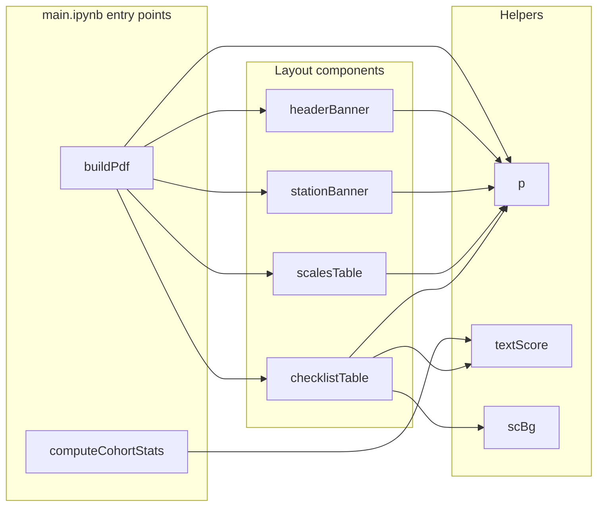

# `osce_pdfs.py`

> Builds per-student OSCE feedback PDFs with ReportLab — one page per station, each showing the student's scale ratings and checklist criteria alongside cohort averages.

| | |
|---|---|
| **Lines of code** | 466 |
| **Top-level functions** | 9 |
| **Classes** | 0 |
| **Module constants** | 20 |
| **Imports from this codebase** | none (pure ReportLab + stdlib) |
| **Imported by** | No other module in the codebase imports it. `main.ipynb` imports it: `from osce_pdfs import (computeCohortStats, buildPdf, DEFAULT_STATION_SCALES, DEFAULT_STATION_MC_COLS,)` |
| **Run how** | Imported by `main.ipynb`. No `if __name__ == "__main__"` block — it is a pure library. |

---

## 1. Purpose and role in the pipeline

**OSCE** (Objective Structured Clinical Examination) is a station-based practical exam: a student rotates through numbered *stations*, and at each one an assessor fills a form containing a set of ordinal **scales** (Global Rating, Time Management, Communication, Professionalism, Readiness to Progress, Position & Ergonomics) and a **checklist** of individual criteria keyed `MC1`, `MC2`, … Each criterion is answered with one of five ordinal labels from *Done well* down to *Not done*.

This module sits at the very end of the OSCE pipeline. It consumes **no database and no Excel** — its input is a plain Python `list` of already-fetched assessment records, which `main.ipynb` loads from the JSON dump written by the DASH API-ingest cell (`temp 2026 osce.json`). The notebook filters that list to submitted records and drops excluded assessors before handing it over.

It produces two things:

1. `computeCohortStats(data)` — a five-tuple of cohort-level lookups: mean scale values per station, mean checklist score per criterion per station, the criterion description text, the scale-label text, and the records regrouped by student.
2. `buildPdf(student, st_data, out_dir, …)` — writes one A4 PDF per student to `out_dir`, named `<student name>.pdf`.

The record shape it expects (inferred from the accessors used throughout) is:

```python
{
  "student": "Jane Citizen", "station": 1, "cohort": "BOH1",
  "subject": "...", "datetime": "2026-05-12T09:30:00Z",
  "assessor": "...", "submitted": True,
  "form": {
      "data": {"assessor": {
          "scale-global-rating": {"scale": "4"},        # scale keys
          "<checklist key>": {"MC1": "Done well", ...},  # the one non-scale, non-comments dict
          "comments": "free text"
      }},
      "checklists": {"<checklist key>": {"name": "...", "fields": {"MC1": "description", ...}}},
      "scales":     {"scale-global-rating": {"fields": {"1": "label", ...}}}
  }
}
```

Note the difference from `boh1_utils`: the OSCE payload stores checklist answers as **human labels** ("Done well"), which `OPTION_KEYS` maps to option keys and then `OPTION_SCORES` to weights, whereas `rawform_forms` stores the `O1`–`O5` keys directly. The two modules therefore have separate, non-shared score tables.

Layout is entirely ReportLab `platypus`: a `story` list of flowables assembled per station and handed to `SimpleDocTemplate.build()`. Everything is driven by module-level colour and style dictionaries so the PDF matches the University's navy house palette (`UNI = #010d44`).

---

## 2. External dependencies

| Library / resource | Used for |
|---|---|
| `os` | `os.path.join` for the output PDF path in `buildPdf`. (`os.makedirs` is done by the caller, not here.) |
| `collections.defaultdict` | `by_student` grouping in `computeCohortStats` |
| `reportlab.lib.pagesizes.A4` | Page size for `SimpleDocTemplate` |
| `reportlab.lib.colors` | `colors.HexColor(...)` for the whole palette; `colors.white`, `colors.black` |
| `reportlab.lib.units.cm` | All column widths and margins are expressed in cm |
| `reportlab.lib.styles.ParagraphStyle` | The 16 named styles in `ST` |
| `reportlab.platypus` (`SimpleDocTemplate`, `Paragraph`, `Spacer`, `Table`, `TableStyle`, `PageBreak`, `KeepTogether`) | Document assembly and table rendering |
| `reportlab.lib.enums.TA_CENTER` | Centre alignment on several `ParagraphStyle`s |
| **Filesystem** | `buildPdf` writes `<out_dir>/<student>.pdf`. The directory must already exist — the notebook does `os.makedirs(OUT_DIR, exist_ok=True)` beforehand. |
| **Database / network / env vars** | None. This module touches neither. |

---

## 3. Module-level constants and variables

### 3.1 Colour palette

| Name | Type | Value / shape | Purpose |
|---|---|---|---|
| `UNI` | `Color` | `colors.HexColor("#010d44")` | University navy. Header banner, station banner, table header row background, and the total-row rule. |
| `WHITE` | `Color` | `colors.white` | Banner text colour and the light band in `ROWBACKGROUNDS`. |
| `LIGHT` | `Color` | `colors.HexColor("#F2F7FC")` | The alternate (shaded) band in `ROWBACKGROUNDS`. |
| `BORDER` | `Color` | `colors.HexColor("#C5D5E8")` | 0.4-pt grid line colour on all data tables. |
| `MUTED` | `Color` | `colors.HexColor("#A8C4E0")` | Secondary text on navy backgrounds (subheadings inside banners). |
| `TOTAL` | `Color` | `colors.HexColor("#DDE8F4")` | Background of the "Overall Average" row in the checklist table. |
| `PAGE_W` | `float` | `17.4 * cm` | Usable page width. Comment at line 19: *"A4 - 2 x 1.8 cm margins"*. Every table width is derived from this. |

### 3.2 Score → colour lookups

| Name | Type | Value / shape | Purpose |
|---|---|---|---|
| `GR_COL` | `dict` (5) | GR value `1..5` → `Color` | Row background applied to the Global Rating row of the scales table. Red (`#FFC7CE`) at 1 → bright green (`#92D050`) at 5. |
| `SC_COL` | `dict` (5) | score `1.00 / 0.80 / 0.60 / 0.40 / 0.00` → `Color` | Cell background for individual checklist scores. Green at 1.00, pale blue at 0.80, amber at 0.60, pink at 0.40, strong red (`#FF4444`) at 0.00. |

```python
GR_COL = {1: "#FFC7CE", 2: "#FFEB9C", 3: "#C6EFCE", 4: "#9DC3E6", 5: "#92D050"}   # as HexColor
SC_COL = {1.00: "#C6EFCE", 0.80: "#DDEBF7", 0.60: "#FFEB9C", 0.40: "#FFC7CE", 0.00: "#FF4444"}
```

### 3.3 Checklist response mapping

| Name | Type | Value / shape | Purpose |
|---|---|---|---|
| `OPTION_KEYS` | `dict` (5) | label → option key | `{"Done well": "O1", "Done": "O2", "Mostly done": "O3", "Sometimes done": "O4", "Not done": "O5"}`. Maps the human label stored in the OSCE payload to the canonical option key. Note there is **no `O6` / "N/A"** entry here, unlike `boh1_utils.OPTION_LABELS`. |
| `OPTION_SCORES` | `dict` (5) | option key → weight | `{"O1": 1.00, "O2": 0.80, "O3": 0.60, "O4": 0.40, "O5": 0.00}`. Identical values to `boh1_utils.SCORE_MAP`, duplicated here. |
| `GR_LABELS` | `dict` (5) | GR value → label | `{1: "Fail", 2: "Borderline Fail", 3: "Pass", 4: "Very Good", 5: "Excellent"}`. **Never referenced anywhere in the module** — the scales table gets its label text from `sc_fields` (the API's own field labels) instead. |
| `SCALE_NAMES` | `dict` (6) | scale key → display name | Used by `scalesTable` to turn `"scale-practice-readiness"` into `"Readiness to Progress"`. |

```python
SCALE_NAMES = {
    "scale-global-rating":       "Global Rating",
    "scale-time-mgmt":           "Time Management",
    "scale-communication":       "Communication",
    "scale-professionalism":     "Professionalism",
    "scale-practice-readiness":  "Readiness to Progress",
    "scale-position-ergonomics": "Position & Ergonomics",
}
```

### 3.4 Station structure defaults

Both are exported to `main.ipynb` and are the intended per-cohort override points. The comment at line 56 reads *"override per cohort in the notebook if station structure differs"*.

| Name | Type | Value / shape | Purpose |
|---|---|---|---|
| `DEFAULT_STATION_SCALES` | `dict` (2) | station int → list of 5 scale keys | Which scales to render, in which order, for each station. Station 1 uses Communication; station 2 swaps that for Position & Ergonomics. |
| `DEFAULT_STATION_MC_COLS` | `dict` (2) | station int → list of MC column names | Station 1 → `MC1`–`MC8` (8 criteria), station 2 → `MC1`–`MC6` (6 criteria). Built with comprehensions: `[f"MC{i}" for i in range(1, 9)]` and `range(1, 7)`. |

```python
DEFAULT_STATION_SCALES = {
    1: ["scale-global-rating", "scale-time-mgmt", "scale-communication",
        "scale-professionalism", "scale-practice-readiness"],
    2: ["scale-global-rating", "scale-time-mgmt", "scale-professionalism",
        "scale-practice-readiness", "scale-position-ergonomics"],
}
DEFAULT_STATION_MC_COLS = {1: ["MC1"…"MC8"], 2: ["MC1"…"MC6"]}
```

### 3.5 Paragraph styles and table styles

| Name | Type | Value / shape | Purpose |
|---|---|---|---|
| `ST` | `dict` (16) | style name → `ParagraphStyle` | Every piece of text in the PDF goes through `p(text, style)` which looks up this dict. The comment at line 98 notes that header-cell text colour *"must be set here, not via TableStyle"* — hence the separate `th_l` / `th_c` white styles. |
| `_NO_INNER` | `list` (2) | `TableStyle` commands | Sets `INNERGRID` and `BOX` to width 0 — i.e. removes all rules. Applied to the two banner tables so they render as flat navy blocks. |
| `_TBL_BASE` | `list` (8) | `TableStyle` commands | Shared base style for the scales and checklist tables: navy header row, middle vertical alignment, 0.4-pt `BORDER` grid, 4-pt top/bottom and 6-pt left/right padding, and `ROWBACKGROUNDS` alternating `[WHITE, LIGHT]`. |
| `SCALE_COLS` | `list` (4) | `[4.5, 1.5, 9.5, 1.9] * cm` | Column widths for `scalesTable`. Defined mid-file at line 192, directly above the function, with the comment `# Cols: Scale(4.5) | Score(1.5) | Your Level(9.5) | Cohort Avg(1.9) = 17.4`. Sums to `PAGE_W`. |
| `CK_COLS` | `list` (4) | `[1.2, 12.3, 1.95, 1.95] * cm` | Column widths for `checklistTable`, defined at line 225 with the comment `# Cols: #(1.2) | Description(12.3) | Score(1.95) | Cohort Avg(1.95) = 17.4`. Also sums to `PAGE_W`. |

The 16 styles in `ST`, grouped by role:

```python
# Page header banner
"name" (Helvetica-Bold 20, WHITE), "hdr_sub" (Helvetica 9, MUTED),
"hdr_r1" (Helvetica-Bold 13, WHITE, centred), "hdr_r2" (Helvetica 8, MUTED, centred)
# Station banner
"stn" (Helvetica-Bold 10, WHITE), "stn_r" (Helvetica 8, MUTED, centred)
# Section labels
"sec_lbl" (Helvetica-Bold 11, UNI, spaceBefore=10 spaceAfter=4)
# Table header cells — colour set here, not in TableStyle
"th_l", "th_c" (Helvetica-Bold 9, WHITE)
# Table body cells
"td_l", "td_c", "td_b", "td_bc" (Helvetica/Bold 9, black),
"td_sm" (Helvetica 8, #333333), "td_wrap" (Helvetica 8, black),
"comment" (Helvetica-Oblique 8, #333333, leftIndent=4)
```

---

## 4. Classes

None. The module defines no classes.

---

## 5. Function reference

The file's own banner comments divide it into: **Helpers**, **Layout components**, **Cohort stats**, and **PDF builder**.

### 5.1 Helpers

#### `textScore(lbl)`

*Lines 140–142.* Convert a checklist response label to its numeric weight.

**Parameters**

| Name | Type | Default | Description |
|---|---|---|---|
| `lbl` | `str` \| any | — | The response label as stored in the payload, e.g. `"Done well"`. |

**Returns** — `float` in `{1.00, 0.80, 0.60, 0.40, 0.00}`, or `None` if the label is not in `OPTION_KEYS`.

**Behaviour** — Two chained lookups: `OPTION_KEYS.get(lbl)` gives the option key, then `OPTION_SCORES.get(ok)` gives the weight. Returns `None` for an unrecognised label rather than raising, which is what lets the callers treat "not answered" and "answered with something unexpected" identically.

**Called by** — `checklistTable`, `computeCohortStats`.

---

#### `scBg(v)`

*Lines 145–148.* Map a numeric score to its background colour.

**Parameters**

| Name | Type | Default | Description |
|---|---|---|---|
| `v` | `float` \| `None` | — | A score. |

**Returns** — `Color` or `None`.

**Behaviour** — Returns `None` immediately for `None`; otherwise `SC_COL.get(round(v, 2))`. **This is an exact-match lookup**: only the five canonical values round-trip. Any other value (e.g. an average of `0.833`) returns `None` and the cell is left uncoloured.

**Called by** — `checklistTable`.

---

#### `p(text, style="td_l")`

*Lines 151–154.* The universal text-to-flowable helper.

**Parameters**

| Name | Type | Default | Description |
|---|---|---|---|
| `text` | any | — | Value to render. `None` becomes the literal `"-"`. |
| `style` | `str` | `"td_l"` | Key into `ST`. A key not present in `ST` raises `KeyError`. |

**Returns** — `reportlab.platypus.Paragraph`.

**Behaviour** — `str(text)` (or `"-"` if `None`), then escapes `&` → `&amp;`, `<` → `&lt;`, `>` → `&gt;` — necessary because ReportLab `Paragraph` parses a mini-HTML markup, so unescaped angle brackets in assessor comments would corrupt the layout. The escaping order (`&` first) is correct.

**Called by** — `headerBanner`, `stationBanner`, `scalesTable`, `checklistTable`, `buildPdf`.

---

### 5.2 Layout components

#### `headerBanner(student, cohort, subject, date, course_code="ORAL10005", year=2026)`

*Lines 158–172.* The full-width navy banner at the top of page 1.

**Parameters**

| Name | Type | Default | Description |
|---|---|---|---|
| `student` | `str` | — | Student name, rendered large in the `"name"` style. |
| `cohort` | `str` | — | Cohort, e.g. `"BOH1"`. |
| `subject` | `str` | — | Subject string from the record. |
| `date` | `str` | — | Date string (already truncated to `YYYY-MM-DD` by the caller). |
| `course_code` | `str` | `"ORAL10005"` | Right-hand large text. |
| `year` | `int` | `2026` | Rendered as `f"OSCE Assessment  .  {year}"`. |

**Returns** — A ReportLab `Table` flowable.

**Behaviour** — A single-row, two-column table: left cell holds the student name over `f"{cohort}  .  {subject}  .  {date}"`; right cell holds the course code over the year line. Column widths are `12 cm` and `PAGE_W - 12 cm`. The style is navy background, 14-pt vertical padding, asymmetric left/right padding, plus `_NO_INNER` to erase all rules.

**Calls** — `osce_pdfs:p`.
**Called by** — `buildPdf`.

---

#### `stationBanner(station, ck_name, assessor)`

*Lines 175–188.* The narrower navy strip that opens each station's section.

**Parameters**

| Name | Type | Default | Description |
|---|---|---|---|
| `station` | `int` | — | Rendered as `f"Station {station}"`. |
| `ck_name` | `str` | — | **Accepted but never used in the body.** `buildPdf` computes the checklist name and passes it in; nothing renders it. |
| `assessor` | `str` | — | Rendered as `f"Assessor: {assessor}"` on the right. |

**Returns** — A ReportLab `Table` flowable.

**Behaviour** — Same two-column `12 cm` / `PAGE_W - 12 cm` split as `headerBanner`, with 8-pt vertical and 12-pt horizontal padding, navy background, and `_NO_INNER`.

**Calls** — `osce_pdfs:p`.
**Called by** — `buildPdf`.

---

#### `scalesTable(st_scale_keys, student_scales, cohort_scale_avgs, sc_fields)`

*Lines 195–221.* The "Scales" table: one row per ordinal scale, with the student's value, the descriptive label for that value, and the cohort mean.

**Parameters**

| Name | Type | Default | Description |
|---|---|---|---|
| `st_scale_keys` | `list[str]` | — | Which scales to render and in what order — for one station, from `station_scales`. |
| `student_scales` | `dict` | — | `{scale_key: int}` for this student at this station. |
| `cohort_scale_avgs` | `dict` | — | `{scale_key: float}` — **already narrowed to this station** by the caller. |
| `sc_fields` | `dict` | — | `{scale_key: {str(value): label}}` — the API's own descriptive text per scale point. Note this is **not** keyed by station. |

**Returns** — A ReportLab `Table` flowable with a header row plus one row per scale.

**Behaviour**

1. Header: `Scale | Score | Your Level | Cohort Avg`.
2. Per scale: display name from `SCALE_NAMES.get(sk, sk)` (falls back to the raw key); the student's integer value or `"-"`; the descriptive label `(sc_fields.get(sk) or {}).get(str(val), "-") if val else "-"`; and the cohort average formatted to 1 dp or `"-"`.
3. **Labels longer than 80 characters are truncated to 78 plus `"..."`** (lines 204–205) so the 9.5 cm column does not overflow.
4. Styling starts from `_TBL_BASE`. It then walks the scale rows and, **only for `"scale-global-rating"`**, applies `GR_COL[val]` as the background of the *whole row*. No other scale is colour-coded.
5. Column widths come from the module-level `SCALE_COLS`.

**Calls** — `osce_pdfs:p`.
**Called by** — `buildPdf`.

---

#### `checklistTable(mc_cols, ck_data, ck_fields, cohort_mc_avgs)`

*Lines 228–287.* The "Checklist" table: one row per `MC` criterion plus an "Overall Average" total row.

**Parameters**

| Name | Type | Default | Description |
|---|---|---|---|
| `mc_cols` | `list[str]` | — | Criterion keys to render, in order — for one station, from `station_mc_cols`. |
| `ck_data` | `dict` | — | `{mc_key: response label}` for this student at this station. |
| `ck_fields` | `dict` | — | `{mc_key: description}` — **already narrowed to this station** by the caller. |
| `cohort_mc_avgs` | `dict` | — | `{mc_key: float}` — also already narrowed to this station. |

**Returns** — A ReportLab `Table` flowable.

**Behaviour**

1. Header: `# | Description | Score (/1) | Cohort Avg (/1)`.
2. Per criterion: the MC key; the description from `ck_fields.get(mc, "")`; the student's score via `textScore(resp)` formatted to 2 dp or `"-"`; the cohort average to 2 dp or `"-"`. Scores that are not `None` are accumulated into `student_scores`.
3. The description cell builds a `Paragraph` **directly** (lines 242–245) with its own inline `&`/`<`/`>` escaping and the `td_wrap` style, rather than calling `p(desc, "td_wrap")` — a duplicated code path with identical behaviour.
4. Total row: `st_avg = round(mean(student_scores), 3)` and `c_avg_t = round(mean(non-None cohort averages), 3)`, each rendered as `f"{x * 100:.1f}%"` — so the two body columns are on a 0–1 scale but the total row is a percentage. Both are `None` (rendered `"-"`) when there is nothing to average.
5. Style: `_TBL_BASE` plus a `TOTAL` background on the last row, a 1-pt `UNI` rule above it, and a re-declared `ROWBACKGROUNDS` restricted to rows `1..-2` so the banding stops before the total row.
6. Per-criterion colouring: the *Score* cell (column 2 only) gets `scBg(sc)` as its background; when the score is exactly `0.0` the text is additionally set to `WHITE` for contrast against the strong red. **The cohort-average column is deliberately not coloured** — lines 275–278 hold that logic commented out.
7. The two total-row cells are also passed through `scBg`, which normally returns `None` for a real average (see Gotchas).

**Calls** — `osce_pdfs:p`, `osce_pdfs:textScore`, `osce_pdfs:scBg`.
**Called by** — `buildPdf`.

---

### 5.3 Cohort stats

#### `computeCohortStats(data, station_mc_cols=None)`

*Lines 291–374.* Single pass over the record list producing every cohort-level lookup the PDF builder needs.

**Parameters**

| Name | Type | Default | Description |
|---|---|---|---|
| `data` | `list[dict]` | — | Filtered, submitted OSCE records. The filtering (submitted-only, assessor exclusions) is done by the caller. |
| `station_mc_cols` | `dict` \| `None` | `None` | `{station: [MC keys]}`. When `None`, falls back to `DEFAULT_STATION_MC_COLS`. **Only used for its `.keys()`** — it determines which stations are in scope, not which criteria are averaged. |

**Returns** — a 5-tuple:

| Position | Name | Shape |
|---|---|---|
| 0 | `cohort_scale_avgs` | `{station: {scale_key: avg}}` |
| 1 | `cohort_mc_avgs` | `{station: {mc_key: avg}}` |
| 2 | `ck_fields` | `{station: {mc_key: description}}` |
| 3 | `sc_fields` | `{scale_key: {str(value): label}}` — **flat, not keyed by station** |
| 4 | `by_student` | `defaultdict` of `{student_name: {station: record}}` |

**Behaviour**

1. `stations = sorted(station_mc_cols.keys())` — with the defaults, `[1, 2]`. Any record whose `station` is not in this set is skipped by the `if st not in …: continue` guards (lines 315, 336).
2. **Scale averages.** Walks `record["form"]["data"]["assessor"]`, keeping keys that `startswith("scale-")` whose value is a `dict`, reads `v.get("scale")`, and appends `int(rv)` to a per-station list. `TypeError`/`ValueError` on the cast is caught and the value skipped. The lists are then collapsed to `round(mean, 2)`, dropping empty lists.
3. **Checklist averages.** For each record it locates the checklist object by a **heuristic**: the first key in the assessor dict that is not `"comments"`, does not start with `"scale-"`, and whose value is a `dict` (lines 340–343). Every `{mc: label}` pair in that object is scored via `textScore` and appended per station, then collapsed to `round(mean, 3)`. Note this averages **every** MC key found in the data, regardless of what `station_mc_cols` lists.
4. **Field label lookups.** `ck_fields[st]` is filled from the *first* record seen for that station that has a `form["checklists"]` entry, taking the first checklist's `"fields"` dict and breaking immediately. `sc_fields` accumulates `form["scales"][scale_key]["fields"]` across all records, first-write-wins per scale key.
5. **Grouping.** `by_student[r["student"]][r["station"]] = r` — direct subscript access, and a later record for the same `(student, station)` silently overwrites an earlier one.

**Side effects** — None. Pure function; does not mutate `data`.

**Calls** — `osce_pdfs:textScore`.
**Called by** — `main.ipynb`.

**Example** — from `main_notebook_code.py`:

```python
from osce_pdfs import (
    computeCohortStats, buildPdf,
    DEFAULT_STATION_SCALES, DEFAULT_STATION_MC_COLS,
)

COHORT      = "BOH1"
YEAR        = 2026
COURSE_CODE = "ORAL10005"
DATA_FILE   = f"temp {YEAR} osce.json"
OUT_DIR     = f"OSCE/{COHORT}/Student Reports"

EXCLUDE_ASSESSORS = {"Suhrid Gupta"}   # set() to exclude none
SKIP_STUDENTS     = {"model 1", "model 2"}

STATION_MC_COLS = DEFAULT_STATION_MC_COLS
STATION_SCALES  = DEFAULT_STATION_SCALES

with open(DATA_FILE, encoding="utf-8") as f:
    raw = json.load(f)

data = [
    r for r in raw
    if r.get("submitted") and r.get("assessor") not in EXCLUDE_ASSESSORS
]

cohort_scale_avgs, cohort_mc_avgs, ck_fields, sc_fields, by_student = \
    computeCohortStats(data, station_mc_cols=STATION_MC_COLS)
```

---

### 5.4 PDF builder

#### `buildPdf(student, st_data, out_dir, cohort_scale_avgs, cohort_mc_avgs, ck_fields, sc_fields, station_mc_cols=None, station_scales=None, year=2026, course_code="ORAL10005")`

*Lines 378–466.* Assemble and write one student's OSCE feedback PDF.

**Parameters**

| Name | Type | Default | Description |
|---|---|---|---|
| `student` | `str` | — | Student name. Used in the banner, the PDF `title` metadata, and the filename. |
| `st_data` | `dict` | — | `{station: record}` for this student — i.e. `by_student[student]`. |
| `out_dir` | `str` | — | Output directory. Must already exist. |
| `cohort_scale_avgs` | `dict` | — | From `computeCohortStats()`, position 0. |
| `cohort_mc_avgs` | `dict` | — | From `computeCohortStats()`, position 1. |
| `ck_fields` | `dict` | — | From `computeCohortStats()`, position 2. |
| `sc_fields` | `dict` | — | From `computeCohortStats()`, position 3. |
| `station_mc_cols` | `dict` \| `None` | `None` | Override; defaults to `DEFAULT_STATION_MC_COLS`. |
| `station_scales` | `dict` \| `None` | `None` | Override; defaults to `DEFAULT_STATION_SCALES`. |
| `year` | `int` | `2026` | Passed to `headerBanner`. |
| `course_code` | `str` | `"ORAL10005"` | Passed to `headerBanner`. |

**Returns** — `None`.

**Behaviour**

1. Resolves the two `None` defaults to the module-level station dicts.
2. Builds the output path: `os.path.join(out_dir, f"{student.replace('/', '_')}.pdf")` — only forward slashes are sanitised out of the filename.
3. Creates a `SimpleDocTemplate` on A4 with 1.8 cm margins on all four sides (matching the `PAGE_W` comment) and `title=f"OSCE Report - {student}"` as PDF metadata.
4. Pulls `cohort`, `subject` and `date` from `st_data` using `next((… for s in st_data), "")` generators — the first station that has the field wins; `date` is `record["datetime"][:10]` and additionally requires `st_data[s].get("datetime")` to be truthy. All three default to `""`.
5. Seeds the story with `headerBanner(...)` and a 14-pt `Spacer`.
6. For each station in `sorted(st_data.keys())`: inserts a `PageBreak` before every station after the first — **so the PDF is one page per station**.
7. Per station, from `record["form"]["data"]["assessor"]`:
   - `student_scales` — the `scale-*` keys, cast to `int`, with `TypeError`/`ValueError` silently skipped.
   - `ck_data` / `ck_key` — located by the same first-non-`comments`-non-`scale-`-dict heuristic used in `computeCohortStats`.
   - `ck_name` — `form["checklists"][ck_key]["name"]`, or `""` when there is no `ck_key`. (Computed, passed to `stationBanner`, and then unused — see Gotchas.)
   - `comments` — `(ad.get("comments") or "").strip()`.
8. Appends the station banner wrapped in `KeepTogether`, then the `"Scales"` label + `scalesTable(...)`, then the `"Checklist"` label + `checklistTable(...)`. Each table is handed `cohort_scale_avgs.get(station, {})` / `ck_fields.get(station, {})` / `cohort_mc_avgs.get(station, {})` — station-narrowed with an empty-dict fallback — and `sc_fields` whole.
9. If `comments` is non-empty, appends an `"Assessor Comments"` label and the comment text in the italic `"comment"` style.
10. `doc.build(story)` writes the file.

**Side effects** — **Writes a PDF file** to `<out_dir>/<student>.pdf`, overwriting silently if it exists. No directory creation, no logging, no return value.

**Calls** — `osce_pdfs:headerBanner`, `osce_pdfs:stationBanner`, `osce_pdfs:scalesTable`, `osce_pdfs:checklistTable`, `osce_pdfs:p`.
**Called by** — `main.ipynb`.

**Example** — from `main_notebook_code.py`, immediately after the `computeCohortStats` call above:

```python
os.makedirs(OUT_DIR, exist_ok=True)

generated = 0
for student, st_data in sorted(by_student.items()):
    if student.lower() in SKIP_STUDENTS:
        continue
    buildPdf(
        student, st_data, OUT_DIR,
        cohort_scale_avgs, cohort_mc_avgs, ck_fields, sc_fields,
        station_mc_cols=STATION_MC_COLS,
        station_scales=STATION_SCALES,
        year=YEAR,
        course_code=COURSE_CODE,
    )
    generated += 1

print(f"Done — {generated} PDFs written to {OUT_DIR}")
```

The notebook then emails the resulting PDFs from `OSCE/BOH1/Student Reports` using addresses queried from `rawform_forms`.

---

## 6. Call graph (this module)



`computeCohortStats` and `buildPdf` are independent roots — the notebook chains them by passing the first's return values into the second.

---

## 7. Gotchas and known issues

- **`stationBanner`'s `ck_name` parameter is never used.** The signature at line 175 takes it and `buildPdf` computes it at line 445 (`form_ck.get(ck_key, {}).get("name", "")`), but nothing in the banner body renders it. The checklist name — the one piece of text identifying *what* the station assessed — therefore never appears in the PDF.
- **`GR_LABELS` is dead.** Defined at line 45 (`{1: "Fail", 2: "Borderline Fail", 3: "Pass", 4: "Very Good", 5: "Excellent"}`) and referenced nowhere. Worse, it silently disagrees with the other GR label tables in the codebase — `boh1_utils.GLOBAL_RATING_LABELS` uses `{1: "Unsatisfactory", 2: "Borderline", 3: "Satisfactory", 4: "Good", 5: "Excellent"}` and `gradio_utils.GR_LABELS` matches that second set. Anyone reviving this constant should reconcile the three first.
- **The total row is almost never colour-coded.** `scBg` (line 148) does an exact-match lookup `SC_COL.get(round(v, 2))`, but `checklistTable` passes it `st_avg` and `c_avg_t`, which are means rounded to 3 dp (lines 250–252). A mean only hits a key when it lands exactly on `1.00`, `0.80`, `0.60`, `0.40` or `0.00`, so in practice lines 279–283 are a no-op and the total row stays plain `TOTAL` blue.
- **The checklist object is found by heuristic, in two places.** Both `computeCohortStats` (lines 340–343) and `buildPdf` (lines 438–442) identify the checklist as *"the first key under `assessor` that isn't `comments`, doesn't start with `scale-`, and holds a dict"*. If the API ever adds another dict-valued metadata key to the assessor payload, whichever key iterates first wins and the scores go wrong silently. The logic is duplicated rather than shared.
- **Stations beyond 1 and 2 are silently dropped from cohort stats but still rendered.** `computeCohortStats` skips any record whose station is not a key of `station_mc_cols` (lines 315, 336), while `buildPdf` iterates every station present in `st_data` (line 420). A station-3 record therefore gets a page with an empty scales table, an empty checklist table (`.get(station, [])` → `[]`), and `"-"` in every cohort-average cell — no error, no warning. `DEFAULT_STATION_MC_COLS` only defines stations 1 and 2.
- **`cohort_mc_avgs` averages every MC key present in the data, not the ones listed in `station_mc_cols`.** The parameter is used only for `.keys()` (line 309). If a station's forms contain `MC1`–`MC10` but `DEFAULT_STATION_MC_COLS` lists `MC1`–`MC8`, the averages for `MC9`/`MC10` are computed and then never displayed. The reverse case — listing a criterion the data does not contain — renders a row of `"-"`.
- **`ck_fields` is keyed by station but `sc_fields` is not** (lines 361–367). The asymmetry is easy to miss: `buildPdf` passes `ck_fields.get(station, {})` but the whole `sc_fields`. If two stations use different label text for the same scale key, first-write-wins and one station's labels are wrong.
- **`ck_fields[st]` takes only the first checklist of the first record for that station** (lines 361–364, `for … break`). A station with more than one checklist key loses all but one set of criterion descriptions.
- **`by_student` uses direct subscripts** (line 372: `by_student[r["student"]][r["station"]] = r`). A record missing `"student"` or `"station"` raises `KeyError` mid-loop rather than being skipped, unlike every other field access in the function which uses `.get`. Duplicate `(student, station)` records silently overwrite.
- **Hard-coded year and course code.** `year=2026` and `course_code="ORAL10005"` are defaults on both `headerBanner` (line 158) and `buildPdf` (line 381). The notebook does pass them explicitly, but the defaults will silently mislabel a report if a caller omits them next year.
- **Filename sanitisation is incomplete.** `student.replace('/', '_')` (line 402) handles forward slashes only. A backslash, colon or other path-hostile character in a student name would produce a wrong path or an `OSError` on write. There is also no collision handling — two students with the same name overwrite each other.
- **No directory creation and no error handling around the write.** `doc.build(story)` (line 466) is the last statement; a missing `out_dir` raises. The notebook compensates with `os.makedirs(OUT_DIR, exist_ok=True)`, but any other caller must too.
- **Silent `int()` failures on scale values.** Both `computeCohortStats` (lines 322–325) and `buildPdf` (lines 432–435) wrap the cast in `try/except (TypeError, ValueError): pass`. A scale stored as, say, `"4 "` with trailing whitespace parses fine, but `"N/A"` vanishes from both the student's row and the cohort mean with no trace.
- **Duplicated escaping in `checklistTable`.** Lines 242–245 rebuild `Paragraph` with inline `&`/`<`/`>` replacement instead of calling `p(desc, "td_wrap")`, which does exactly the same thing. Two copies of the escaping rule to keep in sync.
- **Commented-out code left in place.** Lines 275–278 hold a disabled block that would have colour-coded the cohort-average column of the checklist table. It is the only commented-out logic in the file.
- **`scalesTable` truncates long level descriptions at 78 characters** (lines 204–205) with no ellipsis-aware word boundary. Long rubric wording is cut mid-word.
- **Score scale is mixed within one table.** `checklistTable` labels its two numeric columns `"Score (/1)"` and `"Cohort Avg (/1)"` and prints 2-dp fractions, but the "Overall Average" row in the same columns prints a percentage (`f"{st_avg * 100:.1f}%"`, line 256). Readers comparing a row to the total are comparing `0.80` to `83.3%`.
