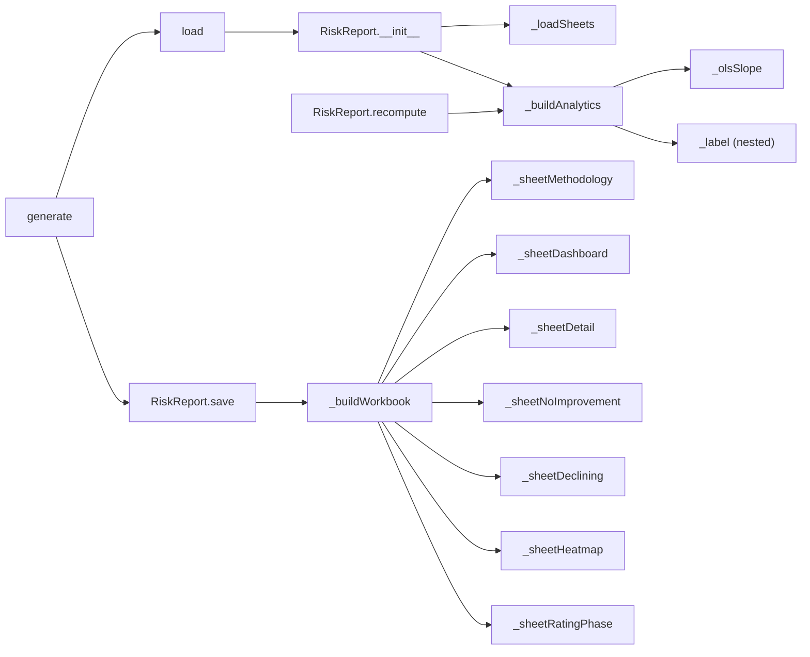
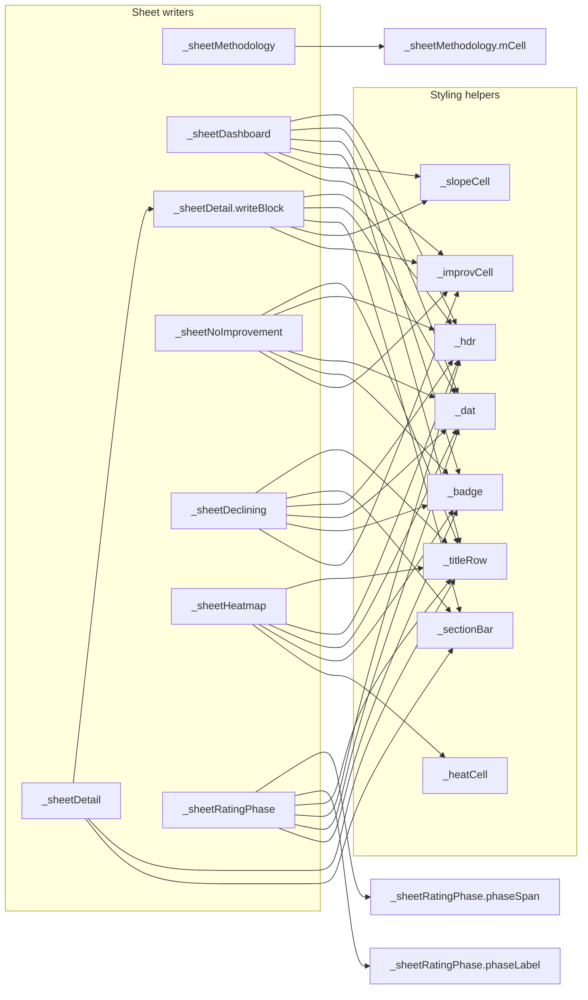
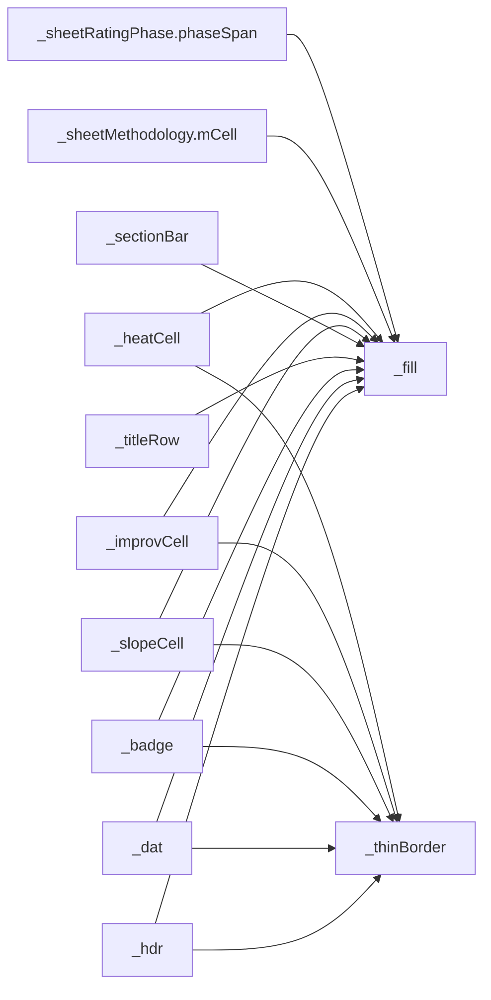

# `risk_report.py`

> Turns a combined per-student scores/ratings/practice-readiness workbook into a seven-sheet, colour-coded Excel "student performance risk report", flagging at-risk students against nine configurable indicators.

| | |
|---|---|
| **Lines of code** | 1205 |
| **Top-level functions** | 23 (plus 9 `RiskReport` methods and 5 nested helpers = 37 function definitions in total) |
| **Classes** | 1 (`RiskReport`) |
| **Module constants** | 4 (`DEFAULTS`, `FLAG_LABELS`, `C`, `RISK_COLORS`) |
| **Imports from this codebase** | none (stdlib + `numpy`, `pandas`, `openpyxl` only) |
| **Imported by** | `main.ipynb` — `from risk_report import generate` (notebook line 1817). No other module in this codebase imports it (`cross_edges_in` is empty). |
| **Run how** | imported by `main.ipynb`; the analyst calls `generate(inputPath, outputPath, cohort=...)` — or `load(...)` for the interactive/threshold-tweaking workflow |

> **Note on the fact file's `notebook_entry_points`.** The machine-parsed facts list `_hdr` (2 calls) as a notebook entry point. This is a **name collision, not a real call**: `main.ipynb` only imports `generate` from this module (line 1817), and defines its **own** four-argument `_hdr(ws, row, col, value)` at notebook line 2180, which is what notebook line 2212 calls. `risk_report._hdr` is never invoked from the notebook. The only genuine notebook entry point is **`generate`**.

---

## 1. Purpose and role in the pipeline

`risk_report.py` sits at the **end** of the DDS/BOH simulation-clinic analytics chain. Upstream, the `flagging_utils` export step writes a "combined scores and ratings" workbook for a cohort and period (the `FHY` / `SHY` / `ALL` first-half-year / second-half-year / whole-year split); this module reads that workbook and turns it into a human-readable Excel deliverable for course coordinators.

It consumes **one `.xlsx` file with five named sheets** (defaults, all overridable via `cfg`):

| `cfg` key | Default sheet name | Contents this module relies on |
|---|---|---|
| `sheetScores` | `scores` | `student_number`, `student_name`, `Avg Score`, and one column per week (any column whose name contains `"Week"`) |
| `sheetRatings` | `global_ratings` | `student_number`, `Avg Score`, and the **same** week columns — the assessor's holistic **GR** (global rating) on a 1–5 scale |
| `sheetPr` | `practice_readiness` | `student_number`, `Avg Score`, week columns — the assessor's **PR** (practice-readiness) judgement |
| `sheetMissing` | `scores_missing` | `student_number`, `missing_item_codes` (a stringified Python list) |
| `sheetRepeated` | `repeated_attempts` | `student_number` — one row per repeated attempt |

It produces **one `.xlsx` file with seven sheets**: `0_Methodology`, `1_Risk_Dashboard`, `2_High_Risk_Detail`, `3_No_Improvement`, `4_Declining_Trend`, `5_Score_Heatmap`, `6_Rating_Phase_Trajectory`.

The analytical core is `_buildAnalytics()`: it computes per-student metrics (an OLS slope per week, a first-window vs last-window improvement, a count of low-scoring weeks, volatility, a late-stage stall measure, and three-phase rating averages), evaluates **nine boolean flags** against the config thresholds, sums them into `risk_score`, and maps that count onto one of four **risk tiers** — `High Risk` (≥ 4 flags), `Moderate Risk` (≥ 2), `Watch` (≥ 1), `OK` (0).

The module docstring (lines 1–45) makes the design intent explicit: it is meant to be usable two ways — a one-liner `generate(...)` for the notebook, and a stateful `load(...) → tweak `rr.cfg` → `rr.recompute()` → `rr.save(...)` loop for interactive threshold exploration. The `0_Methodology` sheet is generated from the *live* config, so the thresholds documented in the output always match the thresholds actually applied. The methodology sheet also argues, in prose written into the workbook (lines 564–575), why the report does **not** use percentile-based flagging: percentile is relative rather than absolute, carries no trajectory information, ignores GR/PR as independent evidence streams, and flags a constant fraction of students regardless of absolute performance.

---

## 2. External dependencies

| Library / resource | Used for |
|---|---|
| `pathlib.Path` | `RiskReport.save()` — resolving the output path and `mkdir(parents=True, exist_ok=True)` |
| `typing.Optional` | **imported at line 50 but never used** |
| `numpy` (`np`) | `_olsSlope` only — `np.nan` and `np.arange` |
| `pandas` (`pd`) | `ExcelFile`, `read_excel`, all DataFrame maths, `pd.isna` |
| `openpyxl.Workbook` | The output workbook object built by `_buildWorkbook` |
| `openpyxl.styles` (`Alignment`, `Border`, `Font`, `PatternFill`, `Side`) | Every cell style in the module |
| `openpyxl.utils.get_column_letter` | Column-width setting on sheets with a variable number of week columns |
| **Filesystem (read)** | the input `.xlsx` (read five times, once per sheet) |
| **Filesystem (write)** | the output `.xlsx`; parent directories are created if missing |
| **Environment variables** | none |
| **Network / database** | none |
| **`eval()`** | `_buildAnalytics` line 333 calls `eval()` on the `missing_item_codes` cell — see Gotchas |

---

## 3. Module-level constants and variables

| Name | Type | Value / shape | Purpose |
|---|---|---|---|
| `DEFAULTS` | `dict`, 22 keys | 6 sheet-name/keyword settings + 16 numeric thresholds | The base config; `RiskReport.__init__` builds `self.cfg = {**DEFAULTS, **cfgOverrides}` so **any** key can be overridden as a keyword argument to `load()`/`generate()` |
| `FLAG_LABELS` | `dict[str, str]`, 9 entries | flag column name → human label | Used to render the "Flags Triggered" text column on sheets 1 and 2 |
| `C` | `dict[str, str]`, 14 entries | palette name → 6-digit hex (no `#`) | House palette for all fills and fonts |
| `RISK_COLORS` | `dict[str, tuple]`, 4 entries | risk tier → `(badgeBg, rowTint, badgeFg)` | Badge and row-tint colours per tier |

### `DEFAULTS` (lines 63–90)

```python
DEFAULTS = dict(
    # Sheet names
    sheetScores="scores", sheetRatings="global_ratings", sheetPr="practice_readiness",
    sheetMissing="scores_missing", sheetRepeated="repeated_attempts",
    weekColKeyword="Week",
    # Thresholds
    sdBelowMeanScore=1.0, decliningSlope=-0.001, improvementWindow=5,
    improvementMinGain=0.02, sdBelowMeanRating=1.0, sdBelowMeanPr=1.0,
    lowScoreThreshold=0.65, lowScoreWeekCount=3, missingThreshold=2,
    lateStallWindow=3, lateStallDrop=0.05,
    highRiskFlags=4, moderateRiskFlags=2, watchFlags=1, minWeeksForSlope=4,
    ratingPhaseDropMin=0.3,   # 0.3 points on 1–5 scale
)
```

| Key | Default | Meaning |
|---|---|---|
| `sheetScores` / `sheetRatings` / `sheetPr` / `sheetMissing` / `sheetRepeated` | see above | Names of the five required input sheets |
| `weekColKeyword` | `"Week"` | A column of the `scores` sheet is treated as a week column if its name **contains** this substring |
| `sdBelowMeanScore` | `1.0` | Flag 1: avg score more than N SD below the cohort mean |
| `decliningSlope` | `-0.001` | Flag 2: OLS slope per week below this value counts as "declining" |
| `improvementWindow` | `5` | Weeks at each end used for the early-vs-late comparison |
| `improvementMinGain` | `0.02` | Flag 3: gain below 2 percentage points = "no improvement" |
| `sdBelowMeanRating` | `1.0` | Flag 4: avg global rating N SD below the cohort mean |
| `sdBelowMeanPr` | `1.0` | Flag 5: avg practice readiness N SD below the cohort mean |
| `lowScoreThreshold` | `0.65` | Absolute per-week floor (65%) |
| `lowScoreWeekCount` | `3` | Flag 6: at least N weeks below the floor |
| `missingThreshold` | `2` | Flag 7: at least N missing item codes |
| `lateStallWindow` | `3` | Number of final weeks used for the stall check |
| `lateStallDrop` | `0.05` | Flag 8: last N weeks more than 5 pp below the mid-semester average |
| `highRiskFlags` / `moderateRiskFlags` / `watchFlags` | `4` / `2` / `1` | Flag-count cut-offs for the risk tiers |
| `minWeeksForSlope` | `4` | Fewer non-null weeks than this ⇒ slope is `NaN` |
| `ratingPhaseDropMin` | `0.3` | Flag 9: last-third average rating this many points (on the 1–5 scale) below the first-third average |

### `FLAG_LABELS` (lines 92–102)

Nine entries mapping the boolean flag columns to display text:

```python
"flag_low_avg_score"    : "Low avg score",
"flag_declining_score"  : "Declining trend",
"flag_rating_phase_drop": "Rating declined across thirds",
```

Full key set: `flag_low_avg_score`, `flag_declining_score`, `flag_no_improvement`, `flag_low_rating`, `flag_low_pr`, `flag_many_low_weeks`, `flag_missing`, `flag_late_stall`, `flag_rating_phase_drop`.

### `C` — palette (lines 105–113)

Fourteen hex strings, stored **without** a leading `#` (openpyxl style):

```python
navy = "1A2B4A",  darkSlate = "2C3E50",
redH = "C0392B",  orangeM   = "E67E22",  yellowW = "F39C12",  greenOk = "27AE60",
bgRed = "FDECEA", bgOrange  = "FEF5EC",  bgYellow = "FEFAE8", bgGreen = "EAF8F0",
lightGrey = "F5F5F5", white = "FFFFFF",  tabHdr = "34495E",   subHdr = "7F8C8D",
```

`C["subHdr"]` is **never referenced** — the same hex `7F8C8D` is instead hard-coded inline in a dozen places.

### `RISK_COLORS` (lines 115–120)

Risk tier → `(badge background, row tint, badge foreground)`:

```python
"High Risk"    : ("C0392B", "FDECEA", "FFFFFF"),
"Moderate Risk": ("E67E22", "FEF5EC", "FFFFFF"),
"Watch"        : ("F39C12", "FEFAE8", "2C3E50"),
"OK"           : ("27AE60", "EAF8F0", "FFFFFF"),
```

The middle element (the row tint) is **discarded** by `_badge` (`badgeBg, _, badgeFg = ...`, line 465) and is not used anywhere else, so it is effectively dead.

---

## 4. Classes

### `RiskReport`

*Lines 168–277.* No base classes (implicitly `object`).

Holds the raw DataFrames, the active config, the computed analytics, and knows how to write the workbook. The docstring states all attributes are public and may be inspected freely.

**Attributes** (all set in `__init__`)

| Attribute | Type | Contents |
|---|---|---|
| `cohort` | `str` | Label used in every sheet heading, e.g. `"DDS2"`, `"DDS3"`, `"BOH2"` |
| `cfg` | `dict` | `{**DEFAULTS, **cfgOverrides}` — the active config |
| `scores` | `DataFrame` | Raw `scores` sheet |
| `ratings` | `DataFrame` | Raw `global_ratings` sheet |
| `pr` | `DataFrame` | Raw `practice_readiness` sheet |
| `missing` | `DataFrame` | Raw `scores_missing` sheet |
| `repeated` | `DataFrame` | Raw `repeated_attempts` sheet |
| `weekCols` | `list[str]` | Columns of `scores` containing `cfg["weekColKeyword"]`, in sheet order |
| `df` | `DataFrame` | Per-student analytics + 9 flag columns + `risk_score` + `risk_label`, sorted by `risk_score` desc then `avg_score` asc |
| `stats` | `dict` | Cohort-level summary stats and phase metadata (see `_buildAnalytics`) |

**Methods**

| Signature | One line |
|---|---|
| `__init__(self, inputPath, cohort="Cohort", **cfgOverrides)` | Load sheets, detect week columns, build analytics, print a one-line summary |
| `recompute(self)` | Re-run `_buildAnalytics` with the current `self.cfg`; returns `self` |
| `save(self, outputPath) -> str` | Build the workbook, create parent dirs, save, print, return the resolved path |
| `highRisk` *(property)* | `df` rows where `risk_label == "High Risk"` |
| `moderateRisk` *(property)* | `df` rows where `risk_label == "Moderate Risk"` |
| `declining` *(property)* | `df` rows with `score_slope < 0`, sorted ascending |
| `noImprovement` *(property)* | `df` rows with `score_improvement < cfg["improvementMinGain"]`, sorted ascending |
| `summary(self) -> DataFrame` | One row per risk tier: `n_students`, `avg_score_mean/min/max`, indexed by `risk_tier` |
| `__repr__(self)` | `RiskReport(cohort=…, students=…, weeks=…, high=…, moderate=…)` |

#### `RiskReport.__init__(self, inputPath: str, cohort: str = "Cohort", **cfgOverrides)`

*Lines 185–214.*

**Behaviour** — 1. Store `cohort`; merge `DEFAULTS` with `cfgOverrides` into `self.cfg` (overrides win; **no validation that an override key is a known key**, so a typo is silently accepted). 2. `_loadSheets()` → the five DataFrames. 3. `weekCols` = columns of `scores` whose `str(c)` contains `cfg["weekColKeyword"]`; raises `ValueError` naming the keyword and sheet if none match. 4. `_buildAnalytics(...)` → `self.df`, `self.stats`.

**Side effects** — reads the input workbook from disk; **prints** a summary line: `Loaded: {cohort} | N students | N weeks | High: n Mod: n Watch: n OK: n`.

**Calls** — `risk_report:_loadSheets`, `risk_report:_buildAnalytics`.

#### `RiskReport.recompute(self)`

*Lines 216–223.* Re-runs `_buildAnalytics` on the **already-loaded** raw DataFrames with the current `self.cfg`, replacing `self.df` and `self.stats`. Returns `self` (so it chains). Does not re-read the file and does not print.

**Calls** — `risk_report:_buildAnalytics`.

#### `RiskReport.save(self, outputPath: str) -> str`

*Lines 225–232.*

**Returns** — `str(Path(outputPath))`.

**Behaviour** — 1. `Path(outputPath)`; `out.parent.mkdir(parents=True, exist_ok=True)`. 2. `_buildWorkbook(self)`. 3. `wb.save(str(out))`.

**Side effects** — **creates directories and writes the `.xlsx`**; **prints** `Saved → {out}`.

**Calls** — `risk_report:_buildWorkbook`. **Called by** — `risk_report:generate`.

#### Properties `highRisk`, `moderateRisk`, `declining`, `noImprovement` and method `summary()`

*Lines 236–269.* Convenience query shortcuts for interactive notebook use. **None of them is called anywhere else in this module** — the sheet writers re-derive the same subsets inline (e.g. `_sheetDeclining` recomputes `rr.df[rr.df.score_slope < 0].sort_values("score_slope")` at line 833, which is byte-for-byte the body of the `declining` property).

- `highRisk` / `moderateRisk` — straight `risk_label` equality filters; `moderateRisk` has no docstring.
- `declining` — `df[df.score_slope < 0]` sorted by `score_slope` ascending. Note this uses a hard `< 0`, **not** `cfg["decliningSlope"]` (`-0.001`), so it is a slightly wider set than `flag_declining_score`.
- `noImprovement` — `df[df.score_improvement < cfg["improvementMinGain"]]` sorted ascending; this one *does* respect the config.
- `summary()` — builds a 4-row DataFrame over the fixed tier order `["High Risk", "Moderate Risk", "Watch", "OK"]`, indexed by `risk_tier`. Empty tiers produce `NaN` for the mean/min/max.

#### `RiskReport.__repr__(self)`

*Lines 271–277.* Returns `RiskReport(cohort='…', students=N, weeks=N, high=N, moderate=N)`. Note the stray space inside `f"high={( self.df.risk_label=='High Risk').sum()}"` at line 275 — cosmetic only.

---

## 5. Function reference

Sections below follow the source's own banner comments: **PUBLIC API** (line 123), **RiskReport CLASS** (line 164, documented in §4), **INTERNAL – DATA LOADING & ANALYTICS** (line 280), **INTERNAL – STYLING HELPERS** (line 435), **INTERNAL – SHEET WRITERS** (line 525), **WORKBOOK BUILDER** (line 1192).

### 5.1 Public API

#### `load(inputPath: str, cohort: str = "Cohort", **cfgOverrides) -> "RiskReport"`

*Lines 127–145.* Loads a workbook and returns a `RiskReport` ready for inspection or saving.

**Parameters**

| Name | Type | Default | Description |
|---|---|---|---|
| `inputPath` | `str` | — | Path to the input `.xlsx` |
| `cohort` | `str` | `"Cohort"` | Label used in report headings, e.g. `"DDS3"`, `"BOH2"` |
| `**cfgOverrides` | | | Any key from `DEFAULTS`, e.g. `lowScoreThreshold=0.60, highRiskFlags=3` |

**Returns** — a constructed `RiskReport`.

**Behaviour** — a one-line pass-through to the constructor. Nothing is saved.

**Side effects** — via the constructor: reads the workbook and prints the load summary.

**Called by** — `risk_report:generate`.

---

#### `generate(inputPath: str, outputPath: str, cohort: str = "Cohort", **cfgOverrides) -> "RiskReport"`

*Lines 148–161.* **The module's real notebook entry point.** Load, compute, and save in one call.

**Parameters** — as `load()`, plus `outputPath` (`str`, the destination `.xlsx`).

**Returns** — the `RiskReport`, so `.df` can still be inspected after saving.

**Behaviour** — 1. `rr = load(inputPath, cohort=cohort, **cfgOverrides)`. 2. `rr.save(outputPath)`. 3. Return `rr`. The resolved path returned by `save()` is discarded.

**Side effects** — reads the input workbook; **writes the output workbook** (creating parent directories); **prints** two lines (the load summary and `Saved → …`).

**Calls** — `risk_report:load` (→ `RiskReport.__init__` → `_loadSheets`, `_buildAnalytics`; then `RiskReport.save` → `_buildWorkbook`).
**Called by** — `main.ipynb`.

**Example** (from `main_notebook_code.py`, lines 1817–1824):

```python
from risk_report import generate

# Reads the combined workbook for the SAME period, so the risk report inherits the
# FHY/SHY/ALL split from its input filename — no period argument needed here.
riskIn  = periodSuffixPath(os.path.join(folder, "dds2 combined scores and ratings.xlsx"), PERIOD)
riskOut = periodSuffixPath(os.path.join(folder, "dds2 sim risk report.xlsx"), PERIOD)
generate(riskIn, riskOut, cohort="DDS2")
print(f"Risk report ({PERIOD}): {riskIn} -> {riskOut}")
```

The interactive workflow is documented in the module docstring (lines 11–26) but has no call site in `main.ipynb`:

```python
from risk_report import load, RiskReport
rr = load("my_cohort.xlsx", cohort="DDS3")
rr.df[rr.df.risk_label == "High Risk"]
rr.cfg["lowScoreThreshold"] = 0.60
rr.recompute()
rr.save("output_report.xlsx")
```

---

### 5.2 Data loading and analytics

#### `_loadSheets(path: str, cfg: dict)`

*Lines 284–305.* Validates that all five required sheets exist, then reads them.

**Returns** — a 5-tuple `(scores, ratings, pr, missing, repeated)` of DataFrames, in that fixed order.

**Behaviour** — 1. Open with `pd.ExcelFile(path)` to read `sheet_names`. 2. Compare the five configured names against `xf.sheet_names`; raise `ValueError` listing the missing ones **and** the available names if any are absent. 3. Read each sheet with a **separate `pd.read_excel(path, sheet_name=…)` call** — the file is therefore parsed five more times rather than being read from the already-open `ExcelFile` handle.

**Side effects** — reads the input file from disk (six opens in total).

**Called by** — `risk_report:RiskReport.__init__`.

---

#### `_olsSlope(row, cols, minWeeks: int) -> float`

*Lines 308–317.* Ordinary-least-squares slope of a student's weekly values, hand-computed (no `numpy.polyfit`/`scipy`).

**Parameters**

| Name | Type | Default | Description |
|---|---|---|---|
| `row` | `Series` | — | One student's row |
| `cols` | `list` | — | The week column names |
| `minWeeks` | `int` | — | Minimum non-null values required (`cfg["minWeeksForSlope"]`) |

**Returns** — the slope as `float`; `np.nan` when fewer than `minWeeks` non-null values; `0.0` when the x-variance `ssx` is zero.

**Behaviour** — 1. `row[cols].dropna()`. 2. Guard on length. 3. `x = np.arange(len(vals))` — **note the x-axis is the position among the *non-missing* weeks, not the actual week number**, so missing weeks compress the time axis rather than leaving a gap. 4. `slope = Σ((x-x̄)(y-ȳ)) / Σ((x-x̄)²)`.

**Called by** — `risk_report:_buildAnalytics` (three times: scores, ratings, PR).

---

#### `_buildAnalytics(scores, ratings, pr, missing, repeated, weekCols, cfg)`

*Lines 320–432.* **The analytical core.** Produces the per-student analytics DataFrame and the cohort stats dict.

**Parameters** — the five raw DataFrames, the detected `weekCols` list, and the active `cfg` dict.

**Returns** — `(df, stats)`.

`df` columns, in construction order:

| Column | Derivation |
|---|---|
| `student_number`, `student_name` | From `scores` |
| `avg_score`, `avg_rating`, `avg_pr` | The `Avg Score` column of `scores`, `ratings`, `pr` respectively |
| `score_slope`, `rating_slope`, `pr_slope` | `_olsSlope` over `weekCols` on each sheet |
| `low_score_weeks` | Count of non-null week values `< cfg["lowScoreThreshold"]` |
| `first5_score`, `last5_score`, `score_improvement` | Mean of the first/last `improvementWindow` week columns and their difference |
| `first5_rating`, `last5_rating` | Same windows on `ratings` (computed but **no flag or sheet uses them**) |
| `volatility` | `scores[weekCols].std(axis=1)` (computed but **never used by any sheet or flag**) |
| `late_stall` | Mean of the last `lateStallWindow` weeks − mean of `midCols` (negative = stalled) |
| `rating_phase_first/mid/last` | Mean rating over each equal third of `weekCols` |
| `rating_phase_drop` | `rating_phase_last − rating_phase_first` (negative = dropped) |
| `missing_count` | `len(eval(missing_item_codes))` per student, mapped by `student_number`, `NaN`→0 |
| `repeated_count` | `repeated.groupby("student_number").size()`, mapped, `NaN`→0 (computed but **never used by any flag or sheet**) |
| `flag_*` (9 columns) | See flag table below |
| `risk_score` | Row-wise sum of all `flag_*` columns |
| `risk_label` | `_label(risk_score)` |

`stats` keys: `cohortAvgScore`, `cohortSdScore`, `cohortAvgRating`, `cohortSdRating`, `cohortAvgPr`, `cohortSdPr`, `flagCols`, `phaseFirstCols`, `phaseMidCols`, `phaseLastCols`, `cohortRatingPhaseFirst`, `cohortRatingPhaseMid`, `cohortRatingPhaseLast`.

**Behaviour**

1. **Cohort stats** — mean and (sample, `ddof=1`) SD of the `Avg Score` column on each of the three measure sheets.
2. **Ancillary counts** — for each row of `missing`, `eval(row["missing_item_codes"])` inside a bare `try/except Exception` that silently substitutes `[]`; `missingCount[student_number] = len(codes)`. `repeatedCount` from a `groupby().size()`.
3. **Phase split** — `seg = len(weekCols) // 3`; first phase `weekCols[:seg]`, mid `weekCols[seg:2*seg]`, last `weekCols[2*seg:]`. The remainder deliberately lands in the **last** phase, so with 16 weeks the split is 5/5/6.
4. **Per-student metrics** — as listed in the table above. Note `midCols = weekCols[impW:-lstW]` **only if** `len(weekCols) > impW + lstW`; otherwise it falls back to the *entire* `weekCols`, which makes `late_stall` compare the last three weeks against an average that includes them.
5. **DataFrame assembly** — every column is assigned via `.values`, i.e. **positional alignment**. `student_number` and `student_name` come from `scores`, but `avg_rating` comes from `ratings` and `avg_pr` from `pr` with no join key. This silently assumes all three sheets contain the same students in the same row order.
6. **Flags** (lines 396–405):

| Flag column | Condition |
|---|---|
| `flag_low_avg_score` | `avg_score < cohortAvgScore − sdBelowMeanScore × cohortSdScore` |
| `flag_declining_score` | `score_slope < cfg["decliningSlope"]` |
| `flag_no_improvement` | `score_improvement < cfg["improvementMinGain"]` |
| `flag_low_rating` | `avg_rating < cohortAvgRating − sdBelowMeanRating × cohortSdRating` |
| `flag_low_pr` | `avg_pr < cohortAvgPr − sdBelowMeanPr × cohortSdPr` |
| `flag_many_low_weeks` | `low_score_weeks >= cfg["lowScoreWeekCount"]` |
| `flag_missing` | `missing_count >= cfg["missingThreshold"]` |
| `flag_late_stall` | `late_stall < −cfg["lateStallDrop"]` |
| `flag_rating_phase_drop` | `rating_phase_drop < −cfg["ratingPhaseDropMin"]` |

7. **Risk score** — `flagCols` is discovered dynamically as every column starting with `"flag_"`, then summed row-wise (booleans sum as 0/1; `NaN` in a comparison yields `False`, so a student with a `NaN` slope simply does not get that flag).
8. **Labelling** — the nested `_label(n)` maps the count onto a tier.
9. **Sort** — `sort_values(["risk_score", "avg_score"], ascending=[False, True])` then `reset_index(drop=True)`: highest flag count first, lowest average first within a tier.

**Side effects** — none on disk. `eval()` executes whatever string is in the `missing_item_codes` cell.

**Calls** — `risk_report:_olsSlope`. **Called by** — `risk_report:RiskReport.__init__`, `risk_report:RiskReport.recompute`.

**Nested functions**

| Name | Signature | One line |
|---|---|---|
| `_label` | `_label(n)` *(lines 410–414)* | `n >= highRiskFlags` → `"High Risk"`; `>= moderateRiskFlags` → `"Moderate Risk"`; `>= watchFlags` → `"Watch"`; else `"OK"`. Closes over `cfg`. |

---

### 5.3 Styling helpers

These wrap `openpyxl` cell creation. All of them **write into the worksheet as a side effect**; most also return the cell.

#### `_fill(hex_)`

*Lines 439–440.* Returns `PatternFill("solid", fgColor=hex_)`. The most-called helper in the module (18 distinct callers).

#### `_thinBorder()`

*Lines 442–444.* Returns a `Border` with a thin `D0D0D0` `Side` on all four edges. A fresh `Border` object is constructed per call.

#### `_hdr(ws, row, col, val, bg="2C3E50", fg="FFFFFF", sz=10, wrap=False, halign="center")`

*Lines 446–452.* Writes a bold, filled, bordered **header** cell in Arial and returns it.

**Behaviour** — sets `Font(name="Arial", bold=True, color=fg, size=sz)`, a solid `bg` fill, `Alignment(horizontal=halign, vertical="center", wrap_text=wrap)`, and a thin border.

**Side effects** — mutates `ws`.

**Calls** — `_fill`, `_thinBorder`. **Called by** — every sheet writer except `_sheetMethodology`.

> Do **not** confuse this with the notebook's own `_hdr(ws, row, col, value)` at `main_notebook_code.py` line 2180 — despite what the facts file's `notebook_entry_points` implies, `main.ipynb` never calls this one.

#### `_dat(ws, row, col, val, fmt=None, bold=False, color="2C3E50", bg=None, halign="center", wrap=False, sz=9)`

*Lines 454–462.* Writes a **data** cell — Arial at `sz`, optional bold/colour/number-format/fill, always bordered and vertically centred. Returns the cell. `fmt` and `bg` are applied only when truthy.

#### `_badge(ws, row, col, label)`

*Lines 464–470.* Writes a risk-tier badge cell: looks the label up in `RISK_COLORS`, using the badge background and foreground and **discarding the middle (row-tint) element**. Bold Arial 9, centred, bordered. Returns `None`. Raises `KeyError` for an unknown label.

#### `_titleRow(ws, row, c1, c2, text, bg, sz=13, fg="FFFFFF")`

*Lines 472–477.* Merges `c1..c2` on `row` and writes a large bold centred title on the merged cell. No border.

#### `_sectionBar(ws, row, c1, c2, text, bg, fg="FFFFFF")`

*Lines 479–484.* Same as `_titleRow` but size 10 and **left**-aligned; used for the coloured "HIGH RISK / MODERATE RISK / NEGATIVE TREND / LATE-STAGE STALL" bars.

#### `_slopeCell(ws, row, col, slope, bg)`

*Lines 486–493.* Writes a slope as `"▼ -0.0034"` / `"▲ +0.0071"` / `"→ +0.0002"` with a matching colour.

**Behaviour** — arrow and colour are chosen by **hard-coded** cut-offs: `slope < -0.001` → `▼` red `C0392B`; `slope > 0.005` → `▲` green `27AE60`; otherwise `→` grey `7F8C8D`. The value is formatted `f"{slope:+.4f}"` (a text string, not a number). Note the down-arrow threshold happens to equal `DEFAULTS["decliningSlope"]` but is **not** read from `cfg`, so overriding `decliningSlope` desynchronises the arrows from the flags. A `NaN` slope makes both comparisons `False`, so it renders as `"→ nan"`.

#### `_improvCell(ws, row, col, improv, bg)`

*Lines 495–502.* Writes an improvement value as a signed percentage (`"+0.0%;-0.0%;0.0%"`), coloured green when `improv >= 0.02`, red when `improv < 0`, orange in between. The `0.02` is hard-coded rather than taken from `cfg["improvementMinGain"]`.

#### `_heatCell(ws, row, col, val, fallbackBg)`

*Lines 504–522.* Writes one heat-map cell for the score grid.

**Behaviour** — 1. `NaN` → an em-dash `"—"` in grey italic on an `EEEEEE` fill. 2. Otherwise a percentage-formatted numeric cell whose fill is banded: `< 0.60` → `E74C3C` with white text; `< 0.65` → `F5B7B1`; `< 0.70` → `FAD7A0`; `>= 0.85` → `A9DFBF`; otherwise `fallbackBg` (the row's alternating tint). All five cut-offs are hard-coded.

**Called by** — `risk_report:_sheetHeatmap` only.

---

### 5.4 Sheet writers

Each writer takes `(wb, rr)` and appends one worksheet. All of them mutate `wb` and return `None`.

#### `_sheetMethodology(wb, rr: RiskReport)`

*Lines 529–625.* Writes sheet **`0_Methodology`** — the indicator guide and risk-tier definitions.

**Behaviour**

1. Uses `wb.active` (the default sheet openpyxl creates) and **renames it** to `0_Methodology`; grid lines off; column widths A=2, B=30, C=60, D=22.
2. Merged navy title `"{cohort} Student Performance Risk Report"` (row 1, height 36) and a dark-slate italic subtitle `"Methodology & Indicator Guide"` (row 2).
3. **"WHY NOT PERCENTILE ALONE?"** — four hard-coded rationale/detail pairs arguing against percentile-only flagging (lines 564–575).
4. **"RISK INDICATORS"** — a three-column table (Indicator / Threshold / Why it matters). The threshold strings are **generated from the live `cfg` and `stats`**, so e.g. "Low Average Score" prints the actual computed cut-off `cohortAvgScore − 1×cohortSdScore` as a percentage. Row height fixed at 46.
5. **"RISK TIER DEFINITIONS"** — four rows (High Risk / Moderate Risk / Watch / OK) with the flag-count thresholds from `cfg`, tinted with `C["bgRed"]` / `bgOrange` / `bgYellow` / `bgGreen` and a recommended action.
6. `r` is a running row cursor incremented by hand throughout.

**Side effects** — mutates `wb`; renames the default worksheet.

**Calls** — `risk_report:_fill`, `risk_report:_thinBorder`. **Called by** — `risk_report:_buildWorkbook`.

**Nested functions**

| Name | Signature | One line |
|---|---|---|
| `mCell` | `mCell(r, c, v, bold=False, sz=10, color="2C3E50", bg=None, italic=False)` *(lines 538–543)* | Writes a left/top-aligned wrapped Arial cell with optional fill; the methodology sheet's own cell helper (no border, unlike `_dat`). |

---

#### `_sheetDashboard(wb, rr: RiskReport)`

*Lines 628–683.* Writes sheet **`1_Risk_Dashboard`** — one row per student, all students, in `rr.df` order (risk-sorted).

**Behaviour**

1. Fixed column widths for A–M; navy title row; a dark `tabHdr` stats strip in row 2 (`Students / Avg Score / Avg Rating / High / Mod / Watch / OK`).
2. Header row 3 (12 headers from `#` through `Flags Triggered`), height 30, `freeze_panes = "C4"`.
3. Per student: alternating `F5F5F5`/white tint; index number; name (bold if High Risk); risk badge; `risk_score` (bold if **≥ 4**, hard-coded, not `cfg["highRiskFlags"]`); `avg_score` as `0.0%`; `avg_rating` and `avg_pr` as `0.00`; a `_slopeCell`; an `_improvCell`; `low_score_weeks` in red if **≥ 5** (a magic number appearing nowhere else in the config); `missing_count` in red if **≥ 2**; and a semicolon-joined list of triggered `FLAG_LABELS`, or `"—"` when none.
4. Row height fixed at 16.

**Calls** — `_titleRow`, `_hdr`, `_dat`, `_badge`, `_slopeCell`, `_improvCell`, `_fill`, `_thinBorder`. **Called by** — `_buildWorkbook`.

---

#### `_sheetDetail(wb, rr: RiskReport)`

*Lines 686–778.* Writes sheet **`2_High_Risk_Detail`** — two stacked blocks (High Risk, then Moderate Risk) with the full week-by-week score grid.

**Behaviour**

1. Column widths: B=26 for names, C–G fixed, then one 7-wide column per week starting at column 8. `eoc = 8 + len(weekCols)` marks the "Low Wks" column, with "Missing" at `eoc+1` and "Flags Triggered" (width 32) at `eoc+2`.
2. Navy title spanning `2..eoc+2`.
3. Calls the nested `writeBlock` twice — once for `High Risk` with `C["redH"]`, once for `Moderate Risk` with `C["orangeM"]` — chaining the returned next-free row.
4. `ws.freeze_panes = "C4"` is set at the very end (line 778), after both blocks are written.

**Calls** — `_titleRow`, `_sectionBar`, `_hdr`, `_dat`, `_slopeCell`, `_improvCell`, `_fill`, `_thinBorder`. **Called by** — `_buildWorkbook`.

**Nested functions**

##### `writeBlock(students, sectionTitle, bgTitle, startRow)`

*Lines 707–770.* Writes one risk-tier block and **returns the next free row** (`startRow + len(students) + 2`, i.e. two blank spacer rows after the block).

1. A coloured `_sectionBar` with the tier name and student count.
2. A header row: `Student Name, Avg Score, Avg Rating, Avg PR, Score Trend, Early→Late`, then `Wk1..WkN` **positional labels** (`f"Wk{i+1}"`, *not* the real week column names), then `Low Wks, Missing, Flags Triggered`.
3. A grey **"─── Cohort Average ───"** reference row carrying `cohortAvgScore`, `cohortAvgRating`, `cohortAvgPr` and the per-week cohort means (`rr.scores[rr.weekCols].mean()`).
4. Per student: an alternating tint that depends on the block colour (`FDF3F2` for red blocks, `FEF5EC` otherwise); name in bold; the three averages; `_slopeCell`; `_improvCell`; then the weekly grid.
5. The weekly grid is written **inline rather than via `_heatCell`**, with a *different* palette from `_heatCell`: `< 0.60` → `F5B7B1`, `< 0.65` → `FAD7A0`, `< 0.70` → `FDEBD0`, `>= 0.85` → `A9DFBF`, else the row tint; `NaN` → `"—"` on `F5F5F5`.
6. The week values are looked up by matching `student_number` against `weekScoresDf` and taking `.iloc[0]`.
7. Flag text is coloured red for the High-Risk block and orange otherwise; unlike the dashboard it is **not** given a `"—"` fallback (an empty list yields an empty string, which cannot happen here since every listed student has ≥ 2 flags).

---

#### `_sheetNoImprovement(wb, rr: RiskReport)`

*Lines 781–821.* Writes sheet **`3_No_Improvement`** — students whose late-window average did not exceed their early-window average by the configured minimum.

**Behaviour** — 1. Fixed widths A–I; navy title; a grey italic criterion note in row 2 generated from `cfg["improvementWindow"]` and `cfg["improvementMinGain"]`. 2. Eight headers in row 3, `freeze_panes = "C4"`. 3. `subset = rr.df[rr.df.score_improvement < cfg["improvementMinGain"]].sort_values("score_improvement")` — the same predicate as the unused `noImprovement` property. 4. Per row: index, name, `first5_score`, `last5_score`, an `_improvCell` whose background escalates (`FDECEA` when the change is negative, `FEF5EC` when below +1 pp, else the alternating tint), the raw `score_slope` at `0.0000`, `avg_score`, and a risk badge.

**Calls** — `_titleRow`, `_hdr`, `_dat`, `_improvCell`, `_badge`, `_fill`. **Called by** — `_buildWorkbook`.

---

#### `_sheetDeclining(wb, rr: RiskReport)`

*Lines 824–888.* Writes sheet **`4_Declining_Trend`** — two blocks: negative OLS trend, then late-stage stall.

**Behaviour**

1. **Block 1 — "NEGATIVE TREND (OLS slope < 0)"**: `rr.df[rr.df.score_slope < 0].sort_values("score_slope")`. Note the filter is a plain `< 0`, **not** `cfg["decliningSlope"]`, so this list is broader than the students carrying `flag_declining_score`. Columns: index, name, slope (bold red, `0.0000`), `first5_score`, `last5_score`, `_improvCell`, risk badge. `freeze_panes = "C4"`.
2. **Block 2 — "LATE-STAGE STALL"** starts at `4 + len(declining) + 2` and lists `rr.df[rr.df.flag_late_stall].sort_values("late_stall")`. Here `midAvg` and `last3Avg` are **recomputed from `rr.scores`** (rather than reusing the `late_stall` column) by locating the student's row with `.loc[...].mean(axis=1).values[0]`, and `midCols` is re-derived with the exact same `impW`/`lstW` expression as `_buildAnalytics`. The drop is shown bold red with a signed percentage format.

**Calls** — `_titleRow`, `_sectionBar`, `_hdr`, `_dat`, `_improvCell`, `_badge`, `_fill`, `_thinBorder`. **Called by** — `_buildWorkbook`.

---

#### `_sheetHeatmap(wb, rr: RiskReport)`

*Lines 891–934.* Writes sheet **`5_Score_Heatmap`** — the full cohort, one row per student, one column per week.

**Behaviour** — 1. Widths: B=28 name, C=10 risk tier, 7 per week from column 4, then `Avg Score` and `Flags Active` at `eoc`/`eoc+1`. 2. Navy title including the week count; a merged legend row describing the five colour bands and stating "Sorted by Risk Tier then Avg Score" (which is the order `rr.df` already carries). 3. Headers use positional `Wk{i+1}` labels. `freeze_panes = "C4"`. 4. Per student: name, badge, then `_heatCell` per week, then `avg_score` (bold) and `risk_score` coloured red at ≥ 4, orange at ≥ 2, else dark — again hard-coded rather than `cfg`. Row height 14.

**Calls** — `_titleRow`, `_hdr`, `_dat`, `_badge`, `_heatCell`, `_fill`. **Called by** — `_buildWorkbook`.

---

#### `_sheetRatingPhase(wb, rr: RiskReport)`

*Lines 937–1189.* Writes sheet **`6_Rating_Phase_Trajectory`** — the largest writer in the module (~250 lines). Splits the semester into three equal thirds and shows each student's phase-average **global rating** (1–5), the deltas between phases, a trend classification, the flag status, and the per-week rating grid.

**Behaviour**

1. **Column layout** is declared with named constants (lines 977–987): `COL_NAME=2`, `COL_RISK=3`, `COL_PF=4`, `COL_PM=5`, `COL_PL=6`, `COL_D1=7` (mid−first), `COL_D2=8` (last−mid), `COL_DTOTAL=9` (last−first), `COL_TREND=10`, `COL_FLAG=11`, `COL_WK0=12` (weekly ratings start here). `totalCols = COL_WK0 + len(weekCols) - 1`.
2. **Row 1** navy title; **row 2** a merged legend that states the phase ranges, the 1–5 scale, the `ratingPhaseDropMin` threshold, the arrow meanings, and the weekly colour bands.
3. **Row 3** phase divider bars spanning the weekly columns, drawn by the nested `phaseSpan`, in three different greys (`tabHdr`, `546E7A`, `darkSlate`).
4. **Row 4** column headers; each weekly header takes the background of the phase its column belongs to (`wk in pF` / `wk in pM` / else). `freeze_panes = "C5"`.
5. **Row 5** the cohort reference row: the three cohort phase averages from `stats`, the three cohort deltas computed inline, and the per-week cohort rating means.
6. **Student rows from row 6**, sorted by `rating_phase_last` **ascending** so the lowest-rated students appear first — a different order from every other sheet.
7. Per student: the whole row is tinted `FEF0EE` when `flag_rating_phase_drop` is set. Phase averages are colour-banded by absolute level via the nested `ratingBg` closure (`≤ 2.0` red `F5B7B1`, `≤ 2.9` amber `FAD7A0`, `≥ 4.0` green `A9DFBF`, else the alternating tint; `NaN` → `EEEEEE`), with the last-phase value bold.
8. **Deltas** `d1`, `d2` are recomputed here; `dtotal` reuses the precomputed `rating_phase_drop`. Colour: green above `+0.1`, red below `−0.1`, grey in between. `NaN` deltas fall back to a blank `_dat` cell.
9. **Trend classification** (lines 1142–1150) from the shape of `d1`/`d2`, evaluated in this priority order:

| Label | Condition |
|---|---|
| `▲ Rising` | `d1 > 0.1 and d2 > 0.1` |
| `▼ Falling` | `d1 < -0.1 and d2 < -0.1` |
| `↗ Recovery` | `d1 < -0.1 and d2 > 0.2` |
| `↘ Late dip` | `d1 > 0.1 and d2 < -0.2` |
| `▶ Stable` | anything else (the default) |

10. **Flagged indicator** — `"⚑ Yes"` in bold red on `FDECEA`, or `"—"` in grey.
11. **Per-week rating cells** — banded `≤ 2` red, `≤ 2.9` amber, `≥ 4` green, else the row tint; `NaN` → `"—"` on `EEEEEE`. Format `0.0`.

**Calls** — `_titleRow`, `_hdr`, `_dat`, `_badge`, `_fill`, `_thinBorder`. **Called by** — `_buildWorkbook`.

**Nested functions**

| Name | Signature | One line |
|---|---|---|
| `phaseLabel` | `phaseLabel(cols)` *(lines 960–964)* | Renders a compact `"Wks 1–5"` label from the 1-based positions of `cols[0]` and `cols[-1]` within `rr.weekCols`. Raises `IndexError` if `cols` is empty. |
| `phaseSpan` | `phaseSpan(cols, label, bg)` *(lines 1033–1040)* | Merges row 3 across the weekly columns belonging to one phase and writes a centred bold white label on the given background. |
| `ratingBg` | `ratingBg(val)` *(lines 1105–1110)* | Colour band for a 1–5 phase-average rating; defined **inside the per-student loop**, closing over that row's `alt` tint. Not listed in the facts file's `nested` array because it is nested two levels deep. |

---

### 5.5 Workbook builder

#### `_buildWorkbook(rr: RiskReport) -> Workbook`

*Lines 1196–1205.* Creates a fresh `openpyxl.Workbook` and runs the seven sheet writers in fixed order: methodology, dashboard, detail, no-improvement, declining, heatmap, rating phase. Returns the workbook **unsaved**.

**Behaviour** — `_sheetMethodology` must run first because it claims and renames `wb.active`; every other writer uses `wb.create_sheet(...)`.

**Calls** — all seven `_sheet*` writers. **Called by** — `risk_report:RiskReport.save`.

---

## 6. Call graph (this module)

The module has 37 function definitions, so the graph is split into three views.

**A — Entry points, analytics, and workbook assembly**



**B — Sheet writers to styling helpers**



**C — Primitive style helpers**



---

## 7. Gotchas and known issues

**Correctness risks — data alignment**

- **`_buildAnalytics` joins the three measure sheets positionally, not by key** (lines 369–391). `student_number`/`student_name` come from `scores` while `avg_rating` comes from `ratings` and `avg_pr` from `pr`, all via `.values`. If the sheets differ in row order — or, worse, in length — every rating and PR figure is attributed to the wrong student (or the `DataFrame` construction raises a length mismatch). There is no assertion or merge anywhere.
- **`ratings[phaseFirstCols]` and `pr` are indexed with week columns detected from `scores` only** (lines 192–195, 346–354). If the ratings or PR sheets name their week columns differently, this raises a `KeyError` at load time.
- **`eval(row["missing_item_codes"])` (line 333)** executes arbitrary Python from a spreadsheet cell — an obvious injection vector for a file that comes from an upstream export. It is wrapped in a bare `except Exception: codes = []` (line 334), so a malformed cell silently becomes a missing-count of 0 and the student quietly loses `flag_missing`. `ast.literal_eval` would be the safe substitute.

**Correctness risks — small cohorts / short semesters**

- **Fewer than 3 week columns** makes `seg = n // 3 == 0`, so `phaseFirstCols` and `phaseMidCols` are empty lists. The phase means become `NaN`, and `_sheetRatingPhase.phaseLabel(cols)` then raises `IndexError` on `cols[0]` (line 962). Nothing guards against this.
- **Fewer than `improvementWindow * 2` weeks** makes `weekCols[:5]` and `weekCols[-5:]` overlap, so `score_improvement` approaches 0 and `flag_no_improvement` fires for the whole cohort.
- **`midCols` fallback** (line 366 and again line 871): when `len(weekCols) <= impW + lstW`, `midCols` becomes the *entire* week list, so `late_stall` compares the last three weeks against an average that includes them — systematically shrinking the apparent drop.
- `_olsSlope` uses `np.arange(len(vals))` after `dropna()` (line 312), so **the x-axis is position among present weeks, not the week number**. A student missing weeks 3–6 has their remaining weeks treated as consecutive, distorting the slope.

**Duplicated / desynchronised thresholds**

- `_slopeCell` hard-codes `-0.001` and `0.005` (lines 487–488) and `_improvCell` hard-codes `0.02` (line 499) instead of reading `cfg["decliningSlope"]` / `cfg["improvementMinGain"]`. Override either config value and the arrows and colours in the workbook stop matching the flags.
- The dashboard and heatmap hard-code the risk-score colour cut-offs `>= 4` and `>= 2` (lines 668, 933) rather than `cfg["highRiskFlags"]` / `cfg["moderateRiskFlags"]`.
- `low_score_weeks >= 5` and `missing_count >= 2` red-text rules (lines 674–677, 758–761) are magic numbers; the `5` corresponds to no config key at all, and the `2` duplicates `missingThreshold`.
- **Two different heat palettes for the same data**: `_heatCell` (lines 512–516) uses `E74C3C / F5B7B1 / FAD7A0 / A9DFBF`, while `_sheetDetail.writeBlock` writes its grid inline (lines 751–756) with `F5B7B1 / FAD7A0 / FDEBD0 / A9DFBF`. The same score therefore appears in different colours on sheets 2 and 5, and the sheet-5 legend does not describe sheet 2.
- `RiskReport.declining` (line 248) and `_sheetDeclining` (line 833) both filter on `score_slope < 0`, which is **not** `cfg["decliningSlope"]` (`-0.001`). The "Declining Trend" sheet therefore lists a superset of the students actually carrying `flag_declining_score`, with no note explaining the discrepancy.
- `midCols` is derived by the identical expression in two places (lines 366 and 871); changing one without the other silently breaks the stall sheet.

**Documentation drift**

- **The methodology sheet documents only 8 of the 9 flags.** The "RISK INDICATORS" table (lines 582–608) omits `flag_rating_phase_drop` entirely, even though it contributes to `risk_score` and therefore to the tier assignment. It is only described in the sheet-6 legend (line 1018).
- **The module docstring's threshold list (lines 30–44) omits `ratingPhaseDropMin`** and all six sheet-name/keyword settings, so a reader who trusts it will not know those keys are overridable.

**Dead / unused code**

- `from typing import Optional` (line 50) is never used.
- `C["subHdr"]` is never referenced; the same hex `7F8C8D` is hard-coded inline instead.
- The middle element of every `RISK_COLORS` tuple (the row tint) is discarded by `_badge` (line 465) and used nowhere else.
- `df["volatility"]`, `df["repeated_count"]`, `df["first5_rating"]`, `df["last5_rating"]`, `df["rating_slope"]` and `df["pr_slope"]` are all computed in `_buildAnalytics` but **feed no flag and appear on no sheet**. `repeated_count` in particular means the `repeated_attempts` sheet is required as input yet has no effect on the output.
- The five `RiskReport` convenience accessors (`highRisk`, `moderateRisk`, `declining`, `noImprovement`, `summary`) are never called internally; the sheet writers re-derive the same filters inline.

**Operational notes**

- `_loadSheets` opens the input file **six times** (once for `ExcelFile`, then once per `read_excel`), which is slow for large workbooks.
- `RiskReport.__init__` and `RiskReport.save` both `print()`. There is no `verbose` switch, so any loop over cohorts is noisy.
- `_sheetMethodology` depends on being called **first** — it takes over `wb.active`. Reordering `_buildWorkbook` (lines 1197–1204) would leave a stray "Sheet" tab and put the methodology content in the wrong place.
- Week headers on sheets 2, 5 and 6 are positional (`Wk1`, `W1`, …) rather than the real column names, so a workbook whose week columns are non-contiguous (e.g. "Week 2, Week 4, Week 7") will be mislabelled.
- Every `cfgOverride` is accepted without validation (line 187), so `generate(..., lowScoreThreshhold=0.6)` silently does nothing.
- There are no `TODO`/`FIXME`/`HACK` comments anywhere in the file, and only one `try/except` — the `eval` guard at lines 333–334.
