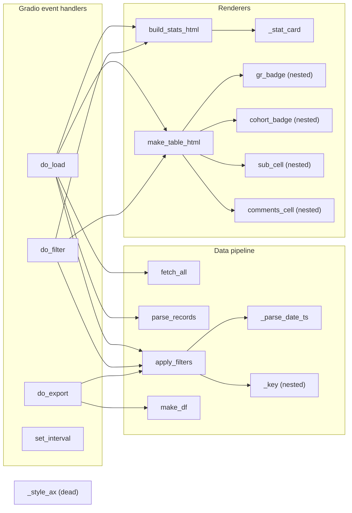

# `scbd_gradio.py`

> A standalone Gradio web dashboard that polls the DASH API for SCBD assessment records and renders them as a live, filterable, auto-refreshing HTML table with summary stat cards and a spreadsheet export.

| | |
|---|---|
| **Lines of code** | 492 |
| **Top-level functions** | 13 (plus 5 nested — 18 in total) |
| **Classes** | 0 |
| **Module constants** | 20 |
| **Imports from this codebase** | **none** — notably it does **not** import `gradio_utils`, unlike `viva_gradio.py`. Every constant it needs is redeclared locally (see §3.5). |
| **Imported by** | Nothing. It is not imported by `main.ipynb` or by any other module; no name from it appears anywhere in `main_notebook_code.py`. |
| **Run how** | Gradio app, run standalone: `python scbd_gradio.py` → serves on `http://localhost:7860` (and, because `share=True`, also on a public Gradio tunnel URL). |

---

## 1. Purpose and role in the pipeline

**SCBD** is one of the assessment form types held in DASH (the University of Melbourne Dental School's assessment platform, `https://api.unimelb-dash.com`). Where the rest of the codebase reads assessment data out of Postgres *after* it has been ingested, this module sits **upstream of the database entirely**: it hits the DASH REST API directly and renders what it gets back. It is a live monitoring tool for coordinators watching a clinical session as it happens — "who has been assessed, who has submitted, what global ratings are coming in" — not a reporting tool.

The file's own docstring describes it as a port: `fetch_all` carries the comment *"Mirrors the JavaScript fetchAll() in scbd_dashboard.html"*, and `make_table_html` / `build_stats_html` both say they match "the HTML dashboard" layout and colour scheme. So this is a Gradio reimplementation of a pre-existing static HTML dashboard, and the visual constants are deliberately copied to keep the two looking identical.

The data flow is a single linear pipeline, re-run on every button click and on every auto-refresh tick:

```
DASH API  →  fetch_all()      →  raw records (list of dict)
          →  parse_records()  →  flat display rows (list of dict, one per assessment)
          →  apply_filters()  →  date range + submitted status + text search + sort
          →  make_table_html() + build_stats_html()  →  HTML strings into gr.HTML components
          →  (on demand) make_df() → do_export() → temp .xlsx file
```

The parsed rows are cached in a `gr.State` (`raw_state`), so the filter/sort/search controls re-render from cache without re-hitting the API; only the **Load** button and the `gr.Timer` tick call the API.

Authentication is entirely env-var driven and **not** exposed in the UI: `DASH_TOKEN` is read once at import time into `ENV_TOKEN` and sent as a Django REST Framework `Authorization: Token <token>` header (not `Bearer`). Optional HTTP basic auth on the Gradio app itself comes from `SCBD_USERNAME` / `SCBD_PASSWORD`.

Everything below `# ── Layout ──` (line 397) executes **at import time**: the `css` string, the `gr.Blocks()` context that constructs every widget, and all the event wiring. Only `demo.launch(...)` is guarded by `if __name__ == "__main__"`. Importing this module therefore builds a complete Gradio UI object as a side effect.

---

## 2. External dependencies

| Library / resource | Used for |
|---|---|
| `os` | `os.getenv` for the three env vars |
| `gradio` (`gr`) | The entire UI: `Blocks`, `Row`, `Column`, `Textbox`, `Dropdown`, `CheckboxGroup`, `Checkbox`, `Button`, `HTML`, `Markdown`, `File`, `State`, `Timer`, `themes.Default` |
| `requests` | `requests.get` in `fetch_all`; `requests.HTTPError` handling in `do_load` |
| `pandas` (`pd`) | `make_df` builds the export DataFrame; `df.to_excel` writes it |
| `tempfile` | `NamedTemporaryFile` for the export file |
| `numpy` (`np`) | **Imported at line 14, never used.** |
| `datetime.datetime` | `fromisoformat` / `strptime` / `timestamp` / `now` for date parsing, filtering and the "last loaded" clock |
| `urllib.parse.urlencode` | Builds the API query string |
| `dotenv.load_dotenv` | Loads `.env` at import time (line 20) |
| **`matplotlib`** | Listed in the docstring's `pip install` line and implied by `_style_ax`, but **never imported**. See Gotchas. |
| **HTTP** | `GET {API_BASE}/assessment/scbd/get?page_size=max&page=1&cohort=…&year=…&ordering=id`, 60-second timeout, follows the `next` pagination link. Header `Authorization: Token <DASH_TOKEN>`. |
| **Env vars** | `DASH_TOKEN` (required — without it `do_load` refuses to run), `SCBD_USERNAME`, `SCBD_PASSWORD` (optional, both must be set for Gradio auth to be enabled) |
| **Filesystem** | `.env` read at import; a `NamedTemporaryFile(suffix=".xlsx", delete=False)` written per export and never cleaned up |
| **Network exposure** | `demo.launch(server_name="localhost", server_port=7860, share=True)` — `share=True` publishes a public Gradio tunnel URL |

---

## 3. Module-level constants and variables

There are 20 module-level assignments. They fall into five groups.

### 3.1 Environment / secrets (lines 21–23)

| Name | Type | Value / shape | Purpose |
|---|---|---|---|
| `ENV_TOKEN` | `str` | `os.getenv("DASH_TOKEN", "")` | DASH API token, read once at import. `do_load` short-circuits with `"❌ No API token found in .env file."` when it is empty. Defaults to `""` rather than `None`, so the falsy check works. |
| `LOGIN_USER` | `str` \| `None` | `os.getenv("SCBD_USERNAME")` | Gradio basic-auth username. Note the `SCBD_` prefix — `viva_gradio` uses `VIVA_USERNAME`. |
| `LOGIN_PASS` | `str` \| `None` | `os.getenv("SCBD_PASSWORD")` | Gradio basic-auth password. Auth is only enabled when **both** are truthy. |

### 3.2 API and data shape (lines 26–30)

| Name | Type | Value / shape | Purpose |
|---|---|---|---|
| `API_BASE` | `str` | `"https://api.unimelb-dash.com"` | DASH API root. |
| `EXCLUDE` | `set` (3) | `{"kunal patel", "suhrid gupta", "test student"}` | Lowercase student names filtered out by `parse_records`. These are staff/test accounts, not students. |
| `ALL_COHORTS` | `list` (2) | `["DDS3", "DDS2"]` | Choices offered in the Cohorts checkbox group. Only DDS cohorts — no BOH, despite `COHORT_COLORS` carrying colours for seven cohorts. |
| `COLUMNS` | `list` (8) | `["Date", "Student", "Assessor", "Cohort", "Subject", "GR", "Submitted", "Comments"]` | Column order for the **export** DataFrame only. Includes `Subject`, which the on-screen table does not show. |
| `MAX_ROWS` | `int` | `500` | Hard cap on rows rendered into the HTML table (stats are still computed over the full filtered set). |

### 3.3 Colour and layout (lines 32–41)

| Name | Type | Value / shape | Purpose |
|---|---|---|---|
| `NAVY` | `str` | `"#010d44"` | University navy. Used in the `css` f-string for the header bar and hard-coded again as the table header background inside `make_table_html`. |
| `PURPLE` | `str` | `"#4f5fb2"` | **Never referenced.** The same literal `"#4f5fb2"` is hard-coded at line 234 for the "Avg global rating" stat card. |
| `GR_COLORS` | `list` (6) | `["", "#ef4444", "#f97316", "#eab308", "#22c55e", "#10b981"]` | **GR** (Global Rating, 1–5) badge colours, red → green. Index 0 is a deliberate empty-string placeholder so the list can be indexed directly by the 1-based GR value. |
| `COHORT_COLORS` | `dict` (7) | cohort → hex | Badge colours for `DDS1`–`DDS4` and `BOH1`–`BOH3`. `make_table_html` falls back to slate `#64748b` for anything unlisted. |
| `TABLE_MAX_HEIGHT` | `str` | `"800px"` | Scroll height of the table container. The inline comment claims *"Used in two places; set to '300px' for testing with fewer records"* — it appears once (line 323). |

```python
COHORT_COLORS = {
    "DDS1": "#818cf8", "DDS2": "#a78bfa", "DDS3": "#c084fc", "DDS4": "#e879f9",
    "BOH1": "#38bdf8", "BOH2": "#22d3ee", "BOH3": "#2dd4bf",
}
```

### 3.4 Refresh and sort options (lines 43–67)

| Name | Type | Value / shape | Purpose |
|---|---|---|---|
| `INTERVAL_MAP` | `dict` (5) | label → `(seconds, active)` | Drives the Refresh dropdown. `"Manual only"` maps to `(60, False)` — the interval is irrelevant because `active=False` stops the timer. |
| `DEFAULT_INTERVAL` | `str` | `"Every 15 sec"` | Initial dropdown value; also seeds the timer at construction. |
| `SORT_OPTIONS` | `dict` (8) | label → `(sort_key, descending)` | Drives the "Sort by" dropdown. |
| `DEFAULT_SORT` | `str` | `"Date — newest first"` | Default for the dropdown *and* the default value of the `sort_opt` parameter on `apply_filters`, `do_load`, `do_filter`, `do_export`. |

```python
INTERVAL_MAP = {
    "Manual only":  (60,  False),   # (seconds, timer active)
    "Every 15 sec": (15,  True),
    "Every 30 sec": (30,  True),
    "Every 1 min":  (60,  True),
    "Every 5 min":  (300, True),
}
SORT_OPTIONS = {
    "Date — newest first": ("_ts",       True),
    "Student A → Z":       ("Student",   False),
    "GR — highest first":  ("GR",        True),
    "Submitted first":     ("Submitted", True),
    # …8 entries, each the ascending/descending pair of the four sort keys
}
```

Line 52 also unpacks `_def_secs, _def_active = INTERVAL_MAP[DEFAULT_INTERVAL]`, used to construct the `gr.Timer` at line 413. (This is a tuple-unpack, not a simple assignment, so it does not appear in the parsed constants list.)

### 3.5 Stat-card and CSS strings (lines 217–218, 398)

| Name | Type | Value / shape | Purpose |
|---|---|---|---|
| `_WRAP` | `str` | `"display:flex;gap:8px;flex-wrap:nowrap;width:100%;padding:2px 0 4px;"` | Inline style for the stat-card flex row. |
| `_CARD_LABELS` | `list` (5) | `["Total records", "Submitted", "Avg global rating", "Unique students", "Assessors active"]` | Labels for the empty-state stat cards. In the populated branch the same five labels are **re-typed as literals** (lines 232–236) rather than read from this list. |
| `css` | `str` (f-string, ~575 chars) | Gradio `css=` payload | Lowercase, unlike every other module constant. Caps the container at 1400 px, styles `#dash-header` with `{NAVY}`, colours `#err-bar` red and `#ts-bar` grey, tightens `.compact-row` gaps, and hides the Gradio `footer`. |

### 3.6 Constants duplicated from / diverging from `gradio_utils.py`

`viva_gradio.py` does `from gradio_utils import *`; **`scbd_gradio.py` does not import it at all** and instead redeclares its own copies. Eleven constants are byte-identical between the two files, and four share a name but have **different values** — the latter are the dangerous ones, because a maintainer who "fixes" one file will not affect the other.

| Constant | `scbd_gradio.py` | `gradio_utils.py` | |
|---|---|---|---|
| `API_BASE` | `"https://api.unimelb-dash.com"` | same | identical |
| `EXCLUDE` | `{"kunal patel", "suhrid gupta", "test student"}` | same | identical |
| `MAX_ROWS` | `500` | same | identical |
| `NAVY` | `"#010d44"` | same | identical |
| `PURPLE` | `"#4f5fb2"` | same | identical (unused in both contexts here) |
| `GR_COLORS` | 6-element list | same | identical |
| `COHORT_COLORS` | 7 cohorts | same | identical |
| `INTERVAL_MAP` | 5 entries | same | identical |
| `DEFAULT_SORT` | `"Date — newest first"` | same | identical |
| `_WRAP` | flex style string | same | identical |
| `_CARD_LABELS` | 5 labels | same | identical |
| **`ALL_COHORTS`** | `["DDS3", "DDS2"]` | `["DDS2", "DDS3", "DDS4"]` | **differs** |
| **`TABLE_MAX_HEIGHT`** | `"800px"` | `"600px"` | **differs** |
| **`DEFAULT_INTERVAL`** | `"Every 15 sec"` | `"Every 30 sec"` | **differs** |
| **`SORT_OPTIONS`** | GR entries use key `"GR"` | GR entries use key `"GR_int"` | **differs** — see below |

The `SORT_OPTIONS` divergence is structural, not cosmetic. `gradio_utils` sorts on a pre-computed integer field `GR_int`; `scbd_gradio` sorts on the **string** field `"GR"` and compensates inside `apply_filters._key`, which casts to `int` and substitutes a sentinel (`-1` descending, `9999` ascending) for the em-dash placeholder. The two dashboards therefore order missing GRs differently.

Constants that exist only in `gradio_utils` (viva-specific, no SCBD equivalent): `ASSESS_TYPE`, `DOMAIN_ORDER`, `DOMAIN_LABELS`, `DOMAIN_MAX`, `TOTAL_MAX`, `MC_COLORS`, `MC_SCORE`, `GR_LABELS`, `EXPORT_COLUMNS`, `TABLE_COLS`, and the whole `DASH_MAX_WIDTH` / `TABLE_FONT_SIZE` / `CHART_*` / `STAT_*` / `COMMENTS_*` UI block. Constants that exist only here: `ENV_TOKEN`, `LOGIN_USER`, `LOGIN_PASS`, `COLUMNS`, `css`.

---

## 4. Classes

None. The module defines no classes. The Gradio component objects (`raw_state`, `timer`, `table_html`, …) are module-level instances created inside the `with gr.Blocks(...)` context.

---

## 5. Function reference

The file's banner comments divide it into: **Auto-refresh helpers**, **API layer**, **Parse**, **Filter / stats helpers**, **HTML table renderer**, **Chart builder**, **Gradio event handlers**, **Layout**, and **Entry point**.

### 5.1 Auto-refresh helpers

#### `set_interval(choice)`

*Lines 69–71.* Translate a Refresh-dropdown label into a reconfigured timer.

**Parameters**

| Name | Type | Default | Description |
|---|---|---|---|
| `choice` | `str` | — | A key of `INTERVAL_MAP`. An unknown value falls back to `INTERVAL_MAP[DEFAULT_INTERVAL]`. |

**Returns** — `gr.Timer(value=secs, active=active)`. Returned as a component update, so Gradio applies the new period and running state to the existing `timer` component.

**Called by** — Wired to `interval_dd.change` (line 476). No Python caller.

---

### 5.2 API layer

#### `fetch_all(token: str, cohorts: list, year: str) -> list`

*Lines 75–100.* Fetch every SCBD record for the given cohorts and year, following pagination.

**Parameters**

| Name | Type | Default | Description |
|---|---|---|---|
| `token` | `str` | — | DASH token, sent as `Authorization: Token <token>` (DRF token auth, **not** `Bearer`). |
| `cohorts` | `list[str]` | — | Joined with commas into the `cohort` query parameter. |
| `year` | `str` | — | The `year` query parameter. |

**Returns** — `list` of raw record dicts, accumulated across all pages.

**Behaviour**

1. Builds `{API_BASE}/assessment/scbd/get?` + `urlencode({"page_size": "max", "page": 1, "cohort": …, "year": …, "ordering": "id"})`.
2. Loops while `url` is truthy: `requests.get(url, headers=…, timeout=60)`, then `raise_for_status()` so 4xx/5xx surface as `requests.HTTPError`.
3. `resp.json()` — a `ValueError` here is re-raised as a more informative `ValueError` quoting the HTTP status and the first 200 characters of the body (this is what catches an HTML error page returned instead of JSON).
4. If the response is a bare `list`, extends and stops. Otherwise extends with `d.get("results", [])` and follows `d.get("next")` — so it handles both the paginated and unpaginated response shapes.

**Side effects** — Network I/O. No retry, no backoff; a hung page blocks for up to 60 s. Because `page_size=max` is requested, the loop normally executes once.

**Called by** — `do_load`.

---

### 5.3 Parse

#### `parse_records(raw: list) -> list`

*Lines 104–148.* Flatten raw API records into display rows, dropping test students and the bulky nested JSON.

**Parameters**

| Name | Type | Default | Description |
|---|---|---|---|
| `raw` | `list[dict]` | — | Output of `fetch_all`. |

**Returns** — `list[dict]`, one per surviving record, with keys `_ts`, `Date`, `Student`, `Assessor`, `Cohort`, `Subject`, `GR`, `Submitted`, `Comments`.

**Behaviour**

1. Skips a record when `student` is empty or its lowercase form is in `EXCLUDE`.
2. Digs out the assessor payload defensively: `ad = (frm.get("data") or {}).get("assessor") or {}`, guarded by `isinstance(frm, dict)`.
3. **GR** comes from `ad["scale-global-rating"]["scale"]` cast to `int`, with `KeyError`/`TypeError`/`ValueError` swallowed leaving `gr = None`.
4. **Date** is parsed with `datetime.fromisoformat(dt_str.replace("Z", "+00:00"))` — so a trailing `Z` is converted to an explicit UTC offset, making the datetime timezone-aware and `dt.timestamp()` a true epoch value. Display format is `f"{dt.day} {dt.strftime('%b %Y')} {dt.strftime('%H:%M')}"` (e.g. `9 Jun 2026 14:30`), deliberately using `dt.day` to avoid a zero-padded day. A bare `except Exception` falls back to the raw string (or `"—"`) with `ts = 0.0`.
5. `_ts` is the sort/filter key and is **not** displayed; `Date` is the human string and is **not** sortable.
6. Missing `Assessor` / `Cohort` / `Subject` / `GR` all become the em dash `"—"`.
7. `Comments` is read by a **second, unguarded** path: `r.get("form", {}).get("data", {}).get("assessor", {}).get("comments", "—").strip() or "—"` — this does not reuse the `ad` dict built at step 2 and does not repeat its `isinstance` guard.

**Called by** — `do_load`.

---

### 5.4 Filter / stats helpers

#### `_parse_date_ts(date_str: str, end_of_day: bool = False) -> float | None`

*Lines 152–160.* Turn a `YYYY-MM-DD` string into a POSIX timestamp bound.

**Parameters**

| Name | Type | Default | Description |
|---|---|---|---|
| `date_str` | `str` | — | Date text from the From/To textboxes. |
| `end_of_day` | `bool` | `False` | When true, shifts the time to `23:59:59` so the To bound is inclusive of the whole day. |

**Returns** — `float` timestamp, or `None` when parsing fails (`ValueError` or `AttributeError`).

**Behaviour** — `datetime.strptime(date_str.strip(), "%Y-%m-%d")` produces a **naive** datetime; `.timestamp()` then interprets it in the **host's local timezone**. The docstring says "UTC midnight", which is only true if the host runs in UTC.

**Called by** — `apply_filters`.

---

#### `apply_filters(rows: list, submitted_only: bool, unsubmitted_only: bool, search: str, sort_opt: str = DEFAULT_SORT, date_from: str = "", date_to: str = "") -> list`

*Lines 163–197.* The single filtering + sorting funnel used by all three event handlers.

**Parameters**

| Name | Type | Default | Description |
|---|---|---|---|
| `rows` | `list[dict]` | — | Parsed display rows. |
| `submitted_only` | `bool` | — | Keep only `Submitted == "Yes"`. |
| `unsubmitted_only` | `bool` | — | Keep only `Submitted == "No"`. Evaluated in an `elif`, so `submitted_only` wins when both checkboxes are ticked. |
| `search` | `str` | — | Case-insensitive substring, matched against `Student`, `Assessor`, `Cohort`, `Subject`. |
| `sort_opt` | `str` | `DEFAULT_SORT` | Key into `SORT_OPTIONS`; unknown values fall back to `("_ts", True)`. |
| `date_from` | `str` | `""` | Inclusive lower bound, `YYYY-MM-DD`. |
| `date_to` | `str` | `""` | Inclusive upper bound (end-of-day). |

**Returns** — `list[dict]`, filtered and sorted.

**Behaviour**

1. Date bounds are parsed only when the corresponding textbox is non-blank; a bound that fails to parse yields `None` and is simply ignored — a typo in the date box silently disables that bound rather than erroring.
2. Each filter stage rebinds `rows` to a **new** list comprehension. If no filter fires, `rows` remains the caller's list object.
3. Sort is `rows.sort(key=_key, reverse=descending)` — **in place** on whatever list `rows` currently refers to.

**Side effects** — When no filter narrows the list, the final in-place `.sort()` reorders the caller's list. In `do_filter` that list is the cached `gr.State` value, so the cache is silently reordered.

**Calls** — `scbd_gradio:_parse_date_ts`.
**Called by** — `do_load`, `do_filter`, `do_export`.

**Nested functions**

| Name | Signature | What it does |
|---|---|---|
| `_key` | `_key(r)` *(lines 186–195)* | Sort-key function closing over `sort_col` and `descending`. Returns `float(val or 0)` for `_ts`; for `GR` casts the string to `int`, falling back to `-1` when descending or `9999` when ascending so that missing GRs (`"—"`) always sort last; otherwise `(val or "").lower()` for case-insensitive text sort. |

---

#### `make_df(rows: list) -> pd.DataFrame`

*Lines 200–204.* Build the export DataFrame.

**Parameters**

| Name | Type | Default | Description |
|---|---|---|---|
| `rows` | `list[dict]` | — | Filtered display rows. |

**Returns** — `pd.DataFrame` restricted and ordered to `COLUMNS` (8 columns — this is what drops the internal `_ts` field). An empty input yields an empty frame with the correct headers.

**Called by** — `do_export`.

---

#### `_stat_card(label: str, value, color: str = "#0f172a") -> str`

*Lines 207–215.* Render one summary stat card as an HTML string.

**Parameters**

| Name | Type | Default | Description |
|---|---|---|---|
| `label` | `str` | — | Small uppercase caption on the right. |
| `value` | any | — | Large coloured number on the left; interpolated directly, so it may be `int` or `str`. |
| `color` | `str` | `"#0f172a"` | Colour of the value text (near-black by default). |

**Returns** — `str` of inline-styled HTML: a flex row with a white background, 1 px `#e2e8f0` border, 6 px radius.

**Called by** — `build_stats_html`.

---

#### `build_stats_html(rows: list) -> str`

*Lines 220–238.* Render the five-card summary strip.

**Parameters**

| Name | Type | Default | Description |
|---|---|---|---|
| `rows` | `list[dict]` | — | The **filtered** rows (stats reflect the current filter, not the whole fetch). |

**Returns** — `str` — a `<div>` styled with `_WRAP` containing five `_stat_card` calls.

**Behaviour**

1. Empty input → five cards showing `"—"`, labelled from `_CARD_LABELS`.
2. `sub` = rows with `Submitted == "Yes"`.
3. **Avg global rating** is the mean of `int(r["GR"])` **over submitted rows only**, formatted to 2 dp; `"—"` when none qualify. Rows whose `GR` is `"—"` or `""` are excluded.
4. **Submitted** is rendered as `f"{len(sub)} ({round(100*len(sub)/len(rows))}%)"`, coloured green `#15803d`.
5. **Unique students** and **Assessors active** are set cardinalities over the filtered rows; the assessor count excludes the `"—"` placeholder, the student count does not filter placeholders.

**Calls** — `scbd_gradio:_stat_card`.
**Called by** — `do_load`, `do_filter`.

---

### 5.5 HTML table renderer

#### `make_table_html(rows: list) -> str`

*Lines 242–328.* Render the whole results table as one HTML string.

**Parameters**

| Name | Type | Default | Description |
|---|---|---|---|
| `rows` | `list[dict]` | — | Filtered rows. Only the first `MAX_ROWS` (500) are rendered. |

**Returns** — `str` — a scrollable `<div>` wrapping a `<table>`, or an empty-state message block.

**Behaviour**

1. Empty input returns a centred grey placeholder: *"No records to display. Enter your token, select cohorts, and click Load."*
2. Defines two inline style strings, `TH` (navy `#010d44` background, `#c7d2fe` text) and `TD`, then four nested cell renderers (below).
3. Header row is a fixed 7-column list: `Date, Student, Assessor, Cohort, GR, Submitted, Comments`. **`Subject` is absent** — the code that would render it is commented out at lines 296–300, though `COLUMNS` still exports it.
4. Body rows alternate `#ffffff` / `#f8fafc` backgrounds by index.
5. When the filtered set exceeds `MAX_ROWS`, appends a `colspan="7"` note: *"Showing 500 of N records — use search to narrow down"*.
6. Wraps everything in a container with `overflow-y:auto; max-height:{TABLE_MAX_HEIGHT}` and an 8 px rounded 1 px border.

**Called by** — `do_load`, `do_filter`.

**Nested functions**

| Name | Signature | What it does |
|---|---|---|
| `gr_badge` | `gr_badge(gr_str)` *(260–269)* | Renders the GR value as a pill: `GR_COLORS[gi]` at 20 % opacity (`{gc}33`) as background with the full colour as text, guarded by `1 <= gi <= 5`. Returns a grey em dash for `"—"` or on `ValueError`/`IndexError`. |
| `cohort_badge` | `cohort_badge(cohort)` *(271–274)* | Cohort pill using `COHORT_COLORS.get(cohort, "#64748b")` at ~13 % opacity (`{cc}22`). |
| `sub_cell` | `sub_cell(val)` *(276–279)* | `"Yes"` → green `✓ Yes`; anything else → grey `✗ No`. |
| `comments_cell` | `comments_cell(text)` *(280–288)* | Falsy text → a faint em dash. Otherwise escapes `&`, `<`, `>` (in that order) and wraps the text in a fixed-width 420 px div with `max-height:32px; overflow-y:auto` and `white-space:pre-wrap`, so long comments scroll inside the cell. |

Note all four are redefined on every call to `make_table_html`, i.e. on every refresh tick.

---

### 5.6 Chart builder

#### `_style_ax(ax, title)`

*Lines 332–339.* Apply the dashboard's flat visual style to a matplotlib axis.

**Parameters**

| Name | Type | Default | Description |
|---|---|---|---|
| `ax` | matplotlib `Axes` | — | Axis to restyle. |
| `title` | `str` | — | Title text. |

**Returns** — `None`.

**Behaviour** — Sets a `#f8fafc` face colour, white horizontal gridlines behind the data (`set_axisbelow(True)`), a 12 pt semibold `#475569` title with 12 pt padding, `#64748b` ticks, and hides all four spines.

**Side effects** — Mutates the passed `ax`.

**Called by** — **Nothing.** This is the sole surviving fragment of a removed chart feature: matplotlib is never imported, there is no `gr.Plot` component, and the only other trace is the stale comment at lines 343–344. See Gotchas.

---

### 5.7 Gradio event handlers

The comment block at lines 342–344 documents the intended output order:

```python
# Return order for load_outputs:
#   [raw_state, table_html, chart_plot, stats_html, updated_md, error_md]
```

The actual wiring at line 468 is `load_outputs = [raw_state, table_html, stats_html, updated_md, error_md]` — five components, no `chart_plot`.

#### `do_load(cohorts, submitted_only, unsubmitted_only, search, sort_opt=DEFAULT_SORT, date_from="", date_to="")`

*Lines 346–376.* Fetch from the API, parse, cache, and return the rendered view.

**Parameters**

| Name | Type | Default | Description |
|---|---|---|---|
| `cohorts` | `list[str]` | — | From the Cohorts checkbox group. Empty → early return with an error message. |
| `submitted_only` | `bool` | — | Forwarded to `apply_filters`. |
| `unsubmitted_only` | `bool` | — | Forwarded to `apply_filters`. |
| `search` | `str` | — | Forwarded to `apply_filters`. |
| `sort_opt` | `str` | `DEFAULT_SORT` | Forwarded to `apply_filters`. |
| `date_from` | `str` | `""` | Forwarded to `apply_filters`. |
| `date_to` | `str` | `""` | Forwarded to `apply_filters`. |

**Returns** — on success a 5-tuple `(rows, table_html, stats_html, "*Last loaded HH:MM:SS*", "")` matching `load_outputs`. On any failure path it returns a **6-tuple** (`*_empty` unpacked to 5 items plus the error string) — see Gotchas.

**Behaviour**

1. Builds `_empty = ([], make_table_html([]), build_stats_html([]), "", "")` — a 5-element "blank view" tuple reused by every error path.
2. Guards: no `ENV_TOKEN` → `"❌ No API token found in .env file."`; no cohorts selected → `"❌ Please select at least one cohort."`
3. `fetch_all(ENV_TOKEN, cohorts, "2026")` — **the year is hard-coded here**, not taken from the UI.
4. `requests.HTTPError` is mapped to a friendly message: 401 → *"Unauthorised — check your API token"*, 403 → *"Forbidden — token may lack permissions for this cohort"*, anything else → `f"HTTP {status} from API"`. `e.response` being `None` degrades the status to `"?"`.
5. Any other exception → `f"❌ Connection error: {e}"`.
6. On success, filters, timestamps with `datetime.now().strftime("%H:%M:%S")`, and returns. The **unfiltered** `rows` go into `raw_state`, so the cache survives filter changes.

**Side effects** — Network I/O via `fetch_all`; reads the module global `ENV_TOKEN`.

**Calls** — `scbd_gradio:fetch_all`, `scbd_gradio:parse_records`, `scbd_gradio:apply_filters`, `scbd_gradio:make_table_html`, `scbd_gradio:build_stats_html`.
**Called by** — Wired to `load_btn.click` (line 470) and `timer.tick` (line 477). No Python caller.

---

#### `do_filter(rows, submitted_only, unsubmitted_only, search, sort_opt=DEFAULT_SORT, date_from="", date_to="")`

*Lines 379–382.* Re-render from the cached rows without touching the API.

**Parameters** — Same as `do_load` except the first argument is `rows` (the `raw_state` cache) rather than `cohorts`.

**Returns** — 2-tuple `(table_html, stats_html)`, matching its wiring at line 474.

**Behaviour** — One `apply_filters` call feeding both renderers. This is the handler bound to every filter widget's `.change`, so typing in the search box re-renders the full table on each keystroke.

**Side effects** — Via `apply_filters`, may sort the cached `raw_state` list in place.

**Calls** — `scbd_gradio:apply_filters`, `scbd_gradio:make_table_html`, `scbd_gradio:build_stats_html`.
**Called by** — Wired to `.change` on `sub_only`, `unsub_only`, `search_in`, `sort_dd`, `date_from`, `date_to` (lines 473–474).

---

#### `do_export(rows, submitted_only, unsubmitted_only, search, sort_opt=DEFAULT_SORT, date_from="", date_to="")`

*Lines 385–394.* Write the current filtered view to a temporary spreadsheet.

**Parameters** — Same as `do_filter`.

**Returns** — `str`, the absolute path of the temp file, handed to a `gr.File` for download.

**Behaviour**

1. Re-applies the filters (so the export always matches what is on screen, including the sort order, but **not** the `MAX_ROWS` truncation — the export contains every filtered row).
2. `make_df` restricts to `COLUMNS`.
3. Creates `tempfile.NamedTemporaryFile(suffix=".xlsx", delete=False, mode="w", newline="", encoding="utf-8-sig")`. The `mode`/`newline`/`encoding` arguments are text-mode CSV settings and have no effect on the `.xlsx` that `pandas` subsequently writes by path.
4. `df.to_excel(tmp.name, index=False)` then `tmp.close()`.

**Side effects** — **Writes a file to the OS temp directory and never deletes it** (`delete=False`). One orphaned file per export click.

**Calls** — `scbd_gradio:apply_filters`, `scbd_gradio:make_df`.
**Called by** — Wired to `export_btn.click` (lines 479–483), chained with `.then(fn=lambda: gr.update(visible=True), outputs=[csv_out])` to reveal the download component.

---

### 5.8 Layout and entry point (module-level, lines 397–492)

Not functions, but they execute at import and are worth documenting.

- **`css`** (line 398) — the f-string described in §3.5.
- **`with gr.Blocks(title="DASH · SCBD Monitor", css=css, theme=gr.themes.Default(primary_hue="indigo")) as demo:`** (line 409). Note `css=` is passed to `gr.Blocks()`, not to `launch()`.
- **State and timer** — `raw_state = gr.State([])`, `timer = gr.Timer(value=_def_secs, active=_def_active)` (15 s, running, by default).
- **Row 1** — `date_from` (default `"2026-06-09"`), `date_to` (default `"2026-06-10"`), the Refresh dropdown, and the `↻ Load` primary button.
- **Row 2** — the Cohorts checkbox group (`ALL_COHORTS`, default `["DDS3"]`), the search box, the Sort-by dropdown, and the two mutually-intended `Submitted only` / `Unsubmitted only` checkboxes.
- **Row 3** — the stats HTML, the red error markdown (`#err-bar`), and the grey right-aligned timestamp (`#ts-bar`).
- **Table** — a single `gr.HTML(make_table_html([]))`. Unlike `viva_gradio`, `sanitize_html=False` is **not** set — this table carries no event-handler attributes, only inline styles, so it does not need it.
- **Export row** — `⬇ Export CSV` button plus a `gr.File(label="Download CSV", visible=False)`.
- **Event wiring** — `load_btn.click` and `timer.tick` both call `do_load` with the same inputs/outputs; the six filter widgets all call `do_filter`; `interval_dd.change` calls `set_interval`.
- **`if __name__ == "__main__":`** (lines 487–492) — prints a four-line banner then `demo.launch(server_name="localhost", server_port=7860, share=True, auth=(LOGIN_USER, LOGIN_PASS) if LOGIN_USER and LOGIN_PASS else None)`.

---

## 6. Call graph (this module)



`set_interval` and `_style_ax` have no intra-module edges — the former is called only by Gradio's event system, the latter by nothing.

---

## 7. Gotchas and known issues

- **Every error path in `do_load` returns the wrong number of values.** `_empty` (line 349) holds **five** elements, and each failure path does `return *_empty, "❌ …"` (lines 352, 354, 364, 366) — **six** values into the five components of `load_outputs` (line 468). The success path (lines 370–376) correctly returns five. So the moment the token is missing, no cohort is selected, or the API errors, the handler returns a mismatched tuple instead of showing the message it carefully constructed. `_empty` appears to have been written for a 6-output signature and never trimmed when `chart_plot` was removed.
- **`_parse_date_ts` compares local-time bounds against true-epoch timestamps.** `datetime.strptime` yields a naive datetime and `.timestamp()` interprets it in the **host's** timezone (line 158), whereas `parse_records` builds `_ts` from a timezone-aware datetime (line 129) and gets a genuine UTC epoch. On a Melbourne-local host the From/To filters are therefore off by 10–11 hours, silently including or excluding records near midnight. The docstring's claim of "a UTC midnight timestamp" is only true when the host runs in UTC.
- **`parse_records` has an unguarded second path to the same data.** Line 145 reads `r.get("form", {}).get("data", {}).get("assessor", {}).get("comments", "—").strip()` while lines 116–118 already built the same `assessor` dict *with* an `isinstance(frm, dict)` guard. If `form`, `data` or `assessor` is present but `null` in the JSON, `.get()` is called on `None` → `AttributeError`; if `comments` is present but `null`, `.strip()` is called on `None` → `AttributeError`. Either kills the whole load, and `do_load`'s `except Exception` reports it as *"Connection error"*, which is misleading.
- **Dead chart code.** `_style_ax` (lines 332–339) is never called, `matplotlib` is never imported (though the docstring's `pip install` line still lists it), `numpy` is imported at line 14 and never used, and the handler comment at lines 343–344 still documents a `chart_plot` output that no longer exists. This is the same removal that left `_empty` mis-sized.
- **`share=True` on launch, with auth optional.** Line 492: `demo.launch(server_name="localhost", server_port=7860, share=True, auth=(LOGIN_USER, LOGIN_PASS) if LOGIN_USER and LOGIN_PASS else None)`. `share=True` publishes a public `*.gradio.live` tunnel, and if `SCBD_USERNAME`/`SCBD_PASSWORD` are not both set in `.env` the tunnel is **unauthenticated** — exposing named student assessment records and assessor comments to anyone with the URL.
- **The "CSV" export is an `.xlsx`.** `do_export` writes `suffix=".xlsx"` via `df.to_excel` (lines 389–392), but the button reads `"⬇ Export CSV"` (line 463), the download component is labelled `"Download CSV"` (line 464), the variable is `csv_out`, and `make_df`'s docstring says *"Plain DataFrame used only for CSV export."* The `mode="w", newline="", encoding="utf-8-sig"` arguments to `NamedTemporaryFile` are leftover CSV settings with no effect on the written workbook.
- **Temp files leak.** `NamedTemporaryFile(..., delete=False)` (line 389) with no cleanup anywhere — every export click leaves a file in the system temp directory for the lifetime of the host.
- **Hard-coded year and dates.** `do_load` calls `fetch_all(ENV_TOKEN, cohorts, "2026")` with the year as a literal (line 357) and no UI control for it. The From/To textboxes default to `"2026-06-09"` / `"2026-06-10"` (lines 425–426), so a fresh launch shows a two-day window from a fixed date rather than anything relative to today.
- **`apply_filters` sorts the caller's list in place.** Line 196 is `rows.sort(...)`, and when no filter narrows the set `rows` is still the object passed in. In `do_filter` that object is the `gr.State` cache, so changing the sort dropdown permanently reorders the cached rows. Harmless in practice because the next `do_load` replaces the cache, but it makes the function non-pure in a way its name does not suggest.
- **Both submission checkboxes can be ticked at once.** Lines 174–177 use `if submitted_only … elif unsubmitted_only`, so ticking both silently applies only "Submitted only". Nothing in the UI makes them mutually exclusive (they are two independent `gr.Checkbox`es, not a radio group).
- **`PURPLE` is unused and its value is duplicated inline.** Declared at line 33, then the same literal `"#4f5fb2"` is typed again at line 234 for the "Avg global rating" card. `NAVY` has the same problem: used via the `css` f-string but also hard-coded as `#010d44` in the `TH` style at line 256.
- **`_CARD_LABELS` is only used for the empty state.** Lines 232–236 re-type all five labels as string literals in the populated branch, so the two lists can drift apart.
- **`Subject` is exported but never displayed.** `COLUMNS` (line 29) includes it and `apply_filters` searches it (line 183), but the rendering code is commented out at lines 296–300 and 307, and `headers` (line 289) omits it. A user searching for a subject sees the row count change with no visible reason.
- **`TABLE_MAX_HEIGHT`'s comment is wrong.** Line 41 says *"Used in two places"*; it appears once, at line 323.
- **`comments_cell`'s closing parenthesis is dedented to the enclosing scope** (line 288, `    )` at 4 spaces while the `return (` is at 8). It parses correctly — indentation is ignored inside brackets — but it reads as if the function ended, and there is no blank line before `headers` on line 289. Easy to break with an automatic reformat.
- **`_stat_card` emits an invalid CSS length.** Line 209 has `min-width:200` with no unit; browsers discard the declaration, so the cards have no minimum width and collapse on narrow viewports.
- **No `gradio_utils` import — four constants silently diverge.** Unlike `viva_gradio.py`, this file redeclares its shared constants locally. `ALL_COHORTS`, `TABLE_MAX_HEIGHT`, `DEFAULT_INTERVAL` and `SORT_OPTIONS` all share a name with a `gradio_utils` constant but hold a **different value** (full comparison in §3.6). In particular `SORT_OPTIONS` here sorts on the string key `"GR"` while `gradio_utils` sorts on `"GR_int"`, so the two dashboards order missing global ratings differently. A change made in `gradio_utils` will not reach this file.
- **`ALL_COHORTS = ["DDS3", "DDS2"]` is out of order and DDS-only** (line 28) — descending, so the checkbox group shows DDS3 first, and no BOH cohort can be selected even though `COHORT_COLORS` styles three of them.
- **`do_filter` fires on every keystroke.** `search_in.change` (lines 473–474) re-renders the entire table — up to 500 rows of string-concatenated HTML — per character typed.
- **`gr_badge`'s `IndexError` handler is unreachable.** Line 268 catches `(ValueError, IndexError)`, but the `1 <= gi <= 5` guard on line 265 already prevents any out-of-range index into `GR_COLORS`.
- **Importing the module builds the UI.** Everything from line 398 to line 483 runs at import time, including `load_dotenv()` at line 20. There is no factory function, so this file cannot be imported for its helpers (`parse_records`, `apply_filters`) without also constructing a full Gradio `Blocks` app.
