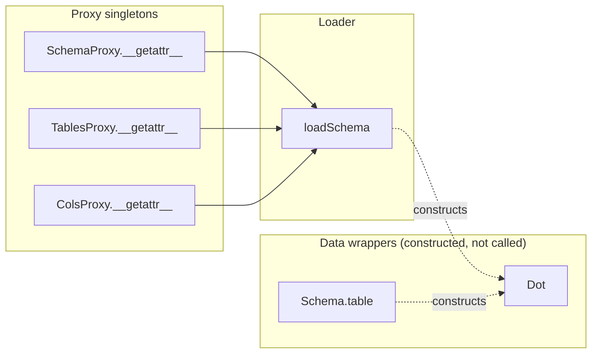

# `variableUtils.py`

> Central configuration module: Qualtrics/DASH column-name strings, the ReportLab
> page geometry, colour palette and `ParagraphStyle` objects used by every PDF
> report, cohort/year settings, student exclusion lists, and an (unused) YAML
> schema-access layer.

| | |
|---|---|
| **Lines of code** | 262 |
| **Top-level functions** | 1 (`loadSchema`); 8 further methods across 5 classes |
| **Classes** | 5 (`Dot`, `Schema`, `SchemaProxy`, `TablesProxy`, `ColsProxy`) — **none are Enums** |
| **Module constants** | 71 |
| **Imports from this codebase** | none (leaf module — no local imports at all) |
| **Imported by** | star-imported by `general_utils`, `boh2_dds2_dds3_utils`, and by `main.ipynb` (`from variableUtils import *`, notebook line 68); plain-imported (`import variableUtils`) by `Utils`, `boh1_utils`, `boh3_dds4_utils`, `flagging_utils`. `boh2_dds2_dds3_utils` does **both**. |
| **Run how** | never run directly; imported. It is the first import in the dependency graph and executes side effects at import time (see §7). |

---

## 1. Purpose and role in the pipeline

`variableUtils.py` is the leaf of the MDS 2026 dependency graph: it imports
nothing from the codebase and everything else imports it. Its job is to hold the
*magic strings and magic objects* that would otherwise be duplicated across the
PDF/Excel report generators — the header labels that Qualtrics exports use
(`'Student ID'`, `'Global Rating'`-adjacent columns, `'Critical incident'`, …),
the University of Melbourne navy `#010d44`, the oversized double-A4 landscape
page the cohort reports are laid out on, and ~18 pre-built ReportLab
`ParagraphStyle` instances.

It is consumed in two distinct styles, which matters for how you read the rest of
this document:

* **Star import** (`from variableUtils import *`) — `general_utils`,
  `boh2_dds2_dds3_utils` and `main.ipynb`. These modules use bare names such as
  `ITEM_CODE_COL`, `REMOVE_STUDENTS_DICT`, `excludeNames`, `uniColor`,
  `subheadingStyle`. Because it is a star import, the names are *copied* at
  import time — reassigning `variableUtils.year` later will not update them.
* **Qualified import** (`import variableUtils`) — `Utils`, `boh1_utils`,
  `boh3_dds4_utils`, `flagging_utils`, which write `variableUtils.pageSize`,
  `variableUtils.uniColor`, `variableUtils.itemSectionMappingFile`, etc.

The second half of the file (lines 105–202) is a separate, self-contained
concern: a small `schema.yaml` loader that would give dotted, auto-reloading
access to Postgres table and column names (`Tables.rawFormForms`,
`Cols.dds4boh3Forms.rotation`). **Nothing in the codebase currently uses it** —
see §7. Lines 205–262 are an entirely commented-out earlier hand-written version
of the same idea.

The module also holds the operational knobs the analyst edits each year: `year =
2026`, the `allCohorts` list, `excludeNames` (test/staff accounts filtered out of
every cohort aggregate), and the per-cohort `*_REMOVED_STUDENTS` withdrawal lists.

---

## 2. External dependencies

| Library / resource | Used for |
|---|---|
| `reportlab.lib.units.inch` | scaling `pageSize` and the four margin constants |
| `reportlab.lib.styles.getSampleStyleSheet`, `ParagraphStyle` | the `styles` stylesheet plus the 18 named paragraph styles |
| `openpyxl.styles.Font`, `PatternFill` | `FAIL_FILL` / `FAIL_TEXT` — the red highlight applied to failed weekly-sim items in xlsx output |
| `pathlib.Path` | `loadSchema` stats and reads the schema file |
| `yaml` (PyYAML) | `yaml.safe_load` of `schema.yaml` |
| `dataclasses.dataclass` | `Schema` is a frozen dataclass |
| `typing` (`Any`, `Literal`, `Optional`, `Dict`) | annotations. `Literal` is imported but only referenced inside the commented-out block at line 206 — an unused import. |
| `__future__.annotations` | postponed annotation evaluation (line 2) |
| **Filesystem** | two hard-coded absolute Windows paths (`studentEmailFile`, `itemSectionMappingFile`); `schema.yaml` resolved **relative to the process CWD**, not to this file |
| **Environment variables** | none |
| **Network / DB** | none |

---

## 3. Module-level constants and variables

71 module-level assignments. Grouped below by the file's own comment blocks.
"Used by" was established by grepping every other file in `src/` and
`out/main_notebook_code.py`; names marked **unused** have no reference anywhere
outside this file.

### 3.1 Qualtrics / overall-report column names (lines 12–30)

Nineteen plain strings naming columns in the legacy Qualtrics "overall report"
Excel exports. The header comment reads *"From overall reports, we can see that
the columns are as follows"*. Only two of the nineteen are still referenced.

| Name | Type | Value | Purpose |
|---|---|---|---|
| `colId` | `str` | `'Student ID'` | Student-number column. Used in `Utils.py` (7 refs), incl. the default for `getPairCounts(df, colPairBy=variableUtils.colId, …)` |
| `colNameG` | `str` | `'Student Given Name'` | Given name. **Unused** |
| `colNameF` | `str` | `'Student Family Name'` | Family name. **Unused** |
| `colDate` | `str` | `'Date'` | Assessment date. **Unused** |
| `colCohort` | `str` | `'Cohort'` | Cohort column; used in `Utils.py` (7 refs, e.g. `getDfbyColumnValue(studentDf, colCohort, cohort)`) |
| `colSubject` | `str` | `'Subject'` | Subject code. **Unused** |
| `colAge` | `str` | `'Patient Age'` | Patient age. **Unused** |
| `colPatient` | `str` | `'Patient'` | Source comment: *"whether saw a patient or not"*. **Unused** |
| `colRole` | `str` | `'Role'` | Student's role on the appointment. **Unused** |
| `colCE` | `str` | `'Critical incident'` | Critical-incident flag. **Unused** |
| `colCEReason` | `str` | `'CI Details'` | Free-text critical-incident detail. **Unused** |
| `colComplex` | `str` | `'Complexity'` | Patient complexity. **Unused** |
| `colClinicType` | `str` | `'Clinic Type'` | Source comment lists the domain: *Fixed Pros, Removable Pros, Perio, Endo, Resto, Paeds, OMFS, Diag, General Practice*. **Unused** |
| `colClinicTypeText` | `str` | `'Clinic Type_3_TEXT'` | Qualtrics "other, please specify" companion field for choice 3. **Unused** |
| `colFinished` | `str` | `'Finished'` | Qualtrics survey-completion flag. **Unused** |
| `colResponseId` | `str` | `'ResponseId'` | Qualtrics response key. **Unused** |
| `colComments` | `str` | `'Supervisor comments'` | Assessor free text. **Unused** |
| `colComments2` | `str` | `'Further comments'` | Second free-text box. **Unused** |
| `colClinicChoice` | `str` | `'Sim or Clinic'` | Simulation vs clinic setting. **Unused** |

### 3.2 Page geometry, palette and margins (lines 35–47)

| Name | Type | Value / shape | Purpose |
|---|---|---|---|
| `pageSize` | `tuple[float, float]` | `(11.69*inch, 8.27*2*inch)` = `(841.68, 1190.88)` pt | The report page: A4-landscape **width** but **double** A4-landscape height — a tall, single-column canvas for the cohort/student PDFs. Passed to `SimpleDocTemplate(pagesize=…)`. Used in `Utils` (9), `boh2_dds2_dds3_utils` (14), `boh3_dds4_utils` (15), and directly in `main.ipynb`. `boh3_dds4_utils.py:2447` overrides the width: `pageSize = (15*inch, variableUtils.pageSize[1])`. |
| `figSize` | `tuple[float, float]` | `(pageSize[0]/100, pageSize[1]/100)` = `(8.4168, 11.9088)` | Matplotlib `figsize` in inches, derived from the page. The `/100` is arbitrary — it happens to land near inches only by coincidence. Used 16× in `boh3_dds4_utils` (e.g. `figsize=(figSize[0]*0.55, figSize[1]*0.32)`), and in `main.ipynb`. |
| `uniColor` | `str` | `'#010d44'` | University of Melbourne navy. The single most-used constant in the codebase: `boh3_dds4_utils` (68), `boh2_dds2_dds3_utils` (20), `Utils`, `generate_mcex_reports`, and `main.ipynb`. Applied as `colors.HexColor(uniColor)` for banners and table headers. |
| `textcolor` | `str` | `'#4f5fb2'` | Lighter blue used as `textColor` of `subsubheadingStyle` / `subsubheadingStyleL`. Never referenced by name outside this file. |
| `whitecolor` | `str` | `'white'` | `textColor` for the two "White" table styles. Never referenced by name outside this file. |
| `HEADER_COLOR` | alias of `uniColor` | `'#010d44'` | openpyxl header fill colour. Comment: *"navy, matching uniColor"*. Consumed in `main.ipynb`'s `styleSheet()` as `PatternFill("solid", start_color=HEADER_COLOR, …)` — see the bug in §7. |
| `HEADER_FONT` | `str` | `'FFFFFF'` | openpyxl header font colour (correctly written **without** a leading `#`). Used in `main.ipynb` `Font(bold=True, color=HEADER_FONT, …)`. |
| `leftMargin` | `float` | `0.5*inch` = 36.0 | Doc margin. Used by `Utils`, `boh2_dds2_dds3_utils`, `boh3_dds4_utils`, `flagging_utils`, `generate_mcex_reports`, `generate_reports`, `osce_pdfs`, `writtenexam_utils`, `main.ipynb`. |
| `rightMargin` | `float` | `0.5*inch` = 36.0 | As above. |
| `topMargin` | `float` | `1*inch` = 72.0 | As above. |
| `bottomMargin` | `float` | `1*inch` = 72.0 | As above. |

### 3.3 ReportLab styles (lines 50–69)

`styles = getSampleStyleSheet()` (line 50) is the shared ReportLab stylesheet.
Line 51 mutates it in place: `styles.add(ParagraphStyle(name='Center',
alignment=1))`. The remaining 18 names are standalone `ParagraphStyle` objects —
they are **not** added to `styles`, so their first positional/`name=` argument is
only a label and several are duplicated (see §7).

| Name | Shape | Purpose |
|---|---|---|
| `styles` | `StyleSheet1` | Base sample stylesheet + an extra `'Center'` entry. Referenced by name in `main.ipynb` (`styles["Heading1"]`, `styles["Heading2"]` as fallbacks in a PDF builder). Note `writtenexam_utils`, `generate_reports`, `generate_mcex_reports` and `flagging_utils` each build their *own* local `styles`/`base` and shadow this one. |
| `headingStyle` | `Heading1`, size 32, centred | Report title. Used in `main.ipynb` (`Paragraph("MCEX Report", headingStyle)`). |
| `heading2Style` | `Heading2`, size 28, centred | Second-level title. **Unused** |
| `subheadingStyleL` | size 24 bold Helvetica, `textColor=uniColor`, left | Left-aligned section heading. Used once, `boh3_dds4_utils.py:2977` (`Paragraph(f"Form: {i+1}", …)`). |
| `subheadingStyle` | as above but centred (`alignment=1`) | The workhorse section heading: `boh3_dds4_utils` (42), `boh2_dds2_dds3_utils` (31), plus passed as a kwarg throughout `main.ipynb`. |
| `subsubheadingStyle` | size 12 Helvetica, `textColor=textcolor`, centred | Caption/sub-caption. Used in `Utils.py` (4), incl. the "No data found" placeholder and as the default `titleStyle=` of the table builders. |
| `subsubheadingStyleL` | as above, left | Left-aligned caption. `boh2_dds2_dds3_utils` (6), `boh3_dds4_utils` (6), `main.ipynb` (1). |
| `smallsubsubheadingStyleL` | `Heading3`, size 13, left | **Unused** |
| `smallsubsubheadingStyleC` | `Heading3`, size 13, centred | **Unused** |
| `normalLargeStyleLeft` | `Normal`, size 18, left | **Unused** |
| `normalLargeStyleCenter` | `Normal`, size 18, centred | **Unused** |
| `tableTextStyle` | `Normal`, size 13, centred | Default body-cell style. `boh2_dds2_dds3_utils` (15), `boh3_dds4_utils` (11), `Utils` (6, incl. as a default arg). |
| `tableTextStyleWhite` | size 13, centred, white | White-on-navy cells. Used 5× in `main.ipynb`. |
| `tableTextStyleL` | size 13, left | **Unused** |
| `tableTextStyleLSmall` | size 11, left | **Unused** |
| `tableTextStyleSmall` | size 11, centred | Dense tables. `boh3_dds4_utils` (27), `boh2_dds2_dds3_utils` (8), `main.ipynb`. |
| `tableTextStyleSmallWhite` | size 11, centred, white | **Unused** |
| `tableTextStyleLarge` | size 15, centred, `leading=20` | **Unused** |
| `bannerHeadingStyle` | 18pt Helvetica-Bold, white, left, `leading=22`, no spacing | Intended for the navy banner strip. **Unused** — the banner modules build their own style. |

### 3.4 Assessment / cohort settings (lines 71–81)

| Name | Type | Value / shape | Purpose |
|---|---|---|---|
| `Checklistcolors` | `dict[str, str]`, 3 items | `{'Yes': 'blue', 'No': 'orange', 'Not Reviewed': 'lightgrey'}` | Intended colour map for checklist-item outcomes. **Unused** anywhere. |
| `allCohorts` | `list[str]`, 7 items | `["DDS4","BOH3","DDS1","DDS2","DDS3","BOH2","BOH1"]` | The full set of cohorts. Passed into `general_utils.buildCohortList(useAll, allCohorts, includeCohorts, excludeCohorts)` from `main.ipynb` (lines 143, 1471). Note DDS4/BOH3 are listed first, not in year order. |
| `year` | `int` | `2026` | Reporting year, used to build DASH API URLs (`…&year={year}`). **`main.ipynb` re-assigns `year = 2026` locally at lines 333 and 1467**, shadowing the import. Elsewhere `year` is a function parameter, not this constant. |
| `excludeNames` | `set[str]`, 3 items | `{"kunal patel", "suhrid gupta", "test student"}` | Lower-cased names dropped from every aggregate — two staff/developer accounts plus a test account. Compared as `student.lower() in excludeNames` in `general_utils.py:610` and `:720` and `main.ipynb:354`, `:1488`. |
| `studentEmailFile` | `str` | `r'C:\Users\Kunal Patel\D folder\MDS Work\2026\RE_ Student List.xlsx'` | Student-number → email mapping workbook. Used 12× in `main.ipynb` as `StudentReportMailer(…, email_file=variableUtils.studentEmailFile, …)`. |
| `itemSectionMappingFile` | `str` | `r'C:\Users\Kunal Patel\D folder\MDS Work\2026\item_section_mapping.xlsx'` | Item-code → Section / Sub-section mapping (columns `Item Code`, `Section`, `Sub-section`). Default of `Utils.py:640`'s mapping loader; read at **import time** by `boh3_dds4_utils.py:101` (`itemSectionDf = pd.read_excel(variableUtils.itemSectionMappingFile)`) and again at `:1572`; used 5× in `boh2_dds2_dds3_utils`. |

### 3.5 DDS2 Weekly Sim report settings (lines 85–90)

All six are consumed by `general_utils` via the star import.

| Name | Type | Value | Purpose |
|---|---|---|---|
| `DEFAULT_DATE_REGEX` | `str` (regex) | `r"\d{4}-\d{2}-\d{2}"` | Extracts the ISO date embedded in each weekly file name. Default of `general_utils.loadWeeklyFiles(dateRegex=…)` and `buildWideDf(dateRegex=…)`. |
| `DEFAULT_FILE_PATTERN` | `str` (regex) | `r"assessment_data\.xlsx$"` | Which files in the Weekly Sim folder count as data. Same two call sites. |
| `DEFAULT_ID_COLS` | `list[str]`, 1 | `["student_number"]` | Grouping/identity columns for the long→wide reshape; default of `buildWideDf(idCols=…)`. |
| `FAIL_FILL` | `openpyxl PatternFill` | solid `FFC7CE` (light red) | Cell fill for failed items — `general_utils.py:1768`, `:1774`. |
| `FAIL_TEXT` | `openpyxl Font` | colour `9C0006` (dark red) | Font for the same cells — `general_utils.py:1769`, `:1775`. |
| `ITEM_CODE_COL` | `str` | `'item_code'` | The item-code column name; the most-used of this group (22 refs in `general_utils`) for dedup, attempt counting and pivoting. |

### 3.6 Withdrawn / removed students (lines 92–95)

Student numbers excluded from cohort statistics and report generation.

```python
BOH2_REMOVED_STUDENTS = [1352051, 1606158, 1605793, 1617958, 1605538]
DDS2_REMOVED_STUDENTS = [1270152, 1155940, 914405]
BOH1_REMOVED_STUDENTS = [1895048, 1895910, 1904651]
REMOVE_STUDENTS_DICT  = {"BOH1": BOH1_REMOVED_STUDENTS, "BOH2": BOH2_REMOVED_STUDENTS,
                         "DDS2": DDS2_REMOVED_STUDENTS, "DDS3": []}
```

| Name | Type | Purpose |
|---|---|---|
| `BOH2_REMOVED_STUDENTS` | `list[int]`, 5 | Checked directly at `boh2_dds2_dds3_utils.py:2172` (`if cohort == 'BOH2' and studentNumber in variableUtils.BOH2_REMOVED_STUDENTS: …`). |
| `DDS2_REMOVED_STUDENTS` | `list[int]`, 3 | Same pattern at `boh2_dds2_dds3_utils.py:2174`. |
| `BOH1_REMOVED_STUDENTS` | `list[int]`, 3 | Referenced **only** through `REMOVE_STUDENTS_DICT`; no direct call site. |
| `REMOVE_STUDENTS_DICT` | `dict[str, list[int]]`, 4 keys | Cohort → removal list, with a `.get(cohort, [])` fallback. Used at `boh2_dds2_dds3_utils.py:888` and `main.ipynb:292`. Note it covers only BOH1/BOH2/DDS2/DDS3 — DDS1, DDS3(non-empty), BOH3, DDS4 have no entry. |

### 3.7 Schema-loader state (lines 106, 155–156, 187, 195, 202)

| Name | Type | Value | Purpose |
|---|---|---|---|
| `schemaPath` | `str` | `'schema.yaml'` | Default path for `loadSchema`. The inline comment says *"relative to this file"* but nothing resolves it against `__file__` — it is relative to the **process working directory**. |
| `_schemaCache` | `Optional[Schema]` | `None` | Module-level cache of the parsed `Schema`; mutated by `loadSchema` via `global`. |
| `_schemaMtime` | `Optional[float]` | `None` | `st_mtime` of the file at the time of the cached parse; drives the auto-reload check. |
| `schema` | `SchemaProxy()` | singleton | Auto-refreshing façade: `schema.tables`, `schema.types`, `schema.commonColumns`, `schema.raw`, `schema.table(...)`. **Unused** — every `schema` hit elsewhere in `src/` is an unrelated comment or docstring. |
| `Tables` | `TablesProxy()` | singleton | `Tables.<tableKey>` → the table's `name` string from the YAML. **Unused**. |
| `Cols` | `ColsProxy()` | singleton | `Cols.<tableKey>` → that table's `columns` node as a `Dot`. **Unused**. |

---

## 4. Classes

None of the five classes is an `Enum`; there is no `enum` import in this module.
Together they implement the `schema.yaml` access layer described in the source
comment at line 105: *"some utils for loading the schema.yaml and providing
convenient access to tables, columns, types etc. as variables in code (instead of
hardcoding strings everywhere). Also auto-reloads if the file changes on disk."*

### `Dot`

*Lines 112–137.* Base classes: none (implicit `object`).

Docstring: *"Dict -> attribute access wrapper. — `d.foo` -> `d["foo"]` —
preserves nested structure"*. Wraps a plain `dict` so nested YAML can be walked
with attribute syntax, re-wrapping any nested `dict` in a new `Dot` and threading
a dotted `path` string through for error messages.

**Attributes**

| Name | Type | Set in | Description |
|---|---|---|---|
| `_data` | `Dict[str, Any]` | `__init__` | The wrapped dictionary. |
| `_path` | `str` | `__init__` | Dotted breadcrumb of how this node was reached (`""` at the root, rendered as `'root'` in errors). |

**Methods**

| Signature | Summary |
|---|---|
| `__init__(self, data: Dict[str, Any], path: str = "")` | Stores `data` and `path`. |
| `__getattr__(self, key: str) -> Any` | Attribute → key lookup; raises `AttributeError` listing available keys if missing. |
| `get(self, key: str, default: Any = None) -> Any` | Non-raising lookup with a default. |
| `dictkeys(self)` | Returns `self._data.keys()`. |

#### `__getattr__(self, key: str) -> Any`

*Lines 122–128.* Raises
`AttributeError(f"Missing '{key}' at {self._path or 'root'}; keys={list(self._data.keys())}")`
when `key` is absent — a deliberately loud error that prints the sibling keys. If
the value is a `dict` it returns `Dot(val, path=…)`; otherwise the raw value.
Because `_data` and `_path` are real instance attributes, normal lookup finds
them first and `__getattr__` is not consulted for them.

#### `get(self, key: str, default: Any = None) -> Any`

*Lines 130–134.* Same dict-re-wrapping behaviour as `__getattr__`, but delegates
to `self._data.get(key, default)` so a missing key yields `default` instead of
raising. Note the default is **not** re-wrapped only if it isn't a dict — a dict
default *is* wrapped.

#### `dictkeys(self)`

*Lines 136–137.* Exposes the underlying `dict.keys()`. Named `dictkeys` rather
than `keys` so it does not collide with an attribute called `keys` in the YAML.

### `Schema`

*Lines 140–152.* Decorated `@dataclass(frozen=True)`; base classes: none.
An immutable bundle of the four top-level nodes of `schema.yaml`.

**Attributes (dataclass fields, all `Dot`)**

| Name | Type | Description |
|---|---|---|
| `raw` | `Dot` | The whole parsed YAML document. |
| `tables` | `Dot` | The `tables:` node. |
| `types` | `Dot` | The `types:` node. |
| `commonColumns` | `Dot` | The `commonColumns:` node. |

**Methods**

| Signature | Summary |
|---|---|
| `table(self, tableName: str) -> Dot` | Looks a table up by its YAML key and returns its node. |

#### `table(self, tableName: str) -> Dot`

*Lines 148–152.* Comment: *"convenience: `Schema.table("raw_form_forms")` -> Dot
node"*. Reaches through `self.raw.tables._data` (the underlying dict, bypassing
`Dot`) and raises `KeyError(f"Unknown table '{tableName}'. Known: {list(...)}")`
if absent, otherwise returns `Dot(tablesDict[tableName], path=f"tables.{tableName}")`.
Note it goes via `self.raw.tables` rather than the already-stored `self.tables`
field — the two are equivalent but the duplication is unnecessary.

### `SchemaProxy`

*Lines 183–185.* Base classes: none. A one-method façade whose sole instance is
the module singleton `schema` (line 187), described in the source as a *"public
singleton (auto-refresh on access via `.schema`)"*.

**Methods**

| Signature | Summary |
|---|---|
| `__getattr__(self, key: str) -> Any` | `return getattr(loadSchema(), key)` — re-runs the freshness check on **every** attribute access. |

### `TablesProxy`

*Lines 191–193.* Base classes: none. Sole instance: `Tables` (line 195). Source
comment: *"convenience variables that feel like your old style"*.

**Methods**

| Signature | Summary |
|---|---|
| `__getattr__(self, tableKey: str) -> str` | `getattr(loadSchema().tables, tableKey).get("name", tableKey)` — returns the physical table name string, falling back to the YAML key itself when the node has no `name`. |

### `ColsProxy`

*Lines 197–200.* Base classes: none. Sole instance: `Cols` (line 202).

**Methods**

| Signature | Summary |
|---|---|
| `__getattr__(self, tableKey: str) -> Dot` | `loadSchema().tables.__getattr__(tableKey).columns` — returns the `columns` node for that table as a `Dot`. Calls the dunder explicitly rather than using `getattr`; functionally identical. |

---

## 5. Function reference

### 5.1 Schema loading

#### `loadSchema(schemaPath: str = schemaPath, reloadIfChanged: bool = True) -> Schema`

*Lines 159–179.* Parses `schema.yaml` into a frozen `Schema`, caching the result
and re-parsing only when the file's mtime changes.

**Parameters**

| Name | Type | Default | Description |
|---|---|---|---|
| `schemaPath` | `str` | the module constant `schemaPath` (`'schema.yaml'`), bound at definition time | Path to the YAML schema file. Shadows the module-level name inside the body. |
| `reloadIfChanged` | `bool` | `True` | When `False`, an existing cache is returned without an mtime comparison — but see step 2. |

**Returns** — the cached or freshly built `Schema` (`raw`, `tables`, `types`,
`commonColumns`).

**Behaviour**

1. Declares `global _schemaCache, _schemaMtime`, wraps the path in `Path`, and
   calls `p.stat().st_mtime` — this happens on **every** call, including cache
   hits, so a missing file always raises `FileNotFoundError` regardless of cache
   state.
2. `if _schemaCache is None: reloadIfChanged = True` — the very first call always
   parses, so passing `reloadIfChanged=False` cannot prevent the initial load.
3. If `reloadIfChanged and (_schemaMtime is None or mtime != _schemaMtime)`:
   reads the file as UTF-8, `yaml.safe_load`s it, coalesces a `None` result to
   `{}` (`or {}`), wraps it as `Dot(data, path="root")`, and builds
   `Schema(raw=root, tables=root.tables, types=root.types, commonColumns=root.commonColumns)`.
   Because those three are `Dot.__getattr__` lookups, a YAML file missing any of
   `tables`, `types` or `commonColumns` raises `AttributeError` here.
4. Stores the new mtime and returns `_schemaCache`.

**Side effects** — mutates the module globals `_schemaCache` and `_schemaMtime`;
reads a file from disk; `p.stat()` on every invocation.

**Calls** — `Path`, `p.stat`, `p.read_text`, `yaml.safe_load`, `Dot`, `Schema`
(all local/stdlib; `calls_resolved` is empty).
**Called by** — `variableUtils:SchemaProxy.__getattr__`,
`variableUtils:TablesProxy.__getattr__`, `variableUtils:ColsProxy.__getattr__`.
Not a `main.ipynb` entry point; not called from any other module.

**Example** — none; no real call site exists in `main_notebook_code.py`.

### 5.2 Proxy accessors

These three one-line methods are documented in §4 alongside their classes. For
completeness:

| Method | Lines | Signature | Summary |
|---|---|---|---|
| `SchemaProxy.__getattr__` | 184–185 | `(self, key: str) -> Any` | Delegates any attribute to a freshly-checked `Schema`. |
| `TablesProxy.__getattr__` | 192–193 | `(self, tableKey: str) -> str` | Table key → physical table `name`. |
| `ColsProxy.__getattr__` | 198–200 | `(self, tableKey: str) -> Dot` | Table key → its `columns` node. |

Each has the side effect of triggering `loadSchema()` (and therefore a `stat`)
per attribute access. **Called by** — nothing in the codebase.

### 5.3 `Dot` / `Schema` methods

Covered in §4: `Dot.__init__` (118–120), `Dot.__getattr__` (122–128), `Dot.get`
(130–134), `Dot.dictkeys` (136–137), `Schema.table` (148–152). None of them has a
`called_by` entry, and none appears in `main_notebook_code.py`.

There are no nested/inner functions in this module.

---

## 6. Call graph (this module)

Only three intra-module edges exist; every other function is a leaf.



`Dot.__init__`, `Dot.__getattr__`, `Dot.get`, `Dot.dictkeys` have no intra-module
edges recorded and are omitted as call nodes.

---

## 7. Gotchas and known issues

* **`Utils.py:231` references a constant that does not exist.**
  `rubricQues = variableUtils.rubricQues` inside `getImportance()`. There is no
  `rubricQues` anywhere in `variableUtils.py` (it exists only as a *parameter*
  name in `Utils.convertRubricScale` / `vectoriseRubricQues`). Calling
  `Utils.getImportance()` raises `AttributeError: module 'variableUtils' has no
  attribute 'rubricQues'`. Either the constant was deleted or never added.

* **`HEADER_COLOR` is not a valid openpyxl colour.** Line 41 sets
  `HEADER_COLOR = uniColor = '#010d44'`. openpyxl requires aRGB hex **without**
  the leading `#`; `PatternFill("solid", start_color="#010d44")` raises
  `ValueError: Colors must be aRGB hex values` (verified). `main.ipynb`'s
  `styleSheet()` (notebook line 462, called at 507–508) does exactly this. The
  neighbouring `HEADER_FONT = "FFFFFF"` is correctly formatted, which makes the
  inconsistency easy to miss.

* **`print(pageSize)` executes on import — line 36.** Every module that imports
  `variableUtils` (directly or transitively, i.e. all of them) prints
  `(841.68, 1190.8799999999999)` to stdout. Stray output in scripts and at the
  top of every notebook run.

* **The entire schema layer is dead code.** `loadSchema`, `Dot`, `Schema`,
  `SchemaProxy`, `TablesProxy`, `ColsProxy`, `schema`, `Tables`, `Cols` (lines
  105–202) have **zero** call sites anywhere in `src/` or `main.ipynb`. Related:
  no `schema.yaml` file exists in the repo, so the first `schema.<anything>`
  access would raise `FileNotFoundError`.

* **`schemaPath` is not resolved relative to the file, despite the comment.**
  Line 106 says *"# relative to this file"*, but `loadSchema` does
  `Path(schemaPath)` with no `__file__` anchoring — it resolves against the
  process CWD. Running the notebook from a different directory silently changes
  which file (if any) is loaded.

* **`loadSchema`'s cache is keyed on mtime only, not on path.** Lines 165–177:
  calling `loadSchema("other.yaml")` after `loadSchema("schema.yaml")` returns the
  *stale* cached `Schema` if the two files happen to share an mtime, because the
  path is never compared.

* **Lines 205–262 are 58 lines of commented-out code** — an earlier hand-written
  version of the same table/column constants (`SqlType`, `ColumnDefinition`,
  `Tables`, `CommonCols`, `dds4boh3Columns`, `formColumns`). Note the commented
  `class Tables` would clash with the live `Tables = TablesProxy()` at line 195 if
  uncommented. `Literal` (line 6) is imported *only* for this dead block.

* **Hard-coded absolute Windows paths, lines 80–81.** `studentEmailFile` and
  `itemSectionMappingFile` both point at `C:\Users\Kunal Patel\D folder\MDS
  Work\2026\…`. The whole pipeline is unrunnable on any other machine or OS.
  Worse, `boh3_dds4_utils.py:101` reads `itemSectionMappingFile` at **import
  time** — so merely importing `boh3_dds4_utils` fails on a machine without that
  file.

* **Hard-coded year and hard-coded student numbers.** `year = 2026` (line 75) and
  the three `*_REMOVED_STUDENTS` lists (lines 92–94) must be edited by hand each
  cycle. `main.ipynb` additionally re-declares `year = 2026` at lines 333 and
  1467, so changing it here alone is not sufficient. `REMOVE_STUDENTS_DICT` has an
  empty `"DDS3"` entry and no entry at all for DDS1, BOH3 or DDS4.

* **`excludeNames` (line 76) contains real people's names** — `"kunal patel"` and
  `"suhrid gupta"` (staff/developer test submissions) plus `"test student"`.
  Matching is by lower-cased full-name string equality, so any genuine student
  sharing a name with a staff member is silently dropped from all statistics.

* **Duplicated `ParagraphStyle` names.** `'LargeFont'` is used for six different
  styles (lines 62–65, 68), `'Subheading'` for two (54–55), `'NormalText'` for two
  (56–57), `'Heading3'` for two (58–59), `'SmallFont'` for two (66–67). This is
  harmless only because none of them is `styles.add(...)`ed — adding any two would
  raise a duplicate-key error in ReportLab.

* **`styles.add(ParagraphStyle(name='Center', alignment=1))` at line 51 mutates a
  module-level object**, and the resulting `styles['Center']` entry is never used
  anywhere. Several downstream modules (`writtenexam_utils`, `generate_reports`,
  `generate_mcex_reports`, `flagging_utils`) build their own local `styles`
  dict/stylesheet that shadows this one, so which `styles` a given line refers to
  depends on the file.

* **31 of the 71 constants are never referenced outside this file** — 17 of the 19
  `col*` Qualtrics names, `textcolor`, `whitecolor`, `Checklistcolors`, and 10
  `ParagraphStyle`s. The `col*` block is a fossil of the pre-DASH Qualtrics era
  (the current pipeline reads snake_case DB columns such as `student_number` /
  `item_code`), and only `colId` and `colCohort` survive, in `Utils.py`.

* **Star-import fragility.** `general_utils`, `boh2_dds2_dds3_utils` and
  `main.ipynb` use `from variableUtils import *`, which also drags in the
  single-letter-ish helpers `Dot`, `Schema`, `Tables`, `Cols`, `schema`, `styles`
  and `year` into their namespaces. `boh2_dds2_dds3_utils` does both
  `import variableUtils` *and* `from variableUtils import *` (lines 35–36), so the
  same value is reachable under two names that can drift if either is rebound.
