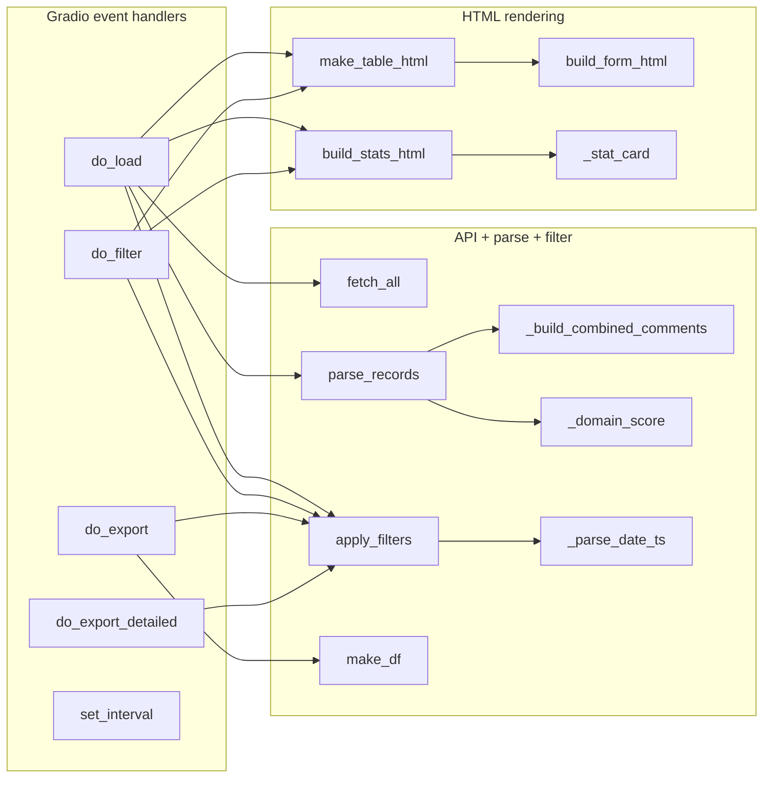

# `viva_gradio.py`

> A standalone Gradio 6 web application ("DASH · Viva Exam Live Monitor") that polls
> the DASH assessment API for DDS4 viva records, renders them as a live auto-refreshing
> HTML table with expandable comment and full-form modals, and exports the filtered
> view to plain or heavily formatted XLSX.

| | |
|---|---|
| **Lines of code** | 1071 |
| **Top-level functions** | 16 (plus 20 nested/inner functions — 36 in total) |
| **Classes** | 0 |
| **Module constants** | 5 (`ENV_TOKEN`, `LOGIN_USER`, `LOGIN_PASS`, `_FORM_MODAL_HANDLER`, `css`) |
| **Imports from this codebase** | `gradio_utils` — twice: `from gradio_utils import *` (line 21) and `from gradio_utils import _WRAP, _CARD_LABELS, _def_active, _def_secs` (line 22) |
| **Imported by** | Nothing. It is not imported by `main.ipynb` or by any other module in the codebase, and has no `cross_edges_in`. |
| **Run how** | CLI / Gradio app — `python viva_gradio.py` (wrapped by `start.bat`). Serves a web UI on `http://localhost:7860`, plus a public Gradio share link (`share=True`). |

## 1. Purpose and role in the pipeline

`viva_gradio.py` is an **operational monitoring tool**, not part of the batch
reporting pipeline. Where the rest of the codebase reads assessment data out of the
database, crunches it in pandas, and emits PDF/Excel *cohort reports* after the fact,
this module is designed to be open on a screen **while a viva exam session is
running**, showing markers' submissions as they arrive.

A *viva* is an oral examination; a *cohort* is a year-level student group
(DDS = Doctor of Dental Surgery, so DDS4 = final-year); a *domain* is one of the five
rubric sections (`DDS4-1` … `DDS4-5`) a viva is marked against; *GR* is the assessor's
Global Rating, a 1–5 overall judgement; and the *MC* items are the individual
multiple-choice checklist criteria inside each domain, each scored 0–4 via
`MC_SCORE`.

**Consumes:** the DASH REST API at `https://api.unimelb-dash.com`, endpoint
`GET /assessment/viva/get?page_size=max&page=1&cohort=…&year=…&ordering=id`,
authenticated with a **Django REST Framework token** (`Authorization: Token <token>`
— *not* `Bearer`). The token comes from `.env` as `DASH_TOKEN`; optional basic-auth
credentials for the Gradio UI itself come from `VIVA_USERNAME` / `VIVA_PASSWORD`.
Each API record carries a nested `form.data.assessor` block (per-domain MC answers,
the global-rating scale, and free-text comments) plus `form.checklists` metadata
(human-readable domain names, field labels, and sub-section headers).

**Produces:** (a) HTML strings rendered into `gr.HTML` components — the stat-card
row, the main table, and two JavaScript modals; (b) two XLSX files written to the
system temp directory and handed to a `gr.File` download component — a plain summary
export (`do_export` → `make_df` → `DataFrame.to_excel`) and a fully styled
openpyxl workbook with merged per-domain header blocks and colour-coded MC cells
(`do_export_detailed`).

**Data flow.** `do_load()` is the single entry point for fresh data: it calls
`fetch_all()` (network) → `parse_records()` (flatten each API record into a display
row dict) → caches the full row list in a `gr.State` → `apply_filters()` → renders
via `make_table_html()` and `build_stats_html()`. Every other handler
(`do_filter`, `do_export`, `do_export_detailed`) works purely from the cached
`gr.State` rows and never touches the network. A `gr.Timer` re-runs `do_load()` on a
user-selectable interval (default every 30 seconds), which re-fetches the API and
rebuilds the entire table HTML from scratch.

All layout constants, colours, scoring maps, column configuration and interval/sort
option maps live in the sibling module `gradio_utils.py`; see that document.

## 2. External dependencies

| Library / resource | Used for |
|---|---|
| `gradio` (`gr`) | The whole UI: `gr.Blocks`, `gr.State`, `gr.Timer`, `gr.HTML`, `gr.Textbox`, `gr.Dropdown`, `gr.CheckboxGroup`, `gr.Checkbox`, `gr.Button`, `gr.File`, `gr.Markdown`, `gr.themes.Default`. Version is printed at import time (line 29). |
| `requests` | `fetch_all()` — HTTP GET against the DASH API with a 60-second timeout; `requests.HTTPError` is caught in `do_load()`. |
| `pandas` (`pd`) | `make_df()` builds the summary `DataFrame`; `do_export()` calls `df.to_excel`. |
| `openpyxl` | `do_export_detailed()` — `Workbook`, `PatternFill`, `Font`, `Alignment`, `Border`, `Side`, `get_column_letter`, merged cells and freeze panes. |
| `tempfile` | Both export handlers create `NamedTemporaryFile(suffix=".xlsx", delete=False)`. |
| `datetime` | Record timestamp parsing (`fromisoformat`), date-filter parsing (`strptime`), and the "Last loaded HH:MM:SS" stamp (`datetime.now()`). |
| `urllib.parse.urlencode` | Query-string construction in `fetch_all()`. |
| `dotenv.load_dotenv` | Loads `.env` at import time (line 24). |
| `numpy` (`np`) | Imported at line 14 but **never used**. |
| `os` | `os.getenv` for the three environment variables. |
| `gradio_utils` | All constants (see §3). |

**Network:** `https://api.unimelb-dash.com/assessment/viva/get` (GET, paginated).
**Filesystem:** writes `.xlsx` files into the OS temp directory; reads `.env`.
**Environment variables:** `DASH_TOKEN` (required — the app refuses to load without
it), `VIVA_USERNAME`, `VIVA_PASSWORD` (optional; both must be set for the UI to
require a login).
**Ports:** binds `0.0.0.0:7860` and additionally requests a public Gradio share
tunnel.

## 3. Module-level constants and variables

| Name | Type | Value / shape | Purpose |
|---|---|---|---|
| `ENV_TOKEN` | `str` | `os.getenv("DASH_TOKEN", "")` — line 25 | The DRF API token. Read **once at import time**. `do_load()` short-circuits with "❌ No API token found in .env file." when it is empty. |
| `LOGIN_USER` | `str \| None` | `os.getenv("VIVA_USERNAME")` — line 26 | Username for Gradio's own basic auth. |
| `LOGIN_PASS` | `str \| None` | `os.getenv("VIVA_PASSWORD")` — line 27 | Password for Gradio's own basic auth. Auth is enabled at line 1071 only when **both** are truthy: `auth=(LOGIN_USER, LOGIN_PASS) if LOGIN_USER and LOGIN_PASS else None`. |
| `_FORM_MODAL_HANDLER` | `str` (1140 chars) | Lines 448–471 — a minified self-contained JavaScript IIFE | The `onclick` payload for the eye-icon "View" cell. Lazily creates a `
` overlay (with inner body `
`) on `document.body` if absent, then sets `document.getElementById('_vfb').innerHTML = el.getAttribute('data-html')` and shows the modal. Closes on ✕ button, backdrop click, or Escape. Because the modal element lives on `document.body`, outside the `gr.HTML` component, it survives auto-refresh table re-renders. |
| `css` | `str` (f-string, 1002 chars) | Lines 947–975 | The dashboard stylesheet: `.gradio-container` max-width from `DASH_MAX_WIDTH`, `#dash-header` banner using `NAVY`, `#err-bar` / `#ts-bar` status bars, `.compact-row` gap override, `#table-wrap` full width, and `footer {display:none}`. Passed to **`demo.launch(css=css)`** at line 1070, not to `gr.Blocks()`. |

All other names in the module's namespace (`API_BASE`, `TABLE_COLS`, `DOMAIN_ORDER`,
`MC_SCORE`, `SORT_OPTIONS`, `_WRAP`, `_def_secs`, …) are imported from
`gradio_utils`.

Module-level executable statements: `load_dotenv()` (line 24), the Gradio version
`print` (line 29), and the entire `with gr.Blocks(...) as demo:` UI construction
(lines 978–1062), which runs at import time.

## 4. Classes

None. The module defines no classes.

## 5. Function reference

Sections follow the source's own `# ── … ──` banner comments.

### 5.1 Auto-refresh control

#### `set_interval(choice)`

*Lines 32–34.* Translates the refresh-interval dropdown label into a `gr.Timer`
update.

**Parameters**

| Name | Type | Default | Description |
|---|---|---|---|
| `choice` | `str` | — | A key of `INTERVAL_MAP`, e.g. `"Every 30 sec"`, `"Manual only"`. |

**Returns** — a `gr.Timer(value=secs, active=active)` component update.

**Behaviour**

1. Looks `choice` up in `INTERVAL_MAP`, falling back to
   `INTERVAL_MAP[DEFAULT_INTERVAL]` (i.e. `(30, True)`) for an unknown label.
2. Unpacks the `(seconds, active)` tuple and returns a new `gr.Timer`. Selecting
   `"Manual only"` yields `(60, False)` — the timer is constructed but inactive, so
   no tick fires.

**Calls** — `INTERVAL_MAP.get`, `gr.Timer`.
**Called by** — wired at line 1052: `interval_dd.change(fn=set_interval, inputs=[interval_dd], outputs=[timer])`.

### 5.2 API layer

#### `fetch_all(token: str, cohorts: list, year: str) -> list`

*Lines 38–61.* Fetches every viva record for the given cohorts and year, following
DRF pagination.

**Parameters**

| Name | Type | Default | Description |
|---|---|---|---|
| `token` | `str` | — | DASH API token, sent as `Authorization: Token <token>`. |
| `cohorts` | `list` | — | Cohort codes, joined with commas into the `cohort` query parameter. |
| `year` | `str` | — | Academic year, passed straight through as the `year` parameter. |

**Returns** — `list` of raw record dicts, concatenated across all pages.

**Behaviour**

1. Builds the query string with `urlencode({"page_size": "max", "page": 1,
   "cohort": ",".join(cohorts), "year": year, "ordering": "id"})`. Note `page_size=max`
   is a literal string the API understands, and `ordering=id` is sent but the rows are
   re-sorted client-side later.
2. Targets `f"{API_BASE}/assessment/{ASSESS_TYPE}/get?{params}"` →
   `https://api.unimelb-dash.com/assessment/viva/get?…`.
3. Loops while `url` is truthy: `requests.get(url, headers=headers, timeout=60)`,
   `raise_for_status()`, then `resp.json()`.
4. Handles **two response shapes**: a bare JSON list (extend and stop), or a DRF
   paginated envelope (extend from `d["results"]`, follow `d["next"]`). The
   `Authorization` header is re-sent on each `next` page.

**Side effects** — network I/O only; raises `requests.HTTPError` on non-2xx, which
`do_load()` catches.

**Calls** — `urlencode`, `requests.get`, `resp.raise_for_status`, `resp.json`.
**Called by** — `viva_gradio:do_load`.

### 5.3 Comment building and domain scoring

#### `_build_combined_comments(ad: dict) -> str`

*Lines 65–104.* Concatenates every free-text field in an assessor block into one
newline-separated, `[Label]`-prefixed string.

**Parameters**

| Name | Type | Default | Description |
|---|---|---|---|
| `ad` | `dict` | — | The `form.data.assessor` block of one record. |

**Returns** — `str` in the form
`"[General] …\n[DDS4-1] …\n[DDS4-2] …\n[Critical Error] …"`, or `"—"` when every
field is empty.

**Behaviour**

1. Appends `[General] <text>` from `ad["comments"]` if non-blank.
2. Builds `ordered_keys = [f"{d}_comments" for d in DOMAIN_ORDER]`, then
   `extra_keys` = any other key in `ad` ending in `_comments` that is not already in
   `ordered_keys` — so undeclared domains still surface, after the known five.
3. For each key with non-blank text, appends `[<domain>] <text>` (the label is the key
   with `_comments` stripped).
4. Finally appends `[Critical Error]` and `[Clinical Incident]` from the
   `critical_error` and `clinical_incident` fields when non-blank.
5. Every value is guarded with `(ad.get(k) or "").strip()`, so `None` and whitespace
   are treated as absent.

**Calls** — no intra-module calls.
**Called by** — `viva_gradio:parse_records`.

#### `_domain_score(domain_dict: dict, domain: str) -> tuple[int, int]`

*Lines 108–113.* Returns `(score, official_max)` for one domain's MC items.

**Parameters**

| Name | Type | Default | Description |
|---|---|---|---|
| `domain_dict` | `dict` | — | The per-domain sub-dict of the assessor block, e.g. `{"MC1": "Done well", "MC2": "Done", …}`. |
| `domain` | `str` | — | Domain key, e.g. `"DDS4-3"`, used only for the `DOMAIN_MAX` lookup. |

**Returns** — `tuple[int, int]` — summed score and the official maximum.

**Behaviour**

1. Keeps only keys starting with the literal prefix `"MC"` — anything else in the
   domain dict is ignored.
2. `score = sum(MC_SCORE.get(v, 0) for v in items.values())`; an unrecognised response
   label silently contributes 0.
3. `max_s = DOMAIN_MAX.get(domain, len(items) * 4)` — the official cap (16/19/34/31/16),
   with a `4 × n_items` fallback for any domain not in `DOMAIN_MAX`.

**Called by** — `viva_gradio:parse_records`.

#### `parse_records(raw: list) -> list`

*Lines 117–191.* Flattens raw API records into the display-row dicts every other
function consumes.

**Parameters**

| Name | Type | Default | Description |
|---|---|---|---|
| `raw` | `list` | — | Records as returned by `fetch_all()`. |

**Returns** — `list[dict]`, one row per included record, with these keys:

| Key | Contents |
|---|---|
| `_ts` | `float` epoch seconds from the record `datetime`, `0.0` if unparseable |
| `_ad` | the raw `form.data.assessor` dict (used by the full-form modal and detailed export) |
| `_checklists` | the raw `form.checklists` metadata dict (domain names, field labels, headers) |
| `_domain_scores` | `{domain: {"score": int, "max": int, "items": dict}}` for every domain present |
| `Date` | display string, e.g. `"9 Jun 2026"` |
| `Student`, `Assessor`, `Cohort`, `Subject` | strings, `"—"` when absent |
| `GR` | the rating as a string, or `"—"` |
| `GR_int` | `int` rating, or `-1` when missing (sort key) |
| `GR_label` | `GR_LABELS` word form, or `"—"` |
| `Overall` | `int` sum of all present domain scores |
| `Submitted` | `"Yes"` / `"No"` |
| `Comments` | the combined string from `_build_combined_comments()` |

**Behaviour**

1. Skips records with a blank student name or whose lower-cased name is in `EXCLUDE`
   (line 133).
2. Reads the assessor block defensively: `ad` and `_checklists` stay `{}` unless
   `r["form"]` is a dict.
3. Global rating: `ad["scale-global-rating"]` is expected to be `{"scale": "3"}`;
   `int(gr_raw["scale"])` is attempted inside a `try` that swallows
   `KeyError/TypeError/ValueError`, leaving `gr_int = None`.
4. Datetime: `datetime.fromisoformat(dt_str.replace("Z", "+00:00"))` produces a
   timezone-aware datetime; display is `f"{dt.day} {dt.strftime('%b %Y')}"` and `_ts`
   is `dt.timestamp()`. A bare `except Exception` falls back to the raw string and
   `ts = 0.0`.
5. Domain scores: iterates `DOMAIN_ORDER` and calls `_domain_score()` for each domain
   whose value is a dict. Domains absent from the record are simply missing from
   `_domain_scores` — they are **not** zero-filled.
6. `Overall` sums only the domains that were present.

**Calls** — `viva_gradio:_build_combined_comments`, `viva_gradio:_domain_score`.
**Called by** — `viva_gradio:do_load`.

### 5.4 Filtering, sorting and summary statistics

#### `_parse_date_ts(date_str: str, end_of_day: bool = False) -> float | None`

*Lines 195–202.* Parses a `YYYY-MM-DD` string into an epoch timestamp.

**Parameters**

| Name | Type | Default | Description |
|---|---|---|---|
| `date_str` | `str` | — | Date in `%Y-%m-%d`; surrounding whitespace is stripped. |
| `end_of_day` | `bool` | `False` | When `True`, sets the time to `23:59:59` so the "To" bound is inclusive. |

**Returns** — `float` timestamp, or `None` when parsing fails (`ValueError`,
`AttributeError` are caught and swallowed, so a malformed date silently disables that
bound).

**Note** — `datetime.strptime` yields a **naive** datetime, so `.timestamp()`
interprets it in the *server's local* timezone, whereas record `_ts` values are true
UTC-based epochs. See §7.

**Called by** — `viva_gradio:apply_filters`.

#### `apply_filters(rows: list, submitted_only: bool, unsubmitted_only: bool, search: str, sort_opt: str=DEFAULT_SORT, date_from: str='', date_to: str='') -> list`
*Lines 205–232.* Filters and sorts already-cached rows without any API call.

Full signature from source:
`apply_filters(rows: list, submitted_only: bool, unsubmitted_only: bool, search: str, sort_opt: str = DEFAULT_SORT, date_from: str = "", date_to: str = "") -> list`

**Parameters**

| Name | Type | Default | Description |
|---|---|---|---|
| `rows` | `list` | — | Display rows from `parse_records()` (normally the `gr.State` cache). |
| `submitted_only` | `bool` | — | Keep only `Submitted == "Yes"`. |
| `unsubmitted_only` | `bool` | — | Keep only `Submitted == "No"` — evaluated in an `elif`, so `submitted_only` wins if both are ticked. |
| `search` | `str` | — | Case-insensitive substring, matched against `Student`, `Assessor`, `Cohort`, `Subject`, `Comments`. |
| `sort_opt` | `str` | `DEFAULT_SORT` | A key of `SORT_OPTIONS`. |
| `date_from` | `str` | `""` | Inclusive lower bound, `YYYY-MM-DD`. |
| `date_to` | `str` | `""` | Inclusive upper bound (end of day). |

**Returns** — the filtered, sorted `list` of row dicts.

**Behaviour**

1. Date bounds are parsed only when the corresponding textbox is non-blank; each
   applied bound rebuilds `rows` as a new list comprehension.
2. Submitted/unsubmitted filter, then the search filter (`any(q in (r.get(k) or "").lower() …)`).
3. `sort_col, descending = SORT_OPTIONS.get(sort_opt, ("_ts", True))`, then
   `rows.sort(key=_key, reverse=descending)`.

**Side effects** — `rows.sort()` sorts **in place**. If no filter branch created a new
list (i.e. no dates, no checkboxes, no search text), this re-orders the caller's
cached `gr.State` list rather than a copy.

**Nested functions**

| Name | Signature | Description |
|---|---|---|
| `_key` | `_key(r)` — lines 226–230 | Sort key. Returns `float(val or 0)` for the numeric columns `_ts` and `GR_int`; otherwise `(val or "").lower()` for case-insensitive string ordering. |

**Calls** — `viva_gradio:_parse_date_ts`.
**Called by** — `do_load`, `do_filter`, `do_export`, `do_export_detailed`.

#### `make_df(rows: list) -> pd.DataFrame`

*Lines 235–254.* Builds the plain summary `DataFrame` used by the simple XLSX export.

**Parameters**

| Name | Type | Default | Description |
|---|---|---|---|
| `rows` | `list` | — | Filtered display rows. |

**Returns** — `pd.DataFrame` with exactly the `EXPORT_COLUMNS` columns (an empty frame
with those columns when `rows` is empty).

**Behaviour**

1. For each row, walks `EXPORT_COLUMNS` in order.
2. Columns whose name is one of `DOMAIN_LABELS.values()` (`D1`–`D5`) are reverse-mapped
   back to their domain key with
   `next((d for d, lbl in DOMAIN_LABELS.items() if lbl == k), None)` and filled from
   `_domain_scores[domain]["score"]`; a missing domain yields `""`.
3. `Overall` is taken from the row but blanked when the row has no `_domain_scores` at
   all.
4. Everything else is a plain `r.get(k, "")`.

**Called by** — `viva_gradio:do_export`.

#### `_stat_card(label: str, value, color: str = "#0f172a") -> str`

*Lines 258–266.* Renders one summary "stat card" as an inline-styled flex `
`.

**Parameters**

| Name | Type | Default | Description |
|---|---|---|---|
| `label` | `str` | — | Uppercased caption, sized with `STAT_LABEL_FONT_SIZE`. |
| `value` | any | — | The big number, sized with `STAT_VALUE_FONT_SIZE`. |
| `color` | `str` | `"#0f172a"` | Colour of the value text. |

**Returns** — an HTML `str`. (The `min-width:200` in the style string at line 260 is
missing its `px` unit and is therefore ignored by browsers.)

**Called by** — `viva_gradio:build_stats_html`.

#### `build_stats_html(rows: list) -> str`

*Lines 269–286.* Builds the five-card summary row above the table.

**Returns** — an HTML `str`: a `
` containing five cards.

**Behaviour**

1. Empty input → five placeholder cards, one per label in `_CARD_LABELS`, all showing
   `"—"`.
2. Otherwise computes: total record count; `pct` = `"<n> (<x>%)"` submitted;
   `avg` = mean `GR_int` **over submitted rows with GR > 0 only**, formatted to two
   decimals; `stu` = count of distinct `Student`; `asr` = count of distinct `Assessor`
   excluding the `"—"` placeholder.
3. Colours: Submitted green `#15803d`, Avg global rating `#4f5fb2` (the literal value
   of the unused `PURPLE` constant).

**Calls** — `viva_gradio:_stat_card`.
**Called by** — `viva_gradio:do_load`, `viva_gradio:do_filter`.

### 5.5 Full-form modal

The banner comment at lines 289–298 documents the feature's three off-switches:
hide the column via `TABLE_COLS["View"]["show"] = False` in `gradio_utils.py`; skip
the HTML build by commenting out the `build_form_html(r)` call in `make_table_html`;
or delete the section plus the View wiring entirely.

#### `build_form_html(row: dict) -> str`

*Lines 300–442.* Renders the complete marked viva form for one record as an HTML
string, escaped so it can live inside a `data-html="…"` attribute.

**Parameters**

| Name | Type | Default | Description |
|---|---|---|---|
| `row` | `dict` | — | One display row; uses `_ad`, `_checklists`, `_domain_scores` and the display fields. |

**Returns** — an HTML `str` with every `"` replaced by `&quot;` (line 442). Returning
`""` here disables the feature (documented in the docstring).

**Behaviour**

1. **Escaping contract.** Structural HTML is written with ordinary `"` and escaped
   wholesale at the end. User text goes through the nested `e()` helper, which
   *double*-encodes (`&` → `&amp;amp;`, `<` → `&amp;lt;`, `>` → `&amp;gt;`) so that it
   survives the browser's single decode when JS reads
   `el.getAttribute('data-html')` and assigns it to `innerHTML`.
2. **Header block**: cohort · subject · date, then a two-column grid of Student,
   Assessor, GR (coloured by `GR_COLORS[gr_int]` when `1 <= gr_int <= 5`, else grey)
   and Submitted (green when `"Yes"`).
3. **Domain sections**, iterating `DOMAIN_ORDER`: pulls the human-readable domain name
   from `_checklists[domain]["name"]` (falling back to the raw key), the item labels
   from `["fields"]`, and sub-section titles from `["extra_config"]["headers"]`.
   Domains with no `MC*` items are skipped entirely (line 354). Each domain gets a navy
   header bar with `score/max`, then one row per MC item sorted by key, with the
   response coloured by `MC_COLORS`. Sub-section headers are emitted once each,
   deduplicated via the `shown_hdrs` set. A per-domain comment box is appended when
   `ad[f"{domain}_comments"]` is non-blank.
4. **Critical Error** panel — always rendered, showing `<i>None reported</i>` when
   empty.
5. **Global Rating Scale** panel — `GR` and `GR_label`, coloured.
6. **Additional Comments** panel — the general `comments` field, `<i>None provided</i>`
   when empty.

Note the record's `clinical_incident` field is **not** rendered by this builder, even
though `_build_combined_comments()` includes it in the table's Comments column.

**Nested functions**

| Name | Signature | Description |
|---|---|---|
| `e` | `e(s: object) -> str` — lines 312–316 | Double-encodes `&`, `<`, `>` for the `getAttribute` round-trip. Does **not** encode quotes — that is handled by the blanket `.replace('"', '&quot;')` on line 442. |

**Called by** — `viva_gradio:make_table_html` (once per rendered row).

### 5.6 HTML table renderer

#### `make_table_html(rows: list) -> str`

*Lines 474–692.* Renders the entire dashboard table — the largest function in the
module, with nine nested cell/column helpers.

**Parameters**

| Name | Type | Default | Description |
|---|---|---|---|
| `rows` | `list` | — | Filtered display rows. |

**Returns** — an HTML `str`: a scrollable wrapper `
` (height `TABLE_MAX_HEIGHT`)
containing a `table-layout:fixed` table with `<colgroup>`, `<thead>` and `<tbody>`.
Empty input returns a centred "No records to display. Enter your token, select
cohorts, and click Load." placeholder.

**Behaviour**

1. Builds two shared inline style strings, `TH` (navy `#010d44` background,
   `#c7d2fe` text) and `TD`, both parameterised by `TABLE_FONT_SIZE`.
2. Builds the header cells and `<colgroup>` through `_add_col()`, which consults
   `TABLE_COLS` via `_on()` / `_col()`. Column order is fixed in code (lines 629–640):
   Date, Student, Assessor, Cohort, GR, then `DOMAIN_ORDER` mapped through
   `DOMAIN_LABELS` (D1–D5, each with a `title` tooltip of the full domain key), Total
   (tooltip `Total score / {TOTAL_MAX}`), Submitted (rendered as `Sub`), View (a 👁
   HTML entity), Comments.
3. Truncates the render to `display = rows[:MAX_ROWS]` (500) and emits alternating row
   backgrounds `#ffffff` / `#f8fafc`.
4. Each `<td>` is emitted only if `_on(key)`, so the header and body stay in sync with
   `TABLE_COLS`.
5. If `len(rows) > MAX_ROWS`, appends a footer row spanning `n_active` columns:
   "Showing 500 of N records — use search to narrow down".

**Side effects** — none (pure string building), but it calls `build_form_html()` for
every displayed row when the View column is on, which is the bulk of the output size.

**Calls** — `viva_gradio:build_form_html`.
**Called by** — `viva_gradio:do_load`, `viva_gradio:do_filter`.

**Nested functions**

| Name | Signature | Description |
|---|---|---|
| `_on` | `_on(key)` — 490–491 | `TABLE_COLS.get(key, {}).get("show", True)`; unknown keys default to visible. |
| `_col` | `_col(key)` — 493–495 | Emits `<col style="width:Npx">` when a width is configured, else a bare `<col>`. |
| `gr_badge` | `gr_badge(gr_str)` — 498–507 | Pill badge for the Global Rating: `GR_COLORS[gi]` at 20% alpha (`{gc}33`) background with solid text. Returns a grey em dash for `"—"` or on `ValueError`/`IndexError`. |
| `cohort_badge` | `cohort_badge(cohort)` — 509–512 | Pill badge using `COHORT_COLORS`, fallback `#64748b`, background at `{cc}22`. |
| `sub_cell` | `sub_cell(val)` — 514–517 | Green ✓ for `"Yes"`, grey ✗ for anything else. |
| `comments_cell` | `comments_cell(text)` — 519–594 | See below. |
| `domain_score_cell` | `domain_score_cell(ds: dict, domain: str) -> str` — 596–606 | `score/max` with the score coloured by percentage: ≥0.85 green `#15803d`, ≥0.65 blue `#2563eb`, ≥0.40 amber `#d97706`, else red `#dc2626`. Missing domain → grey em dash. |
| `overall_cell` | `overall_cell(row)` — 608–618 | Same four-band colour scale but always divided by `TOTAL_MAX` (116). Returns `N/A` when the row has no `_domain_scores`. |
| `_add_col` | `_add_col(key, th_html, w_key=None)` — 624–627 | Appends the `<th>` and matching `<col>` when the column is enabled. `w_key` allows a different width key but is never passed by any caller. |

##### `comments_cell(text)` — lines 519–594

The comment cell and its double-click modal, the most intricate piece of the file.

1. Returns a grey em dash for empty/`"—"` text.
2. Escapes `&`, `<`, `>` and splits on newlines. Lines that start with `[` and contain
   `]` are split into a bold navy `[Label]` span (colour `NAVY`) and a slate body span;
   other lines are rendered plain. Joined with ` `.
3. Builds `data_val`, the *raw* text escaped for an HTML attribute (`&`, `"`, `<`, `>`,
   `'`), stored in `data-comment`. JS reads it back with `getAttribute`, which decodes
   the entities automatically.
4. Builds `handler`, a self-contained minified JavaScript IIFE by Python string
   concatenation. It creates or reuses `
` (with body `
`)
   **appended to `document.body`**, wires ✕/backdrop/Escape close handlers, then
   rebuilds the modal body from `data-comment` line by line using
   `createElement`/`textContent`/`style.cssText` only — never `innerHTML` with quoted
   strings — so there are no nested HTML-entity problems.
5. Returns a `
` collapsed to `COMMENTS_MAX_HEIGHT` with `overflow-y:auto`.

### 5.7 Gradio event handlers

#### `do_load(cohorts, submitted_only, unsubmitted_only, search, sort_opt=DEFAULT_SORT, date_from="", date_to="")`

*Lines 697–727.* The only handler that hits the network: fetch → parse → cache →
render.

**Parameters** — mirror the widget row: `cohorts` (list from the CheckboxGroup),
the two Submitted checkboxes, the search string, the sort dropdown value, and the two
date textboxes.

**Returns** — on success a 5-tuple matching
`load_outputs = [raw_state, table_html, stats_html, updated_md, error_md]`:
the **unfiltered** parsed rows (cached in `gr.State`), the filtered table HTML, the
filtered stats HTML, `"*Last loaded HH:MM:SS*"`, and `""` for the error bar.

**Behaviour**

1. Precomputes `_empty = ([], make_table_html([]), build_stats_html([]), "", "")`.
2. Guard clauses: no `ENV_TOKEN` → "❌ No API token found in .env file."; no cohorts
   selected → "❌ Please select at least one cohort."
3. Calls `fetch_all(ENV_TOKEN, cohorts, "2026")` — **the year is hard-coded** and not
   exposed in the UI — then `parse_records(raw)`.
4. `requests.HTTPError` is mapped to a friendly message: 401 → "Unauthorised — check
   your API token", 403 → "Forbidden — token may lack permissions for this cohort",
   anything else → `f"HTTP {status} from API"`. A bare `except Exception` catches
   everything else as "❌ Connection error: {e}".
5. Applies filters and stamps `datetime.now().strftime("%H:%M:%S")`.

**Side effects** — network request; reads the module global `ENV_TOKEN`; writes into
the `gr.State` cache via its return value. Called on button click, on `demo.load`
startup, and on every timer tick.

**Calls** — `viva_gradio:fetch_all`, `viva_gradio:parse_records`,
`viva_gradio:apply_filters`, `viva_gradio:make_table_html`,
`viva_gradio:build_stats_html`.
**Called by** — the Gradio event wiring at lines 1040, 1041–1044 and 1053.

#### `do_filter(rows, submitted_only, unsubmitted_only, search, sort_opt=DEFAULT_SORT, date_from="", date_to="")`

*Lines 730–734.* Re-filters the cached rows without touching the API.

**Returns** — 2-tuple `(table_html, stats_html)`, matching
`filter_outputs = [table_html, stats_html]`.

**Behaviour** — one call to `apply_filters()`, then re-renders both HTML blocks. Wired
to the `.change` event of all six filter widgets (line 1049–1050).

**Calls** — `viva_gradio:apply_filters`, `viva_gradio:make_table_html`,
`viva_gradio:build_stats_html`.

#### `do_export(rows, submitted_only, unsubmitted_only, search, sort_opt=DEFAULT_SORT, date_from="", date_to="")`

*Lines 737–745.* Writes the filtered view to a plain XLSX.

**Returns** — `str`, the path of the temp file, handed to the `gr.File` component.

**Behaviour** — `apply_filters()` → `make_df()` →
`tempfile.NamedTemporaryFile(suffix=".xlsx", delete=False)` → `df.to_excel(tmp.name,
index=False)`.

**Side effects** — writes a file to the OS temp directory that is **never deleted**
(`delete=False`, no cleanup anywhere in the module). The `.then()` chain at line 1059
makes the download component visible afterwards.

**Calls** — `viva_gradio:apply_filters`, `viva_gradio:make_df`.

#### `do_export_detailed(rows, submitted_only, unsubmitted_only, search, sort_opt=DEFAULT_SORT, date_from="", date_to="")`

*Lines 748–943.* Writes a fully formatted openpyxl workbook — every MC item as its own
numeric column, grouped under merged per-domain header blocks.

**Returns** — `str`, the temp `.xlsx` path.

**Behaviour**

1. **Filter**, then grab checklist metadata from the first row that has any:
   `cl_meta = next((r["_checklists"] for r in filtered if r.get("_checklists")), {})`.
   All label lookups therefore come from one arbitrary record.
2. **Discover MC keys per domain** (lines 763–771) by scanning every filtered row and
   accumulating sorted, de-duplicated item keys — so a record missing an item still
   gets the column.
3. **Colour palette** (lines 785–796): `SCHEME` maps each block to a
   `(header_hex, subheader_hex)` pair — identity navy `010D44`, DDS4-1 indigo,
   DDS4-2 violet, DDS4-3 cyan, DDS4-4 emerald, DDS4-5 amber, summary slate, comments
   grey. `MC_FILL_MAP` colours data cells by score (4 green → 0 red);
   `GR_FILL_MAP` colours the GR column by rating 5 → 1.
4. **Column definition list** `cols`, each entry a 7-tuple
   `(block_key, block_label, hdr_hex, sub_hex, col_label, val_fn, fill_fn)`:
   - identity block: Date, Student, Assessor, Cohort (via closures binding `key`), plus
     Submitted with `_sub_fill`;
   - one block per domain: an `MC1`, `MC2`… column whose value function converts the
     response label to its `MC_SCORE` integer, then a `Score /{DOMAIN_MAX}` column;
   - summary block: `GR` (with `_gr_fill`) and `Overall /{TOTAL_MAX}`;
   - comments block: `General`, one `D1 Comments` … `D5 Comments` column per domain,
     and `Critical Error`. A `Clinical Incident` column is present but **commented out**
     (lines 847–848).
   All loop-created closures bind their loop variable via a default argument
   (`d=domain`, `k=mc_key`, `key=key`) to avoid late-binding bugs.
5. **Block boundaries** (lines 872–883): a single pass over `cols` produces
   `blocks = [(block_key, label, hdr_hex, start_col, end_col)]`, and `block_last` is the
   set of block-final column indices, used to draw thick right borders.
6. **Row 1** — merged, centred, white-on-block-colour block headers, thick borders at
   block edges. **Row 2** — per-column sub-headers, wrapped, filled with the block's
   light shade.
7. **Data rows** from row 3: zebra background `FFFFFF`/`F8FAFC` by row parity, a
   per-cell fill from `fill_fn` when one is defined, wrap enabled for any column whose
   label contains `"Comments"` or is in `{"General", "Critical Error", "Clinical
   Incident"}`, row height 15.
8. **Column widths** by rule (lines 921–934): comment columns 32; `Score /…`, `GR`,
   `Submitted`, `Overall /116` → 9; Student/Assessor 18; Date/Cohort 11; `MC*` 6;
   everything else 14.
9. **Freeze panes** at `row=3, column=n_id+1`, where `n_id` counts the identity
   columns — so both header rows and the identity block stay pinned.
10. Saves to a `delete=False` temp file and returns its path.

**Side effects** — writes an XLSX to the OS temp directory; never cleans it up.

**Calls** — `viva_gradio:apply_filters` (plus openpyxl).

**Nested functions**

| Name | Signature | Description |
|---|---|---|
| `_mc_hdr` | `_mc_hdr(domain, mc_key)` — 773–779 | Would produce a human-readable MC column heading from `extra_config.headers[…][0]["title"]`, falling back to the field label truncated to 32 chars + `…`. **Never called** — the export uses the raw `MC1`/`MC2` keys instead. |
| `_domain_name` | `_domain_name(domain)` — 781–782 | `cl_meta[domain]["name"]` or the raw domain key; used as the merged block label. |
| `_sub_fill` | `_sub_fill(v)` — 807–808 | Green `BBFFD9` for `"Yes"`, red `FECACA` for `"No"`, else `F1F5F9`. |
| `_gr_fill` | `_gr_fill(v, gf=GR_FILL_MAP)` — 829–831 | `GR_FILL_MAP[int(v)]` with a **bare `except:`** returning `F1F5F9`. |
| `_ad` | `_ad(r)` — 838 | `r.get("_ad") or {}`; shorthand for the comment value functions. |
| `_fill` | `_fill(hex_c)` — 857–858 | `PatternFill(fill_type="solid", fgColor=hex_c)`. |
| `_font` | `_font(bold=False, color="1E293B", size=9)` — 859–860 | Calibri `Font` factory. |
| `_align` | `_align(h="left", v="center", wrap=False)` — 861–862 | `Alignment` factory. |
| `_border` | `_border(lthick=False, rthick=False)` — 865–868 | `Border` using the module-local `thin` (`E2E8F0`) / `thick` (medium, `94A3B8`) sides. |

### 5.8 Layout, event wiring and entry point (module level, lines 946–1071)

Not functions, but executed at import time and essential to understanding the app.

- `css` (947–975) — the stylesheet, passed to `demo.launch(css=css)`.
- `with gr.Blocks(title="DASH · Viva Monitor", theme=gr.themes.Default(primary_hue="indigo")) as demo:` (978).
- `raw_state = gr.State([])` (980) — the row cache. `timer = gr.Timer(value=_def_secs,
  active=_def_active)` (981) — 30 s, active.
- Header `gr.HTML` (984–989); Row 1 (992–999): `From` / `To` date textboxes defaulting
  to `"2026-06-10"` / `"2026-06-11"`, the Refresh dropdown (`list(INTERVAL_MAP.keys())`,
  default `DEFAULT_INTERVAL`), and the `↻ Load` primary button.
- Row 2 (1002–1018): cohort `CheckboxGroup` (choices `ALL_COHORTS`, value
  `["DDS3","DDS4","DDS2"]`), search textbox, sort dropdown
  (`list(SORT_OPTIONS.keys())`, default `DEFAULT_SORT`), and the two mutually-intended
  checkboxes.
- Stats row (1021–1024): `stats_html`, `error_md` (`elem_id="err-bar"`), `updated_md`
  (`elem_id="ts-bar"`).
- **`table_html = gr.HTML(make_table_html([]), elem_id="table-wrap", sanitize_html=False)`**
  (1027) — `sanitize_html=False` is what keeps the `ondblclick` / `onclick` attributes
  alive.
- Export row (1030–1033): two buttons plus a hidden `gr.File`.
- Wiring (1036–1062): `load_btn.click` → `do_load`; `demo.load` fires a lambda calling
  `do_load(["DDS3","DDS4","DDS2"], False, False, "", DEFAULT_SORT, "2026-06-09",
  "2026-06-10")` at page load; each of the six filter widgets `.change` → `do_filter`;
  `interval_dd.change` → `set_interval` → `timer`; `timer.tick` → `do_load`; both export
  buttons `.click(...).then(lambda: gr.update(visible=True))` to reveal the download.
- `if __name__ == "__main__":` (1065–1071) prints a small banner and calls
  `demo.launch(server_name="0.0.0.0", server_port=7860, share=True, max_threads=10,
  css=css, auth=(LOGIN_USER, LOGIN_PASS) if LOGIN_USER and LOGIN_PASS else None)`.

## 6. Call graph (this module)

Restricted to the 16 top-level functions (nested helpers are documented inline above).

`set_interval` has no intra-module edges — it is wired directly to a widget event and
only touches `INTERVAL_MAP` and `gr.Timer`.

## 7. Gotchas and known issues

### Gradio 6 / JavaScript injection — documented project decisions

These are recorded in the project's `CLAUDE.md` as hard-won decisions. Do not
re-litigate them:

- **Gradio 6 moved `js=`, `css=` and `head=` from `gr.Blocks()` to `demo.launch()`.**
  That is why `css` is built at line 947 but only passed at line 1070
  (`demo.launch(..., css=css)`), while `gr.Blocks()` at line 978 takes only `title` and
  `theme`.
- **`gr.HTML()` never executes `<script>` tags.** Scripts injected via `innerHTML` do
  not run — this is browser security, not a Gradio bug. Every piece of JavaScript in
  this file is therefore an inline event-handler attribute, never a `<script>` block.
- **`launch(js=...)` is broken in some Gradio 6 builds**, and **`launch(head=...)` broke
  the app entirely** when it was tried.
- **`sanitize_html=False` on `table_html = gr.HTML(...)` (line 1027) is load-bearing.**
  It preserves the `ondblclick` and `onclick` attributes the modals depend on; removing
  it silently kills both modals.
- **The comment modal is a self-contained inline `ondblclick` IIFE**, built by Python
  string concatenation inside `comments_cell()` (lines 543–587), which itself lives
  inside `make_table_html()`. It needs no globally defined JS function. The modal
  element is appended to `document.body` — outside the `gr.HTML` component — so it
  **survives auto-refresh table re-renders**. The same pattern is used for
  `_FORM_MODAL_HANDLER` (lines 448–471, `
`).
- **Approaches already tried and failed — do not repeat:** (1) a `<script>` block inside
  the string returned by `make_table_html()` — never executes; (2) `gr.Blocks(js=…)` —
  ignored by Gradio 6; (3) `demo.launch(js=…)` — broken in the current build;
  (4) `demo.launch(head=…)` — broke the app; (5) a CSS-only `
/
`
  expander — works, but collapses on every auto-refresh because the table HTML is fully
  rebuilt.
- **`gr.Timer` auto-refresh calls `do_load()`** (line 1053), which re-fetches the API and
  rebuilds the *entire* table. Any per-render UI state inside the table is therefore
  discarded every 30 seconds by design — hence the `document.body` modal placement.
- **API contract (project decision):** base `https://api.unimelb-dash.com`; auth is a
  **Django REST Framework token — `Authorization: Token <token>`, NOT `Bearer`**;
  endpoint `GET /assessment/viva/get?page_size=max&page=1&cohort=…&year=…`; token from
  `.env` as `DASH_TOKEN`; optional UI login via `VIVA_USERNAME` / `VIVA_PASSWORD`.

### Correctness bugs

- **`do_load()` returns six values on every error path but only five on success**
  (lines 700–717). `_empty` is a **5**-tuple `([], table, stats, "", "")`, and each
  guard/except does `return *_empty, "❌ …"` → six values, while
  `load_outputs` (line 1038) has five components. The trailing `""` in `_empty` looks
  like the bug: it should be a 4-tuple so that the error message lands in `error_md`.
  As written, every failure path (no token, no cohort, HTTP error, connection error)
  produces an output-count mismatch.
- **Timezone skew in the date filter.** `_parse_date_ts()` (line 197) builds a *naive*
  datetime and calls `.timestamp()`, which uses the **server's local timezone**, while
  `parse_records()` (line 155) parses the record's ISO timestamp as UTC-aware. If the
  app runs on a UTC host while the viva session is in Melbourne (UTC+10/+11), the day
  boundaries are 10–11 hours out and records at the edge of the range drop out.
- **Records whose datetime fails to parse get `_ts = 0.0`** (line 160), so any non-empty
  `From` date silently excludes them, and they sort to the extreme end.
- **`overall_cell()` always divides by `TOTAL_MAX` (116)** (line 613) regardless of how
  many domains the record actually has. A partially-marked viva shows an artificially
  low percentage and therefore a red/amber colour.
- **`apply_filters()` sorts in place** (line 231). When no filter branch has created a
  new list, this mutates the caller's cached `gr.State` rows.
- **Both Submitted checkboxes can be ticked at once**; the `elif` at line 217 means
  `submitted_only` silently wins and `unsubmitted_only` is ignored.
- **Unrecognised MC response labels score 0 silently** — `MC_SCORE.get(v, 0)` at line
  111. A renamed rubric label in DASH would quietly deflate scores rather than error.

### Hard-coded values

- **The academic year is hard-coded as `"2026"`** in `do_load()` (line 708) and is not
  exposed anywhere in the UI. Running the dashboard next year requires a code change.
- **The startup date range disagrees with the visible textboxes.** The `From`/`To`
  textboxes default to `2026-06-10` / `2026-06-11` (lines 993–994), but the `demo.load`
  lambda at line 1042 loads `"2026-06-09"` to `"2026-06-10"`. The first table the user
  sees does not match the dates shown in the inputs.
- **The default cohort selection `["DDS3", "DDS4", "DDS2"]` is written out twice**
  (lines 1004 and 1042) instead of deriving from `ALL_COHORTS`.
- **`NAVY`'s value `#010d44` is hard-coded** rather than referenced at lines 329, 361,
  486 and 573 (and as `"010D44"` at line 786); **`PURPLE`'s value `#4f5fb2`** is
  hard-coded at line 282 while the `PURPLE` constant itself is never used.
- **`TOTAL_MAX = 116` in `gradio_utils.py` is not derived from `DOMAIN_MAX`** — editing a
  domain maximum desynchronises the `/116` denominators at lines 613, 618, 637, 833.

### Dead code and unused imports

- **`_mc_hdr()` (lines 773–779) is defined but never called.** It exists to turn `MC1`,
  `MC2`… into human-readable headings in the detailed export, but the export writes the
  raw keys (line 821), so the workbook's item columns are unlabelled beyond `MC1`,
  `MC2`, ….
- **`seen = set()` in `_build_combined_comments()`** (lines 87 and 96) is populated but
  never read.
- **`import numpy as np` (line 14) is unused.** The docstring's install line also
  mentions `matplotlib`, which is never imported; the matching `CHART_FIGSIZE` /
  `CHART_BAR_WIDTH` constants in `gradio_utils.py` are likewise unused — there is no
  chart in this dashboard.
- **`_add_col`'s `w_key` parameter (line 624) is never passed** by any of its eleven call
  sites.
- **The `Clinical Incident` export column is commented out** (lines 847–848), even
  though `_build_combined_comments()` still emits `[Clinical Incident]` into the table's
  Comments column (line 99) and `build_form_html()` never shows it at all — three
  different treatments of the same field.

### Error handling that swallows problems

- **Bare `except:` at line 830** inside `_gr_fill` — catches everything, including
  `KeyboardInterrupt`, and returns a default fill.
- **`except Exception` at line 158** hides any datetime parsing problem behind a `0.0`
  timestamp.
- **`except Exception as e` at line 716** turns every non-HTTP failure into a single
  "Connection error" string in the UI with no logging or traceback.
- **`_parse_date_ts()` returns `None` on bad input** (line 202), which silently *disables*
  the bound rather than warning the user that their date is malformed.

### Operational and security concerns

- **`share=True` (line 1070) creates a public Gradio tunnel URL** exposing identifiable
  student assessment data to anyone with the link, and **`server_name="0.0.0.0"`** binds
  every interface. The only protection is the optional basic auth, which is applied only
  when *both* `VIVA_USERNAME` and `VIVA_PASSWORD` are present in `.env` — if either is
  missing, the public link is unauthenticated.
- **`ENV_TOKEN` is read once at import** (line 25). The comment at line 23 says "token
  field is still editable if not set", but there is no token input widget in the current
  UI — editing `.env` requires restarting the process.
- **Exported temp files are never deleted** — both export handlers use
  `NamedTemporaryFile(..., delete=False)` (lines 742, 940) and nothing cleans them up, so
  the temp directory grows with every export. Downloads are also named after the random
  temp file rather than something meaningful.
- **Page weight.** With the View column enabled, `make_table_html()` calls
  `build_form_html()` for up to `MAX_ROWS` = 500 rows, and each comments cell embeds its
  own ~1.5 kB copy of the modal JavaScript in an `ondblclick` attribute. The whole
  payload is regenerated and re-sent on every 30-second timer tick.
- **`MAX_ROWS` truncates the display only.** Both exports write every filtered row, so
  the spreadsheet and the screen can disagree on record count without warning.
- **`sanitize_html=False`** means anything reaching the table HTML is trusted. The code
  does escape user text in `comments_cell()` and `build_form_html()` (via `e()`), but any
  future cell renderer that forgets to escape becomes an injection vector for assessor
  free-text.
- **`min-width:200` at line 260** is missing its `px` unit, so stat cards have no
  effective minimum width.
- **`cl_meta` in `do_export_detailed()` (line 761) is taken from the first row that has
  any checklist metadata.** If different records carry different checklist versions, the
  whole workbook is labelled from one arbitrary record.
