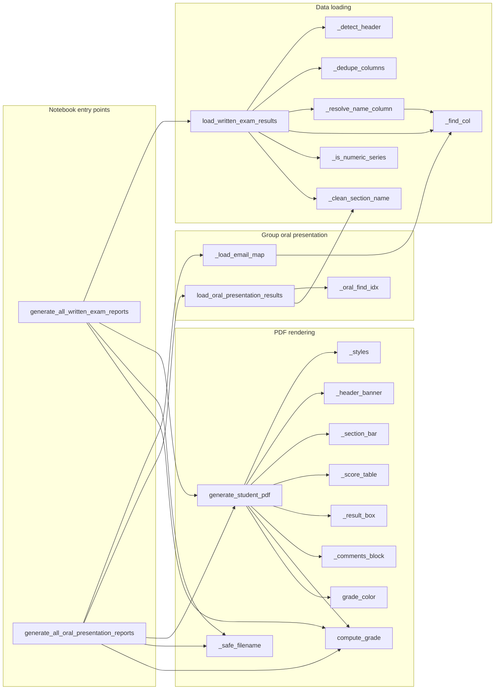

# `writtenexam_utils.py`

> Loads a per-student score workbook (written-exam, rubric, or group-oral-presentation layout) and renders one navy-branded ReportLab PDF feedback report per student.

| | |
|---|---|
| **Lines of code** | 1012 |
| **Top-level functions** | 22 |
| **Classes** | 0 |
| **Module constants** | 18 (plus the tuple unpack `PAGE_W, PAGE_H = A4` on line 88) |
| **Imports from this codebase** | none (only stdlib + `pandas` + `reportlab`) |
| **Imported by** | `main.ipynb` twice — `from writtenexam_utils import *` (notebook line 72) and `from writtenexam_utils import generate_all_written_exam_reports` (notebook line 3331). No other module in the codebase imports it (`cross_edges_in` is empty). |
| **Run how** | imported by `main.ipynb`; the analyst calls `generate_all_written_exam_reports(...)` once per cohort/assessment |

---

## 1. Purpose and role in the pipeline

This module is a **self-contained leaf** of the MDS 2026 codebase. Unlike most of the other report generators here it touches no database, no DASH API and no other project module — it consumes a **single Excel workbook of marks** and emits **one PDF per student** plus a summary `DataFrame`. That makes it the "end of the line" step an analyst runs after marks have been finalised in a spreadsheet.

It supports **three source layouts**, two of which are auto-detected by `load_written_exam_results()` and reported back as `loaded["mode"]`:

- **`"paired"`** — the DDS2/DDS4 written-exam shape: one row per student, then repeating `(RawScore, Percentage[.N])` column pairs, one pair per exam *section* (a clinical topic area), ending in a `(Total, Percentage)` pair. Optional trailing summary rows (`Marks available`, `Class average`, `Class average percent`) supply exact per-section maxima and cohort means.
- **`"rubric"`** — the DDS3 research-progress shape: one row per student, one column per rubric criterion scored out of a fixed max declared in an `"Out of N"` sub-header row, ending in `Total` and `Percentage`. May carry a free-text `Comments` column and a `Supervisor` column.
- **`"oral"`** — the DDS2 research-project group-presentation shape, handled by a separate loader (`load_oral_presentation_results()`): a whole *group* is graded on one row and its members are listed on the rows below with blank score cells. The loader forward-fills the group's scores onto every member and joins the scattered comment lines into one shared block.

All three loaders return the **same `loaded` dict shape**, which is the module's central data contract (see `load_written_exam_results()` for the field list). Everything downstream — `generate_student_pdf()` and the whole PDF rendering layer — is written against that dict, so the oral-presentation path reuses the rendering code unchanged.

**Note on psychometrics.** Despite the module name, this file performs **no item-level psychometric analysis**: there is no item difficulty (p-value), no item discrimination (point-biserial), no KR-20 / Cronbach's alpha, no distractor analysis, and no per-question data at all. The only statistics computed are (a) an arithmetic mean per section and for the total, used as the "Cohort Avg" column (lines 429–435), and (b) a `.mode()` of the observed `score / (pct/100)` ratio, used only to *reverse-engineer the maximum mark* of a column when no `Marks available` row or `Out of N` sub-header is present (lines 369–370, 420–421). The report footer text at lines 675–677 explicitly states "Individual questions are not released."

Visual style deliberately matches the pre-existing DDS4 written-exam feedback template (`Extra/DDS4/DENT90124_WrittenExam_Feedback/*.pdf`): navy header banner, navy section bars, a striped section-performance table, and a grade-coloured overall-result box.

---

## 2. External dependencies

| Library / resource | Used for |
|---|---|
| `os` | `os.makedirs(output_dir, exist_ok=True)` and `os.path.join` for output paths |
| `re` | `TITLE_PREFIX_RE`, `OUT_OF_RE`, whitespace normalisation in `_clean_section_name` / comment joining, and filename sanitising in `_safe_filename` |
| `pandas` (`pd`) | `read_excel`, `ExcelFile`, `read_csv`, `to_numeric`, `isna`/`notna`, `DataFrame` construction for the returned summary |
| `reportlab.lib.pagesizes.A4` | page size; also unpacked into `PAGE_W, PAGE_H` |
| `reportlab.lib.colors` | `HexColor` for the house palette; `colors.white` |
| `reportlab.lib.units.cm` | `MARGIN = 1.8 * cm` |
| `reportlab.lib.styles.ParagraphStyle` | all 14 paragraph styles built in `_styles()` |
| `reportlab.lib.enums` | `TA_LEFT`, `TA_CENTER`, `TA_JUSTIFY` alignment constants |
| `reportlab.platypus` | `SimpleDocTemplate`, `Paragraph`, `Spacer`, `Table`, `TableStyle` — the whole PDF story |
| **Filesystem (read)** | the `input_file` `.xlsx` workbook; optionally an `email_list_csv` (`studentEmailList.csv`) |
| **Filesystem (write)** | one `.pdf` per student into `output_dir` |
| **Environment variables** | none |
| **Network / database** | none |

---

## 3. Module-level constants and variables

### House palette and page geometry (lines 78–90)

Sampled directly from the DDS4 written-exam PDF, per the source comment on line 78.

| Name | Type | Value / shape | Purpose |
|---|---|---|---|
| `NAVY` | `reportlab Color` | `colors.HexColor('#003087')` | Header banner, section bars, table header row, bold total text |
| `ORANGE` | `reportlab Color` | `colors.HexColor('#F57F17')` | Defined at line 80 but **never referenced anywhere in the module** — dead constant (`FALLBACK_GRADE_COLOR` carries the same hex as a string instead) |
| `ROW_ALT` | `reportlab Color` | `colors.HexColor('#F4F4F4')` | Alternating (even) row background in the score table |
| `ROW_WHITE` | `reportlab Color` | `colors.white` | Alternating (odd) row background |
| `TOTAL_BG` | `reportlab Color` | `colors.HexColor('#E8EFF7')` | Background of the score table's final Total row |
| `SUBTITLE_BLUE` | `reportlab Color` | `colors.HexColor('#AEC6E8')` | Subtitle / period text on the navy banner |
| `TEXT_DARK` | `reportlab Color` | `colors.HexColor('#222222')` | Body text in table cells and comments |
| `GREY_LINE` | `reportlab Color` | `colors.HexColor('#C3D5E8')` | Defined at line 86 but **never referenced** — dead constant |
| `PAGE_W`, `PAGE_H` | `float`, `float` | `A4` unpacked (line 88) | `PAGE_W` feeds `CONTENT_W`; `PAGE_H` is **never used** |
| `MARGIN` | `float` | `1.8 * cm` | All four `SimpleDocTemplate` margins |
| `CONTENT_W` | `float` | `PAGE_W - 2 * MARGIN` | Base width every table's `colWidths` fractions are taken from |

### Grading (lines 92–140)

| Name | Type | Value / shape | Purpose |
|---|---|---|---|
| `DEFAULT_GRADE_BANDS` | `list[tuple[float, str]]`, 6 entries | see block below | University of Melbourne honours scale; mapped by `compute_grade()` against the **unrounded** percentage |
| `DEFAULT_GRADE_COLORS` | `dict[str, str]`, 6 entries | see block below | Overall-result box fill per grade label; a green→orange→red progression |
| `FALLBACK_GRADE_COLOR` | `str` | `'#F57F17'` | Box colour when the grade is `None` or not in `grade_colors` |
| `SUMMARY_ROW_LABELS` | `set[str]`, 6 entries | `{'marks available', 'class average', 'class average percent', 'cohort average', 'average', 'cohort average percent'}` | Lower-cased name-column values treated as sheet summary rows and dropped from `students` (line 426) |
| `TITLE_PREFIX_RE` | `re.Pattern` | `^(mr\|mrs\|ms\|miss\|mx\|dr\|prof)\.?\s+`, `IGNORECASE` | Strips a title off a "Legal name" column in `_resolve_name_column()` |
| `OUT_OF_RE` | `re.Pattern` | `out of\s+([\d.]+)`, `IGNORECASE` | Extracts the max mark from an `"Out of N"` sub-header cell |

```python
DEFAULT_GRADE_BANDS = [
    (80.0, "H1"), (75.0, "H2A"), (70.0, "H2B"),
    (65.0, "H3"), (50.0, "P"),   (0.0,  "N"),
]

DEFAULT_GRADE_COLORS = {
    "H1":  "#1B5E20",   # dark green
    "H2A": "#7CB342",   # yellow-green
    "H2B": "#FBC02D",   # gold / yellow
    "H3":  "#F57F17",   # orange (middle of the scale)
    "P":   "#E65100",   # deep orange
    "N":   "#C62828",   # red
}
```

The comment at lines 93–98 records the calibration evidence for banding on the unrounded value: in the DDS4 sample report `76/109 = 69.72%` renders as grade **H3** (the 65–69 band) even though the table displays a rounded `70%`, which would otherwise sit on the H2B boundary.

### Oral-presentation rubric (lines 772–773)

| Name | Type | Value / shape | Purpose |
|---|---|---|---|
| `ORAL_SECTION_MAX` | `float` | `5.0` | Default max mark for each group-presentation rubric criterion; default of `load_oral_presentation_results(section_max=...)` |
| `ORAL_TOTAL_MAX` | `float` | `20.0` | Default total max (four criteria × 5); default of `load_oral_presentation_results(total_max=...)` |

---

## 4. Classes

None. `classes[]` in the facts file is empty.

---

## 5. Function reference

The source is divided by banner comments into: grading helpers (lines 128–140), **Data loading** (line 143), **PDF rendering** (line 453), and **Group-based rubric layout** (line 753).

### 5.1 Grade helpers

#### `grade_color(grade, grade_colors=DEFAULT_GRADE_COLORS)`

*Lines 128–131.* Looks up the result-box fill colour for a grade label.

**Parameters**

| Name | Type | Default | Description |
|---|---|---|---|
| `grade` | `str \| None` | — | Grade label such as `"H1"`, `"P"`, `"N"` |
| `grade_colors` | `dict[str, str]` | `DEFAULT_GRADE_COLORS` | Grade label → hex string |

**Returns** — a `reportlab` `Color` built from the hex string.

**Behaviour** — 1. If `grade` is falsy (`None`, empty string), use `FALLBACK_GRADE_COLOR` immediately. 2. Otherwise `grade_colors.get(grade, FALLBACK_GRADE_COLOR)`. 3. Wrap in `colors.HexColor`.

**Called by** — `writtenexam_utils:generate_student_pdf`

---

#### `compute_grade(pct, grade_bands=DEFAULT_GRADE_BANDS)`

*Lines 183–190.* Maps an overall percentage (0–100, **unrounded**) to a grade label.

**Parameters**

| Name | Type | Default | Description |
|---|---|---|---|
| `pct` | `float \| None` | — | Overall percentage; `None`/`NaN` tolerated |
| `grade_bands` | `list[tuple[float, str]]` | `DEFAULT_GRADE_BANDS` | `(minimum_threshold, label)` pairs |

**Returns** — the grade label `str`, or `None` when `pct` is `None`/`NaN`.

**Behaviour** — 1. Guard on `pct is None or pd.isna(pct)` → `None`. 2. Sort the bands **descending** by threshold and return the first label with `pct >= threshold`. 3. Final fallback (unreachable with the default bands, whose lowest threshold is `0.0`): return the label of the *lowest* band. Note the sort is done on every call, so callers may pass bands in any order.

**Called by** — `writtenexam_utils:generate_student_pdf`, `writtenexam_utils:generate_all_written_exam_reports`, `writtenexam_utils:generate_all_oral_presentation_reports`

---

### 5.2 Data loading — helpers

#### `_dedupe_columns(header)`

*Lines 146–165.* Renames repeated header labels the way `pandas` does (`name`, `name.1`, `name.2`, …).

**Parameters**

| Name | Type | Default | Description |
|---|---|---|---|
| `header` | `list` | — | Raw header labels built from cell text |

**Returns** — `list` of de-duplicated labels, same length and order.

**Behaviour** — 1. Keep a `seen` counter dict. 2. First occurrence of a label passes through unchanged; the *n*th repeat becomes `f"{h}.{n-1+1}"` i.e. `.1`, `.2`, …. This is necessary because the module builds headers from raw cells (`header=None` read) rather than letting `pd.read_excel(header=0)` dedupe. Without it, label-based lookup on a repeated header (e.g. `"Percentage"` typed seven times) returns a `DataFrame` instead of a `Series` and breaks the pair-detection logic downstream.

**Called by** — `writtenexam_utils:load_written_exam_results`

---

#### `_find_col(columns, keywords)`

*Lines 168–173.* First column whose lower-cased name contains any of `keywords`.

**Returns** — the column label, or `None`.

**Behaviour** — linear scan in column order; substring (not exact) match, so ordering of `keywords` does not matter but ordering of `columns` does. Note the `["...", "id"]` keyword list used by callers matches *any* header containing "id" — including "Middle name"-like words is not a risk, but "Valid", "Provider ID" etc. would match.

**Called by** — `writtenexam_utils:_resolve_name_column`, `writtenexam_utils:load_written_exam_results`, `writtenexam_utils:_load_email_map`

---

#### `_clean_section_name(raw)`

*Lines 176–180.* Normalises a section/criterion header into a display name.

**Behaviour** — 1. `str().strip()`. 2. Collapse runs of whitespace to one space. 3. Strip a trailing `" score"` (case-insensitive).

**Called by** — `writtenexam_utils:load_written_exam_results`, `writtenexam_utils:load_oral_presentation_results`

---

#### `_is_numeric_series(s, min_frac=0.6)`

*Lines 193–202.* True when at least `min_frac` of the non-null values of `s` are numbers.

**Behaviour** — 1. Drop nulls; empty → `False`. 2. Count values that are `int`/`float` **and not `bool`** (explicit `isinstance(v, bool)` exclusion). 3. Compare `numeric_count / len(non_null)` against the magic threshold `0.6`. Used to decide which candidate columns are scoreable rubric criteria.

**Called by** — `writtenexam_utils:load_written_exam_results`

---

#### `_detect_header(raw)`

*Lines 205–250.* Works out where the header row(s) end and the data begins, in a sheet read with `header=None`.

**Parameters**

| Name | Type | Default | Description |
|---|---|---|---|
| `raw` | `DataFrame` | — | Sheet read with `header=None` — no assumptions about header shape |

**Returns** — `(header_labels, sub_header_labels, data_start_row)`. `sub_header_labels` is `None` when there was no second header row; when present its positions align with `header_labels`.

**Behaviour**

1. **Anchor row**: scan the first `min(6, len(raw))` rows for a cell whose stripped, lower-cased text is exactly `"total"`.
2. **No anchor found** → fall back to the original single-row-header assumption: row 0 is the header, data starts at row 1, `sub_header` is `None`. Blank header cells become `col_{i}`.
3. **Anchor found** → header labels come from the anchor row; `data_start = anchor + 1`.
4. **Second header row test**: look at the row immediately below. Count `text_like` (non-null `str`) vs `numeric_like` (non-null `int`/`float`) cells. If `text_like > 0 and text_like >= numeric_like`, treat it as a sub-header (e.g. an `"Out of 5"` row), merge it into `header` wherever the anchor cell was blank, and push `data_start` to `anchor + 2`.
5. Any still-blank header slot becomes `col_{i}`.

**Called by** — `writtenexam_utils:load_written_exam_results`

---

#### `_resolve_name_column(df, name_col=None)`

*Lines 253–290.* Determines (or synthesises) a column holding a clean display name.

**Returns** — `(name_col, df)`. When a name is synthesised, `df` is a **copy** with a new `"__display_name__"` column; otherwise the original `df` is returned unchanged.

**Behaviour** — tried strictly in this order:

1. Explicit `name_col` override → returned as-is, no validation.
2. Exact lower-cased `"preferred name"` **and** `"last name"` columns → `__display_name__ = "{Preferred} {Last}"`.
3. A column containing `"legal name"` → `__display_name__` = legal name with `TITLE_PREFIX_RE` (`Mr `/`Ms `/`Dr `/…) stripped.
4. `_find_col(df.columns, ["name"])` — any header containing "name".
5. Otherwise **raises `ValueError`** listing the columns found.

**Side effects** — none on disk; returns a copied DataFrame in branches 2 and 3 (the caller's frame is not mutated).

**Calls** — `writtenexam_utils:_find_col`. **Called by** — `writtenexam_utils:load_written_exam_results`

---

### 5.3 Data loading — main entry

#### `load_written_exam_results(input_file, sheet_name=0, name_col=None, id_col=None, comments_col=None, supervisor_col=None)`

*Lines 293–450.* Reads a per-student score workbook and returns the module's standard `loaded` dict, auto-detecting **`"paired"`** vs **`"rubric"`** layout.

**Parameters**

| Name | Type | Default | Description |
|---|---|---|---|
| `input_file` | `str` (path) | — | `.xlsx` workbook of marks |
| `sheet_name` | `str \| int` | `0` | Passed straight to `pd.read_excel` |
| `name_col` | `str \| None` | `None` | Override; otherwise `_resolve_name_column()` heuristics |
| `id_col` | `str \| None` | `None` | Override; otherwise `_find_col(..., ["sis_id","student_id","student_number","id"])` |
| `comments_col` | `str \| None` | `None` | Override; otherwise first column containing `"comment"` |
| `supervisor_col` | `str \| None` | `None` | Override; otherwise first column containing `"supervisor"` |

**Returns** — `dict` with keys:

| Key | Contents |
|---|---|
| `students` | `DataFrame`, one row per real student (rows with a null id, and rows whose name matches `SUMMARY_ROW_LABELS`, are dropped; index reset) |
| `sections` | `list[dict]` of `{name, score_col, pct_col, max_points}`; `pct_col` is `None` in rubric mode |
| `total_col`, `total_pct_col`, `total_max` | The Total column label, its adjacent Percentage column (or `None`), and the total maximum mark |
| `name_col`, `id_col`, `comments_col`, `supervisor_col` | Resolved column labels (`None` where not found, except `id_col`, which is mandatory) |
| `cohort_avg` | `{section_name: mean raw score}` plus `"__total__"` |
| `cohort_avg_pct` | `{section_name: None}` plus `"__total__"` in paired mode; **only** `"__total__"` in rubric mode |
| `mode` | `"paired"` or `"rubric"` |

**Behaviour**

1. `pd.read_excel(..., header=None)` → `_detect_header()` → `_dedupe_columns()`; slice from `data_start` and apply the header as columns.
2. Resolve `name_col` (`_resolve_name_column`), then `id_col`. **`id_col` is mandatory** — a `ValueError` is raised if it cannot be found, with the advice that rubric-style sheets without a numeric student ID must pass it explicitly (e.g. a group/section code column).
3. Resolve optional `comments_col` / `supervisor_col`.
4. Find `total_col` via `_find_col(["total"])` → `ValueError("Could not find a 'Total' column.")` if absent. Then look at the **next two columns only** (`total_idx+1 .. total_idx+2`) for a header containing `"percent"` to set `total_pct_col`.
5. Locate an optional `marks_row` — the data row whose name cell reads `"marks available"` — which gives exact per-section maxima.
6. `candidate_cols` = the columns strictly **between** `id_col` and `total_col`. Everything is detected inside this window, so any non-score column sitting between them is a candidate.
7. **Paired detection**: walk `candidate_cols` two at a time; if the *second* column's lower-cased name `startswith("percentage")`, emit a section. `max_points` comes from `marks_row` if available, else from the **mode of the observed `score / (pct/100)` ratio**, rounded to 2 dp (`inf` dropped) — `None` if no ratios survive. Advance by 2 on a hit, by 1 on a miss.
8. **Rubric fallback** (only when `sections` is still empty): `mode = "rubric"`; for each candidate column that is not the comments/supervisor column and passes `_is_numeric_series`, take `max_points` from `OUT_OF_RE` against that column's sub-header text; last resort use the **largest observed score** in the column.
9. **`total_max`**: `OUT_OF_RE` on the Total sub-header → else `marks_row[total_col]` → else the ratio-mode trick against `total_pct_col` → else the sum of the section maxima (`or None`, so a sum of 0 becomes `None`).
10. Build `students` by dropping null-id rows and `SUMMARY_ROW_LABELS` name rows.
11. `cohort_avg` per section = `pd.to_numeric(...).mean()` over `students`; `cohort_avg["__total__"]` likewise. With a `total_pct_col`, per-section percentage averages are deliberately set to `None` and only the total is averaged; without one, `cohort_avg_pct` has **only** `"__total__"`, derived as `mean_total / total_max * 100`.

**Side effects** — reads `input_file` from disk. No writes, no mutation of caller state.

**Calls** — `writtenexam_utils:_detect_header`, `_dedupe_columns`, `_resolve_name_column`, `_find_col`, `_is_numeric_series`, `_clean_section_name`.
**Called by** — `writtenexam_utils:generate_all_written_exam_reports`

---

### 5.4 PDF rendering helpers

#### `_styles()`

*Lines 456–488.* Builds and returns the report's `ParagraphStyle` dictionary.

**Returns** — `dict[str, ParagraphStyle]` with 14 keys: `name` (Helvetica-Bold 20, white), `subtitle` (11, `SUBTITLE_BLUE`), `course` (Bold 13, white, left), `period` (10, `SUBTITLE_BLUE`, left), `bar_title` (Bold 12.5, white), `th` (Bold 9.5, white), `td` (9.5, `TEXT_DARK`), `td_bold` (Bold 9.5, `NAVY`), `grade_big` (Bold 30, white, centred), `grade_lbl` (9.5, white, centred), `result_lbl` (Bold 10, white), `result_val` (13.5, white), `footer` (Helvetica-Oblique 8.5, `#666666`), `comment` (Helvetica-Oblique 9.5, justified), `comments_heading` (Bold 12, `NAVY`).

**Behaviour** — a fresh dict of styles is constructed on every call (once per student PDF), so styles are never shared between documents.

**Called by** — `writtenexam_utils:generate_student_pdf`

---

#### `_header_banner(student_name, student_id, course_code, exam_title, styles, extra_subtitle=None, id_label='Student ID', assessment_label='Written Examination')`

*Lines 491–511.* Builds the navy banner at the top of the report.

**Returns** — a `Table` (one row, two cells) with a `NAVY` background.

**Behaviour** — 1. The ID line is `"{id_label}: {student_id}"` when `extra_subtitle` is supplied, otherwise `"{id_label}: {student_id} &middot; {assessment_label}"` — i.e. the assessment name is dropped from the ID line whenever a supervisor subtitle takes its place. 2. Left cell: name + ID line + optional `extra_subtitle`. Right cell: `course_code` + `exam_title`, right-aligned. 3. Column split is 62% / 38% of `CONTENT_W`.

**Called by** — `writtenexam_utils:generate_student_pdf`

---

#### `_section_bar(text, styles)`

*Lines 514–522.* A full-width navy bar with a bold white title; used as the "Section Performance" and "Overall Result" dividers.

**Returns** — a single-cell `Table` of width `CONTENT_W`.

**Called by** — `writtenexam_utils:generate_student_pdf`

---

#### `_score_table(sections, row_data, cohort_avg, total_col_label, total_max, total_score, total_cohort_avg, styles, show_cohort_avg=True)`

*Lines 525–576.* Builds the striped per-section performance table, with an optional Cohort Avg column.

**Parameters**

| Name | Type | Default | Description |
|---|---|---|---|
| `sections` | `list[dict]` | — | `loaded["sections"]` |
| `row_data` | `Series` | — | The student's row |
| `cohort_avg` | `dict` | — | `loaded["cohort_avg"]`, keyed by section name |
| `total_col_label` | `str` | — | Label for the bottom Total row |
| `total_max`, `total_score`, `total_cohort_avg` | `float` | — | Total figures |
| `styles` | `dict` | — | From `_styles()` |
| `show_cohort_avg` | `bool` | `True` | Include the Cohort Avg column (4 columns vs 3) |

**Returns** — a `Table` with `repeatRows=1`.

**Behaviour**

1. Column layout switches on `show_cohort_avg`: 4 columns at `0.46 / 0.20 / 0.18 / 0.16` of `CONTENT_W`, or 3 columns at `0.56 / 0.24 / 0.20`.
2. Per section: a missing (NaN) score renders as `"— (not submitted)"` and its percentage as `"—"`; otherwise `f"{score:.2f}/{max_pts:.2f}"` and `f"{pct:.2f}%"`, where `pct = score / max_points * 100` recomputed from the raw score — **not** read from the sheet's own percentage column.
3. Total row is bold navy, `total_pct = total_score / total_max * 100`, or **`0`** if `total_max` is falsy.
4. Styling: navy header row, centred numeric columns, `TOTAL_BG` background and a 1pt navy `LINEABOVE` on the last row, and alternating `ROW_ALT`/`ROW_WHITE` backgrounds for the body rows.

**Called by** — `writtenexam_utils:generate_student_pdf`

---

#### `_result_box(grade, score, max_points, pct, cohort_avg, cohort_avg_pct, styles, box_color=None, show_cohort_avg=True)`

*Lines 579–605.* The grade-coloured overall-result box.

**Returns** — a one-row, two-cell `Table` filled with `box_color`.

**Behaviour** — 1. `box_color` defaults to `HexColor(FALLBACK_GRADE_COLOR)`. 2. Left cell (26% of `CONTENT_W`): the grade in 30pt bold, or `"-"` when `grade` is falsy, above the caption "Grade". 3. Right cell (74%): "Your Score" and `f"{score:.2f}/{max_points:.2f} ({pct:.2f}%)"`; then, only if `show_cohort_avg and cohort_avg is not None`, a "Cohort Average" pair. 4. A white `LINEAFTER` separates the two cells.

**Called by** — `writtenexam_utils:generate_student_pdf`

---

#### `_comments_block(comment_text, styles)`

*Lines 608–613.* Returns a 3-element list — `Spacer`, an "Assessor Comments" heading, and the comment paragraph in italic justified text — to be spliced into the story.

**Called by** — `writtenexam_utils:generate_student_pdf`

---

#### `_safe_filename(text)`

*Lines 616–618.* Strips the characters `\ / : * ? " < > |` from `text` and trims whitespace. Note it does **not** handle path-length limits, leading dots, or reserved Windows device names.

**Called by** — `writtenexam_utils:generate_all_written_exam_reports`, `writtenexam_utils:generate_all_oral_presentation_reports`

---

### 5.5 Report generation

#### `generate_student_pdf(row, loaded, course_code, exam_title, out_path, grade_bands=DEFAULT_GRADE_BANDS, grade_colors=DEFAULT_GRADE_COLORS, section_bar_label='Written Examination', total_row_label=None, show_cohort_avg=True, note=None, id_label='Student ID')`

*Lines 621–679.* Renders one student's PDF to `out_path`. This is the single rendering entry point shared by all three layouts.

**Parameters**

| Name | Type | Default | Description |
|---|---|---|---|
| `row` | `Series` | — | One row of `loaded["students"]` |
| `loaded` | `dict` | — | Output of `load_written_exam_results()` or `load_oral_presentation_results()` |
| `course_code` | `str` | — | e.g. `"DENT90146"`; shown top-right |
| `exam_title` | `str` | — | e.g. `"Mid-Year Examination 2026"` |
| `out_path` | `str` | — | Destination `.pdf` path |
| `grade_bands` | `list` | `DEFAULT_GRADE_BANDS` | Passed to `compute_grade` |
| `grade_colors` | `dict` | `DEFAULT_GRADE_COLORS` | Passed to `grade_color` |
| `section_bar_label` | `str` | `'Written Examination'` | Used in both navy bars and as `assessment_label` on the banner |
| `total_row_label` | `str \| None` | `None` | Defaults to `f"Overall {section_bar_label} Total"` |
| `show_cohort_avg` | `bool` | `True` | Suppresses the Cohort Avg column and the box's cohort line |
| `note` | `str \| None` | `None` | Footer text; falls back to the built-in "Individual questions are not released…" note |
| `id_label` | `str` | `'Student ID'` | Banner label — e.g. `"Group Code"` or `"Student Email"` |

**Returns** — `None`.

**Behaviour**

1. Build styles; pull `name_col`/`id_col`/`total_col`/`total_pct_col`/`total_max` out of `loaded`.
2. Stringify the ID and strip a trailing `".0"` (Excel numeric-ID artefact).
3. `total_score = float(row[total_col])`; `total_pct` from the sheet's percentage column if `total_pct_col` is set, else recomputed as `total_score / total_max * 100`.
4. Grade via `compute_grade(total_pct, grade_bands)`, colour via `grade_color`.
5. If a `supervisor_col` exists and the cell is non-blank, set `extra_subtitle = f"Supervisor: {…}"`.
6. Cohort figures are read only when `show_cohort_avg` is true; otherwise both are `None`.
7. Assemble the story: banner → spacer → "… — Section Performance" bar → score table → spacer → "… — Overall Result" bar → spacer → result box.
8. Append the comments block only when `comments_col` exists and the cell is non-null and non-blank.
9. Append the footer note and `doc.build(story)`.

**Side effects** — **writes a PDF file to `out_path`**. (The parent directory must already exist; both callers create it first.)

**Calls** — `writtenexam_utils:_styles`, `_header_banner`, `_section_bar`, `_score_table`, `_result_box`, `_comments_block`, `compute_grade`, `grade_color`.
**Called by** — `writtenexam_utils:generate_all_written_exam_reports`, `writtenexam_utils:generate_all_oral_presentation_reports`

---

#### `generate_all_written_exam_reports(input_file, output_dir, course_code, exam_title, sheet_name=0, name_col=None, id_col=None, comments_col=None, supervisor_col=None, grade_bands=DEFAULT_GRADE_BANDS, grade_colors=DEFAULT_GRADE_COLORS, section_bar_label='Written Examination', total_row_label=None, show_cohort_avg=True, note=None, id_label='Student ID', id_in_filename=True)`

*Lines 682–750.* **The module's notebook entry point** (called 4× from `main.ipynb`): load a workbook and write one PDF per student.

**Parameters** — the loader parameters (`input_file`, `sheet_name`, `name_col`, `id_col`, `comments_col`, `supervisor_col`) plus the renderer parameters (`course_code`, `exam_title`, `grade_bands`, `grade_colors`, `section_bar_label`, `total_row_label`, `show_cohort_avg`, `note`, `id_label`), plus:

| Name | Type | Default | Description |
|---|---|---|---|
| `output_dir` | `str` | — | Directory for the PDFs; created if missing |
| `id_in_filename` | `bool` | `True` | `"Name (id).pdf"` vs `"Name.pdf"` |

**Returns** — a summary `DataFrame` with columns `name`, `id`, `total_score`, `total_max`, `total_pct`, `grade`, `file`.

**Behaviour**

1. `load_written_exam_results(...)`, then `os.makedirs(output_dir, exist_ok=True)`.
2. For each student row: stringify name and id, stripping a trailing `".0"` off the id.
3. Filename — with `id_in_filename=True` it is `"{name} ({id})"`; with `False` it is just `"{name}"`, and a `used_names` counter appends `" (2)"`, `" (3)"`, … for duplicate names. **The duplicate-name counter is only maintained in the `False` branch** (lines 726–729), so with the default `True` uniqueness relies entirely on the ID being unique.
4. Sanitise via `_safe_filename` and call `generate_student_pdf`.
5. Recompute `total_score` / `total_pct` for the summary row (`None` if there is no percentage column and no `total_max`) and `compute_grade`.
6. `print(f"Done - {len(summary)} PDFs written to: {output_dir} (mode: {loaded['mode']})")` and return the `DataFrame`.

**Side effects** — creates `output_dir`; writes one PDF per student; **prints** a completion line to stdout.

**Calls** — `writtenexam_utils:load_written_exam_results`, `generate_student_pdf`, `_safe_filename`, `compute_grade`.
**Called by** — `main.ipynb` (4 call sites).

**Example** (from `main_notebook_code.py`, lines 3331–3339 — DDS2 paired layout):

```python
from writtenexam_utils import generate_all_written_exam_reports

# DDS2 — Mid-Year Written Examination 2026
summaryDDS2Written = generate_all_written_exam_reports(
    input_file="Extra/DDS2/Results to release to students.xlsx",
    output_dir="Extra/DDS2/Student Reports",
    course_code="DENT90146",
    exam_title="Mid-Year Examination 2026",
)
summaryDDS2Written
```

**Example** (from `main_notebook_code.py`, lines 3361–3372 — DDS3 rubric layout, with the group-code ID column and the cohort average switched off):

```python
summaryDDS3Research = generate_all_written_exam_reports(
    input_file="Extra/DDS3/research progress summary Raed.xlsx",
    output_dir="Extra/DDS3/Student Reports",
    course_code="DDS3",
    exam_title="Research Progress Summary 2026",
    id_col="DDS3 year now",          # group/section code column, e.g. DDS2-Grp-01-A
    id_label="Group Code",
    section_bar_label="Research Progress Summary",
    show_cohort_avg=False,
    note=("This assessment contributes 20% to your final grade. Comments above reflect "
          "your supervisor's feedback on this component."),
)
summaryDDS3Research
```

A commented-out DDS4 variant sits at notebook lines 3343–3348 (`course_code="DENT90124"`, `input_file="Extra/DDS4/Results to release to students.xlsx"`).

---

### 5.6 Group-based rubric layout (oral presentation)

Source section starting line 753. The explanatory comment at lines 756–770 describes the layout: a group is graded on one row, its members are listed on the rows below with their own Student IDs but blank score cells, and comments are scattered across the members' rows but belong to the group.

#### `_oral_find_idx(title_row, sub_row, keywords, exact_sub=None)`

*Lines 776–789.* Finds the first column index whose **title row OR sub-header** text matches.

**Parameters**

| Name | Type | Default | Description |
|---|---|---|---|
| `title_row` | `list` | — | The group-label header row (the row above the sub-header) |
| `sub_row` | `list` | — | The field-name / `"Out of N"` row |
| `keywords` | `list[str] \| None` | — | Substrings to match (may be `None` when `exact_sub` is given) |
| `exact_sub` | `str \| None` | `None` | If given, match the sub-header **exactly** (used for the `"Out of 5"` / `"Out of 20"` score columns) |

**Returns** — `int` column index, or `None`.

**Behaviour** — iterate `j` over `max(len(title_row), len(sub_row))`; safely coerce both cells to lower-cased strings (empty when out of range or `None`). If `exact_sub` is set, only the exact sub-header comparison applies; otherwise a substring match against either row. Matching by header **text rather than position** is what lets sheets from different sessions, with columns at different offsets, still parse.

**Called by** — `writtenexam_utils:load_oral_presentation_results`

---

#### `_load_email_map(email_list_csv)`

*Lines 792–798.* Reads `studentEmailList.csv` into `{student_number(str): email}`.

**Behaviour** — 1. `pd.read_csv(..., dtype=str)` (everything as strings). 2. `_find_col` for `["student_number", "student number", "id"]` and for `["email"]`. 3. Zip and strip, skipping rows whose number is null.

**Side effects** — reads a CSV from disk. Will raise if either column cannot be found (`df[None]`).

**Calls** — `writtenexam_utils:_find_col`. **Called by** — `writtenexam_utils:generate_all_oral_presentation_reports`

---

#### `load_oral_presentation_results(input_file, sheets=None, email_map=None, section_max=ORAL_SECTION_MAX, total_max=ORAL_TOTAL_MAX)`

*Lines 801–951.* Parses a group-presentation rubric workbook (potentially many sheets) into a `loaded` dict compatible with `generate_student_pdf()`, with `mode="oral"`.

**Parameters**

| Name | Type | Default | Description |
|---|---|---|---|
| `input_file` | `str` | — | Workbook path |
| `sheets` | `list[str] \| None` | `None` | Sheet names to include; default all sheets |
| `email_map` | `dict \| None` | `None` | `{student_id: email}`; when supplied, an `email` column is populated and used as the report's ID line |
| `section_max` | `float` | `ORAL_SECTION_MAX` (5.0) | Max mark per criterion |
| `total_max` | `float` | `ORAL_TOTAL_MAX` (20.0) | Max total mark |

**Returns** — the standard `loaded` dict, with `students` one row per **member** carrying the group's scores, percentage, supervisor and combined comments; `total_col="total"`, `total_pct_col="pct"`, `name_col="name"`, `comments_col="comments"`, `supervisor_col="supervisor"`, `mode="oral"`. `cohort_avg` and `cohort_avg_pct` are **all `None`** by construction (line 948) — cohort averages are deliberately not computed for this layout.

**Behaviour**

1. Open with `pd.ExcelFile`; iterate over `sheets` or all `xls.sheet_names`.
2. Per sheet: read with `header=None`, convert to a list of lists. Locate the sub-header row as the first of the top 6 rows containing a cell reading exactly `"family name"`; **if none is found the sheet is skipped silently** (`continue`, line 835). `title_row = rows[sub_i - 1]`.
3. Locate columns with `_oral_find_idx`: family name, preferred name, student id, supervisor, percentage, and the total column via `exact_sub="out of 20"`. The criterion columns `sec_idxs` are every column whose sub-header is exactly `"out of 5"`.
4. **Comments column resolution**: because the `"Comments"` header cell can be merged/shifted one column left of the actual free text, the code takes the header index and scans it plus the next two columns, picking whichever holds the most strings longer than 3 characters.
5. `section_titles` is taken from the **first sheet processed only** and reused for all sheets.
6. Walk the data rows: skip all-empty rows. A row with a non-null value in the total column **starts a new group** (`cur`), capturing its criterion scores, total, percentage and supervisor. Every subsequent row (until the next scored row) contributes its comment text to that group and, if it has a student ID, registers a member with name `f"{preferred} {family}"` and an ID with any trailing `".0"` stripped. Rows before the first scored row are ignored (`if cur is None: continue`).
7. Flatten: for each group, join all comment lines with spaces and collapse whitespace, then emit one row per member carrying `name`, `id`, `email` (looked up in `email_map`, `""` if absent), `supervisor`, `comments`, `total`, `pct` and `__sec0`…`__secN` score columns.
8. `sections` are built as `{"name": title, "score_col": f"__sec{k}", "pct_col": None, "max_points": section_max}`.
9. `id_col` is `"email"` when an `email_map` was given **and** at least one member resolved to a non-empty email; otherwise `"id"`.

**Side effects** — reads `input_file` from disk (once via `ExcelFile`, then once more per sheet via `pd.read_excel`).

**Calls** — `writtenexam_utils:_oral_find_idx`, `_clean_section_name`.
**Called by** — `writtenexam_utils:generate_all_oral_presentation_reports`

---

#### `generate_all_oral_presentation_reports(input_file, output_dir, course_code, exam_title, email_list_csv=None, sheets=None, section_bar_label='Oral Presentation', id_label='Student Email', id_in_filename=True, grade_bands=DEFAULT_GRADE_BANDS, grade_colors=DEFAULT_GRADE_COLORS, note=None)`

*Lines 954–1012.* Generates one PDF per student from a group-presentation rubric workbook; members of a group share the group's grade and a combined comments block.

**Parameters**

| Name | Type | Default | Description |
|---|---|---|---|
| `input_file`, `output_dir`, `course_code`, `exam_title` | `str` | — | As for the written-exam entry point |
| `email_list_csv` | `str \| None` | `None` | If given, `_load_email_map()` reads it and e-mails are shown as the report's ID line |
| `sheets` | `list[str] \| None` | `None` | Sheet subset |
| `section_bar_label` | `str` | `'Oral Presentation'` | Navy bar label |
| `id_label` | `str` | `'Student Email'` | Banner ID label |
| `id_in_filename` | `bool` | `True` | `"Name (id).pdf"` vs `"Name.pdf"` with a `(2)`/`(3)` de-duplication suffix |
| `grade_bands`, `grade_colors`, `note` | | defaults | As above |

**Returns** — a summary `DataFrame` with `name`, `id`, `total_score`, `total_max`, `total_pct`, `grade`, **`supervisor`**, `file` (one extra column vs the written-exam summary).

**Behaviour**

1. Build `email_map` if `email_list_csv` was given, then `load_oral_presentation_results(...)` and `os.makedirs(output_dir, exist_ok=True)`.
2. `default_note` (lines 975–976) is hard-coded: *"This assessment contributes 20% to your final grade. Comments above reflect your supervisor's feedback on this component."*
3. Filenames use `row["id"]` — the **student number**, not the email — even when `loaded["id_col"] == "email"`. The report header still shows the e-mail.
4. Each PDF is rendered with `show_cohort_avg=False` hard-coded (line 998) and `total_row_label=f"Overall {section_bar_label} Total"`, because each group is graded by a different supervisor so a single cohort average would not be a fair comparison.
5. `total_pct` from `row["pct"]` when non-null, else recomputed from `total_max`.
6. Prints the same `"Done - N PDFs written to: …"` line and returns the summary.

**Side effects** — creates `output_dir`; writes one PDF per student; reads the workbook and (optionally) the e-mail CSV; **prints** a completion line.

**Calls** — `writtenexam_utils:_load_email_map`, `load_oral_presentation_results`, `generate_student_pdf`, `_safe_filename`, `compute_grade`.
**Called by** — nothing in this module, and **no call site exists in `main.ipynb`** — this entry point is currently unused from the orchestrator notebook (though `from writtenexam_utils import *` does make it available).

---

## 6. Call graph (this module)



---

## 7. Gotchas and known issues

**Dead / unused code**

- `ORANGE` (line 80) and `GREY_LINE` (line 86) are defined and never referenced. `FALLBACK_GRADE_COLOR` (line 125) duplicates `ORANGE`'s hex `#F57F17` as a string — the two must be kept in sync manually, as must `DEFAULT_GRADE_COLORS["H3"]`, which is the same value a third time.
- `PAGE_H` (line 88) is unpacked from `A4` and never used.
- `generate_all_oral_presentation_reports` and `load_oral_presentation_results` (lines 801–1012, ~210 lines, the whole "Group-based rubric layout" section) have **no call site in `main.ipynb`**. Only `generate_all_written_exam_reports` is a notebook entry point.

**Fragile parsing assumptions**

- `_detect_header` only scans the **first 6 rows** for the anchor cell reading exactly `"total"` (line 206). A sheet with more preamble rows, or one that spells it `"Total Mark"`, silently falls back to "row 0 is the header" and every downstream detection will be wrong.
- Likewise `load_oral_presentation_results` only scans the first 6 rows for `"family name"` (line 830) and **silently `continue`s** past any sheet where it is not found (line 835) — a mis-formatted sheet produces no error and no PDFs for its students.
- `_find_col` matches substrings, and `load_written_exam_results` searches for `"id"` (line 326). Any earlier column whose header merely contains "id" will be picked as the student ID column.
- `total_pct_col` is only searched in the **two columns immediately after** `total_col` (line 343). A sheet with a blank spacer column in between loses the percentage column, silently switching to recomputed percentages.
- Section detection only inspects columns strictly **between `id_col` and `total_col`** (line 358). Any score column outside that window is invisible; any non-score column inside it becomes a candidate.
- Paired-mode detection requires the percentage header to `startswith("percentage")` (line 365) — `"% "`, `"Pct"` or `"Percent"` alone will not match, dropping the module into rubric mode.
- `max_points` reverse-engineering by `ratios.mode()` (lines 369–370, 420–421) breaks down if every student scored 0 (division by zero → `inf`, dropped) or if the sheet's percentages are pre-rounded — the modal ratio then yields a slightly wrong maximum which is silently rounded to 2 dp.
- The rubric-mode last resort of using the **largest observed score** as the maximum (lines 399–401) means that if nobody achieves full marks, every student's percentage is inflated.
- `_is_numeric_series` uses a bare magic threshold of `0.6` (line 193) with no explanation.

**Behavioural traps**

- `_score_table` recomputes each section's percentage from `score / max_points` rather than using the sheet's own `pct_col` (line 540), so a report can disagree with the source spreadsheet if the sheet's percentages were computed against a different denominator.
- `_score_table` line 550: when `total_max` is falsy the total percentage is silently rendered as `0.00%` rather than `—`.
- Duplicate-name filename de-duplication (`used_names`) only runs in the `id_in_filename=False` branch (lines 726–729 and 987–990). With the default `True`, two students sharing a name **and** an ID would silently overwrite each other's PDF.
- `generate_all_oral_presentation_reports` writes filenames from `row["id"]` (line 982) while `loaded["id_col"]` may be `"email"` — deliberate, but easy to misread.
- `load_oral_presentation_results` reuses `section_titles` from the **first sheet only** (line 866). If a later sheet's criteria are ordered differently, its scores will be labelled with the wrong criterion names.
- Both `generate_all_*` functions `print()` a completion line — noisy if called in a loop, and the only progress signal there is.
- Grade banding must operate on the **unrounded** percentage; the comment at lines 93–98 documents why. Anyone rounding earlier in the chain will shift students across band boundaries.

**Missing error handling**

- `_load_email_map` (line 795–796) does not check that `_find_col` found either column; a missing one raises a confusing `KeyError: None` rather than a clear message.
- `generate_student_pdf` does `float(row[total_col])` unguarded (line 636) — a student with a blank Total raises `ValueError`/`TypeError` mid-run, after earlier students' PDFs have already been written.
- There are no `try`/`except` blocks anywhere in the module, so one bad row aborts the whole batch (leaving a partially populated `output_dir`).

**Terminology**

- The module name says "written exam", but the file also handles rubric and group-oral layouts; `loaded["mode"]` (`"paired"` / `"rubric"` / `"oral"`) is the reliable indicator of what was actually parsed and is echoed in the completion `print`.
- **No psychometric statistics are computed** — no item difficulty, discrimination, KR-20 or reliability index appears anywhere in the file. Anyone looking for those must look elsewhere in the codebase.
